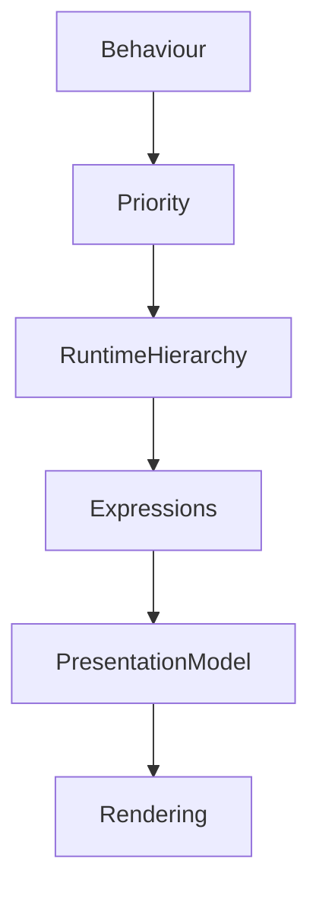

<!--
File: design/mds/MDS-006 Composition Engine/05-runtime-hierarchy.md
Document: MDS-006
Chapter: 05
Title: Runtime Hierarchy
Status: Draft
Version: 0.1
-->

# Runtime Hierarchy

---

# Purpose

The Composition Solver determines what should exist.

Expression Resolution determines how those concepts become communicable.

Runtime Hierarchy determines **how those Expressions continuously relate to one another as the user's World evolves.**

Unlike traditional interfaces, hierarchy within Mosaic is never static.

It is continuously resolved from behaviour.

The user should therefore experience one interface that naturally adapts without ever feeling unpredictable.

---

# Definition

Within MDS, **Runtime Hierarchy** is defined as:

> **The continuously evaluated ordering of Expressions according to the user's current World, Behaviour and Composition.**

Runtime Hierarchy is behavioural.

Not visual.

Presentation communicates hierarchy.

It does not create it.

---

# Why Runtime Hierarchy Exists

Traditional applications frequently define hierarchy statically.

Example.

```text
Header

↓

Sidebar

↓

Content

↓

Footer
```

This hierarchy exists regardless of:

- user intent
- behaviour
- context

Mosaic intentionally rejects this model.

Instead.

```text
Behaviour

↓

Priority

↓

Hierarchy

↓

Expressions
```

Hierarchy becomes the consequence of behaviour.

---

# Hierarchy Is Continuous

Runtime Hierarchy should evolve continuously.

Example.

```
Browsing

↓

Hero

↓

Watching

↓

Playback

↓

Episode Complete

↓

Continue Watching
```

Nothing has been rebuilt.

Hierarchy simply evolved.

Users should perceive continuity rather than transition.

---

# Runtime Inputs

Runtime Hierarchy evaluates:

```text
Behaviour

↓

Focus

↓

Context

↓

Priority

↓

Relationships

↓

Composition
```

Rendering information is intentionally absent.

Hierarchy exists before presentation.

---

# Runtime Outputs

Runtime Hierarchy produces:

```text
Hero

↓

Primary

↓

Supporting

↓

Peripheral

↓

Background
```

Every Expression receives exactly one current hierarchical role.

Future runtime systems consume this ordering.

---

# Hero Resolution

Exactly one Hero should normally exist.

Example.

```
Playback

↓

Episode
```

The Hero receives:

- strongest editorial emphasis
- highest material quality
- primary motion
- greatest atmospheric influence

Everything else naturally organises itself around the Hero.

---

# Dynamic Priority

Priority changes.

Hierarchy follows.

Example.

Current activity.

```
Browsing Reviews
```

Reviews become:

```
Primary
```

Playback information becomes:

```
Supporting
```

Nothing about the information changed.

Only its behavioural importance.

---

# Relationship Influence

Relationships influence Runtime Hierarchy.

Example.

```
Episode

↓

Next Episode

↓

Series

↓

Franchise
```

The closer a relationship is to the user's current behaviour...

The stronger its hierarchical influence should become.

Hierarchy should therefore emerge naturally from the World rather than fixed navigation structures.

---

# Local Hierarchy

Hierarchy should evolve locally whenever practical.

Example.

Playback progress updates.

↓

Timeline hierarchy updates.

Hero remains unchanged.

The remainder of the Composition should remain behaviourally stable.

This preserves continuity while minimising unnecessary runtime work.

---

# Environmental Hierarchy

Materials also participate in Runtime Hierarchy.

Examples.

Hero Material.

↓

Highest physical presence.

Supporting Acrylic.

↓

Moderate presence.

Canvas.

↓

Stable environment.

Material Hierarchy should always reinforce Runtime Hierarchy.

Never compete with it.

---

# Editorial Hierarchy

Typography inherits Runtime Hierarchy.

Examples.

Hero.

↓

Heading.

Supporting.

↓

Body.

Peripheral.

↓

Caption.

Typography therefore communicates behavioural importance without requiring independent editorial decisions.

---

# Motion Hierarchy

Motion also follows Runtime Hierarchy.

Example.

Hero changes.

↓

Hero moves first.

↓

Supporting Expressions respond.

↓

Environment settles.

Movement therefore becomes another consequence of hierarchy.

---

# Runtime Stability

Hierarchy should change only when behaviour justifies it.

Poor.

```
Minor Layout Change

↓

Hierarchy Changes
```

Preferred.

```
Behaviour Changes

↓

Hierarchy Evolves
```

Visual adaptation alone should never reorganise conceptual importance.

---

# Multi-Device Hierarchy

Every device should share identical Runtime Hierarchy.

Desktop.

↓

Expanded Presentation.

Phone.

↓

Compact Presentation.

Television.

↓

Immersive Presentation.

The hierarchy remains identical.

Only expression changes.

---

# Accessibility

Accessibility should never change Runtime Hierarchy.

Examples.

Large text.

↓

Hierarchy preserved.

Reduced motion.

↓

Hierarchy preserved.

High contrast.

↓

Hierarchy preserved.

Accessibility modifies presentation.

Never behavioural importance.

---

# Runtime Profiles

Future implementations may internally represent Runtime Hierarchy through Hierarchy Profiles.

Conceptually.

```text
Composition

↓

Hierarchy Profile

↓

Expression Ordering

↓

Presentation
```

Profiles improve:

- caching
- deterministic updates
- incremental recomposition

Applications should remain unaware of their existence.

---

# Runtime Updates

Typical hierarchy recalculation triggers include:

- Focus changes
- Behaviour changes
- Context changes
- Relationship updates
- Plugin contributions

Ordinary rendering updates should not trigger hierarchy recalculation.

---

# Plugins

Extensions contribute:

- behaviours
- information
- relationships

Plugins never assign:

- Hero
- Priority
- Hierarchy

The Runtime Hierarchy remains entirely platform owned.

Every extension therefore naturally inherits one behavioural language.

---

# Good Examples

## Playback

Behaviour.

↓

Playback.

↓

Hero.

↓

Timeline.

↓

Supporting metadata.

Everything feels inevitable.

---

## Reading

Book.

↓

Current Chapter.

↓

Reading Progress.

↓

Bookmarks.

Editorial hierarchy emerges naturally.

---

## Music

Album.

↓

Current Track.

↓

Queue.

↓

Recommendations.

Listening behaviour determines importance.

---

# Anti-patterns

## Static Hierarchy

Fixed interface hierarchy regardless of behaviour.

---

## Layout Hierarchy

Screen position determining importance.

---

## Component Hierarchy

Widgets deciding priority.

---

## Plugin Hierarchy

Extensions assigning their own behavioural importance.

---

# Runtime Hierarchy Model



Behaviour determines hierarchy.

Hierarchy determines communication.

Rendering simply expresses the result.

---

# Relationship To Future Chapters

The next chapter defines **Adaptive Layout**.

Runtime Hierarchy explains:

> **What deserves attention.**

Adaptive Layout explains:

> **How that hierarchy is expressed across different devices and environments without changing behavioural meaning.**

Together they complete the behavioural foundation of runtime presentation.

---

# Summary

Runtime Hierarchy continuously transforms behavioural importance into understandable structure.

It ensures that:

- the Hero remains obvious,
- supporting information remains supportive,
- peripheral information stays quiet,
- every Mosaic client communicates the same behavioural language.

Hierarchy is therefore never authored.

It is continuously solved from the evolving World.

---

# Review Status

**Status**

Draft

**Next File**

`06-adaptive-layout.md`
