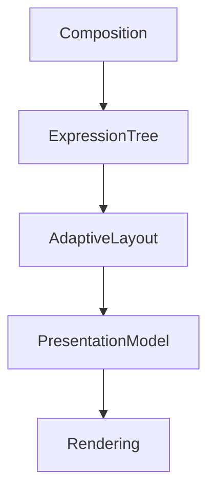

<!--
File: docs/design/system/mds-006-composition-engine/06-adaptive-layout.md
Document: MDS-006
Chapter: 06
Title: Adaptive Layout
Status: Draft
Version: 0.2
-->

# Adaptive Layout

---

# Purpose

The Composition Solver determines:

- what should exist,
- what deserves attention,
- how understanding should be organised.

Adaptive Layout determines how that solved understanding is expressed within the physical constraints of a device.

Unlike responsive design, Adaptive Layout does **not** solve geometry first.

It solves understanding first.

Layout becomes a consequence.

---

# Definition

Within MDS, **Adaptive Layout** is defined as:

> **The deterministic projection of a solved Composition into a device-specific spatial arrangement while preserving behavioural hierarchy and understanding.**

Adaptive Layout changes:

- spatial organisation,
- density,
- presentation.

It never changes:

- hierarchy,
- behaviour,
- meaning.

---

# Why Adaptive Layout Exists

Traditional responsive systems generally behave like this.

```text
Viewport

↓

Breakpoints

↓

Different Layout
```

Meaning frequently changes because layout changed.

Mosaic intentionally follows:

```text
Composition

↓

Hierarchy

↓

Expressions

↓

Adaptive Layout

↓

Presentation
```

Understanding remains constant.

Only spatial expression changes.

---

# Behaviour Before Geometry

Adaptive Layout should never ask:

> How much space exists?

before asking:

> What must remain understandable?

Behaviour always possesses higher authority than geometry.

---

# One Composition

Every device should consume the same solved Composition.

Desktop.

↓

Expanded Presentation.

Tablet.

↓

Editorial Presentation.

Phone.

↓

Compact Presentation.

Television.

↓

Immersive Presentation.

The Composition never changes.

Only layout.

---

# Layout Inputs

Adaptive Layout evaluates:

```text
Expression Tree

↓

Hierarchy

↓

Device Class

↓

Orientation

↓

Viewing Distance

↓

Capabilities
```

Notice that Behaviour has already been solved.

Adaptive Layout communicates.

It does not decide.

---

# Layout Outputs

Adaptive Layout produces:

```text
Spatial Regions

↓

Expression Placement

↓

Density

↓

Presentation Constraints
```

These outputs remain independent from components.

Future rendering systems consume them directly.

---

# Regions

Adaptive Layout organises Expressions into conceptual regions.

Examples.

```text
Hero

↓

Primary Region

↓

Supporting Region

↓

Peripheral Region

↓

Navigation
```

Regions communicate behavioural organisation.

Not implementation.

---

# Density

Adaptive Layout may alter density.

Examples.

Desktop.

↓

Expanded spacing.

Phone.

↓

Compact spacing.

Television.

↓

Large spacing.

The hierarchy remains identical.

Only physical density changes.

---

# Progressive Disclosure

Smaller devices should prefer progressive disclosure over hierarchy reduction.

Incorrect.

```text
Remove Relationships
```

Preferred.

```text
Relationships

↓

Collapsed

↓

Expandable
```

Understanding remains available.

Presentation simply becomes more compact.

---

# Hero Preservation

The Hero should remain visually dominant across every layout.

Examples.

Desktop.

↓

Large Hero region.

Phone.

↓

Compact Hero.

Television.

↓

Immersive Hero.

The Hero should always remain immediately recognisable.

---

# Anchor Preservation

Anchors should remain behaviourally stable.

Examples include:

- Navigation
- Search
- Playback
- Current Focus

Adaptive Layout may reposition Anchors.

It should never redefine them.

---

# Expression Integrity

Expressions should never fragment because layout changes.

Example.

Timeline.

↓

Timeline.

Not.

Timeline Header.

↓

Timeline Progress.

↓

Timeline Footer.

Expressions remain conceptually whole even when visually rearranged.

---

# Material Awareness

Adaptive Layout should preserve Material Hierarchy.

Hero Region.

↓

Hero Material.

Supporting Region.

↓

Acrylic.

Canvas.

↓

Environment.

Layout should never weaken physical hierarchy.

---

# Typography Awareness

Editorial hierarchy should remain stable.

Heading.

↓

Heading.

Body.

↓

Body.

Supporting.

↓

Supporting.

Adaptive Layout may alter line length and spacing.

It should never alter editorial roles.

---

# Motion Awareness

Adaptive Layout should preserve behavioural sequencing.

Examples.

Hero moves first.

↓

Supporting Expressions respond.

↓

Environment settles.

Changing layout should never create a different Motion language.

---

# Device Classes

Future runtime implementations may define conceptual device classes.

Examples.

```text
Phone

Tablet

Desktop

Television

Voice
```

Each device class receives its own adaptive layout strategy.

All consume identical Expressions.

---

# Runtime Adaptation

Adaptive Layout should respond to:

- orientation changes,
- window resizing,
- foldable devices,
- accessibility scaling.

These changes should preserve continuity.

Users should feel the interface adapting.

Not rebuilding.

---

# Incremental Layout

Small environmental changes should produce small layout changes.

Preferred.

```text
Window Slightly Wider

↓

Additional Supporting Expression Appears
```

Avoid.

```text
Window Slightly Wider

↓

Entire Layout Rebuilt
```

Incremental adaptation preserves orientation.

---

# Accessibility

Accessibility should influence layout.

Examples.

Larger text.

↓

Greater spacing.

Reduced vision.

↓

Simpler layout.

High contrast.

↓

Unchanged hierarchy.

Accessibility modifies spatial expression.

Not behavioural meaning.

---

# Modules

Modules contribute Expressions.

Modules never determine layout.

Adaptive Layout remains entirely platform owned.

Every module therefore automatically inherits future layout improvements.

---

# Good Examples

## Desktop

Hero.

↓

Expanded supporting regions.

↓

Peripheral collections.

Everything breathes.

---

## Phone

Hero.

↓

Primary actions.

↓

Progressive disclosure.

Understanding remains intact.

---

## Television

Large Hero.

↓

Generous spacing.

↓

Minimal interface.

Entertainment remains dominant.

---

# Anti-patterns

## Breakpoint Thinking

Entire interface changes because width crossed an arbitrary value.

---

## Hierarchy Loss

Smaller devices removing behavioural importance.

---

## Component Layout

Widgets determining spatial organisation.

---

## Module Layout

Modules introducing independent layout systems.

---

# Adaptive Layout Model



Composition determines understanding.

Adaptive Layout determines spatial expression.

---

# Relationship To Future Chapters

The next chapter defines **Behaviour Orchestration**.

Adaptive Layout explains:

> **Where Expressions should appear.**

Behaviour Orchestration explains:

> **How every runtime subsystem evolves together as behaviour changes.**

Together they transform solved understanding into one continuously evolving runtime experience.

---

# Summary

Adaptive Layout is not responsive design.

It is behavioural projection.

The user's World remains identical across:

- phones,
- desktops,
- televisions,
- future devices.

Only the physical arrangement changes.

That distinction allows Mosaic to remain one coherent Companion regardless of where users choose to experience it.

---

# Review Status

**Status**

Draft

**Next File**

`07-behaviour-orchestration.md`
