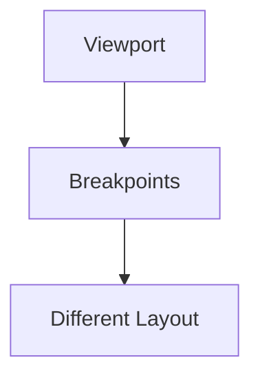
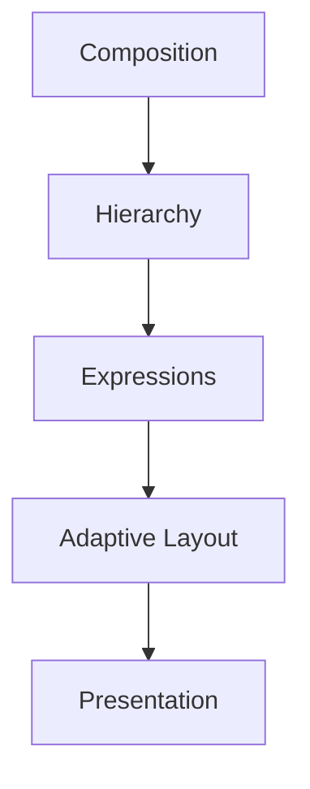
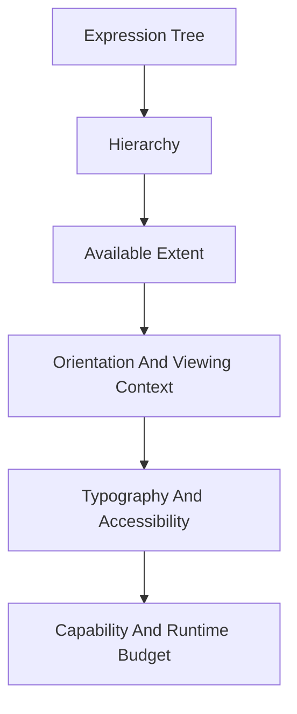
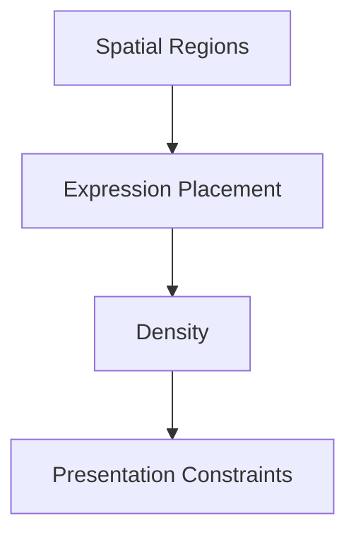
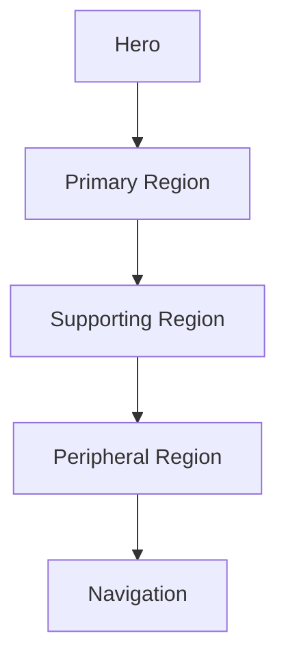
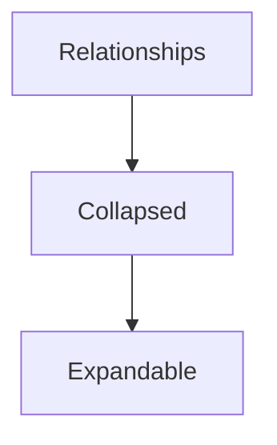
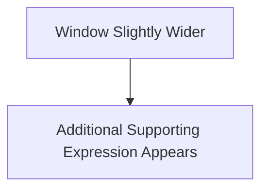
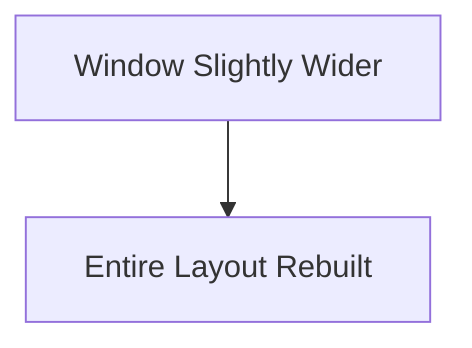
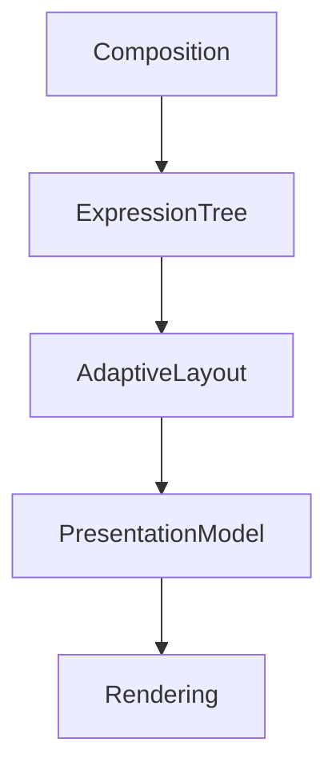

<!--
File: docs/design/system/mds-006-composition-engine/06-adaptive-layout.md
Document: MDS-006
Chapter: 06
Title: Adaptive Layout
Status: Draft
Version: 0.4
-->

# Adaptive Layout

---

# Purpose

The Composition Solver determines:

- what should exist,
- what deserves attention,
- how understanding should be organised.

Adaptive Layout determines how that solved understanding is expressed within the physical constraints of a device.

Unlike responsive design, Adaptive Layout does **not** solve geometry first.

It solves understanding first.

Layout becomes a consequence.

---

# Definition

Within MDS, **Adaptive Layout** is defined as:

> **The deterministic client-side projection of a solved Composition into a spatial arrangement while preserving behavioural hierarchy and understanding.**

Adaptive Layout changes:

- spatial organisation,
- density,
- presentation.

It never changes:

- hierarchy,
- behaviour,
- meaning.

---

# Why Adaptive Layout Exists

Traditional responsive systems generally behave like this.



Meaning frequently changes because layout changed.

Mosaic intentionally follows:



Understanding remains constant.

Only spatial expression changes.

---

# Behaviour Before Geometry

Adaptive Layout should never ask:

> How much space exists?

before asking:

> What must remain understandable?

Behaviour always possesses higher authority than geometry.

---

# One Composition

Every device should consume the same solved Composition.

Desktop.

↓

Expanded Presentation.

Tablet.

↓

Editorial Presentation.

Phone.

↓

Compact Presentation.

Television.

↓

Immersive Presentation.

The Composition never changes.

Only layout.

---

# Layout Modes

Mosaic supports two client layout modes.

| Mode | Use |
|------|-----|
| Adaptive Composition | Media-driven experiences where the client mathematically resolves Tile geometry from Composition, artwork, Focus, content and current constraints. |
| Authored Layout | Documentation, administration, dashboards and conventional application pages built with CSS or native layout using public Semantic Tokens. |

Both modes use the same typography, spacing, sizing, Material, accessibility and Refraction systems.

Authored Layout does not require the Composition Engine to replace CSS Grid, Flexbox or native layout primitives.

Adaptive Composition does not require authors to select spacing or geometry values manually.

One client may combine both modes while preserving one Mosaic design language.

---

# Layout Inputs

Adaptive Layout evaluates:



Notice that Behaviour has already been solved.

Adaptive Layout communicates.

It does not decide.

---

# Layout Outputs

Adaptive Layout produces:



These outputs remain independent from components.

Future rendering systems consume them directly.

The client-side Mosaic design runtime calculates concrete Presentation geometry from these outputs and private Platform primitives.

Runtime SDUI does not provide final coordinates, dimensions, padding, spacing, radius or typography values.

---

# Regions

Adaptive Layout organises Expressions into conceptual regions.

Examples.



Regions communicate behavioural organisation.

Not implementation.

---

# Density

Adaptive Layout resolves density continuously from available extent, viewing distance, input context, typography, accessibility and current content pressure.

It must not select density from a device category.

The provisional relationship bands are:

| Private values | Relationship |
|---------------:|--------------|
| `2–8` | Optical and internal detail |
| `12–16` | Tightly related content |
| `24–32` | Component groups |
| `48–64` | Major regions |
| `64–96` | Hero and artwork breathing space |

These bands guide the resolver; they are not SDUI or Module controls.

Related items must sit visibly closer together than unrelated items.

Separation between groups should normally be at least twice the separation within a group.

Artwork receives more surrounding space than utility controls.

Dense administration and calendar expressions may reduce internal separation without flattening hierarchy or removing region-level breathing space.

Accessibility may increase separation or restructure the Composition.

It must not solve pressure by squeezing content below readable or operable limits.

---

# Acrylic Topology

Composition determines material topology before the Material System resolves Acrylic edges.

One Tile represents one continuous Acrylic surface even when it contains several internal content regions.

An Acrylic Assembly represents several rigid Tiles that share a governed group relationship while retaining distinct material boundaries.

Adaptive Layout may align and move Assembly members together and the renderer may composite them in one pass.

It must not fuse separate Tile silhouettes because their projected bounds touch or become close.

Modules express content relationships and valid domain layout modes.

They do not select continuous-surface, seam, radius or edge-band values directly.

The visual and optical Assembly behaviour is owned by [MDS-003 — Material System](../mds-003-material-system/04-acrylic.md#acrylic-assemblies).

---

# Progressive Disclosure

Smaller devices should prefer progressive disclosure over hierarchy reduction.

Incorrect.

```text
Remove Relationships
```

Preferred.



Understanding remains available.

Presentation simply becomes more compact.

---

# Hero Preservation

The Hero should remain visually dominant across every layout.

Examples.

Desktop.

↓

Large Hero region.

Phone.

↓

Compact Hero.

Television.

↓

Immersive Hero.

The Hero should always remain immediately recognisable.

---

# Artwork Title Treatment

Composition selects the visible media-title treatment from the available artwork role and safe placement.

For landscape or backdrop artwork:

1. use an HD ClearLogo when one is available and a verified negative-space region can contain it without obscuring the focal subject
2. otherwise use the semantic Mona Sans title on an Acrylic information plane

For portrait poster artwork, preserve the image without text overlays and place the semantic title and metadata below it.

The ClearLogo and typographic fallback must not appear together.

The semantic text title remains available for accessibility, search, voice output and asset failure even when the ClearLogo is visible.

ClearLogos preserve their aspect ratio and must not be cropped, stretched or reduced below a legible presentation size.

Asset aspect ratio and artwork role determine this treatment.

Device category does not.

---

# Anchor Preservation

Anchors should remain behaviourally stable.

Examples include:

- Navigation
- Search
- Playback
- Current Focus

Adaptive Layout may reposition Anchors.

It should never redefine them.

---

# Expression Integrity

Expressions should never fragment because layout changes.

Example.

Timeline.

↓

Timeline.

Not.

Timeline Header.

↓

Timeline Progress.

↓

Timeline Footer.

Expressions remain conceptually whole even when visually rearranged.

---

# Material Awareness

Adaptive Layout should preserve Material Hierarchy.

Hero Region.

↓

Hero Material.

Supporting Region.

↓

Acrylic.

Canvas.

↓

Environment.

Layout should never weaken physical hierarchy.

---

# Typography Awareness

Editorial hierarchy should remain stable.

Heading.

↓

Heading.

Body.

↓

Body.

Supporting.

↓

Supporting.

Adaptive Layout may alter line length and spacing.

It should never alter editorial roles.

---

# Motion Awareness

Adaptive Layout should preserve behavioural sequencing.

Examples.

Hero moves first.

↓

Supporting Expressions respond.

↓

Environment settles.

Changing layout should never create a different Motion language.

---

# Capability-Driven Layout

Adaptive Layout must not select a permanent strategy from a product category such as phone, tablet, desktop or television.

Those labels do not reliably describe the available extent, input method, viewing distance, typography scale, renderer capability or current workload.

The same solved Composition is projected from measured and declared constraints.

Clients with equivalent effective constraints should produce equivalent spatial behaviour even when their product categories differ.

---

# Runtime Adaptation

Adaptive Layout should respond to:

- orientation changes,
- window resizing,
- foldable devices,
- accessibility scaling.

These changes should preserve continuity.

Users should feel the interface adapting.

Not rebuilding.

---

# Incremental Layout

Small environmental changes should produce small layout changes.

Preferred.



Avoid.



Incremental adaptation preserves orientation.

---

# Accessibility

Accessibility should influence layout.

Examples.

Larger text.

↓

Greater spacing.

Reduced vision.

↓

Simpler layout.

High contrast.

↓

Unchanged hierarchy.

Accessibility modifies spatial expression.

Not behavioural meaning.

---

# Modules

Modules contribute Expressions and may declare governed domain layout constraints or valid presentation modes.

Modules do not provide final Presentation coordinates, Material radius values or arbitrary Primitive values.

A Module implementing Authored Layout may consume the public Semantic Tokens defined by [MDS-001 — Design Token Architecture](../mds-001-design-token-architecture/04-semantic-tokens.md).

Adaptive Layout remains Platform-owned and chooses how the Module contract is projected through Mosaic primitives.

Every module therefore automatically inherits future layout improvements.

---

# Good Examples

## Desktop

Hero.

↓

Expanded supporting regions.

↓

Peripheral collections.

Everything breathes.

---

## Phone

Hero.

↓

Primary actions.

↓

Progressive disclosure.

Understanding remains intact.

---

## Television

Large Hero.

↓

Generous spacing.

↓

Minimal interface.

Entertainment remains dominant.

---

# Anti-patterns

## Breakpoint Thinking

Entire interface changes because width crossed an arbitrary value.

---

## Hierarchy Loss

Smaller devices removing behavioural importance.

---

## Component Layout

Widgets determining spatial organisation.

---

## Module Layout

Modules introducing independent layout systems.

---

# Adaptive Layout Model



Composition determines understanding.

Adaptive Layout determines spatial expression.

---

# Relationship To Future Chapters

The next chapter defines **Behaviour Orchestration**.

Adaptive Layout explains:

> **Where Expressions should appear.**

Behaviour Orchestration explains:

> **How every runtime subsystem evolves together as behaviour changes.**

Together they transform solved understanding into one continuously evolving runtime experience.

---

# Summary

Adaptive Layout is not responsive design.

It is behavioural projection.

The user's World remains identical across:

- phones,
- desktops,
- televisions,
- future devices.

Only the physical arrangement changes.

That distinction allows Mosaic to remain one coherent Companion regardless of where users choose to experience it.
