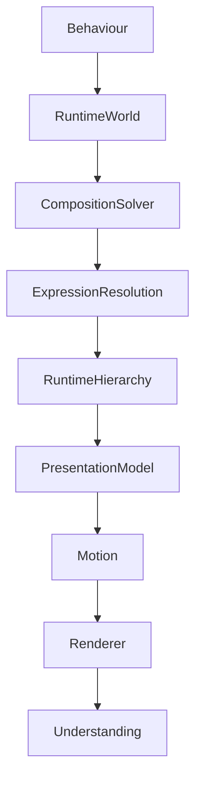

<!--
File: design/mds/MDS-006 Composition Engine/07-behaviour-orchestration.md
Document: MDS-006
Chapter: 07
Title: Behaviour Orchestration
Status: Draft
Version: 0.1
-->

# Behaviour Orchestration

---

# Purpose

The Runtime World evolves continuously.

Every behavioural change affects multiple systems simultaneously.

Examples include:

- Composition
- Motion
- Materials
- Typography
- Atmosphere

If each subsystem reacted independently, the platform would feel fragmented.

Behaviour Orchestration ensures every subsystem evolves as one coherent behavioural experience.

The user should never perceive separate systems updating.

They should perceive one World continuing naturally.

---

# Definition

Within MDS, **Behaviour Orchestration** is defined as:

> **The coordinated execution of every runtime subsystem in response to behavioural change while preserving continuity, determinism and understanding.**

Orchestration is responsible for sequencing.

Not solving.

The Composition Solver determines *what* should happen.

Behaviour Orchestration determines *how every subsystem evolves together*.

---

# Why Orchestration Exists

Traditional interfaces frequently behave like this.

```text
State Changes

↓

Layout Updates

↓

Animation

↓

Theme Updates

↓

Done
```

Each subsystem behaves independently.

Mosaic intentionally behaves differently.

```text
Behaviour

↓

Composition

↓

Expressions

↓

Materials

↓

Motion

↓

Presentation

↓

Understanding
```

The runtime behaves as one coordinated organism.

---

# Behaviour Is The Trigger

Every orchestration cycle begins with behaviour.

Examples include:

```text
Playback Started

Playback Paused

Focus Changed

Episode Completed

Search Opened

Chapter Changed
```

Rendering events should never initiate orchestration.

Behaviour always possesses the highest authority.

---

# Orchestration Pipeline

Every behavioural event should follow the same conceptual pipeline.

```text
Behaviour

↓

Runtime World

↓

Composition Solver

↓

Expression Resolution

↓

Hierarchy Update

↓

Presentation Model

↓

Motion

↓

Rendering
```

Each stage contributes one responsibility.

No stage should bypass another.

---

# World Snapshot

Every orchestration cycle begins from one immutable Runtime World snapshot.

```text
Runtime World

↓

Snapshot

↓

Entire Pipeline
```

This guarantees that every subsystem responds to identical behavioural information.

No subsystem should observe partially updated state.

---

# Sequential Consistency

Subsystems should evolve in a predictable order.

Preferred order.

```text
Behaviour

↓

Composition

↓

Expressions

↓

Materials

↓

Typography

↓

Motion

↓

Presentation
```

This ordering mirrors the architectural dependency chain established throughout MDL and MDS.

---

# Atomic Behaviour

One behavioural event should produce one coherent runtime update.

Poor.

```text
Playback

↓

Composition

↓

Later...

↓

Materials

↓

Later...

↓

Motion
```

Preferred.

```text
Playback

↓

Entire Runtime Evolves Together
```

Users should never perceive intermediate states.

---

# Incremental Evolution

Behaviour Orchestration should minimise unnecessary work.

Example.

Progress updates.

↓

Timeline Expression updates.

↓

Timeline Material updates.

↓

Timeline Motion updates.

The Hero remains unchanged.

Local behavioural changes should remain local.

---

# Dependency Graph

Future implementations may internally construct a dependency graph.

Conceptually.

```text
Behaviour

↓

Dependency Graph

↓

Affected Systems

↓

Presentation
```

The graph remains an implementation detail.

Behavioural ordering remains architecturally defined by this specification.

---

# Behaviour Categories

Different behaviours naturally produce different orchestration paths.

Examples.

## Focus Change

Updates:

- Composition
- Hero
- Expressions
- Materials
- Atmosphere
- Motion

---

## Playback Progress

Updates:

- Timeline
- Progress
- Motion

Only.

---

## Search

Updates:

- Overlay
- Navigation
- Interaction

The Runtime World itself remains largely unchanged.

Behaviour determines orchestration scope.

---

# Material Coordination

Material systems should never update independently.

Preferred.

```text
Composition

↓

Hero Material

↓

Atmosphere

↓

Refraction

↓

Presentation
```

Every Material subsystem should receive identical behavioural inputs.

---

# Typography Coordination

Typography should participate after Composition has stabilised.

Reasons.

Editorial hierarchy depends upon:

- Hero
- Expressions
- Runtime Hierarchy

Typography should therefore respond.

Never lead.

---

# Motion Coordination

Motion begins only after the behavioural model has been solved.

Motion communicates change.

It never determines change.

The Motion System therefore consumes the resolved Presentation Model.

---

# Rendering Boundary

Rendering begins only after orchestration completes.

Conceptually.

```text
Behaviour

↓

Runtime Systems

↓

Presentation Model

↓

Renderer
```

Rendering frameworks should remain passive consumers.

They should never influence orchestration.

---

# Failure Behaviour

If one subsystem cannot update.

Preferred.

```text
Behaviour

↓

Graceful Degradation

↓

Presentation Continues
```

Avoid.

```text
Behaviour

↓

Entire Runtime Stops
```

The Composition Engine should remain resilient.

Individual subsystem failures should not prevent behavioural continuity wherever practical.

---

# Deterministic Orchestration

Given identical:

- Runtime World
- Behaviour
- Context

the orchestration pipeline should always produce identical outputs.

Deterministic behaviour enables:

- replay
- debugging
- testing
- caching
- synchronisation

Every client should therefore experience equivalent runtime behaviour.

---

# Multi-Device Behaviour

Different devices may render differently.

They should orchestrate identically.

Desktop.

↓

Same Behaviour Pipeline.

Phone.

↓

Same Behaviour Pipeline.

Television.

↓

Same Behaviour Pipeline.

Presentation differs.

Behaviour does not.

---

# Plugins

Extensions contribute:

- behaviours
- information
- relationships

Plugins never orchestrate runtime systems.

The Composition Engine determines:

- sequencing
- hierarchy
- subsystem execution

Every extension therefore inherits one coherent runtime architecture.

---

# Good Examples

## Playback

Playback begins.

↓

Composition updates.

↓

Timeline resolves.

↓

Hero remains stable.

↓

Motion communicates change.

↓

Presentation updates.

Everything feels continuous.

---

## Reading

Chapter changes.

↓

Progress updates.

↓

Bookmarks evolve.

↓

Typography remains stable.

↓

Reader continues naturally.

---

## Music

Track changes.

↓

Hero updates.

↓

Playback queue adapts.

↓

Atmosphere redistributes.

↓

Environment settles.

The World quietly evolves.

---

# Anti-patterns

## Independent Systems

Every subsystem updates independently.

---

## Renderer Ownership

Rendering engine driving behavioural updates.

---

## Partial State

Subsystems observing different Runtime Worlds.

---

## Behaviour Duplication

Multiple systems attempting to solve the same behavioural problem.

---

# Behaviour Orchestration Model



One behavioural event.

One coordinated runtime evolution.

---

# Relationship To Future Chapters

The next chapter defines **Runtime Pipelines**.

Behaviour Orchestration explains:

> **How runtime systems evolve together.**

Runtime Pipelines explain:

> **How those coordinated stages are executed efficiently inside the Composition Engine.**

Together they establish the execution architecture of the Mosaic runtime.

---

# Summary

Behaviour Orchestration is the conductor of the Mosaic runtime.

Every subsystem:

- Composition,
- Materials,
- Typography,
- Motion,
- Presentation,

should evolve together from one shared behavioural understanding.

Users should never perceive multiple systems updating.

They should simply feel that their World naturally continued.

---

# Review Status

**Status**

Draft

**Next File**

`08-runtime-pipelines.md`
