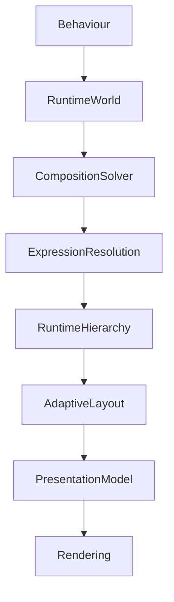

<!--
File: design/mds/MDS-006 Composition Engine/08-runtime-pipelines.md
Document: MDS-006
Chapter: 08
Title: Runtime Pipelines
Status: Draft
Version: 0.1
-->

# Runtime Pipelines

---

# Purpose

Behaviour Orchestration defines how runtime systems evolve together.

Runtime Pipelines define **how those behavioural stages execute efficiently inside the Composition Engine**.

The Composition Engine should not be viewed as one large process.

Instead it is a series of deterministic runtime pipelines.

Each pipeline performs one responsibility.

Together they continuously construct the user's World.

---

# Definition

Within MDS, **Runtime Pipelines** are defined as:

> **The ordered execution stages through which behavioural changes are transformed into a fully resolved Presentation Model.**

Pipelines execute architecture.

They do not define architecture.

---

# Philosophy

Many runtime frameworks follow this model.

```text
State

↓

Render

↓

Done
```

Mosaic intentionally follows:

```text
Behaviour

↓

Pipeline

↓

Understanding

↓

Presentation

↓

Render
```

The runtime solves understanding before rendering begins.

---

# Pipeline Principles

Every runtime pipeline should satisfy the following principles.

- deterministic
- incremental
- behaviour-driven
- presentation independent
- cacheable
- observable

Pipelines should communicate intent.

Not implementation.

---

# Pipeline Overview

Every behavioural event should travel through the same conceptual pipeline.

```text
Behaviour

↓

Runtime World

↓

Composition Solver

↓

Expression Resolution

↓

Hierarchy Resolution

↓

Adaptive Layout

↓

Presentation Model

↓

Rendering
```

No stage should be skipped.

No stage should duplicate another.

---

# Stage One

## Behaviour Intake

Purpose.

Receive behavioural events.

Examples.

- Playback Started
- Focus Changed
- Search Opened
- Chapter Completed

This stage validates behavioural intent.

It performs no presentation work.

---

# Stage Two

## Runtime World Update

Purpose.

Apply behavioural mutations to the Runtime World.

Outputs include:

- updated Focus
- updated Context
- updated Relationships

The Runtime World becomes the single source of truth for the remainder of the pipeline.

---

# Stage Three

## Composition Solver

Purpose.

Determine:

- Hero
- Priority
- Grouping
- Expressions

The Solver constructs understanding.

It produces no presentation.

---

# Stage Four

## Expression Resolution

Purpose.

Transform solved concepts into reusable Expressions.

Outputs include:

- Expression Tree
- Material Intent
- Typography Intent
- Motion Intent

Expressions remain implementation independent.

---

# Stage Five

## Runtime Hierarchy

Purpose.

Resolve behavioural importance.

Outputs include:

```text
Hero

↓

Primary

↓

Supporting

↓

Peripheral
```

Every Expression receives exactly one current runtime role.

---

# Stage Six

## Adaptive Layout

Purpose.

Project Expressions into spatial organisation.

Adaptive Layout considers:

- device class
- orientation
- viewing distance
- accessibility

Behaviour remains unchanged.

Only spatial expression adapts.

---

# Stage Seven

## Presentation Model

Purpose.

Construct a platform-independent presentation description.

The Presentation Model contains:

- Expressions
- Regions
- Materials
- Typography
- Motion
- Interaction metadata

Components do not yet exist.

---

# Stage Eight

## Rendering

Rendering frameworks consume the Presentation Model.

Examples.

- Flutter
- Web
- SwiftUI
- Compose

Rendering should remain a passive implementation stage.

Behaviour has already been solved.

---

# Incremental Pipelines

Not every behavioural event should execute every stage.

Example.

Playback progress.

Preferred.

```text
Behaviour

↓

Timeline Expression

↓

Presentation Update
```

Avoid.

```text
Behaviour

↓

Entire Pipeline

↓

Complete Rebuild
```

Incremental execution improves performance while preserving behavioural correctness.

---

# Parallel Execution

Future implementations may execute independent stages concurrently.

Examples.

Typography.

↓

Parallel.

Materials.

↓

Parallel.

Motion.

↓

Parallel.

Provided they consume the same immutable Presentation Model.

Parallel execution should never compromise determinism.

---

# Pipeline Snapshots

Every stage should consume immutable inputs.

Conceptually.

```text
Snapshot

↓

Stage

↓

Snapshot

↓

Next Stage
```

Immutable snapshots improve:

- replay
- testing
- debugging
- caching

No stage should mutate data owned by another stage.

---

# Failure Recovery

Pipelines should degrade gracefully.

Preferred.

```text
Material Failure

↓

Fallback Material

↓

Continue
```

Avoid.

```text
Material Failure

↓

Entire Runtime Stops
```

The user's World should remain available whenever practical.

---

# Pipeline Caching

Pipeline stages should cache deterministic outputs.

Examples.

```text
Runtime World

↓

Composition

↓

Cache
```

```text
Expression Tree

↓

Presentation Model

↓

Cache
```

Only affected stages should recompute after behavioural changes.

---

# Observability

Future runtime implementations should expose pipeline telemetry.

Examples include:

- execution time
- cache utilisation
- invalidation reasons
- behavioural triggers
- presentation updates

Observability exists to improve runtime quality.

Not to influence behavioural architecture.

---

# Multi-Device Execution

Every device executes the same conceptual pipeline.

Desktop.

↓

Pipeline.

Phone.

↓

Pipeline.

Television.

↓

Pipeline.

Only Presentation differs.

Behavioural execution remains identical.

---

# Plugins

Extensions contribute:

- behaviour
- information
- relationships

Plugins never participate directly in pipeline execution.

The Composition Engine determines:

- execution order
- stage boundaries
- presentation

Every extension therefore inherits identical runtime behaviour.

---

# Good Examples

## Playback

Behaviour.

↓

Runtime World.

↓

Timeline updates.

↓

Presentation updates.

↓

Rendering.

Only affected stages execute.

---

## Reading

Chapter changes.

↓

Composition updates.

↓

Typography updates.

↓

Presentation.

Reading continues naturally.

---

## Search

Search opens.

↓

Overlay Expressions.

↓

Adaptive Layout.

↓

Presentation.

The underlying World remains intact.

---

# Anti-patterns

## Full Pipeline

Executing every stage for every behavioural update.

---

## Mutable Stages

Pipeline stages modifying upstream data.

---

## Rendering Pipeline

Rendering engine influencing behavioural execution.

---

## Platform Pipelines

Different clients inventing different runtime architectures.

---

# Runtime Pipeline Model



Every behavioural event travels through one deterministic architectural pipeline.

---

# Relationship To Future Chapters

The next chapter defines **Composition Caching**.

Runtime Pipelines explain:

> **How runtime stages execute.**

Composition Caching explains:

> **How the results of those stages are reused efficiently while preserving deterministic behaviour.**

Together they define the execution model of the Composition Engine.

---

# Summary

Runtime Pipelines transform behavioural events into presentation through one deterministic execution architecture.

Each stage performs one responsibility.

No stage duplicates another.

The runtime therefore remains:

- predictable,
- incremental,
- cacheable,
- platform independent.

Users should never perceive these pipelines.

They should simply experience a World that continually understands and responds to them.

---

# Review Status

**Status**

Draft

**Next File**

`09-composition-caching.md`
