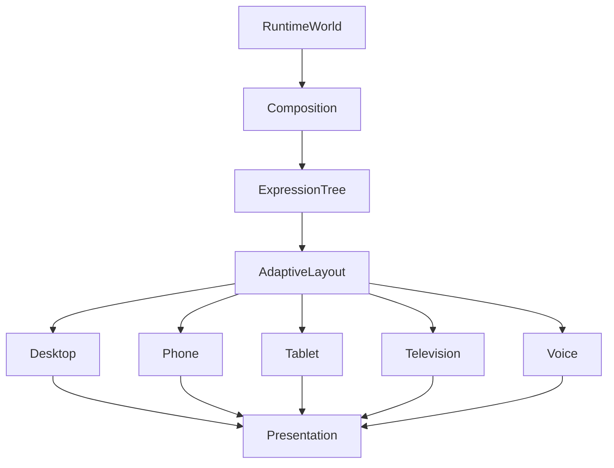

<!--
File: design/mds/MDS-006 Composition Engine/10-multi-device-composition.md
Document: MDS-006
Chapter: 10
Title: Multi-Device Composition
Status: Draft
Version: 0.1
-->

# Multi-Device Composition

---

# Purpose

The Composition Engine solves one Runtime World.

Users, however, may experience that World across many different devices.

Examples include:

- phone
- tablet
- desktop
- television
- foldable devices
- future spatial interfaces
- voice interfaces

This chapter defines how one solved Composition becomes many presentations without fragmenting behavioural understanding.

There should never be:

- Mobile Composition
- TV Composition
- Desktop Composition

There should only ever be:

> **One Composition.**

---

# Definition

Within MDS, **Multi-Device Composition** is defined as:

> **The deterministic projection of one solved Runtime Composition across multiple presentation environments while preserving behavioural understanding.**

Presentation adapts.

Understanding does not.

---

# Philosophy

Traditional applications frequently solve interfaces separately.

Examples.

```
Mobile UI

↓

Desktop UI

↓

TV UI
```

These experiences often diverge over time.

Mosaic intentionally solves once.

```
Runtime World

↓

Composition

↓

Expressions

↓

Device Projection

↓

Presentation
```

The World remains identical.

Only its physical expression changes.

---

# One Runtime

Every client consumes the same Runtime World.

Desktop.

↓

Runtime World.

Phone.

↓

Same Runtime World.

Television.

↓

Same Runtime World.

No client owns independent behavioural state.

The Runtime World remains the single source of truth.

---

# One Composition

Likewise.

Every client consumes the same solved Composition.

Examples.

```
Hero

Timeline

Relationships

Progress

Actions
```

These Expressions remain identical regardless of device.

The Adaptive Layout system determines presentation.

---

# Device Projection

The Composition Engine projects solved Expressions into device-specific layouts.

Conceptually.

```text
Composition

↓

Expression Tree

↓

Adaptive Layout

↓

Phone
```

```text
Composition

↓

Expression Tree

↓

Adaptive Layout

↓

Desktop
```

Behaviour remains identical.

---

# Device Classes

Future implementations may define conceptual device classes.

Examples.

```text
Phone

Tablet

Desktop

Television

Foldable

Voice

Spatial
```

Each device class receives its own Presentation Model.

No device receives a different Composition.

---

# Viewing Distance

Projection should account for viewing distance.

Television.

↓

Greater spacing.

↓

Larger typography.

↓

Expanded Hero.

Phone.

↓

Closer reading.

↓

Compact hierarchy.

The behavioural language remains unchanged.

---

# Input Independence

Different devices expose different interaction methods.

Examples.

- touch
- mouse
- keyboard
- remote
- voice
- gesture

These affect interaction.

They do not affect Composition.

Behaviour remains independent from input technology.

---

# Expression Stability

Expressions should remain recognisable across every platform.

Timeline.

↓

Timeline.

Hero.

↓

Hero.

Relationships.

↓

Relationships.

Only visual expression changes.

Conceptual identity remains constant.

---

# Progressive Projection

Smaller devices should progressively disclose information.

Not remove it.

Incorrect.

```
Desktop

↓

Cast

↓

Phone

↓

Removed
```

Preferred.

```
Desktop

↓

Cast

↓

Phone

↓

Collapsed

↓

Expandable
```

Understanding remains available.

Presentation adapts.

---

# Simultaneous Devices

Future Mosaic experiences may span multiple devices simultaneously.

Examples.

Television.

↓

Playback.

Phone.

↓

Companion controls.

Tablet.

↓

Metadata.

Each device receives a different Presentation Model.

All consume the same Runtime World.

Behaviour remains synchronised.

---

# Runtime Synchronisation

Every device should observe identical behavioural evolution.

Example.

Playback pauses.

↓

Television updates.

↓

Phone updates.

↓

Tablet updates.

↓

Runtime World remains authoritative.

Presentation latency should never alter behavioural ordering.

---

# Material Consistency

Different devices may implement Materials differently.

Desktop.

↓

Premium Acrylic.

Phone.

↓

Simplified Acrylic.

Television.

↓

Greater perceived depth.

The Material language remains recognisably Mosaic.

Only rendering fidelity changes.

---

# Typography Consistency

Editorial hierarchy remains identical.

Examples.

Hero.

↓

Heading.

Supporting.

↓

Body.

Caption.

↓

Caption.

Different devices may alter:

- spacing
- measure
- scale

Editorial meaning remains unchanged.

---

# Motion Consistency

Motion sequencing should remain identical.

Examples.

Hero moves.

↓

Supporting responds.

↓

Environment settles.

Different platforms may adjust:

- duration
- interpolation
- rendering fidelity

Behavioural ordering must remain identical.

---

# Accessibility

Accessibility should remain device independent.

Large text.

↓

All devices.

Reduced motion.

↓

All devices.

High contrast.

↓

All devices.

Accessibility profiles belong to the Runtime World.

Not individual platforms.

---

# Runtime Identity

Users should always feel they are interacting with:

> The same Companion.

Changing device should never require relearning:

- hierarchy
- navigation
- behaviour
- editorial language

Only presentation changes.

---

# Device Handover

Future implementations may support seamless device handover.

Example.

Watching.

↓

Television.

↓

Continue on Phone.

↓

Same Runtime World.

↓

Same Hero.

↓

Same Progress.

↓

Same Composition.

The transition should feel like continuing the same experience rather than opening a different application.

---

# Plugins

Extensions contribute:

- behaviour
- information
- relationships

Plugins never target specific devices.

The Composition Engine determines how extension content appears everywhere.

Every extension therefore automatically supports future devices.

---

# Good Examples

## Television

Hero.

↓

Large presentation.

↓

Minimal controls.

↓

Immersive experience.

---

## Phone

Hero.

↓

Compact presentation.

↓

Progressive disclosure.

↓

Comfortable touch interaction.

The behavioural language remains identical.

---

## Foldable

One Runtime World.

↓

Adaptive projection.

↓

Expanded editorial layout.

↓

Same Expressions.

The experience evolves naturally with the device.

---

# Anti-patterns

## Mobile Features

Mobile receives different behaviour.

---

## Platform Hierarchy

Television invents different conceptual priorities.

---

## Device Plugins

Extensions creating independent device interfaces.

---

## Separate Runtime

Every client maintaining its own behavioural state.

---

# Multi-Device Composition Model



One Runtime World.

One Composition.

Many Presentations.

---

# Relationship To Future Chapters

The next chapter defines **Composition Engine Governance**.

Multi-Device Composition explains:

> **How one solved World becomes many device experiences.**

Governance explains:

> **How the Composition Engine evolves while preserving one consistent behavioural architecture across every future client.**

Together they complete the architectural foundation of the Mosaic runtime.

---

# Summary

Multi-Device Composition ensures that Mosaic remains one platform rather than a collection of applications.

Users should experience:

- one World,
- one Companion,
- one behavioural language,

regardless of:

- screen size,
- input method,
- rendering technology,
- future devices.

Presentation may change.

Understanding never should.

---

# Review Status

**Status**

Draft

**Next File**

`11-governance.md`
