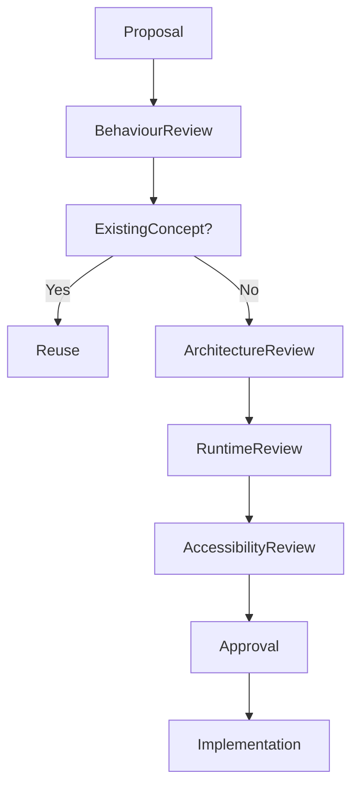

<!--
File: design/mds/MDS-006 Composition Engine/11-governance.md
Document: MDS-006
Chapter: 11
Title: Composition Engine Governance
Status: Draft
Version: 0.1
-->

# Composition Engine Governance

---

# Purpose

The Composition Engine is the architectural heart of Mosaic.

Every runtime experience ultimately depends upon it.

Unlike rendering technologies, which may evolve frequently, the Composition Engine defines how the platform thinks.

Poor governance would gradually fragment:

- behavioural consistency,
- runtime hierarchy,
- composition,
- plugin integration,
- cross-platform parity.

This chapter defines how the Composition Engine should evolve while preserving one coherent runtime architecture.

---

# Governance Philosophy

The Composition Engine should evolve technically.

Its behavioural model should remain remarkably stable.

The objective is not preserving implementation.

It is preserving:

- understanding,
- determinism,
- continuity,
- compositional integrity.

Future runtime technologies should strengthen these ideas rather than replacing them.

---

# Runtime Is Architecture

The Composition Engine is not middleware.

It is architecture.

Changing:

- Runtime Hierarchy,
- Expression Resolution,
- Behaviour Orchestration,

changes how users understand Mosaic.

These changes therefore require architectural review.

---

# Stable Responsibilities

The following concepts should remain highly stable.

- Runtime World
- Composition Solver
- Expression Resolution
- Runtime Hierarchy
- Behaviour Orchestration
- Adaptive Composition

These concepts define the behavioural identity of Mosaic.

---

# Evolvable Responsibilities

The following may evolve continuously.

- caching strategies
- graph implementations
- execution pipelines
- scheduling
- runtime optimisation
- parallel execution

Implementation may evolve.

Behaviour should remain stable.

---

# Engine Ownership

Composition Engine responsibilities are intentionally separated.

| Layer | Owner |
|--------|-------|
| Runtime Philosophy | Design Systems |
| Composition Solver | Runtime Architecture |
| Expression Resolution | Runtime Architecture |
| Adaptive Layout | Runtime Architecture |
| Presentation Model | Client Runtime |
| Rendering | Client Platform |

Ownership preserves conceptual integrity while allowing implementation to improve independently.

---

# Introducing New Runtime Behaviour

Before introducing new runtime behaviour ask:

## Question One

Does the Runtime World already communicate this?

---

## Question Two

Does the Composition Solver already solve this?

---

## Question Three

Could this be expressed through existing Expressions?

---

## Question Four

Will this remain meaningful after future rendering technologies change?

---

## Question Five

Would another contributor naturally discover this behaviour?

If uncertainty remains...

The proposal should continue evolving before implementation.

---

# Runtime Drift

Runtime Drift occurs when:

- platforms solve behaviour differently,
- hierarchy diverges,
- plugins bypass composition,
- expressions lose semantic consistency,
- presentation begins influencing behaviour.

Runtime Drift weakens the entire Mosaic architecture.

It should therefore be treated as architectural debt.

---

# Runtime Debt

Examples include:

- duplicated runtime logic,
- presentation-driven behaviour,
- component-owned hierarchy,
- plugin-owned composition,
- undocumented runtime exceptions.

Runtime Debt should be reduced continuously.

The Composition Engine should become simpler over time.

Not more complicated.

---

# Solver Governance

The Composition Solver should always remain:

- deterministic,
- behavioural,
- presentation independent.

The Solver should never begin reasoning about:

- widgets,
- rendering,
- layouts,
- platforms.

Its only responsibility is understanding.

---

# Expression Governance

Expressions represent one of the strongest architectural contracts within Mosaic.

New Expressions should be introduced sparingly.

Before creating a new Expression ask:

- Can an existing Expression communicate this?
- Is this actually new understanding?
- Is this merely another presentation?

The Expression vocabulary should remain intentionally compact.

---

# Adaptive Layout Governance

Adaptive Layout should never redefine:

- hierarchy,
- behaviour,
- editorial structure.

Layout projects understanding.

It does not create understanding.

This distinction should remain inviolable.

---

# Accessibility Governance

Accessibility always possesses higher authority than adaptive presentation.

No optimisation should weaken:

- hierarchy,
- continuity,
- understanding,
- behavioural clarity.

Accessibility modifies presentation.

Never runtime behaviour.

---

# Plugin Governance

Extensions must never define:

- hierarchy,
- expressions,
- runtime pipelines,
- behavioural sequencing.

Plugins contribute:

- behaviour,
- information,
- relationships.

The Composition Engine owns runtime understanding.

This guarantees one coherent behavioural language throughout the ecosystem.

---

# Review Questions

Every runtime proposal should answer:

- Does this strengthen understanding?
- Does this preserve determinism?
- Does this improve continuity?
- Does this reinforce behavioural hierarchy?
- Would users still recognise Mosaic after this change?
- Is this solving behaviour or implementation?

If the proposal exists primarily because a runtime optimisation is available...

It should be reconsidered.

Behaviour always possesses higher authority than optimisation.

---

# Validation

Future tooling should automatically validate:

- deterministic solving
- Expression integrity
- hierarchy consistency
- behavioural sequencing
- cache correctness
- cross-platform parity

Validation should reinforce architectural review.

It should never replace behavioural reasoning.

---

# Governance Workflow

Architectural refinement should always be preferred over expanding runtime concepts.

---

# Success Criteria

The Composition Engine succeeds when:

- every client constructs the same understanding,
- runtime remains deterministic,
- behaviour always precedes presentation,
- extensions naturally integrate,
- contributors think in Worlds rather than interfaces,
- optimisation never weakens behavioural correctness.

Users should never perceive the Composition Engine.

They should simply experience a platform that always understands them.

---

# Architectural Decisions

| ADR | Decision |
|------|----------|
| ADR-149 | The Runtime World is the single behavioural source of truth. |
| ADR-150 | The Composition Solver owns runtime understanding. |
| ADR-151 | Expressions are the stable contract between runtime and presentation. |
| ADR-152 | Adaptive Layout projects understanding without redefining it. |
| ADR-153 | Extensions enrich the Runtime World but never own composition. |

---

# Review Status

**Status**

Draft

**Next File**

`12-adrs.md`
