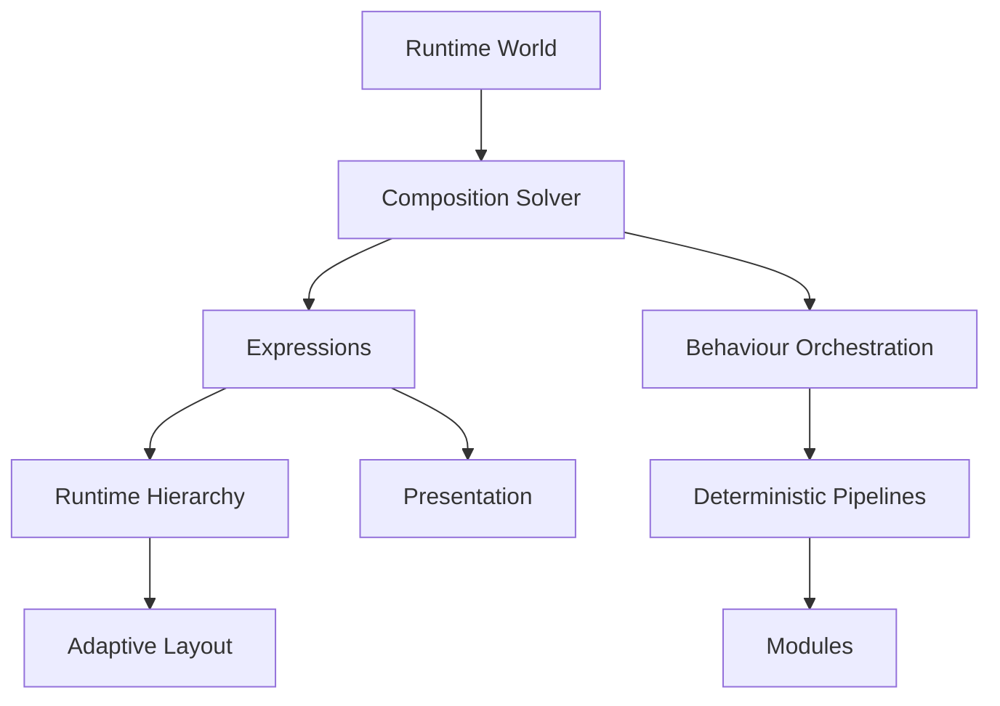

<!--
File: docs/design/system/mds-006-composition-engine/12-adrs.md
Document: MDS-006
Chapter: 12
Title: Architectural Decision Records
Status: Draft
Version: 0.2
-->

# Architectural Decision Records

---

# Purpose

The Architectural Decision Records (ADRs) contained within MDS-006 preserve the architectural reasoning behind the Mosaic Composition Engine.

Every previous specification established:

- Vision
- Behaviour
- Design Language
- Runtime Systems

MDS-006 establishes how those systems become one continuously evolving runtime experience.

These ADRs explain why Mosaic treats runtime composition as a behavioural solving process rather than a rendering process.

Future contributors should understand these decisions before modifying the Composition Engine.

---

# Decision Format

Decision format, lifecycle and review expectations are governed by **MDG-001 — Documentation Authority Guide**.

This chapter records decisions specific to this specification and avoids redefining the shared ADR process.

# ADR-154

## Title

Treat The Runtime World As The Primary Runtime Model

### Status

Accepted

### Context

Traditional applications frequently build interfaces from application state.

Founder workshops consistently favoured modelling the user's current World rather than interface state.

### Decision

The Runtime World becomes the single behavioural source of truth.

### Consequences

Every runtime subsystem consumes identical behavioural information.

Presentation becomes deterministic.

---

# ADR-155

## Title

Composition Is Solved Rather Than Authored

### Status

Accepted

### Context

Static interface templates struggle to communicate changing behavioural priorities.

### Decision

The Composition Solver continuously constructs understanding from the Runtime World.

### Consequences

The interface evolves naturally as behaviour changes.

---

# ADR-156

## Title

Introduce Expressions As A Runtime Abstraction

### Status

Accepted

### Context

Directly generating components tightly couples runtime behaviour to rendering frameworks.

### Decision

Expressions become the stable contract between runtime understanding and presentation.

### Consequences

Future clients remain implementation independent while sharing one conceptual runtime.

---

# ADR-157

## Title

Runtime Hierarchy Is Behavioural

### Status

Accepted

### Context

Traditional interfaces frequently derive hierarchy from layout.

### Decision

Hierarchy is continuously solved from behaviour rather than geometry.

### Consequences

Adaptive layouts preserve understanding across every device.

---

# ADR-158

## Title

Behaviour Orchestrates Every Runtime System

### Status

Accepted

### Context

Independent runtime subsystems frequently produce fragmented user experiences.

### Decision

Every runtime subsystem evolves from one coordinated behavioural pipeline.

### Consequences

Users experience one coherent World rather than multiple independent interface updates.

---

# ADR-159

## Title

Presentation Is A Runtime Product

### Status

Accepted

### Context

Traditional frameworks often treat presentation as the runtime model.

### Decision

Presentation becomes the output of runtime solving.

### Consequences

Rendering technologies remain replaceable without affecting runtime behaviour.

---

# ADR-160

## Title

Adaptive Layout Never Changes Behaviour

### Status

Accepted

### Context

Responsive layouts frequently alter behavioural meaning across devices.

### Decision

Adaptive Layout projects solved understanding rather than redefining it.

### Consequences

Every device communicates identical behavioural intent.

---

# ADR-161

## Title

Runtime Pipelines Must Remain Deterministic

### Status

Accepted

### Context

Predictable runtime behaviour is essential for replay, testing and synchronisation.

### Decision

Every pipeline stage consumes immutable inputs and produces deterministic outputs.

### Consequences

Caching, replay and multi-device synchronisation become reliable architectural capabilities.

---

# ADR-162

## Title

Modules Enrich The Runtime World

### Status

Accepted

### Context

Allowing modules to construct presentation fragments runtime consistency.

### Decision

Modules contribute behaviour, relationships and information only.

The Composition Engine owns runtime solving.

### Consequences

Community modules inherit every future runtime improvement automatically.

---

# ADR Relationships

Together these decisions establish the Composition Engine as a behavioural runtime architecture rather than a rendering framework.

---

# Future ADRs

Future Composition Engine ADRs are expected to formalise:

- Predictive Composition
- AI-assisted Expression Selection
- Distributed Runtime Worlds
- Collaborative Runtime Sessions
- Spatial Composition
- Incremental Graph Solving
- Runtime Behaviour Personas
- Cloud-assisted Composition Pipelines

These intentionally remain outside the scope of MDS-006 Version 0.1.

---

# ADR Governance

Composition Engine ADRs should change only when:

- behavioural research identifies deficiencies,
- runtime architecture fundamentally evolves,
- deterministic guarantees require refinement,
- the Mosaic Design Language itself changes.

Implementation technology alone should never justify architectural changes.

The runtime model should remain recognisably Mosaic regardless of future execution environments.

---

# Summary

The ADRs contained within MDS-006 define the architectural heart of Mosaic.

Rather than constructing interfaces...

The Composition Engine constructs understanding.

Everything else:

- layouts,
- materials,
- typography,
- motion,
- rendering,

emerges naturally from that solved understanding.

---

# Review Status

**Status**

Draft

**Next File**

`13-contributor-guidance.md`
