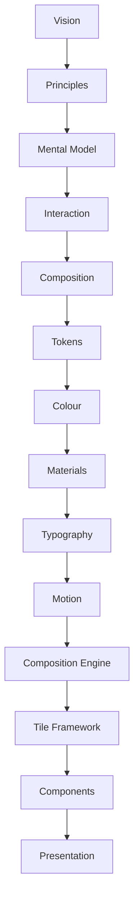
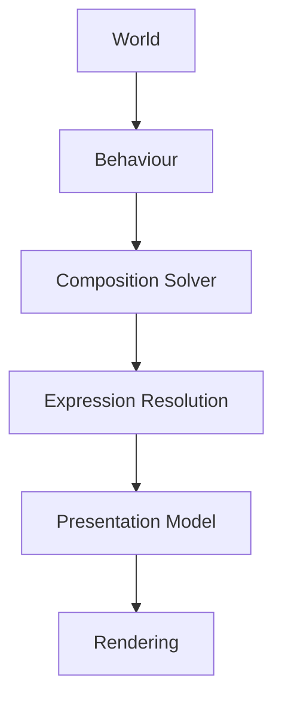

<!--
File: docs/design/system/mds-006-composition-engine/index.md
Document: MDS-006
Status: Draft
Version: 0.4
-->

# MDS-006 — Composition Engine

> *The interface is never authored. It is solved.*

---

# Purpose

Every specification preceding MDS-006 has defined **what** Mosaic is.

The MDL established:

- Vision
- Principles
- Mental Model
- Interaction
- Composition

The MDS established:

- Design Tokens
- Colour
- Materials
- Typography
- Motion

MDS-006 defines how all of those systems become a living runtime experience.

It is the architectural heart of Mosaic.

Unlike traditional UI frameworks, which render predefined screens, the Composition Engine continuously constructs the user's current World from behaviour, information and relationships.

It does not render layouts.

It solves understanding.

---

# Relationship to Previous Specifications



The Composition Engine consumes every previous specification.

It produces:

- Expressions
- Runtime Hierarchy
- Adaptive Composition
- Runtime Behaviour
- Presentation Models

---

# Scope

This specification defines:

- Composition Engine Architecture
- Runtime Solver
- Expression Resolution
- Hierarchy Resolution
- Adaptive Layout Resolution
- Permanent Composition-Plane Occupancy
- Airspace Reserve Resolution
- Behaviour Orchestration
- Runtime Graph Processing
- Multi-Device Composition
- Composition Caching
- Runtime Pipelines

This specification intentionally does **not** define:

- Components
- Rendering APIs
- GraphQL Schema
- Storage
- Transport

Those systems provide data.

The Composition Engine constructs experience.

---

# Guiding Question

MDS-006 exists to answer one question.

> **How does Mosaic construct the user's World at runtime?**

Not:

> How do we render screens?

---

# Composition Engine Statement

Within Mosaic:

> **The user experiences a solved World rather than a rendered interface.**

Every runtime decision should reinforce that principle.

---

# Composition Engine Responsibilities

The Composition Engine separates runtime construction into several conceptual layers.



Each layer contributes one responsibility.

No layer duplicates another.

---

# Expected Outcome

After reading MDS-006 contributors should understand:

- how runtime composition works,
- how Expressions are resolved,
- how adaptive composition behaves,
- how multiple devices share one runtime model,
- how behavioural changes propagate,
- how presentation remains implementation independent,
- how layered projected occupancy and protected artwork regions are solved,

without discussing specific UI frameworks.

---

# Repository Structure

```text
design/

└── mds/

    └── MDS-006 Composition Engine/

        README.md

        00-document-control.md

        01-composition-engine-philosophy.md

        02-runtime-world.md

        03-composition-solver.md

        04-expression-resolution.md

        05-runtime-hierarchy.md

        06-adaptive-layout.md

        07-behaviour-orchestration.md

        08-runtime-pipelines.md

        09-composition-caching.md

        10-multi-device-composition.md

        11-governance.md

        12-adrs.md

        13-contributor-guidance.md

        references.md

        glossary.md
```

---

# Dependencies

Required reading:

- [MDL-001](../../language/mdl-001-vision/index.md) → [MDL-005](../../language/mdl-005-composition-model/index.md)
- [MDS-001](../mds-001-design-token-architecture/index.md) → [MDS-005](../mds-005-motion-system/index.md)

Downstream specifications:

- [MDS-007 — Tile Framework](../mds-007-tile-framework/index.md)
- [MDS-008 — Component Library](../mds-008-component-library/index.md)
