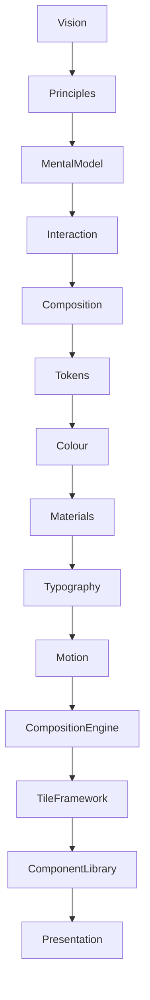

<!--
File: design/mds/MDS-007 Tile Framework/00-document-control.md
Document: MDS-007
Title: Tile Framework
Status: Draft
Version: 0.1
-->

# Document Control

---

# Document Information

| Property | Value |
|----------|-------|
| Document ID | MDS-007 |
| Title | Mosaic Design System — Tile Framework |
| Classification | Internal |
| Status | Draft |
| Version | 0.1 |
| Owner | Lead Runtime Presentation Architecture Team |
| Parent Specifications | MDL-001 → MDL-005, MDS-001 → MDS-006 |
| Repository | `/design/mds/MDS-007 Tile Framework/` |

---

# Purpose

MDS-007 defines the Tile Framework used throughout Mosaic.

The Tile Framework is the architectural bridge between runtime understanding and visual implementation.

Where the Composition Engine determines:

> **What the user should understand.**

The Tile Framework determines:

> **How that understanding becomes reusable presentation.**

Tiles are not components.

They are presentation primitives that carry behavioural meaning independently from rendering technology.

Every visual interface within Mosaic should ultimately be composed from Tiles.

---

# Authority

MDS-007 governs:

- Tile philosophy
- Tile taxonomy
- Expression-to-Tile mapping
- Tile lifecycle
- Adaptive Tile behaviour
- Tile interaction
- Runtime Tile resolution
- Tile orchestration
- Extension Tile integration

This specification intentionally does **not** govern:

- platform widgets
- rendering frameworks
- UI toolkits
- animation APIs
- layout engines

Those systems implement Tiles.

They do not define them.

---

# Relationship To MDS

The Tile Framework extends the Composition Engine.



The Tile Framework consumes:

- Expressions
- Runtime Hierarchy
- Material Intent
- Typography Intent
- Motion Intent

It produces:

- reusable presentation primitives.

---

# Design Intent

Traditional interface frameworks frequently begin with reusable components.

Examples include:

- cards
- buttons
- lists
- grids

Mosaic intentionally introduces an additional abstraction.

```text
Expression

↓

Tile

↓

Component

↓

Rendering
```

This separation ensures that behavioural meaning remains independent from implementation.

---

# Reader Expectations

Before reading this specification contributors should already understand:

- MDL-001 Vision
- MDL-002 Principles
- MDL-003 Mental Model
- MDL-004 Interaction Model
- MDL-005 Composition Model
- MDS-001 Design Token Architecture
- MDS-002 Colour System
- MDS-003 Material System
- MDS-004 Typography System
- MDS-005 Motion System
- MDS-006 Composition Engine

The Tile Framework assumes runtime understanding has already been solved.

Its responsibility is reusable presentation.

---

# Architectural Scope

The Tile Framework defines:

- tile identities
- tile behaviour
- tile adaptation
- tile interaction
- tile orchestration
- runtime tile resolution

It intentionally avoids implementation technologies such as:

- Flutter widgets
- React components
- SwiftUI views
- Compose composables

Those become consumers of Tiles rather than architectural concepts.

---

# Stability

Expected lifetime.

| Artefact | Expected Lifetime |
|----------|-------------------|
| Components | Months |
| Rendering Frameworks | Months |
| Platform Widgets | Months |
| Tile Taxonomy | Years |
| Tile Philosophy | Decades |

Rendering technologies are expected to evolve rapidly.

Tile identities should remain remarkably stable.

---

# Success Criteria

MDS-007 succeeds when:

- Expressions consistently resolve into appropriate Tiles
- Tiles remain reusable across every Mosaic client
- components become simple rendering implementations
- extensions naturally inherit platform presentation
- adaptive behaviour remains predictable
- contributors think in Tiles rather than widgets

Users should never perceive Tiles directly.

They should simply experience a coherent interface whose behaviour naturally reflects the Runtime World.

---

# Review Status

**Status**

Draft

**Dependencies**

- MDL-001 → MDL-005
- MDS-001 → MDS-006

**Supersedes**

None.

**Next File**

`01-tile-philosophy.md`
