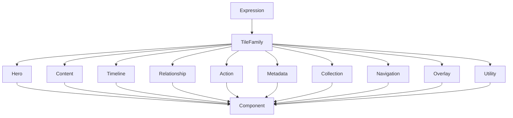

<!--
File: design/mds/MDS-007 Tile Framework/02-tile-taxonomy.md
Document: MDS-007
Chapter: 02
Title: Tile Taxonomy
Status: Draft
Version: 0.1
-->

# Tile Taxonomy

---

# Purpose

The previous chapter established what a Tile is.

This chapter defines the vocabulary of Tiles available throughout Mosaic.

Unlike traditional component libraries, Tile Taxonomy is **not** a catalogue of widgets.

It is a behavioural classification system.

Every Tile exists because it communicates one recurring kind of understanding.

The taxonomy should therefore remain:

- intentionally small,
- behaviourally meaningful,
- presentation independent.

---

# Definition

Within MDS, **Tile Taxonomy** is defined as:

> **The canonical classification of reusable presentation primitives used to communicate solved runtime Expressions.**

Tiles describe:

- purpose,
- behaviour,
- presentation intent.

They intentionally avoid describing:

- implementation,
- layout,
- rendering technology.

---

# Why A Taxonomy Exists

Without a shared taxonomy:

Different contributors naturally invent:

- Hero Card
- Episode Card
- Media Card
- Film Card
- Continue Watching Card

Each solves essentially the same behavioural problem.

The result is duplication.

Instead.

```text
Hero Tile
```

One behavioural concept.

Many runtime presentations.

---

# Tile Categories

The current Tile Framework defines the following conceptual Tile families.

```text
Hero

↓

Content

↓

Timeline

↓

Relationship

↓

Action

↓

Metadata

↓

Collection

↓

Navigation

↓

Overlay

↓

Utility
```

Every Tile belongs to exactly one primary family.

---

# Hero Tile

Purpose.

Communicate the current Focus.

Examples.

- current film
- current episode
- current book
- current album

Hero Tiles receive:

- Hero Material
- Heading typography
- Hero Motion

There should normally be one Hero Tile within the current Composition.

---

# Content Tile

Purpose.

Represent an individual piece of content.

Examples.

- film
- episode
- chapter
- song
- book

Content Tiles are intentionally neutral.

They become important only through Runtime Hierarchy.

---

# Timeline Tile

Purpose.

Communicate temporal progression.

Examples.

- playback progress
- reading progress
- listening position
- download progress

Timeline Tiles should communicate continuity.

Not merely percentages.

---

# Relationship Tile

Purpose.

Communicate relationships.

Examples.

- sequel
- author
- cast
- franchise
- recommendations

Relationship Tiles strengthen understanding of the user's World.

They should rarely become the behavioural centre.

---

# Action Tile

Purpose.

Communicate behavioural possibility.

Examples.

- continue
- play
- resume
- bookmark
- download

Action Tiles communicate what users can do next.

They should never replace the Hero.

---

# Metadata Tile

Purpose.

Communicate supporting information.

Examples.

- runtime
- codec
- language
- release year
- publisher

Metadata Tiles should remain editorially quiet.

They support understanding.

They rarely lead it.

---

# Collection Tile

Purpose.

Represent organised groups of Expressions.

Examples.

- Continue Watching
- Library
- Recently Added
- Favourites
- Collections

Collection Tiles organise related Content Tiles.

They should not redefine their behavioural importance.

---

# Navigation Tile

Purpose.

Communicate orientation.

Examples.

- Home
- Search
- Library
- Downloads
- Settings

Navigation Tiles remain behaviourally stable.

Users should always know where they are.

---

# Overlay Tile

Purpose.

Support temporary interaction.

Examples.

- search
- playback controls
- command palette
- menus

Overlay Tiles inherit:

- Overlay Material
- Overlay Motion

They remain temporary behavioural participants.

---

# Utility Tile

Purpose.

Communicate supporting system information.

Examples.

- diagnostics
- synchronisation
- storage
- updates

Utility Tiles should remain behaviourally peripheral.

They should never compete with entertainment.

---

# Behavioural Identity

Every Tile possesses one behavioural identity.

Incorrect.

```text
Hero Timeline Tile
```

Several responsibilities merged.

Preferred.

```text
Hero Tile

↓

Timeline Tile
```

Composition determines relationships.

Tiles remain individually meaningful.

---

# Tile Stability

Tile identities should remain stable for many years.

Example.

```
Timeline Tile
```

may later become:

- holographic
- voice
- spatial
- adaptive

Its behavioural identity remains:

```
Timeline Tile
```

The taxonomy therefore survives future presentation technologies.

---

# Runtime Hierarchy

Runtime Hierarchy influences Tile importance.

Example.

```
Content Tile

↓

Hero Tile
```

A Content Tile may temporarily become the Hero because behaviour changed.

The taxonomy remains unchanged.

Only runtime role evolves.

---

# Material Intent

Each Tile family possesses default Material Intent.

| Tile | Material |
|------|----------|
| Hero | Hero Material |
| Content | Surface Material |
| Timeline | Acrylic |
| Relationship | Surface Material |
| Action | Acrylic |
| Metadata | Surface Material |
| Collection | Canvas / Surface |
| Navigation | Surface Material |
| Overlay | Overlay Material |
| Utility | Surface Material |

These defaults may adapt through Runtime Resolution while preserving behavioural identity.

---

# Typography Intent

Each Tile family also carries editorial intent.

Examples.

Hero.

↓

Heading.

Metadata.

↓

Supporting.

Utility.

↓

Caption.

Typography therefore follows Tile behaviour naturally.

---

# Motion Intent

Motion behaviour also derives from Tile family.

Hero.

↓

Hero Motion.

Timeline.

↓

Supporting Motion.

Overlay.

↓

Overlay Motion.

Movement therefore remains behaviourally consistent across every Mosaic client.

---

# Adaptive Behaviour

The same Tile may appear differently across devices.

Desktop.

↓

Expanded Hero Tile.

Phone.

↓

Compact Hero Tile.

Television.

↓

Immersive Hero Tile.

Voice.

↓

Spoken Hero Tile.

The taxonomy remains unchanged.

---

# Plugins

Extensions should never define new Tile families.

Plugins contribute:

- Expressions,
- information,
- relationships.

The Tile Framework maps those Expressions into existing Tile families.

This preserves one coherent presentation vocabulary.

---

# Good Examples

## Film

Expression.

↓

Hero.

↓

Hero Tile.

↓

Component.

---

## Reading

Expression.

↓

Bookmarks.

↓

Relationship Tile.

↓

Presentation.

---

## Music

Expression.

↓

Playback Queue.

↓

Collection Tile.

↓

Presentation.

The behavioural identity remains stable.

---

# Anti-patterns

## Widget Taxonomy

Naming Tiles after components.

---

## Platform Taxonomy

Creating Flutter Tiles.

---

## Domain Taxonomy

Creating Anime Tiles, Book Tiles or Music Tiles.

Behaviour should remain domain independent.

---

## Plugin Taxonomy

Extensions introducing independent Tile families.

---

# Tile Taxonomy Model



Expressions determine Tile family.

Components render Tiles.

---

# Relationship To Future Chapters

The next chapter defines **Expression Mapping**.

Tile Taxonomy explains:

> **Which Tile families exist.**

Expression Mapping explains:

> **How solved Expressions are deterministically mapped into those Tile families at runtime.**

Together they establish the runtime presentation vocabulary of Mosaic.

---

# Summary

Tile Taxonomy provides one shared presentation language for the entire Mosaic platform.

It ensures that:

- Expressions remain behavioural,
- Tiles remain reusable,
- Components remain replaceable,
- Extensions remain native.

Every future Mosaic client should therefore communicate one consistent visual language built from the same small vocabulary of behavioural Tiles.

---

# Review Status

**Status**

Draft

**Next File**

`03-expression-mapping.md`
