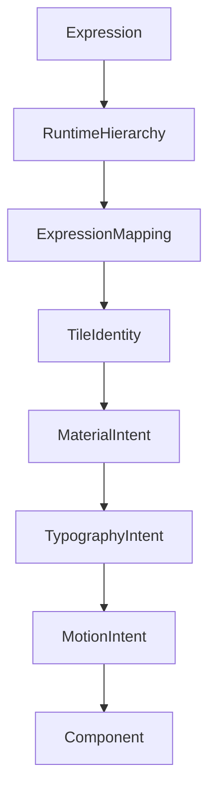

<!--
File: design/mds/MDS-007 Tile Framework/03-expression-mapping.md
Document: MDS-007
Chapter: 03
Title: Expression Mapping
Status: Draft
Version: 0.1
-->

# Expression Mapping

---

# Purpose

The Composition Engine produces Expressions.

The Tile Framework produces Tiles.

This chapter defines the deterministic process that connects the two.

Expression Mapping is intentionally one of the strongest architectural boundaries within Mosaic.

Expressions communicate understanding.

Tiles communicate presentation.

Neither system should know implementation details belonging to the other.

---

# Definition

Within MDS, **Expression Mapping** is defined as:

> **The deterministic process through which solved runtime Expressions are transformed into appropriate Tile identities while preserving behavioural meaning.**

Expression Mapping communicates presentation intent.

It does not perform rendering.

---

# Why Mapping Exists

Without Expression Mapping, rendering systems would need to understand runtime concepts directly.

Example.

```text
Playback

↓

Widgets
```

This tightly couples behaviour to implementation.

Instead.

```text
Playback

↓

Expressions

↓

Tiles

↓

Components

↓

Rendering
```

Every layer owns one responsibility.

---

# One Expression

Every Expression should normally resolve to one primary Tile.

Example.

```text
Hero

↓

Hero Tile
```

The Tile may later be implemented differently.

Its behavioural identity remains unchanged.

---

# Behaviour Before Mapping

Mapping should always begin from behavioural meaning.

Incorrect.

```text
Poster

↓

Poster Card
```

Correct.

```text
Hero Expression

↓

Hero Tile
```

Presentation follows behaviour.

Never the reverse.

---

# Deterministic Mapping

Given identical:

- Runtime World
- Expressions
- Behaviour
- Context

Expression Mapping should always produce identical Tile identities.

This determinism enables:

- caching
- testing
- replay
- cross-platform consistency

---

# Mapping Inputs

Expression Mapping evaluates:

```text
Expression

↓

Runtime Hierarchy

↓

Behaviour

↓

Context

↓

Device Capability
```

Rendering technology is intentionally absent.

Tiles remain implementation independent.

---

# Mapping Outputs

The Mapping stage produces:

```text
Tile Identity

↓

Material Intent

↓

Typography Intent

↓

Motion Intent

↓

Interaction Intent
```

The Component Library later consumes these outputs.

---

# Hero Mapping

Example.

```text
Hero Expression

↓

Hero Tile
```

The Hero Tile inherits:

- Hero Material
- Hero Typography
- Hero Motion

The renderer later decides how this appears physically.

---

# Timeline Mapping

Example.

```text
Timeline Expression

↓

Timeline Tile
```

Timeline Tiles inherit:

- Supporting Motion
- Acrylic Material
- Supporting Typography

The behavioural role remains identical across every platform.

---

# Relationship Mapping

Example.

```text
Relationship Expression

↓

Relationship Tile
```

Relationship Tiles communicate:

- recommendations
- cast
- author
- franchise

without introducing domain-specific presentation.

---

# Action Mapping

Example.

```text
Resume Expression

↓

Action Tile
```

The Tile communicates behavioural opportunity.

Not button implementation.

Buttons remain platform components.

---

# Metadata Mapping

Example.

```text
Metadata Expression

↓

Metadata Tile
```

Metadata remains:

- supporting,
- editorial,
- behaviourally quiet.

It should never unexpectedly become primary because of implementation choices.

---

# Runtime Hierarchy

Runtime Hierarchy may influence Tile behaviour.

Example.

```text
Content Expression

↓

Hero

↓

Hero Tile
```

The Expression remains:

```
Content
```

Its runtime role changes.

Mapping respects that role.

---

# Device Adaptation

Different devices may receive different Tile variants.

Desktop.

↓

Expanded Hero Tile.

Phone.

↓

Compact Hero Tile.

Voice.

↓

Spoken Hero Tile.

These remain behavioural variants of one Tile identity.

The mapping remains conceptually identical.

---

# Material Intent

Expression Mapping also assigns Material Intent.

Example.

```text
Overlay Expression

↓

Overlay Tile

↓

Overlay Material
```

Rendering systems remain unaware of behavioural reasoning.

They simply receive Tile metadata.

---

# Typography Intent

Expressions also inherit editorial behaviour.

Example.

```text
Hero

↓

Hero Tile

↓

Heading
```

```text
Metadata

↓

Metadata Tile

↓

Supporting
```

Typography therefore becomes another consequence of behavioural mapping.

---

# Motion Intent

Motion also follows Tile identity.

Example.

Hero Tile.

↓

Hero Motion.

Timeline Tile.

↓

Supporting Motion.

Overlay Tile.

↓

Overlay Motion.

Movement therefore remains behaviourally consistent without components defining transitions independently.

---

# Interaction Intent

Tiles also communicate interaction.

Examples.

```text
Hero Tile

↓

Primary Interaction
```

```text
Relationship Tile

↓

Exploration
```

```text
Metadata Tile

↓

Passive
```

Interaction therefore emerges naturally from behavioural understanding.

---

# Incremental Mapping

Expression Mapping should update incrementally.

Example.

Playback progress.

↓

Timeline Tile updates.

Hero Tile unchanged.

Only affected mappings should recompute.

This preserves runtime efficiency and behavioural continuity.

---

# Plugins

Extensions contribute:

- Expressions,
- information,
- relationships.

Plugins never perform mapping.

The Tile Framework owns:

- Tile identity,
- Material intent,
- Motion intent,
- Typography intent.

Every extension therefore automatically inherits future presentation improvements.

---

# Good Examples

## Playback

Expression.

↓

Timeline.

↓

Timeline Tile.

↓

Platform Component.

Behaviour remains intact.

---

## Reading

Expression.

↓

Bookmarks.

↓

Relationship Tile.

↓

Presentation.

The runtime vocabulary remains consistent.

---

## Music

Expression.

↓

Current Track.

↓

Hero Tile.

↓

Presentation.

Behaviour determines presentation.

---

# Anti-patterns

## Widget Mapping

Expressions directly selecting components.

---

## Platform Mapping

Different platforms inventing different Tile identities.

---

## Plugin Mapping

Extensions deciding presentation.

---

## Domain Mapping

Creating Film Tiles, Anime Tiles or Book Tiles.

Behaviour should remain media independent.

---

# Expression Mapping Model



Expressions determine Tiles.

Tiles determine presentation.

Components remain implementation.

---

# Relationship To Future Chapters

The next chapter defines **Tile Lifecycle**.

Expression Mapping explains:

> **How Expressions become Tiles.**

Tile Lifecycle explains:

> **How those Tiles evolve over time while preserving behavioural continuity.**

Together they establish the runtime life of every presentation primitive within Mosaic.

---

# Summary

Expression Mapping is one of the most important abstraction boundaries within the Mosaic architecture.

It ensures that:

- runtime behaviour remains independent,
- presentation remains reusable,
- rendering remains replaceable.

Expressions describe understanding.

Tiles describe presentation.

Components simply render the result.

---

# Review Status

**Status**

Draft

**Next File**

`04-tile-lifecycle.md`
