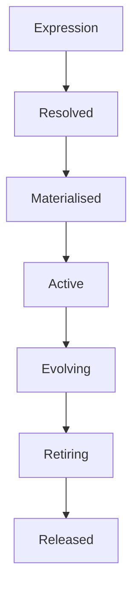

<!--
File: design/mds/MDS-007 Tile Framework/04-tile-lifecycle.md
Document: MDS-007
Chapter: 04
Title: Tile Lifecycle
Status: Draft
Version: 0.1
-->

# Tile Lifecycle

---

# Purpose

Expressions continuously evolve as the Runtime World changes.

Tiles must evolve with them.

Unlike conventional UI components, which are frequently created and destroyed in response to interface events, Mosaic Tiles are intended to preserve behavioural continuity.

The Tile Lifecycle defines how Tiles:

- appear,
- evolve,
- persist,
- disappear,

while maintaining one continuous user experience.

The objective is not efficient rendering.

It is uninterrupted understanding.

---

# Definition

Within MDS, **Tile Lifecycle** is defined as:

> **The behavioural evolution of a Tile from creation through adaptation to retirement while preserving continuity with the Runtime World.**

The lifecycle belongs to behaviour.

Not rendering.

---

# Philosophy

Traditional UI frameworks often behave like this.

```text
Create Widget

↓

Render

↓

Destroy Widget
```

Mosaic intentionally behaves differently.

```text
Expression

↓

Tile Appears

↓

Tile Evolves

↓

Tile Adapts

↓

Tile Retires
```

Users should experience continuous objects rather than disposable interface elements.

---

# Lifecycle Stages

Every Tile progresses through the same conceptual lifecycle.

```text
Resolved

↓

Materialised

↓

Active

↓

Evolving

↓

Retiring

↓

Released
```

Each stage communicates one behavioural responsibility.

---

# Stage One

## Resolved

The Tile has been selected by Expression Mapping.

At this stage it possesses:

- identity,
- Material intent,
- Typography intent,
- Motion intent,
- Interaction intent.

It does not yet exist visually.

---

# Stage Two

## Materialised

The Tile becomes part of the Presentation Model.

Materialised Tiles now possess:

- runtime identity,
- spatial intent,
- hierarchy,
- behavioural role.

Rendering has still not occurred.

---

# Stage Three

## Active

The Tile is now visible.

Examples.

Hero Tile.

↓

Displayed.

Timeline Tile.

↓

Displayed.

Metadata Tile.

↓

Displayed.

The Tile participates fully in:

- Motion,
- Materials,
- Interaction,
- Runtime Hierarchy.

---

# Stage Four

## Evolving

Most Tiles spend the majority of their lifetime evolving.

Examples.

Playback progresses.

↓

Timeline evolves.

Hero changes.

↓

Hero Tile evolves.

Reading progresses.

↓

Progress Tile evolves.

Evolution should preserve Tile identity whenever practical.

Users should perceive continuity.

Not replacement.

---

# Stage Five

## Retiring

A Tile retires when its behavioural purpose ends.

Examples.

Search closes.

↓

Search Tile retires.

Overlay dismissed.

↓

Overlay Tile retires.

The Tile should depart naturally.

It should not simply disappear.

Retirement should preserve behavioural understanding.

---

# Stage Six

## Released

The Tile is no longer behaviourally relevant.

Runtime resources may now be reclaimed.

Importantly...

Users should already understand why the Tile disappeared before this stage occurs.

Release is an implementation concern.

Retirement is a behavioural concern.

---

# Behaviour Owns Lifecycle

Only behaviour changes Tile lifecycle.

Incorrect.

```text
Scroll

↓

Destroy Tile
```

Correct.

```text
Behaviour Changes

↓

Tile Retires
```

Rendering optimisations should never redefine behavioural lifetime.

---

# Identity Preservation

Whenever practical...

A Tile should evolve rather than be replaced.

Preferred.

```text
Episode 17

↓

Episode 18

↓

Hero Tile Evolves
```

Avoid.

```text
Hero Tile Destroyed

↓

New Hero Tile Created
```

Identity continuity significantly reduces cognitive effort.

---

# Runtime Hierarchy

Hierarchy changes may alter a Tile's role.

Example.

```
Content Tile

↓

Hero Tile
```

The Tile remains behaviourally related.

Only its runtime importance evolves.

This distinction strengthens continuity throughout the interface.

---

# Material Continuity

Tiles should preserve Material identity throughout evolution.

Hero Tile.

↓

Hero Material.

↓

Still Hero Material.

A Tile should never unexpectedly become an unrelated material because implementation changed.

---

# Typography Continuity

Editorial roles should remain stable.

Examples.

Heading.

↓

Heading.

Supporting.

↓

Supporting.

The wording may change.

The editorial language should remain recognisable.

---

# Motion Continuity

Tile lifecycle transitions should follow the Motion System.

Examples.

Resolved.

↓

Materialised.

↓

Active.

↓

Evolving.

↓

Retiring.

↓

Released.

Movement communicates behavioural evolution.

It should never obscure it.

---

# Incremental Evolution

Small behavioural updates should produce small lifecycle changes.

Example.

Playback progresses.

↓

Timeline Tile evolves.

Everything else remains active.

Incremental evolution preserves runtime stability while reducing unnecessary work.

---

# Reuse

Future implementations may reuse Tile instances.

Conceptually.

```text
Released Tile

↓

Compatible Expression

↓

Reuse
```

Reuse is an implementation optimisation.

The behavioural lifecycle remains unchanged.

---

# Runtime Ownership

The Tile Framework owns lifecycle.

Components merely render current lifecycle state.

Rendering frameworks should never independently determine:

- creation,
- retirement,
- evolution.

Behaviour remains authoritative.

---

# Plugins

Extensions contribute:

- Expressions,
- behaviour,
- information.

Plugins never manage Tile lifecycles.

Every extension therefore inherits one consistent behavioural model automatically.

---

# Good Examples

## Playback

Timeline Tile.

↓

Progress updates.

↓

Tile evolves.

↓

Playback continues.

No unnecessary replacement occurs.

---

## Reading

Bookmark added.

↓

Relationship Tile evolves.

↓

Reader continues uninterrupted.

---

## Search

Search Tile appears.

↓

Interaction.

↓

Search Tile retires.

↓

Previous Composition continues naturally.

---

# Anti-patterns

## Widget Lifecycle

Component creation determining behavioural lifetime.

---

## Instant Replacement

Destroying Tiles rather than evolving them.

---

## Platform Lifecycle

Different clients managing behavioural lifetime differently.

---

## Plugin Lifecycle

Extensions owning Tile creation and destruction.

---

# Tile Lifecycle Model



Tiles evolve because behaviour evolves.

Rendering simply follows.

---

# Relationship To Future Chapters

The next chapter defines **Adaptive Tiles**.

Tile Lifecycle explains:

> **How Tiles evolve over time.**

Adaptive Tiles explain:

> **How the same Tile adapts across different environments while preserving its behavioural identity.**

Together they ensure Tiles remain both continuous and adaptive.

---

# Summary

The Tile Lifecycle ensures presentation behaves like the rest of Mosaic.

Continuous.

Behavioural.

Predictable.

Tiles should not feel disposable.

They should feel like persistent participants within the user's World, evolving naturally as behaviour changes and quietly departing only when their purpose has truly ended.

---

# Review Status

**Status**

Draft

**Next File**

`05-adaptive-tiles.md`
