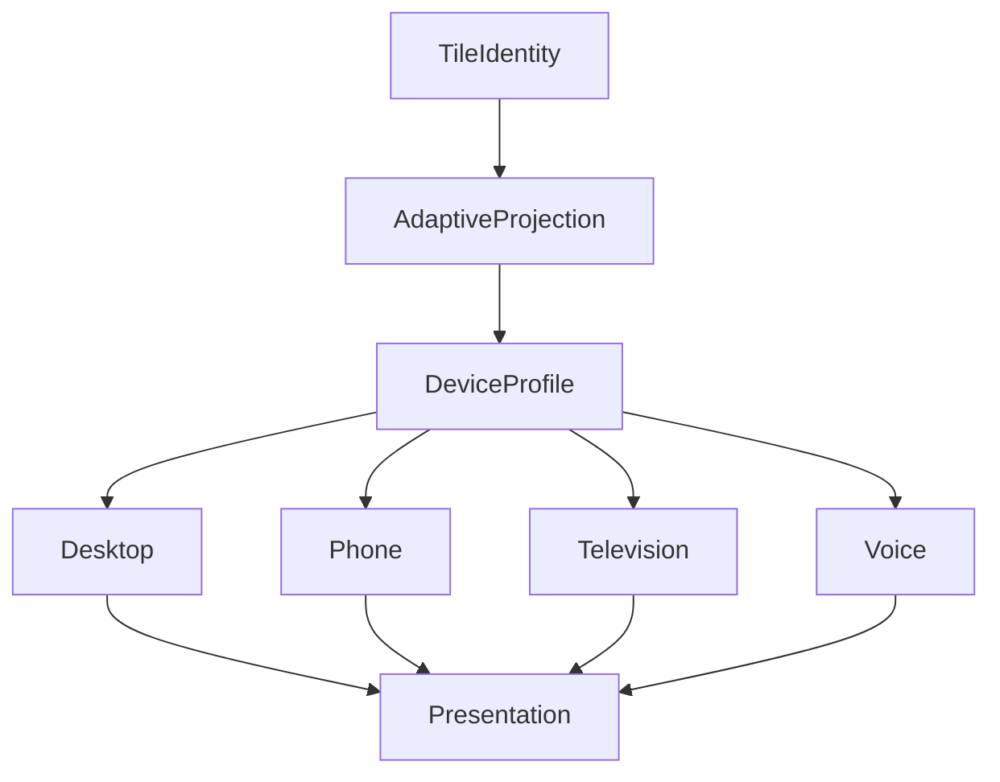

<!--
File: design/mds/MDS-007 Tile Framework/05-adaptive-tiles.md
Document: MDS-007
Chapter: 05
Title: Adaptive Tiles
Status: Draft
Version: 0.1
-->

# Adaptive Tiles

---

# Purpose

Every Tile communicates one behavioural idea.

That idea must remain recognisable regardless of:

- device,
- screen size,
- viewing distance,
- interaction method,
- accessibility preferences.

Adaptive Tiles define how one Tile identity evolves across different presentation environments without changing its behavioural meaning.

The Tile adapts.

The understanding remains constant.

---

# Definition

Within MDS, **Adaptive Tiles** are defined as:

> **Tiles capable of altering their physical presentation while preserving behavioural identity, runtime hierarchy and conceptual responsibility.**

Adaptive behaviour changes presentation.

It never changes purpose.

---

# Philosophy

Traditional responsive systems frequently create:

- desktop cards,
- mobile cards,
- TV cards.

Each gradually evolves into an independent implementation.

Mosaic intentionally avoids this.

Instead.

```text
Hero Tile

↓

Adaptive Hero Tile

↓

Platform Presentation
```

One Tile.

Many physical expressions.

---

# Behaviour Before Adaptation

Adaptive Tiles always begin with behaviour.

Incorrect.

```text
Phone

↓

Compact Card
```

Correct.

```text
Hero Tile

↓

Adaptive Projection

↓

Phone Presentation
```

Devices influence presentation.

They never redefine behaviour.

---

# One Tile Identity

Every Adaptive Tile preserves one stable identity.

Examples.

```text
Hero Tile

↓

Desktop
```

```text
Hero Tile

↓

Phone
```

```text
Hero Tile

↓

Television
```

Every presentation remains:

```
Hero Tile
```

The behavioural identity never changes.

---

# Adaptive Inputs

Adaptive behaviour evaluates:

```text
Tile Identity

↓

Runtime Hierarchy

↓

Device Class

↓

Viewing Distance

↓

Accessibility

↓

Capabilities
```

Behaviour has already been solved.

Adaptive Tiles communicate that behaviour appropriately.

---

# Adaptive Outputs

Adaptive Tiles produce:

```text
Presentation Variant

↓

Material Behaviour

↓

Typography Behaviour

↓

Interaction Behaviour

↓

Layout Constraints
```

These outputs remain independent from rendering technology.

---

# Hero Adaptation

Desktop.

↓

Expanded Hero.

Phone.

↓

Compact Hero.

Television.

↓

Immersive Hero.

Voice.

↓

Spoken Hero.

The Hero remains behaviourally identical.

Only presentation differs.

---

# Timeline Adaptation

Timeline Tiles should adapt according to available space.

Examples.

Desktop.

↓

Expanded progress.

Phone.

↓

Condensed progress.

Television.

↓

Distance-optimised progress.

Voice.

↓

Spoken progress.

Users should always recognise:

```
Timeline
```

regardless of implementation.

---

# Metadata Adaptation

Metadata should progressively collapse.

Preferred.

Desktop.

↓

Complete metadata.

Phone.

↓

Primary metadata.

↓

Expandable detail.

Understanding remains available.

Presentation simply becomes quieter.

---

# Relationship Adaptation

Relationship Tiles may adapt by:

- grouping,
- collapsing,
- summarising,
- expanding.

Relationships should never disappear solely because presentation space decreased.

Behaviour always possesses higher priority than convenience.

---

# Collection Adaptation

Collections should adapt naturally.

Desktop.

↓

Large collection.

Phone.

↓

Progressive collection.

Television.

↓

Immersive collection.

The Collection Tile remains behaviourally unchanged.

---

# Material Adaptation

Adaptive Tiles inherit Material behaviour.

Examples.

Hero Tile.

↓

Hero Material.

Compact Hero.

↓

Simplified Hero Material.

Low Power Device.

↓

Reduced Material Fidelity.

Material identity remains recognisable.

Only rendering complexity changes.

---

# Typography Adaptation

Editorial hierarchy remains stable.

Heading.

↓

Heading.

Supporting.

↓

Supporting.

Caption.

↓

Caption.

Adaptive Tiles may alter:

- measure,
- spacing,
- line length.

They should never alter editorial meaning.

---

# Motion Adaptation

Motion should adapt naturally.

Examples.

Desktop.

↓

Full Material Motion.

Phone.

↓

Reduced travel.

Television.

↓

Greater perceived distance.

Reduced Motion.

↓

Minimal movement.

Behavioural sequencing remains identical.

---

# Interaction Adaptation

Interaction methods naturally differ.

Examples.

Phone.

↓

Touch.

Desktop.

↓

Pointer.

Television.

↓

Remote.

Voice.

↓

Conversation.

Adaptive Tiles expose different interaction affordances.

The underlying behaviour remains identical.

---

# Accessibility

Accessibility may adapt Tile presentation.

Examples.

Large Text.

↓

Greater spacing.

Reduced Motion.

↓

Simplified transitions.

High Contrast.

↓

Clearer Materials.

The Tile should remain behaviourally recognisable under every accessibility profile.

---

# Runtime Adaptation

Adaptive behaviour should occur continuously.

Examples.

Window resized.

↓

Tile evolves.

Orientation changes.

↓

Tile adapts.

Accessibility enabled.

↓

Tile refines.

The Tile should never appear to restart its lifecycle because presentation changed.

---

# Device Independence

Adaptive behaviour should remain independent from specific platforms.

Future devices should require only:

```
Capability Profile

↓

Adaptive Projection
```

The Tile Framework should remain prepared for technologies that do not yet exist.

---

# Plugins

Extensions never define adaptive behaviour.

Plugins contribute:

- Expressions,
- behaviour,
- information.

Adaptive Tiles remain entirely platform owned.

Every extension therefore automatically supports future devices.

---

# Good Examples

## Hero

Desktop.

↓

Expanded Hero.

Phone.

↓

Compact Hero.

Behaviour remains identical.

---

## Reading

Metadata collapses naturally.

↓

Reader expands when required.

↓

Understanding preserved.

---

## Television

Collection Tile expands.

↓

Greater spacing.

↓

Long-distance readability.

↓

Same behavioural identity.

---

# Anti-patterns

## Device Tiles

Creating independent Mobile Hero Tiles.

---

## Layout Behaviour

Changing behavioural meaning because layout changed.

---

## Platform Identity

Different clients inventing different Tile vocabularies.

---

## Accessibility Tiles

Creating separate Tile identities for accessibility.

---

# Adaptive Tile Model



One Tile identity.

Many adaptive presentations.

---

# Relationship To Future Chapters

The next chapter defines **Tile Composition**.

Adaptive Tiles explain:

> **How one Tile adapts across environments.**

Tile Composition explains:

> **How multiple Tiles combine into coherent runtime presentation while preserving behavioural understanding.**

Together they establish the presentation architecture of Mosaic.

---

# Summary

Adaptive Tiles ensure that Mosaic remains:

- behaviourally consistent,
- presentation flexible,
- future proof.

Users should never think:

> "This is the mobile version."

They should simply feel that the same Companion naturally adapted to the device they chose to use.

That behavioural continuity is the defining objective of Adaptive Tiles.

---

# Review Status

**Status**

Draft

**Next File**

`06-tile-composition.md`
