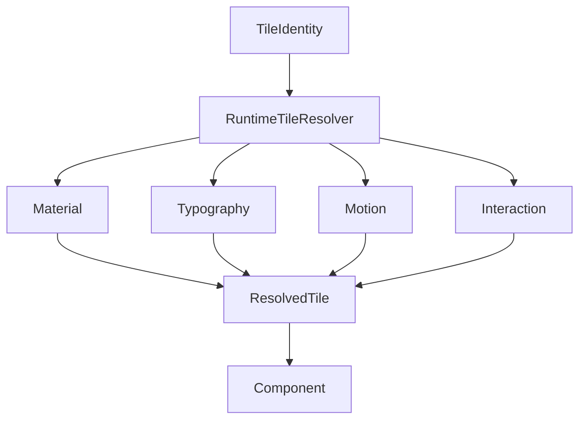

<!--
File: design/mds/MDS-007 Tile Framework/08-runtime-tile-resolution.md
Document: MDS-007
Chapter: 08
Title: Runtime Tile Resolution
Status: Draft
Version: 0.1
-->

# Runtime Tile Resolution

---

# Purpose

The Tile Framework defines:

- Tile identities,
- Tile behaviour,
- Tile interaction,
- Tile composition.

This chapter defines how those concepts become concrete runtime presentation objects.

Runtime Tile Resolution transforms behavioural Tiles into fully resolved presentation primitives ready for implementation by the Component Library.

Components should never decide:

- Material
- Typography
- Motion
- Interaction
- Layout

They receive already resolved Tiles.

---

# Definition

Within MDS, **Runtime Tile Resolution** is defined as:

> **The deterministic process through which behavioural Tile identities become fully resolved runtime presentation objects while preserving behavioural meaning and platform independence.**

Runtime Tile Resolution resolves presentation.

It never changes behaviour.

---

# Why Resolution Exists

Without Runtime Tile Resolution, every component would need to understand:

- Runtime Hierarchy
- Material Intent
- Typography Intent
- Motion Intent
- Adaptive behaviour
- Accessibility

Instead.

```text
Tile

↓

Runtime Tile Resolver

↓

Resolved Tile

↓

Component
```

Components remain extremely simple.

---

# Resolution Pipeline

Every Tile follows the same conceptual pipeline.

```text
Tile Identity

↓

Runtime Hierarchy

↓

Material Intent

↓

Typography Intent

↓

Motion Intent

↓

Accessibility

↓

Adaptive Behaviour

↓

Resolved Tile
```

Each stage contributes one responsibility.

---

# Resolution Inputs

Runtime Tile Resolution evaluates:

```text
Tile Identity

↓

Expression

↓

Runtime Hierarchy

↓

Current Context

↓

Device Profile

↓

Accessibility

↓

Capabilities
```

Rendering technology remains intentionally absent.

---

# Resolution Outputs

Resolved Tiles contain:

```text
Material

↓

Typography

↓

Motion

↓

Interaction

↓

Adaptive Variant

↓

Presentation Metadata
```

These objects become the direct input to the Component Library.

---

# Tile Identity Is Stable

One of the strongest guarantees within Mosaic is:

```text
Hero Tile

↓

Always Hero Tile
```

Runtime Resolution may alter:

- material richness,
- layout,
- interaction affordances,
- typography.

It never alters Tile identity.

---

# Material Resolution

Material Intent resolves into runtime Materials.

Example.

```text
Hero Tile

↓

Hero Material

↓

Resolved Hero Material
```

Components should never determine Material behaviour independently.

---

# Typography Resolution

Typography Intent resolves similarly.

Example.

```text
Metadata Tile

↓

Supporting Typography

↓

Resolved Typography
```

Editorial hierarchy therefore remains entirely runtime driven.

---

# Motion Resolution

Motion Intent resolves into runtime behaviour.

Example.

```text
Timeline Tile

↓

Supporting Motion

↓

Resolved Motion Profile
```

Components consume motion.

They never construct it.

---

# Interaction Resolution

Interaction Intent also resolves.

Examples.

```text
Primary

↓

Touch

↓

Mouse

↓

Remote

↓

Voice
```

Interaction methods adapt.

Behavioural intent remains unchanged.

---

# Adaptive Resolution

Runtime Tile Resolution also determines adaptive variants.

Example.

Desktop.

↓

Expanded Hero Tile.

Phone.

↓

Compact Hero Tile.

Voice.

↓

Conversational Hero Tile.

The Tile remains behaviourally identical.

---

# Accessibility Resolution

Accessibility refines resolved Tiles.

Examples.

Large Text.

↓

Typography.

Reduced Motion.

↓

Motion.

High Contrast.

↓

Materials.

Behaviour remains identical.

Only presentation adapts.

---

# Runtime Profiles

Future implementations may internally generate Tile Profiles.

Conceptually.

```text
Hero Tile

↓

Tile Profile

↓

Material

↓

Typography

↓

Motion

↓

Interaction

↓

Resolved Tile
```

Components consume Tile Profiles.

They remain unaware of runtime solving.

---

# Runtime Caching

Resolved Tiles should be aggressively cacheable.

Typical invalidation events include:

- behaviour changes,
- hierarchy changes,
- accessibility changes,
- device changes.

Ordinary rendering should reuse existing Tile Profiles whenever practical.

---

# Incremental Resolution

Preferred.

```text
Timeline Tile

↓

Resolved

↓

Updated
```

Avoid.

```text
Every Tile

↓

Resolved Again
```

Incremental resolution preserves runtime performance and behavioural continuity.

---

# Platform Independence

Runtime Tile Resolution should remain completely platform independent.

Flutter.

↓

Consumes Resolved Tile.

Web.

↓

Consumes Resolved Tile.

SwiftUI.

↓

Consumes Resolved Tile.

Compose.

↓

Consumes Resolved Tile.

Presentation differs.

Resolved behavioural intent remains identical.

---

# Deterministic Resolution

Given identical:

- Tile Identity,
- Runtime World,
- Hierarchy,
- Accessibility,

Runtime Tile Resolution should always produce identical resolved Tiles.

Determinism improves:

- caching,
- replay,
- testing,
- cross-platform consistency.

---

# Plugins

Extensions contribute:

- Expressions,
- behaviour,
- relationships.

Plugins never resolve Tiles.

The Tile Framework owns:

- Tile Resolution,
- adaptive behaviour,
- runtime presentation.

Every extension therefore automatically inherits future Tile improvements.

---

# Good Examples

## Playback

Timeline Tile.

↓

Runtime Resolution.

↓

Resolved Timeline.

↓

Component.

Behaviour remains preserved.

---

## Reading

Relationship Tile.

↓

Adaptive Resolution.

↓

Phone Presentation.

↓

Reader continues naturally.

---

## Television

Hero Tile.

↓

Immersive Variant.

↓

Hero Material.

↓

Presentation.

One behavioural identity.

---

# Anti-patterns

## Component Resolution

Components selecting Materials independently.

---

## Platform Resolution

Each client inventing Tile behaviour.

---

## Widget Resolution

Rendering technology influencing behavioural presentation.

---

## Plugin Resolution

Extensions bypassing the Tile Framework.

---

# Runtime Tile Resolution Model



The Runtime Tile Resolver transforms behavioural presentation into implementation-ready runtime objects.

---

# Relationship To Future Chapters

The next chapter defines **Extension Tiles**.

Runtime Tile Resolution explains:

> **How Tiles become runtime presentation.**

Extension Tiles explain:

> **How third-party runtime contributions participate in the Tile Framework while remaining indistinguishable from native Mosaic presentation.**

Together they complete the runtime architecture of the Tile Framework.

---

# Summary

Runtime Tile Resolution ensures every behavioural Tile becomes one fully resolved presentation object before rendering begins.

Components therefore remain implementation details.

Behaviour remains the architectural authority.

Tiles remain the presentation language of Mosaic.

That separation allows the platform to evolve indefinitely while preserving one coherent runtime experience.

---

# Review Status

**Status**

Draft

**Next File**

`09-extension-tiles.md`
