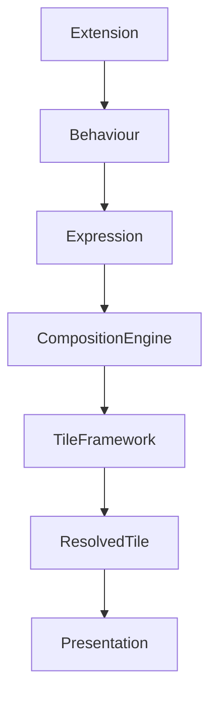

<!--
File: design/mds/MDS-007 Tile Framework/09-extension-tiles.md
Document: MDS-007
Chapter: 09
Title: Extension Tiles
Status: Draft
Version: 0.1
-->

# Extension Tiles

---

# Purpose

One of Mosaic's defining architectural goals is allowing extensions to feel indistinguishable from native functionality.

Users should never be able to identify whether a Tile originated from:

- Mosaic Core,
- an official extension,
- a community extension,
- a third-party integration.

This chapter defines how extensions participate in the Tile Framework without fragmenting the behavioural language of the platform.

Extensions contribute understanding.

The Tile Framework determines presentation.

---

# Definition

Within MDS, **Extension Tiles** are defined as:

> **Runtime Tiles produced from extension-provided Expressions using the same behavioural resolution pipeline as native Mosaic functionality.**

Extension Tiles are not custom Tile types.

They are standard Mosaic Tiles whose behavioural source happens to originate from an extension.

---

# Philosophy

Traditional plugin systems frequently allow extensions to create arbitrary interfaces.

The result is:

- inconsistent layouts,
- inconsistent motion,
- inconsistent typography,
- inconsistent interaction.

Mosaic intentionally rejects this model.

Instead:

```text
Extension

↓

Expression

↓

Tile Framework

↓

Standard Tile

↓

Presentation
```

Extensions become behaviourally native.

---

# Extensions Never Create Tiles

This principle is fundamental.

Extensions provide:

- information,
- relationships,
- behaviours,
- capabilities.

They never provide:

- Hero Tiles,
- custom Cards,
- layouts,
- widgets.

The Tile Framework remains solely responsible for presentation.

---

# Behaviour Before Presentation

Extensions communicate behavioural meaning.

Example.

```text
Real-Debrid Stream

↓

Playback Expression
```

Not:

```text
Streaming Widget
```

The runtime determines how playback should appear.

The extension merely enriches the Runtime World.

---

# Expression Ownership

Extension Expressions participate identically to native Expressions.

Example.

```text
Extension

↓

Timeline Expression

↓

Timeline Tile

↓

Platform Component
```

The Composition Engine never distinguishes between native and extension Expressions during presentation.

Only behaviour matters.

---

# Tile Resolution

Extension Expressions pass through the complete runtime pipeline.

```text
Extension

↓

Runtime World

↓

Composition Solver

↓

Expression Resolution

↓

Tile Resolution

↓

Presentation
```

No shortcuts should exist.

This guarantees behavioural consistency.

---

# Runtime Hierarchy

Extensions never assign hierarchy.

Incorrect.

```text
Extension

↓

Hero
```

Correct.

```text
Extension

↓

Expression

↓

Composition Solver

↓

Hero
```

Only the Composition Engine determines runtime importance.

This preserves behavioural integrity.

---

# Material Behaviour

Extension Tiles inherit standard Material behaviour.

Examples.

Hero.

↓

Hero Material.

Relationship.

↓

Surface Material.

Overlay.

↓

Overlay Material.

Extensions should never specify Material behaviour directly.

---

# Typography Behaviour

Editorial hierarchy also remains platform owned.

Examples.

Extension Metadata.

↓

Supporting.

Extension Hero.

↓

Heading.

Extension Diagnostics.

↓

Caption.

The editorial language remains consistent regardless of content source.

---

# Motion Behaviour

Extension Tiles inherit standard Motion.

Examples.

Playback.

↓

Hero Motion.

Relationship.

↓

Supporting Motion.

Overlay.

↓

Overlay Motion.

Extensions never define transitions.

Movement remains behaviourally consistent.

---

# Adaptive Behaviour

Extension Tiles adapt exactly like native Tiles.

Desktop.

↓

Expanded Tile.

Phone.

↓

Compact Tile.

Television.

↓

Immersive Tile.

Voice.

↓

Conversational Tile.

Extensions automatically support future presentation environments.

---

# Interaction Behaviour

Extensions communicate interaction intent.

Examples.

```text
Play

Bookmark

Install

Open
```

The Tile Framework resolves:

- touch,
- pointer,
- remote,
- keyboard,
- voice.

Interaction therefore remains platform independent.

---

# Extension Identity

Users should perceive:

```
Mosaic
```

Not:

```
Extension UI
```

Visual identity belongs to the platform.

Behaviour belongs to the Runtime World.

Extensions should therefore disappear into the experience.

---

# Capability Projection

Extensions may expose capabilities.

Examples.

```text
Offline Download

Transcoding

Metadata

Streaming

Recommendations
```

Capabilities become behavioural Expressions.

The Composition Engine determines whether and how they appear.

Capability does not imply presentation.

---

# Runtime Updates

Extension updates should follow identical runtime behaviour.

Example.

Extension updates metadata.

↓

Runtime World updates.

↓

Composition evolves.

↓

Tiles update.

The extension should never directly manipulate presentation.

---

# Accessibility

Extension Tiles automatically inherit:

- accessibility,
- adaptive layout,
- motion preferences,
- typography,
- materials.

Extensions should never implement accessibility independently.

The platform guarantees consistency.

---

# Multi-Device Behaviour

Extension Tiles should remain behaviourally identical across:

- desktop,
- mobile,
- television,
- voice,
- future platforms.

Presentation adapts.

Behaviour remains stable.

Extensions therefore automatically support future clients without modification.

---

# Security Boundary

The Tile Framework intentionally provides an architectural security boundary.

Extensions should never directly influence:

- rendering,
- runtime hierarchy,
- Materials,
- Typography,
- Motion,
- Adaptive Layout.

This significantly reduces the risk of inconsistent or malicious presentation behaviour.

---

# Runtime Ownership

The Runtime World owns:

- hierarchy,
- composition,
- presentation.

Extensions own:

- capabilities,
- behaviour,
- information.

Responsibilities remain intentionally separated.

---

# Good Examples

## Streaming Extension

Behaviour.

↓

Playback Expression.

↓

Hero Tile.

↓

Presentation.

Users experience normal playback.

---

## Book Provider

Behaviour.

↓

Relationship Expression.

↓

Relationship Tile.

↓

Presentation.

Discovery behaves identically to native content.

---

## Download Extension

Capability.

↓

Download Expression.

↓

Action Tile.

↓

Presentation.

Interaction feels entirely native.

---

# Anti-patterns

## Custom Widgets

Extensions rendering independent UI.

---

## Custom Tile Types

Extensions inventing new behavioural presentation primitives.

---

## Theme Injection

Extensions modifying:

- Materials,
- Typography,
- Motion.

---

## Runtime Ownership

Extensions bypassing the Composition Engine.

---

# Extension Tile Model



Extensions contribute behaviour.

The platform owns presentation.

---

# Relationship To Future Chapters

The next chapter defines **Tile Orchestration**.

Extension Tiles explain:

> **How extensions participate in the Tile Framework.**

Tile Orchestration explains:

> **How every Tile evolves together during runtime while preserving behavioural continuity.**

Together they complete the behavioural integration architecture of the Tile Framework.

---

# Summary

Extension Tiles ensure that the Mosaic ecosystem grows without fragmenting.

Extensions enrich:

- the Runtime World,
- behavioural understanding,
- user capability.

The Tile Framework transforms those contributions into presentation that feels entirely native.

Users should never think:

> "This came from an extension."

They should simply feel that Mosaic naturally became more capable.

---

# Review Status

**Status**

Draft

**Next File**

`10-tile-orchestration.md`
