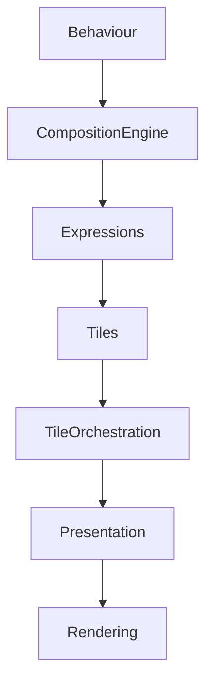

<!--
File: design/mds/MDS-007 Tile Framework/10-tile-orchestration.md
Document: MDS-007
Chapter: 10
Title: Tile Orchestration
Status: Draft
Version: 0.1
-->

# Tile Orchestration

---

# Purpose

The Tile Framework transforms behavioural understanding into presentation.

However...

A real user experience is rarely the result of one Tile acting independently.

Hero Tiles.

Timeline Tiles.

Relationship Tiles.

Overlay Tiles.

All evolve together as the Runtime World changes.

Tile Orchestration ensures every Tile participates in one coherent behavioural experience.

Users should never perceive independent Tiles updating.

They should perceive one World naturally evolving.

---

# Definition

Within MDS, **Tile Orchestration** is defined as:

> **The coordinated runtime evolution of every active Tile following behavioural change while preserving continuity, hierarchy and presentation coherence.**

Tile Orchestration coordinates presentation.

It does not determine behaviour.

Behaviour remains the responsibility of the Composition Engine.

---

# Philosophy

Traditional interfaces often behave like this.

```text
Widget

↓

Updates

↓

Neighbour Updates

↓

Animation

↓

Finished
```

Each component behaves independently.

Mosaic intentionally behaves differently.

```text
Behaviour

↓

Composition

↓

Tiles

↓

Presentation

↓

Understanding
```

Tiles evolve together because behaviour changed.

Not because rendering occurred.

---

# Behaviour Is Authority

Every orchestration cycle begins with behaviour.

Examples.

```text
Playback Started

Playback Paused

Focus Changed

Search Opened

Episode Completed

Bookmark Added
```

Rendering events never initiate Tile Orchestration.

Behaviour always possesses the highest authority.

---

# Orchestration Pipeline

Every behavioural update follows the same conceptual sequence.

```text
Behaviour

↓

Composition Engine

↓

Expression Resolution

↓

Tile Resolution

↓

Tile Orchestration

↓

Presentation

↓

Rendering
```

Tile Orchestration never bypasses earlier runtime stages.

---

# Orchestration Responsibilities

Tile Orchestration coordinates:

- Tile activation
- Tile evolution
- Tile retirement
- Material synchronisation
- Motion sequencing
- Presentation continuity

It intentionally avoids:

- behavioural solving
- rendering
- platform implementation

Those responsibilities belong elsewhere.

---

# Hero First

The Hero remains the behavioural centre.

When orchestration occurs:

```text
Hero

↓

Primary

↓

Supporting

↓

Peripheral

↓

Environment
```

Tile evolution should always respect Runtime Hierarchy.

---

# Group Coordination

Tile groups evolve together.

Example.

Playback.

```text
Hero Group

↓

Timeline

↓

Actions

↓

Metadata
```

The entire group should communicate one behavioural transition.

Groups should never fragment into unrelated animations.

---

# Material Coordination

Tile Orchestration synchronises Material behaviour.

Example.

Hero evolves.

↓

Hero Material updates.

↓

Supporting Acrylic responds.

↓

Atmosphere redistributes.

↓

Canvas settles.

Every material should appear to belong to one physical environment.

---

# Typography Coordination

Typography should remain behaviourally stable.

Tile Orchestration should ensure:

- editorial hierarchy remains intact
- reading rhythm is preserved
- emphasis changes only when behaviour changes

Words should remain easier to follow than movement.

---

# Motion Coordination

Tile Orchestration coordinates Motion.

Example.

```text
Hero Tile

↓

Hero Motion

↓

Supporting Motion

↓

Environmental Motion
```

Motion should reinforce Tile relationships.

It should never create new behavioural meaning.

---

# Incremental Orchestration

Most runtime updates affect only a small number of Tiles.

Example.

Playback progress.

↓

Timeline Tile evolves.

↓

Hero unchanged.

↓

Relationships unchanged.

Only affected Tiles should participate.

This preserves both performance and continuity.

---

# Tile Dependencies

Future implementations may internally maintain Tile dependency graphs.

Conceptually.

```text
Hero Tile

↓

Timeline Tile

↓

Metadata Tile
```

Dependencies improve scheduling.

They should never alter behavioural ordering.

---

# Stable Identity

Whenever practical...

Tiles should evolve rather than be replaced.

Preferred.

```text
Hero Tile

↓

Updated Hero Tile
```

Avoid.

```text
Hero Removed

↓

Hero Created
```

Identity continuity significantly reduces cognitive effort.

---

# Environmental Coordination

Environmental presentation should always respond last.

Example.

```text
Behaviour

↓

Tiles

↓

Motion

↓

Atmosphere

↓

Environment Settles
```

The world should appear to respond naturally.

Not mechanically.

---

# Adaptive Coordination

Adaptive behaviour should participate naturally.

Examples.

Orientation changes.

↓

Tile variants evolve.

Window resized.

↓

Groups adapt.

Accessibility enabled.

↓

Presentation refines.

The orchestration model remains identical.

Only presentation changes.

---

# Failure Behaviour

If one Tile cannot update.

Preferred.

```text
Tile Fallback

↓

Group Continues
```

Avoid.

```text
Entire Composition Stops
```

Behavioural continuity should always remain the highest priority.

---

# Deterministic Behaviour

Given identical:

- Runtime World
- Expressions
- Tile identities

Tile Orchestration should always produce identical runtime behaviour.

Determinism enables:

- replay
- debugging
- caching
- synchronisation

Every Mosaic client should therefore orchestrate Tiles identically.

---

# Multi-Device Coordination

Every device follows the same orchestration model.

Desktop.

↓

Same Tile sequence.

Phone.

↓

Same Tile sequence.

Television.

↓

Same Tile sequence.

Presentation fidelity changes.

Behavioural orchestration does not.

---

# Plugins

Extensions contribute:

- Expressions
- Behaviour
- Relationships

Plugins never orchestrate Tiles.

The Tile Framework owns:

- sequencing
- grouping
- presentation evolution

Every extension therefore automatically inherits one coherent presentation language.

---

# Good Examples

## Playback

Playback begins.

↓

Hero Group evolves.

↓

Timeline updates.

↓

Atmosphere settles.

↓

Presentation completes.

Everything feels like one behavioural transition.

---

## Reading

Bookmark added.

↓

Reading Group updates.

↓

Typography remains stable.

↓

Reader continues naturally.

---

## Search

Overlay Group appears.

↓

Interaction.

↓

Overlay retires.

↓

Previous Hero Group immediately resumes.

Continuity is preserved.

---

# Anti-patterns

## Independent Tiles

Every Tile animates separately.

---

## Component Orchestration

Widgets coordinating runtime behaviour.

---

## Platform Orchestration

Different clients inventing different sequencing.

---

## Plugin Orchestration

Extensions scheduling their own presentation updates.

---

# Tile Orchestration Model



One behavioural event.

One coordinated presentation evolution.

---

# Relationship To Future Chapters

The next chapter defines **Tile Framework Governance**.

Tile Orchestration explains:

> **How Tiles evolve together.**

Governance explains:

> **How the Tile Framework continues evolving while preserving one behavioural presentation language across the lifetime of Mosaic.**

Together they complete the runtime architecture of the Tile Framework.

---

# Summary

Tile Orchestration is the presentation conductor of Mosaic.

It ensures that:

- Tiles evolve together,
- Materials remain coherent,
- Motion remains meaningful,
- Typography remains readable,
- the user's World remains continuous.

Users should never perceive individual Tiles updating.

They should simply feel that their World naturally continued.

---

# Review Status

**Status**

Draft

**Next File**

`11-governance.md`
