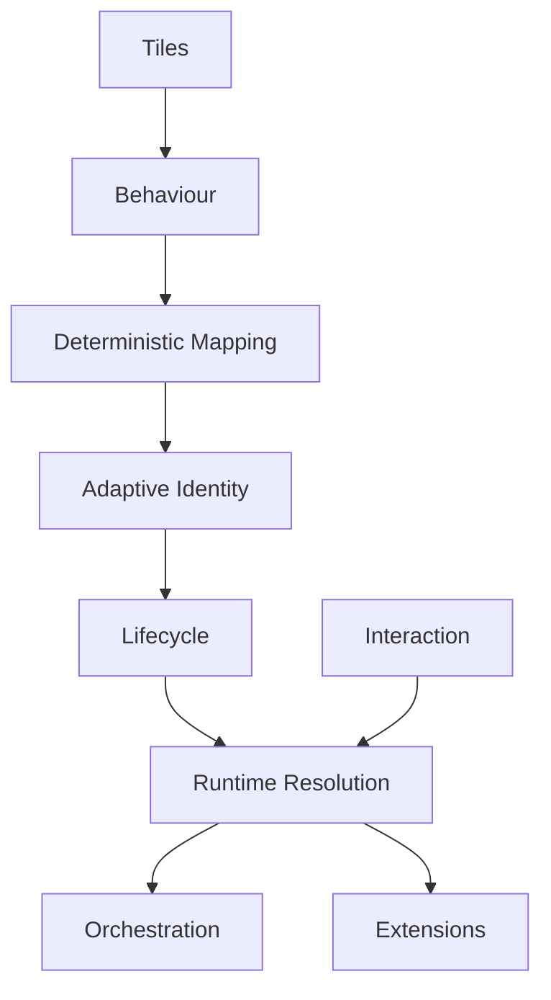

<!--
File: design/mds/MDS-007 Tile Framework/12-adrs.md
Document: MDS-007
Chapter: 12
Title: Architectural Decision Records
Status: Draft
Version: 0.1
-->

# Architectural Decision Records

---

# Purpose

The Architectural Decision Records (ADRs) contained within MDS-007 preserve the architectural reasoning behind the Mosaic Tile Framework.

Every previous specification established:

- Behaviour
- Runtime World
- Composition
- Expressions

MDS-007 establishes how those runtime concepts become reusable presentation primitives.

These ADRs explain why Mosaic deliberately separates:

- Expressions,
- Tiles,
- Components,
- Rendering,

into independent architectural layers.

Future contributors should understand these decisions before modifying the Tile Framework.

---

# ADR Format

Every Mosaic ADR follows the standard structure.

```text
ADR Number

Status

Context

Decision

Consequences

Alternatives Considered

Related Specifications
```

Each ADR documents one architectural decision.

---

# ADR-168

## Title

Introduce Tiles Between Expressions And Components

### Status

Accepted

### Context

Directly rendering Expressions tightly couples runtime behaviour to implementation technology.

### Decision

Introduce Tiles as reusable presentation primitives positioned between Expressions and Components.

### Consequences

Behaviour remains independent from rendering frameworks while presentation becomes reusable.

---

# ADR-169

## Title

Tiles Represent Behaviour Rather Than Widgets

### Status

Accepted

### Context

Traditional UI frameworks frequently name presentation primitives after implementation.

### Decision

Tile identities communicate behavioural purpose rather than component type.

### Consequences

Tile vocabulary remains stable even as rendering technologies evolve.

---

# ADR-170

## Title

Expression Mapping Must Remain Deterministic

### Status

Accepted

### Context

Platform-specific presentation decisions create inconsistent runtime behaviour.

### Decision

Identical Expressions must always resolve into identical Tile identities.

### Consequences

Caching, replay, testing and cross-platform consistency become significantly simpler.

---

# ADR-171

## Title

Adaptive Behaviour Never Changes Tile Identity

### Status

Accepted

### Context

Responsive interfaces frequently create separate presentation concepts for different devices.

### Decision

Adaptive behaviour modifies presentation only.

Tile identity remains unchanged.

### Consequences

One behavioural language survives across every device.

---

# ADR-172

## Title

Tile Lifecycle Preserves Identity

### Status

Accepted

### Context

Destroying and recreating presentation primitives weakens continuity.

### Decision

Tiles evolve whenever practical instead of being replaced.

### Consequences

Users perceive one continuous World rather than constantly changing interface objects.

---

# ADR-173

## Title

Tile Interaction Represents Behaviour

### Status

Accepted

### Context

Component-owned callbacks tightly couple interaction to implementation.

### Decision

Tiles expose behavioural interaction intent.

Components merely implement interaction mechanisms.

### Consequences

Interaction remains platform independent and behaviourally consistent.

---

# ADR-174

## Title

Runtime Tile Resolution Owns Presentation

### Status

Accepted

### Context

Allowing components to determine Materials, Typography or Motion fragments presentation.

### Decision

Runtime Tile Resolution produces fully resolved Tiles before rendering begins.

### Consequences

Components become extremely small implementation artefacts.

---

# ADR-175

## Title

Extensions Never Define Tiles

### Status

Accepted

### Context

Plugin-owned presentation primitives fragment behavioural consistency.

### Decision

Extensions contribute Expressions.

The Tile Framework determines presentation.

### Consequences

Community extensions automatically inherit future presentation improvements.

---

# ADR-176

## Title

Tile Orchestration Coordinates Presentation

### Status

Accepted

### Context

Independent Tile updates weaken behavioural continuity.

### Decision

Tile evolution is orchestrated centrally.

### Consequences

Users experience one coherent presentation rather than many unrelated interface updates.

---

# ADR Relationships



Together these decisions establish Tiles as the stable presentation language bridging runtime understanding and visual implementation.

---

# Future ADRs

Future Tile Framework ADRs are expected to formalise:

- AI-generated Tile Variants
- Spatial Tile Projection
- Ambient Tile Groups
- Multi-user Shared Tiles
- Predictive Tile Resolution
- Streaming Tile Pipelines
- Adaptive Accessibility Tiles
- Runtime Tile Virtualisation

These intentionally remain outside the scope of MDS-007 Version 0.1.

---

# ADR Governance

Tile Framework ADRs should change only when:

- behavioural architecture evolves,
- runtime presentation requires refinement,
- accessibility research identifies deficiencies,
- the Mosaic Design Language itself changes.

Rendering technology alone should never justify architectural changes.

Tiles should remain recognisably Mosaic regardless of implementation.

---

# Summary

The ADRs contained within MDS-007 define the presentation identity of Mosaic.

Expressions communicate understanding.

Tiles communicate presentation.

Components implement rendering.

Maintaining these boundaries allows Mosaic to evolve for decades without losing its behavioural language.

---

# Review Status

**Status**

Draft

**Next File**

`13-contributor-guidance.md`
