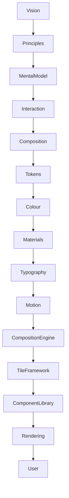

<!--
File: docs/design/system/mds-008-component-library/00-document-control.md
Document: MDS-008
Title: Component Library
Status: Draft
Version: 0.4
-->

# Document Control

---

# Document Information

| Property | Value |
|----------|-------|
| Document ID | MDS-008 |
| Title | Mosaic Design System — Component Library |
| Classification | Internal |
| Status | Draft |
| Version | 0.4 |
| Owner | Lead UI Platform Architecture Team |
| Parent Specifications | MDL-001 → MDL-005, MDS-001 → MDS-007 |
| Repository | `/design/mds/MDS-008 Component Library/` |

---

# Purpose

MDS-008 defines the Component Library used throughout Mosaic.

The Component Library is the final implementation layer of the entire Mosaic Design Language.

Everything before this specification determines:

- behaviour,
- hierarchy,
- materials,
- typography,
- motion,
- presentation.

The Component Library determines only:

> **How those solved decisions become visible.**

Unlike conventional component libraries, Mosaic Components intentionally possess almost no behavioural responsibility.

Components are implementation.

Not architecture.

---

# Authority

MDS-008 governs:

- Component philosophy
- Component taxonomy
- Component contracts
- Component lifecycle
- Component composition
- Rendering architecture
- Client rendering
- Runtime SDUI
- Recovery SDUI
- Platform-specific MDL libraries
- Platform components
- Accessibility contracts
- Runtime rendering
- Component optimisation

This specification intentionally does **not** govern:

- Behaviour
- Runtime World
- Composition
- Expressions
- Tiles
- Design Tokens

Those systems already solved runtime understanding.

Components simply render it.

---

# Relationship To MDS

The Component Library sits at the very end of the runtime architecture.



Every previous specification influences Components.

Components influence nothing upstream.

---

# Design Intent

Traditional UI frameworks frequently behave like this.

```text
Components

↓

State

↓

Behaviour

↓

Rendering
```

Mosaic intentionally reverses this dependency.

```text
Behaviour

↓

Composition

↓

Tiles

↓

Components

↓

Rendering
```

Components become passive renderers of behavioural presentation.

---

# Reader Expectations

Before reading this specification contributors should already understand:

- MDL-001 Vision
- MDL-002 Principles
- MDL-003 Mental Model
- MDL-004 Interaction Model
- MDL-005 Composition Model
- MDS-001 → MDS-007

MDS-008 assumes every architectural decision has already been made.

Its responsibility is implementation.

---

# Architectural Scope

The Component Library defines:

- component contracts
- rendering behaviour
- platform implementation
- platform-specific MDL library boundaries
- accessibility implementation
- runtime rendering
- client rendering responsibilities
- component optimisation

It intentionally avoids implementation-specific frameworks becoming architectural concepts.

Web and native clients remain implementation targets.

Native clients may include Flutter, Windows, macOS, Linux, Android TV or Apple TV.

Not design abstractions.

The Platform and Supervisor emit SDUI contracts.

Clients implement those contracts as native presentation.

The Component Library owns the rendering responsibility, not the upstream runtime decisions.

Version 0.4 records the Presentation Architecture boundary between Platform semantic UI, client renderers and platform-specific MDL libraries.

---

# Stability

Expected lifetime.

| Artefact | Expected Lifetime |
|----------|-------------------|
| Platform Widgets | Months |
| Rendering APIs | Months |
| Framework Integrations | Years |
| Component Contracts | Years |
| Component Philosophy | Decades |

Frameworks evolve.

Component philosophy should remain recognisably Mosaic.

---

# Success Criteria

MDS-008 succeeds when:

- Components remain behaviourally simple
- platform implementations remain replaceable
- accessibility is automatically inherited
- rendering remains deterministic
- contributors naturally think in Tiles rather than Components
- the runtime architecture remains invisible beneath implementation

Users should never perceive Components.

They should simply experience a Companion that always behaves consistently.

---

# Review Status

**Status**

Draft

**Dependencies**

- MDL-001 → MDL-005
- MDS-001 → MDS-007

**Supersedes**

None.

**Next File**

`01-component-philosophy.md`
