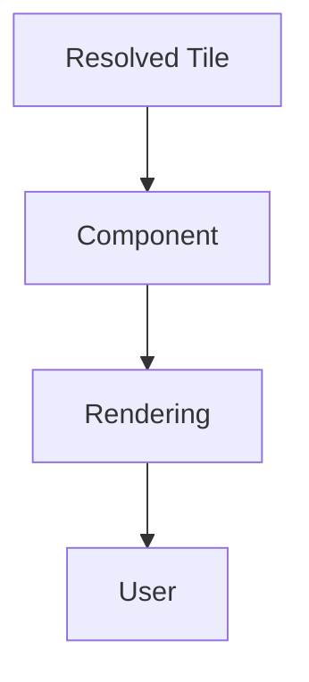
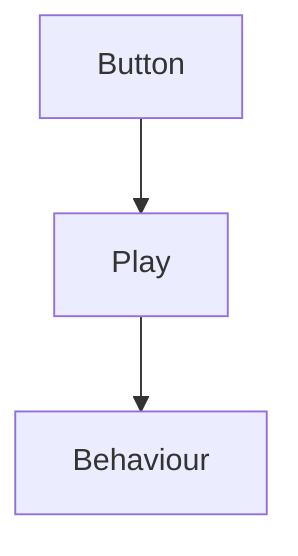
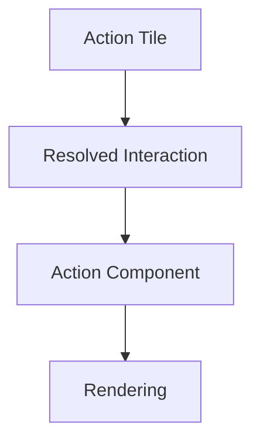
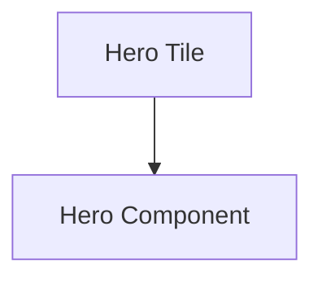
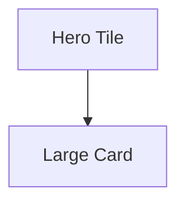
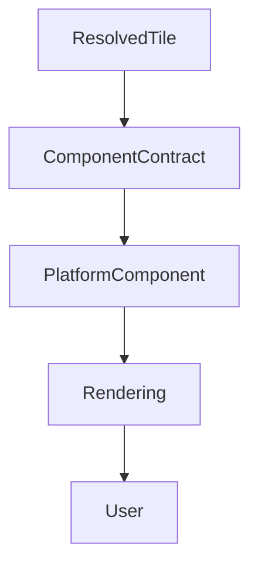

<!--
File: docs/design/system/mds-008-component-library/01-component-philosophy.md
Document: MDS-008
Chapter: 01
Title: Component Philosophy
Status: Draft
Version: 0.4
-->

# Component Philosophy

---

# Purpose

Before defining Component Contracts, platform implementations or rendering behaviour, contributors must first understand what a Component represents within Mosaic.

Many UI frameworks place Components at the centre of application architecture.

Components:

- manage state,
- own behaviour,
- control interaction,
- perform rendering.

Mosaic intentionally rejects this model.

By the time a Component exists...

Every important architectural decision has already been made.

Components exist for one purpose.

To faithfully render the user's World.

---

# Philosophy Statement

> **Components implement presentation. They never determine understanding.**

Everything within the Component Library derives from this statement.

---

# Why Components Exist

The Composition Engine produces:

- Expressions

The Tile Framework produces:

- Tiles

The Runtime Tile Resolver produces:

- fully resolved presentation.

Rendering technologies cannot consume these architectural concepts directly.

Components provide the final bridge.

Components are implementation.

Nothing more.

---

# Components Are Passive

A Component should never ask:

> "What should happen?"

Instead it should ask:

> **"How should I render what has already been decided?"**

This distinction dramatically simplifies application architecture.

Behaviour belongs elsewhere.

---

# Components Never Solve Behaviour

Incorrect.

Correct.

The behavioural decision already exists.

The Component merely implements it.

---

# Components Consume Contracts

Components should consume only resolved contracts.

Examples include:

- Material Profile
- Typography Profile
- Motion Profile
- Interaction Profile
- Accessibility Profile

Components should never independently resolve:

- hierarchy
- Materials
- Typography
- Motion

The runtime already solved those decisions.

---

# Components Are Replaceable

A Hero Component may be implemented using:

- Flutter
- React
- SwiftUI
- Compose
- future frameworks

Every implementation should communicate the same Tile.

Frameworks are temporary.

Component behaviour should remain stable.

---

# Components Preserve Identity

A Component should faithfully preserve Tile identity.

Example.

Not.

Component naming should reflect architectural identity.

Not visual appearance.

---

# Components Respect Materials

Components receive Material behaviour.

Examples.

Hero Component.

↓

Hero Material.

Metadata Component.

↓

Surface Material.

Overlay Component.

↓

Overlay Material.

Components should never invent Material behaviour independently.

---

# Components Respect Typography

Typography is resolved before Components exist.

Examples.

Heading.

↓

Heading Component.

Supporting.

↓

Supporting Component.

Caption.

↓

Caption Component.

Editorial hierarchy should remain entirely runtime driven.

---

# Components Respect Motion

Motion is likewise inherited.

Hero Component.

↓

Hero Motion.

Timeline Component.

↓

Supporting Motion.

Overlay Component.

↓

Overlay Motion.

Components execute motion.

They never define it.

---

# Components Respect Interaction

Interaction belongs to behavioural intent.

Components implement:

- pointer events,
- touch events,
- keyboard events,
- accessibility actions.

They should never redefine behavioural outcomes.

---

# Components Respect Accessibility

Accessibility is automatic.

Components receive:

- accessible typography,
- accessible Materials,
- accessible Motion,
- accessible interaction.

They should not independently invent accessibility behaviour.

Accessibility belongs to the runtime architecture.

---

# Components Are Stateless

Whenever practical...

Components should remain stateless.

State belongs to:

- Runtime World,
- Composition Engine,
- Tile Framework.

Components render current presentation.

Nothing more.

---

# Components Are Predictable

Given identical Resolved Tiles...

Components should always produce identical presentation.

Deterministic rendering simplifies:

- testing,
- replay,
- debugging,
- optimisation.

Predictability remains more valuable than clever implementation.

---

# Components Are Disposable

Unlike Tiles...

Components are disposable.

They may be:

- recreated,
- recycled,
- virtualised,
- pooled.

Behavioural identity survives because:

Tiles survive.

Not because Components survive.

This separation significantly improves implementation flexibility.

---

# Components Across Platforms

Every platform should implement the same Component contracts.

Flutter.

↓

Hero Component.

React.

↓

Hero Component.

SwiftUI.

↓

Hero Component.

Compose.

↓

Hero Component.

Implementations differ.

Architectural identity remains unchanged.

---

# Modules

Modules never provide Components.

Modules contribute:

- behaviour,
- Expressions,
- information.

The Tile Framework resolves presentation.

Platform implementations provide Components.

This guarantees one coherent implementation model.

---

# Good Examples

## Playback

Resolved Hero Tile.

↓

Hero Component.

↓

Rendering.

Behaviour remains unchanged.

---

## Reading

Resolved Timeline Tile.

↓

Timeline Component.

↓

Rendering.

Editorial understanding remains intact.

---

## Music

Resolved Relationship Tile.

↓

Relationship Component.

↓

Presentation.

Components remain implementation only.

---

# Anti-patterns

## Smart Components

Components solving runtime behaviour.

---

## Stateful Components

Components becoming behavioural authorities.

---

## Platform Behaviour

Different frameworks producing different behavioural outcomes.

---

## Component Styling

Components independently inventing Material or Typography behaviour.

---

# Component Philosophy Model

Components faithfully implement runtime presentation.

Nothing upstream depends upon them.

---

# Relationship To Future Chapters

The remaining chapters define how this philosophy becomes implementation.

Including:

- Component Taxonomy
- Component Contracts
- Component Lifecycle
- Component Composition
- Rendering Architecture
- Platform Components
- Accessibility Contracts
- Runtime Rendering

Every implementation decision should reinforce the philosophy established here.

---

# Summary

Components are the thinnest architectural layer in Mosaic.

They should:

- render,
- adapt,
- implement,
- disappear.

They should never:

- solve,
- decide,
- infer,
- reinterpret.

By the time a Component exists, the user's World has already been completely understood.

The Component simply makes that understanding visible.
