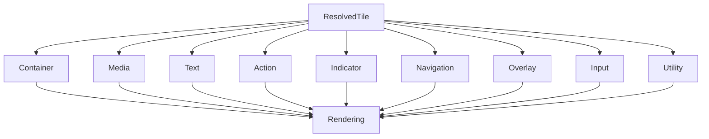

<!--
File: docs/design/system/mds-008-component-library/02-component-taxonomy.md
Document: MDS-008
Chapter: 02
Title: Component Taxonomy
Status: Draft
Version: 0.2
-->

# Component Taxonomy

---

# Purpose

The Tile Framework defines the behavioural vocabulary of Mosaic.

The Component Library defines the implementation vocabulary.

Unlike Tiles, which represent behavioural presentation, Components represent concrete rendering primitives.

Component Taxonomy exists to ensure every implementation remains:

- predictable,
- reusable,
- platform independent,
- behaviourally passive.

The taxonomy should remain intentionally small.

Components should solve rendering.

Nothing more.

---

# Definition

Within MDS, **Component Taxonomy** is defined as:

> **The canonical classification of implementation primitives responsible for rendering resolved Tiles.**

Components communicate implementation.

They intentionally do **not** communicate behaviour.

---

# Why A Taxonomy Exists

Without a shared Component vocabulary, implementations naturally diverge.

Examples.

- PosterCard
- MediaCard
- HeroWidget
- EpisodePanel
- AlbumView

These names describe application features.

Not implementation.

Instead Mosaic defines a stable implementation vocabulary independent from runtime behaviour.

---

# Component Families

The Component Library defines the following conceptual component families.

```text
Container

↓

Content

↓

Media

↓

Text

↓

Action

↓

Indicator

↓

Navigation

↓

Overlay

↓

Input

↓

Utility
```

Every Component belongs to exactly one primary family.

---

# Container Components

Purpose.

Provide structural implementation.

Examples include:

- panels
- regions
- stacks
- groups
- layouts

Container Components never determine hierarchy.

They simply implement the structure already resolved by the Tile Framework.

---

# Content Components

Purpose.

Render resolved content.

Examples include:

- content bodies
- summaries
- descriptions
- metadata collections

Content Components communicate information.

They never determine its importance.

---

# Media Components

Purpose.

Render media.

Examples include:

- artwork
- posters
- thumbnails
- backdrops
- video surfaces

Media Components implement presentation.

They never determine Material behaviour.

---

# Text Components

Purpose.

Render resolved typography.

Examples include:

- headings
- body text
- captions
- labels

Text Components consume resolved Typography Profiles.

They never select typography independently.

---

# Action Components

Purpose.

Implement behavioural interaction.

Examples include:

- buttons
- segmented controls
- icon actions
- contextual actions

Action Components render Interaction Profiles.

They never define interaction behaviour.

---

# Indicator Components

Purpose.

Communicate runtime state.

Examples include:

- progress
- badges
- status
- loading
- activity

Indicators render resolved behavioural state.

They never infer it.

---

# Navigation Components

Purpose.

Implement navigation affordances.

Examples include:

- navigation bars
- side rails
- tab bars
- breadcrumbs

Navigation Components remain behaviourally passive.

The Runtime World determines navigation state.

---

# Overlay Components

Purpose.

Render temporary presentation.

Examples include:

- dialogs
- sheets
- menus
- playback controls

Overlay Components consume Overlay Tiles.

They never determine lifecycle independently.

---

# Input Components

Purpose.

Capture user interaction.

Examples include:

- text fields
- sliders
- toggles
- selectors

Input Components communicate behavioural intent.

They never directly mutate runtime behaviour.

---

# Utility Components

Purpose.

Implement supporting presentation.

Examples include:

- spacers
- dividers
- placeholders
- skeletons
- scroll containers

Utility Components should remain behaviourally invisible.

---

# Behavioural Neutrality

Components intentionally avoid behavioural names.

Incorrect.

```text
PlaybackButton
```

Preferred.

```text
Action Component
```

The behavioural meaning already exists within the resolved Tile.

---

# Component Identity

Components possess stable implementation identities.

Example.

```text
Text Component
```

may render:

- Heading
- Supporting
- Caption

The Typography Resolver determines the difference.

The Component remains identical.

---

# Component Reuse

Every Component should implement many Tile families.

Example.

A Text Component may appear inside:

- Hero Tile
- Metadata Tile
- Relationship Tile
- Utility Tile

Reuse should naturally emerge from runtime resolution.

---

# Adaptive Behaviour

Components adapt through resolved contracts.

Desktop.

↓

Expanded Container.

Phone.

↓

Compact Container.

Television.

↓

Distance-optimised Container.

The Component family remains unchanged.

---

# Material Awareness

Components consume resolved Material Profiles.

Examples.

Hero Component.

↓

Hero Material.

Overlay Component.

↓

Overlay Material.

Container Component.

↓

Surface Material.

Material behaviour belongs to the Material System.

---

# Typography Awareness

Text Components consume Typography Profiles.

Examples.

Heading.

↓

Resolved Typography.

↓

Text Component.

Editorial hierarchy remains external.

---

# Motion Awareness

Components execute Motion Profiles.

Examples.

Hero Motion.

↓

Component Animation.

The Motion System defines behaviour.

The Component performs it.

---

# Accessibility

Components consume Accessibility Profiles automatically.

Examples.

- larger typography
- reduced motion
- higher contrast
- accessible interaction

Accessibility should never require independent component logic.

---

# Runtime Independence

Components should remain completely unaware of:

- Runtime World
- Expressions
- Behaviour
- Composition

They receive only resolved presentation contracts.

This keeps implementation clean and predictable.

---

# Modules

Modules never provide Components.

Platform implementations provide Components.

Modules contribute runtime behaviour only.

This preserves one coherent implementation vocabulary across the ecosystem.

---

# Good Examples

## Hero Tile

↓

Container Component

↓

Media Component

↓

Text Component

↓

Action Component

Each Component performs one implementation responsibility.

---

## Timeline Tile

↓

Indicator Component

↓

Text Component

↓

Container Component

Behaviour remains external.

---

## Relationship Tile

↓

Media Component

↓

Text Component

↓

Action Component

The implementation remains reusable.

---

# Anti-patterns

## Feature Components

Creating MovieCard or AnimeCard components.

---

## Behaviour Components

Components owning runtime behaviour.

---

## Platform Components

Different frameworks inventing different component vocabularies.

---

## Smart Components

Components resolving Materials, Motion or Typography independently.

---

# Component Taxonomy Model



Tiles determine presentation.

Components determine implementation.

---

# Relationship To Future Chapters

The next chapter defines **Component Contracts**.

Component Taxonomy explains:

> **Which implementation primitives exist.**

Component Contracts explain:

> **How every Component receives resolved runtime behaviour without introducing independent architectural decisions.**

Together they establish the implementation architecture of the Component Library.

---

# Summary

The Component Taxonomy intentionally remains:

- small,
- reusable,
- implementation focused.

Components are not behavioural concepts.

They are implementation primitives.

Every behavioural decision has already been made before Components exist.

That simplicity is the defining architectural strength of the Mosaic Component Library.

---

# Review Status

**Status**

Draft

**Next File**

`03-component-contracts.md`
