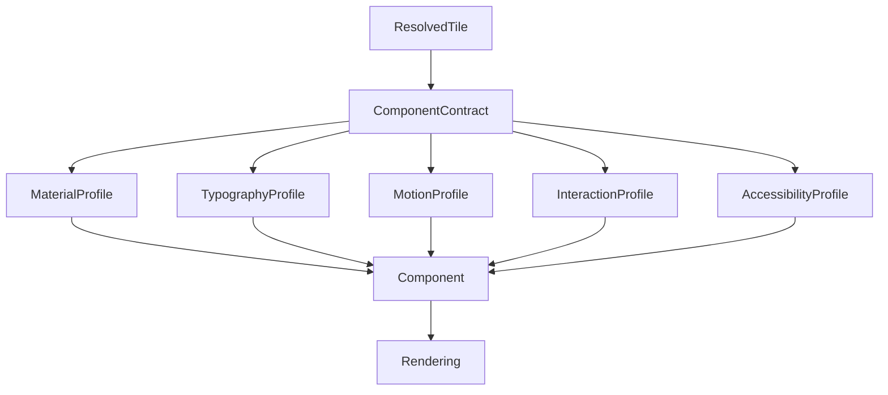

<!--
File: docs/design/system/mds-008-component-library/03-component-contracts.md
Document: MDS-008
Chapter: 03
Title: Component Contracts
Status: Draft
Version: 0.4
-->

# Component Contracts

---

# Purpose

Components intentionally possess almost no architectural responsibility.

Their behaviour is entirely determined by the runtime.

Component Contracts define the interface between:

- Runtime Tile Resolution
- Platform Components

A Component Contract describes everything a Component needs to render correctly.

Nothing more.

Nothing less.

---

# Definition

Within MDS, a **Component Contract** is defined as:

> **The complete, immutable description of a Component's runtime behaviour, presentation and interaction supplied by the Tile Framework.**

Components consume contracts.

They never construct them.

---

# Why Contracts Exist

Traditional UI frameworks frequently allow Components to determine:

- colours,
- typography,
- spacing,
- interaction,
- motion,
- hierarchy.

This tightly couples behaviour to implementation.

Mosaic intentionally follows:

```text
Runtime

↓

Component Contract

↓

Component

↓

Rendering
```

Behaviour remains external.

---

# Contracts Are Immutable

A Component Contract should never be modified by a Component.

Conceptually.

```text
Resolved Tile

↓

Component Contract

↓

Read Only

↓

Component
```

Components render.

They do not negotiate.

---

# One Responsibility

Every Component Contract communicates one implementation responsibility.

Examples.

```text
Text Component

↓

Typography Contract
```

```text
Media Component

↓

Media Contract
```

```text
Action Component

↓

Interaction Contract
```

Responsibilities remain intentionally isolated.

---

# Contract Inputs

Component Contracts originate from:

```text
Resolved Tile

↓

Material Profile

↓

Typography Profile

↓

Motion Profile

↓

Interaction Profile

↓

Accessibility Profile
```

Components receive the completed result.

---

# Contract Outputs

A Component Contract exposes implementation information such as:

- Material Profile
- Typography Profile
- Motion Profile
- Interaction Behaviour
- Accessibility Behaviour
- Layout Constraints
- Rendering Metadata

It intentionally excludes:

- Behaviour
- Runtime World
- Expressions
- Composition

Those concepts remain upstream.

---

# Material Contract

Material behaviour is fully resolved before reaching Components.

Example.

```text
Hero Tile

↓

Hero Material

↓

Material Contract

↓

Hero Component
```

Components should never select Materials independently.

---

# Typography Contract

Typography follows the same model.

Example.

```text
Heading

↓

Typography Contract

↓

Text Component
```

The Component simply renders the supplied typography.

---

# Motion Contract

Motion Contracts communicate:

- sequencing
- timing
- interpolation
- lifecycle events

Components execute motion.

They never invent it.

---

# Interaction Contract

Interaction Contracts expose:

- interaction intent
- enabled state
- focus behaviour
- accessibility actions

Platform-specific events:

- pointer
- touch
- keyboard
- remote
- voice

are mapped onto the same behavioural contract.

---

# Accessibility Contract

Accessibility behaviour is resolved centrally.

Examples include:

- large typography
- reduced motion
- semantic labels
- accessible focus

Components should never independently implement accessibility policy.

They simply honour the Accessibility Contract.

---

# Layout Contract

Adaptive Layout supplies:

- constraints
- available regions
- preferred sizing
- adaptive behaviour

Components should never calculate behavioural layout.

They receive already resolved constraints.

---

# Rendering Metadata

Future implementations may expose additional rendering metadata.

Examples include:

- virtualisation hints
- image priorities
- placeholder behaviour
- lazy loading hints

These remain implementation metadata.

They should never alter behavioural presentation.

---

# Contract Stability

Component Contracts should remain stable across platforms.

Flutter.

↓

Same Contract.

Web.

↓

Same Contract.

SwiftUI.

↓

Same Contract.

Compose.

↓

Same Contract.

Only implementation differs.

---

# Deterministic Contracts

Given identical:

- Resolved Tile
- Runtime Profiles
- Accessibility

the Component Contract should always be identical.

Deterministic contracts simplify:

- testing
- replay
- caching
- rendering

Predictability remains the primary objective.

---

# Stateless Components

Components should consume Contracts without introducing additional behavioural state.

Preferred.

```text
Contract

↓

Render
```

Avoid.

```text
Contract

↓

Component State

↓

Render
```

Runtime owns behaviour.

Components remain passive.

---

# Runtime Updates

When behaviour changes:

```text
New Contract

↓

Same Component

↓

Updated Presentation
```

Whenever practical...

Components should remain alive while Contracts evolve.

This preserves rendering efficiency and visual continuity.

---

# Platform Adaptation

Platforms may interpret Contracts differently.

Examples.

Desktop.

↓

Pointer interaction.

Phone.

↓

Touch interaction.

Television.

↓

Remote interaction.

The behavioural contract remains identical.

Only implementation differs.

---

# Modules

Modules never provide Component Contracts.

Modules contribute:

- Expressions
- Behaviour
- Information

The Runtime resolves:

- Tiles
- Contracts
- Presentation

Every module therefore inherits identical implementation behaviour.

---

# Good Examples

## Hero

Resolved Hero Tile.

↓

Component Contract.

↓

Hero Component.

↓

Rendering.

Behaviour remains external.

---

## Timeline

Timeline Contract.

↓

Indicator Component.

↓

Presentation.

The Component performs no behavioural reasoning.

---

## Metadata

Metadata Contract.

↓

Text Component.

↓

Rendering.

Editorial hierarchy remains runtime owned.

---

# Anti-patterns

## Smart Contracts

Contracts containing behavioural logic.

---

## Component Decisions

Components overriding Material or Typography Contracts.

---

## Platform Contracts

Different platforms inventing different runtime contracts.

---

## Mutable Contracts

Components modifying runtime contracts during rendering.

---

# Component Contract Model



The runtime defines behaviour.

Contracts communicate it.

Components implement it.

---

# Relationship To Future Chapters

The next chapter defines **Component Lifecycle**.

Component Contracts explain:

> **What Components receive.**

Component Lifecycle explains:

> **How Components evolve while consuming changing Contracts throughout the lifetime of the Runtime World.**

Together they establish the implementation model of the Component Library.

---

# Summary

Component Contracts complete one of the most important architectural separations within Mosaic.

Runtime determines behaviour.

Contracts communicate behaviour.

Components implement behaviour.

By preserving this separation, Mosaic ensures that rendering technologies remain replaceable while behavioural understanding remains permanently stable.

---

# Review Status

**Status**

Draft

**Next File**

`04-component-lifecycle.md`
