<!--
File: docs/design/system/mds-008-component-library/04-component-lifecycle.md
Document: MDS-008
Chapter: 04
Title: Component Lifecycle
Status: Draft
Version: 0.4
-->

# Component Lifecycle

---

# Purpose

The Tile Framework defines the behavioural lifecycle.

The Component Library defines the implementation lifecycle.

Unlike Tiles, which preserve behavioural identity over time, Components are intentionally disposable implementation objects.

This distinction is one of the most important architectural separations within Mosaic.

Users experience persistent Tiles.

The runtime manages transient Components.

---

# Definition

Within MDS, **Component Lifecycle** is defined as:

> **The implementation lifecycle through which Components render evolving Component Contracts while remaining behaviourally passive.**

Component lifecycle concerns implementation.

Behaviour remains entirely external.

---

# Philosophy

Traditional UI frameworks frequently merge:

- behavioural lifetime,
- component lifetime.

Mosaic intentionally separates them.

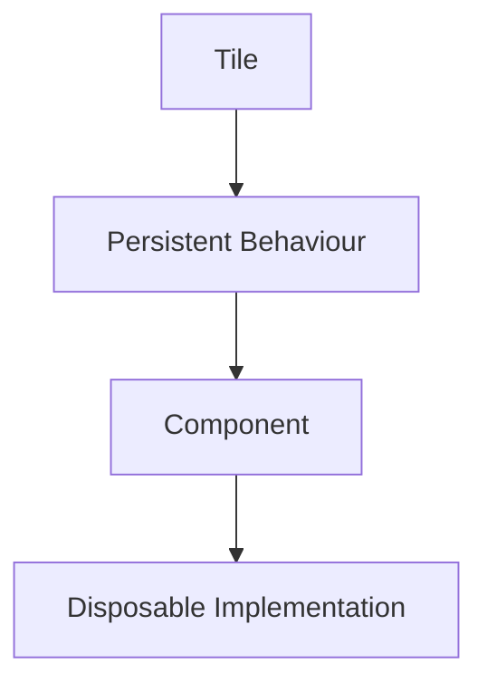

Components may be:

- recreated,
- recycled,
- virtualised,
- pooled.

Behavioural continuity remains unaffected because the Tile survives.

---

# Lifecycle Stages

Every Component progresses through the same conceptual lifecycle.

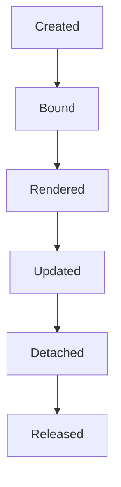

Each stage communicates one implementation responsibility.

---

# Stage One

## Created

The Component instance is allocated.

At this stage it possesses:

- implementation identity,
- no behavioural information,
- no presentation.

Creation should remain inexpensive.

---

# Stage Two

## Bound

The Component receives a Component Contract.

Examples include:

- Material Profile
- Typography Profile
- Motion Profile
- Accessibility Profile

Only after binding does the Component understand how it should render.

---

# Stage Three

## Rendered

The Component becomes visible.

Rendering should simply express the current Contract.

No behavioural decisions should occur during this stage.

---

# Stage Four

## Updated

Most Components spend the majority of their lifetime receiving updated Contracts.

Preferred.

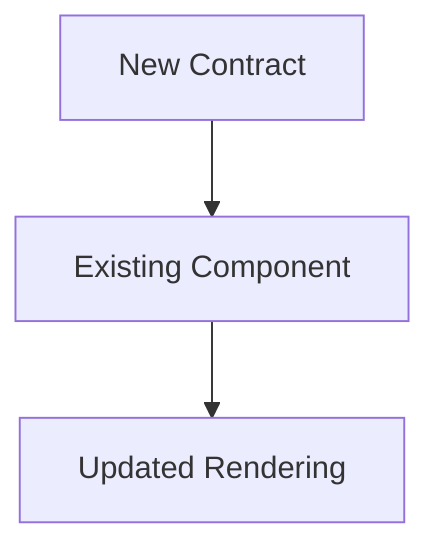

Avoid.

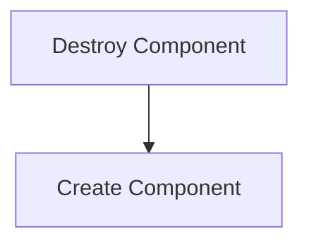

Updating preserves rendering efficiency while maintaining behavioural continuity.

---

# Stage Five

## Detached

The Component is removed from the active presentation.

Detachment does **not** necessarily imply destruction.

Future implementations may:

- pool,
- recycle,
- virtualise,

detached Components.

---

# Stage Six

## Released

The implementation object is discarded.

Importantly...

The Tile may still exist.

Behavioural lifetime and Component lifetime intentionally remain independent.

---

# Contracts Drive Lifecycle

Components should evolve only because their Contracts evolve.

Incorrect.

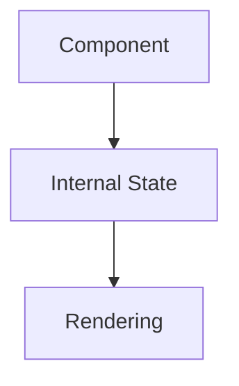

Correct.

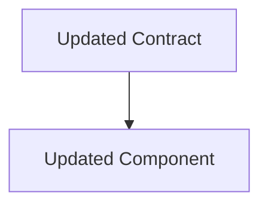

The runtime owns behavioural evolution.

---

# Stateless Rendering

Whenever practical...

Components should remain stateless.

Preferred.

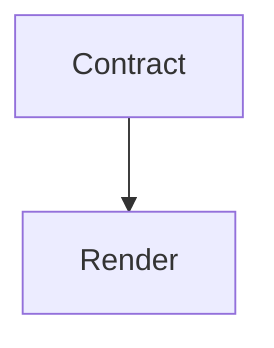

Avoid.

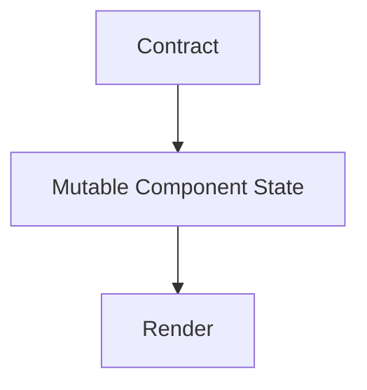

State belongs upstream.

---

# Reuse

Future implementations should aggressively reuse Components.

Examples include:

- scrolling collections,
- long libraries,
- virtual lists,
- infinite grids.

Reuse is an implementation optimisation.

Behaviour remains entirely unchanged.

---

# Identity

Component identity should never be exposed to users.

Users should perceive:

```

Hero Tile
```

Not:

```

Hero Component Instance
```

Component identity is an implementation detail.

Tile identity remains behaviourally meaningful.

---

# Material Updates

Material changes should normally produce:

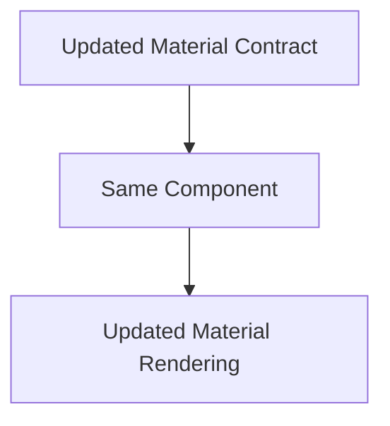

Component replacement should rarely be necessary.

---

# Typography Updates

Typography behaves similarly.

Accessibility changes.

↓

Typography Contract.

↓

Text Component updates.

↓

Reading continues.

The runtime should preserve continuity wherever practical.

---

# Motion Updates

Motion should also follow Contracts.

Components execute:

- Motion start,
- Motion update,
- Motion completion.

They never determine Motion sequencing independently.

---

# Accessibility Updates

Accessibility should update Components through new Contracts.

Examples.

Reduced Motion.

↓

Motion Contract updates.

Large Text.

↓

Typography Contract updates.

High Contrast.

↓

Material Contract updates.

The Component simply re-renders.

---

# Adaptive Updates

Adaptive behaviour also updates existing Components.

Examples.

Window resized.

↓

Adaptive Contract.

↓

Existing Component updates.

The lifecycle should remain continuous.

---

# Runtime Ownership

The Runtime owns:

- Contracts,
- lifecycle timing,
- updates.

Components own:

- rendering,
- resource usage,
- implementation.

Responsibilities remain intentionally separated.

---

# Failure Behaviour

If a Component fails.

Preferred.

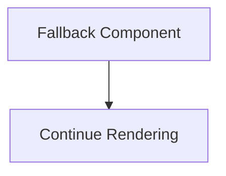

Avoid.

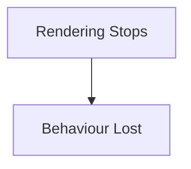

Implementation failures should not compromise runtime understanding wherever practical.

---

# Platform Independence

Every platform should follow the same lifecycle.

Flutter.

↓

Created.

↓

Bound.

↓

Rendered.

↓

Updated.

↓

Released.

React.

↓

Same lifecycle.

SwiftUI.

↓

Same lifecycle.

Behaviour remains platform independent.

---

# Modules

Modules never participate in Component lifecycle.

Modules contribute:

- behaviour,
- Expressions,
- information.

The platform owns:

- Components,
- Contracts,
- rendering.

Every module therefore automatically inherits future implementation improvements.

---

# Good Examples

## Playback

Hero Component.

↓

New Contract.

↓

Updated Hero.

↓

Playback continues.

No behavioural interruption occurs.

---

## Reading

Typography updates.

↓

Text Component updates.

↓

Reader continues naturally.

---

## Library

Scrolling.

↓

Components recycled.

↓

Tiles remain behaviourally identical.

Users perceive one continuous library.

---

# Anti-patterns

## Behaviour Components

Components storing runtime behaviour.

---

## Component Ownership

Components mutating the Runtime World.

---

## Replacement Rendering

Destroying Components for every runtime update.

---

## Platform Lifecycles

Different clients inventing incompatible lifecycle models.

---

# Component Lifecycle Model


The Component lifecycle exists purely to implement changing Contracts.

Behaviour remains external.

---

# Relationship To Future Chapters

The next chapter defines **Component Composition**.

Component Lifecycle explains:

> **How Components evolve over time.**

Component Composition explains:

> **How Components combine to faithfully implement resolved Tiles while preserving the behavioural architecture established throughout Mosaic.**

Together they complete the implementation lifecycle of the Component Library.

---

# Summary

Component Lifecycle intentionally separates implementation from behaviour.

Tiles persist.

Components do not.

Contracts evolve.

Components render.

This separation allows Mosaic to optimise rendering aggressively without ever compromising behavioural continuity or architectural clarity.
