<!--
File: docs/design/system/mds-008-component-library/05-component-composition.md
Document: MDS-008
Chapter: 05
Title: Component Composition
Status: Draft
Version: 0.4
-->

# Component Composition

---

# Purpose

Individual Components rarely exist alone.

A Hero Tile may require:

- Container Component,
- Media Component,
- Text Component,
- Action Component.

Component Composition defines how these implementation primitives combine to faithfully render one resolved Tile.

Unlike the Tile Framework, Component Composition is **not** concerned with behavioural grouping.

That work has already been completed.

Its responsibility is purely implementation.

---

# Definition

Within MDS, **Component Composition** is defined as:

> **The deterministic assembly of implementation Components required to render one resolved Tile while preserving the behavioural intent established by the runtime.**

Component Composition concerns implementation.

Behaviour remains external.

---

# Philosophy

Traditional UI frameworks frequently begin by composing widgets.

Examples.

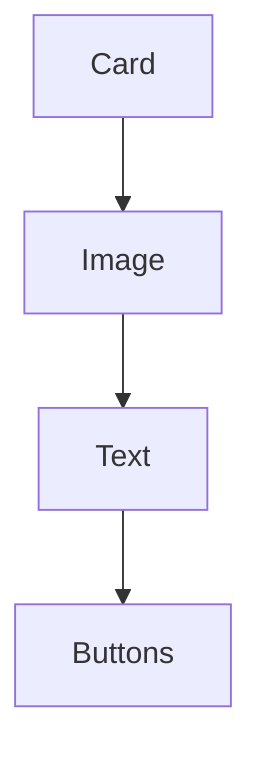

Mosaic intentionally begins one layer higher.

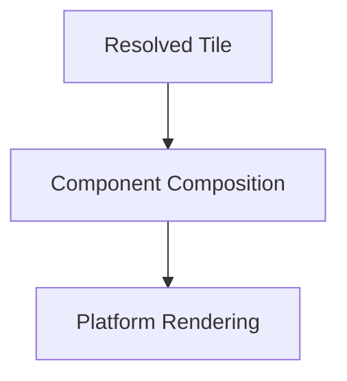

The Tile determines composition.

Components implement it.

---

# Behaviour Before Composition

Components should never determine what belongs together.

Incorrect.

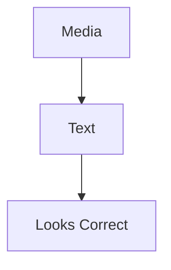

Correct.

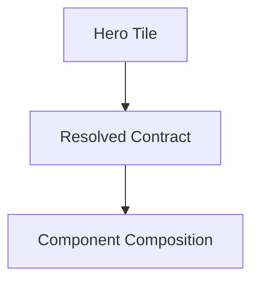

Runtime understanding always precedes implementation.

---

# One Tile

Every Component Composition should implement one Tile.

Example.

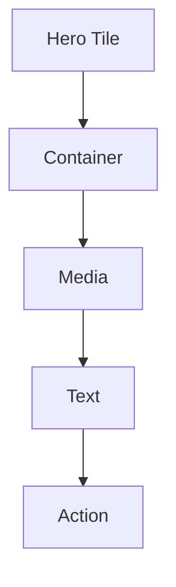

The Tile remains the behavioural unit.

Components remain implementation details.

---

# Composition Inputs

Component Composition consumes:

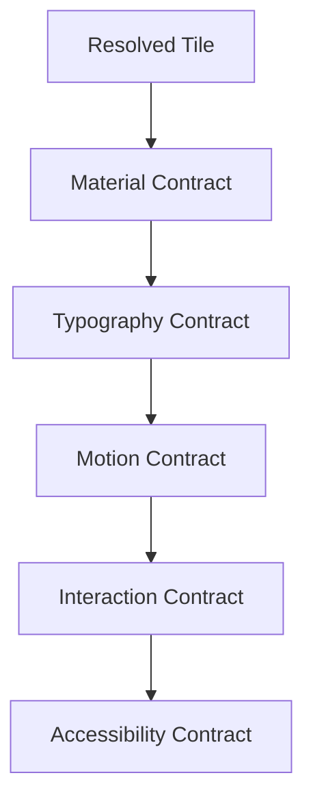

Every required decision has already been made.

---

# Composition Outputs

Component Composition produces:

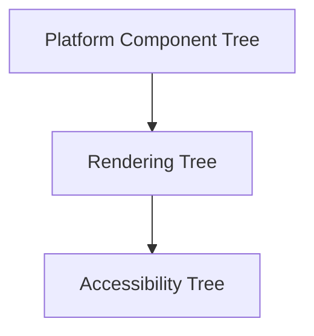

Behaviour does not appear within these outputs.

---

# Container First

Most Component Compositions begin with a Container Component.

Purpose.

Provide:

- structure,
- clipping,
- spacing,
- Material implementation.

The Container should never introduce behavioural meaning.

---

# Media Composition

Media Components render:

- artwork,
- thumbnails,
- video,
- imagery.

Media Components should never determine:

- hierarchy,
- Hero status,
- interaction.

Those responsibilities belong to the Tile.

---

# Typography Composition

Text Components render resolved Typography Contracts.

Example.

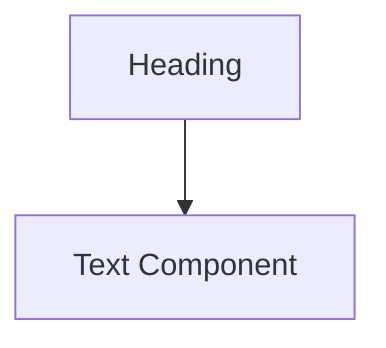

Typography should never be chosen by Component Composition.

The runtime already resolved it.

---

# Action Composition

Action Components render behavioural intent.

Example.

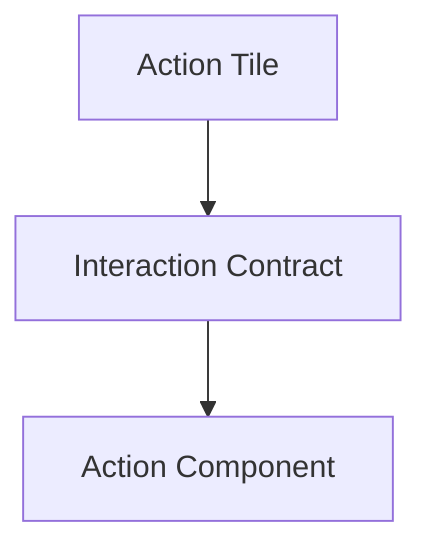

Buttons remain implementation details.

Interaction remains behavioural.

---

# Indicator Composition

Indicators render resolved state.

Examples.

- playback progress,
- download progress,
- activity.

Indicators should never compute state independently.

They simply display resolved values.

---

# Nested Composition

Components may contain other Components.

Example.

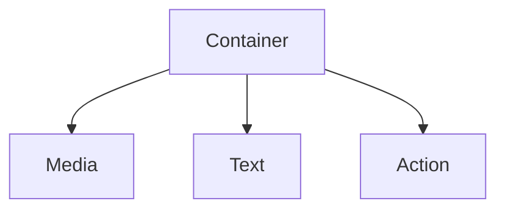

Nested composition improves implementation.

It should never alter Tile identity.

---

# Material Cohesion

Every Component within one Tile should consume compatible Material Contracts.

Example.

Hero Tile.

↓

Hero Material.

↓

Every child Component inherits compatible Material behaviour.

Components should never introduce conflicting Materials.

---

# Typography Cohesion

Editorial hierarchy should remain intact.

Example.

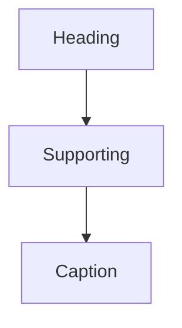

Component Composition should preserve this ordering exactly.

---

# Motion Cohesion

Components should execute one Motion Profile.

Example.

Hero Tile.

↓

Hero Motion.

↓

Every child Component participates.

Movement should appear unified.

Not individually animated.

---

# Accessibility Cohesion

Accessibility Contracts should apply consistently across every Component within a Tile.

Example.

Large text.

↓

Every Text Component updates.

Reduced motion.

↓

Every child Component respects Motion Contracts.

Accessibility should remain behaviourally coherent.

---

# Adaptive Composition

Adaptive behaviour may alter Component Composition.

Example.

Desktop.

↓

Media.

↓

Text.

↓

Actions.

Phone.

↓

Media.

↓

Text.

↓

Collapsed Actions.

The behavioural Tile remains identical.

Only implementation changes.

---

# Runtime Updates

Updated Contracts should generally update existing Components.

Preferred.

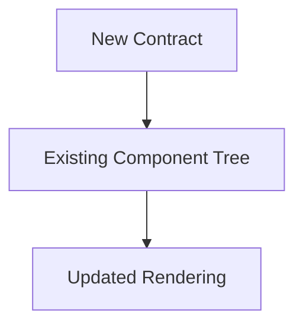

Avoid.

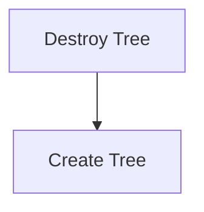

Stable implementation improves performance while preserving continuity.

---

# Platform Independence

Every platform should construct equivalent Component trees.

Flutter.

↓

Hero Components.

React.

↓

Equivalent Hero Components.

SwiftUI.

↓

Equivalent Hero Components.

Implementation differs.

Behaviour remains identical.

---

# Modules

Modules never define Component Composition.

Modules contribute:

- behaviour,
- Expressions.

The Tile Framework resolves presentation.

Platform implementations compose Components.

Every module therefore automatically inherits native implementation quality.

---

# Good Examples

## Hero

Resolved Hero Tile.

↓

Container.

↓

Media.

↓

Text.

↓

Action.

↓

Rendering.

Everything reflects one behavioural contract.

---

## Timeline

Timeline Tile.

↓

Container.

↓

Indicator.

↓

Text.

Behaviour remains runtime owned.

---

## Metadata

Metadata Tile.

↓

Container.

↓

Text.

↓

Indicator.

Editorial hierarchy remains intact.

---

# Anti-patterns

## Smart Composition

Component trees determining behaviour.

---

## Platform Composition

Different clients inventing different Component structures.

---

## Behavioural Containers

Containers mutating runtime state.

---

## Component Hierarchy

Implementation structure redefining behavioural hierarchy.

---

# Component Composition Model

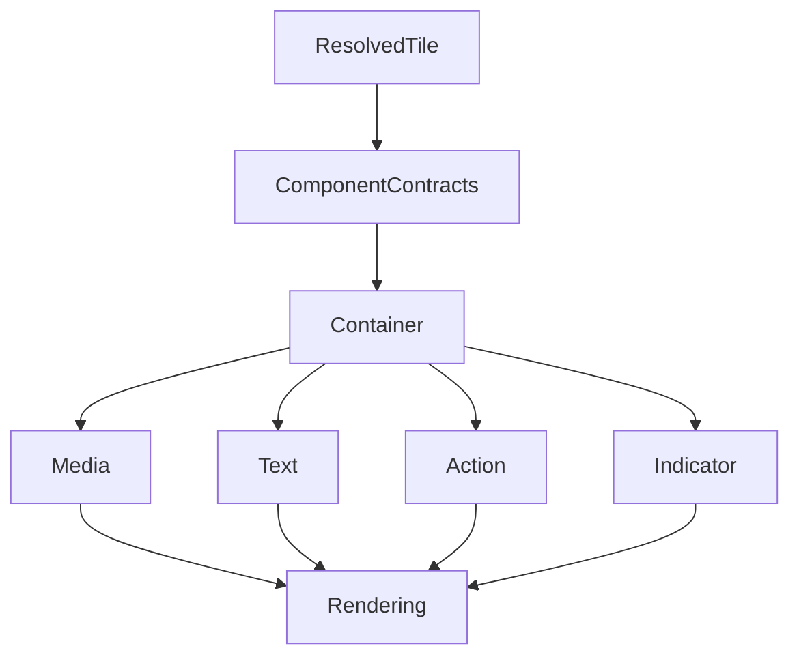

Resolved Tiles determine composition.

Components faithfully implement it.

---

# Relationship To Future Chapters

The next chapter defines **Rendering Architecture**.

Component Composition explains:

> **How Components combine into implementation.**

Rendering Architecture explains:

> **How those Components become efficient, deterministic presentation across every supported rendering technology.**

Together they complete the implementation architecture of the Component Library.

---

# Summary

Component Composition intentionally remains simple.

It assembles Components.

It does not solve behaviour.

Every Component tree should faithfully reflect:

- one Tile,
- one behavioural intent,
- one runtime contract.

By keeping implementation downstream from behaviour, Mosaic ensures that rendering technology can evolve indefinitely without changing the architectural language of the platform.
