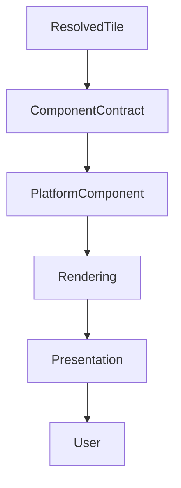

<!--
File: docs/design/system/mds-008-component-library/06-rendering-architecture.md
Document: MDS-008
Chapter: 06
Title: Rendering Architecture
Status: Draft
Version: 0.4
-->

# Rendering Architecture

---

# Purpose

The Component Library concludes with one responsibility.

Rendering.

Everything before this chapter has progressively transformed:

- behaviour,
- understanding,
- presentation,

into resolved Component Contracts.

Rendering Architecture defines how those resolved Components become pixels without introducing new architectural decisions.

Rendering should be considered the thinnest layer in the entire Mosaic architecture.

Its responsibility is implementation.

Nothing more.

---

# Definition

Within MDS, **Rendering Architecture** is defined as:

> **The deterministic implementation layer responsible for transforming resolved Component Contracts into visible presentation while remaining behaviourally passive.**

Rendering implements.

It never reasons.

---

# Philosophy

Traditional UI architectures frequently combine:

- rendering,
- state,
- behaviour,
- layout.

Mosaic intentionally separates these responsibilities.

```text
Runtime World

↓

Composition

↓

Tiles

↓

Components

↓

Rendering
```

Rendering becomes the final implementation stage.

Nothing upstream depends upon it.

---

# Presentation Architecture

Mosaic presentation separates three responsibilities.

| Layer | Responsibility |
|-------|----------------|
| Platform | Semantic UI intent |
| MDL | Presentation behaviour |
| Renderer | Native implementation |

The Platform should answer:

> **What is this component?**

It should never answer:

> **How should this be rendered?**

The Platform may describe:

- business logic,
- navigation structure,
- component hierarchy,
- actions,
- state,
- permissions.

It must not describe:

- CSS,
- colours,
- spacing,
- animation,
- refraction,
- layout coordinates,
- native widget classes.

---

# Semantic UI

Runtime SDUI is semantic UI.

Example.

```yaml
page:
  sections:
    - type: media-grid
      items:
        - type: media-card
          entity: one-piece
```

This communicates intent.

It does not communicate visual implementation.

Examples of semantic UI include:

- Media Card
- Sidebar
- Settings Page
- Navigation Drawer
- Search Results
- Playback Controls

The Platform never decides how these appear.

---

# Client Renderers

Mosaic presentation is implemented by clients.

Examples include:

- Web
- Flutter native client
- Windows
- macOS
- Linux
- Android TV
- Apple TV

Each client owns a renderer that transforms Mosaic SDUI into native presentation for that client.

Conceptually.

```text
SDUI Contract

↓

Client Renderer

↓

Native Presentation
```

The Platform and Supervisor provide SDUI contracts.

They do not render client interfaces.

The browser implementation is not the reference implementation.

Every renderer is a first-class implementation of Mosaic presentation.

---

# Renderer Flow

Web rendering follows this shape.

```text
Runtime SDUI

↓

Web Renderer

↓

MDL Web Library

↓

HTML / CSS / JavaScript

↓

Browser
```

A native client follows the same architectural model.

Flutter is the clearest current example of a non-Web native client, but the architecture does not depend on Flutter.

```text
Runtime SDUI

↓

Native Client Renderer

↓

Native MDL Library

↓

Native UI / Graphics Primitives

↓

Native Application
```

The only significant difference between platforms should be renderer implementation.

---

# MDL Libraries

The Mosaic Design Language should not exist as a runtime presentation service.

Instead, MDL should be implemented as platform-specific libraries.

Examples include:

- `mdl-web`
- `mdl-flutter`
- future `mdl-windows`
- future `mdl-macos`
- future `mdl-linux`
- future `mdl-android-tv`
- future `mdl-apple-tv`
- future `mdl-tv`

Each renderer links against its platform's MDL implementation.

Conceptually.

```text
Platform

↓

Renderer

↓

MDL Library

↓

Native Graphics API
```

This avoids inserting another runtime layer and allows each client to remain idiomatic.

MDL is not a runtime.

The runtime is the Platform.

MDL is the design-language implementation that each renderer links against to realise Mosaic presentation on a native graphics stack.

---

# Relationship To SDUI

The Platform owns Runtime SDUI.

The Supervisor owns Recovery SDUI.

MDL does not modify either contract.

The renderer combines:

- semantic structure from SDUI,
- design rules from MDL,
- platform capabilities from the client runtime.

Conceptually.

```text
Semantic SDUI

↓

Renderer

↓

MDL Library

↓

Native Presentation
```

This preserves a clean boundary.

SDUI describes structure and intent.

MDL describes how Mosaic should feel.

The renderer decides how to realise MDL on a specific platform.

The graphics API draws pixels.

---

# Material Resolution

Renderers may ask their MDL library to resolve a semantic component into a design-language specification.

Example.

```yaml
component:
  type: media-card
entity:
  id: one-piece
context:
  collection: trending
```

The MDL library may resolve that semantic input into design intent.

```yaml
material:
  type: glass
lighting:
  source: artwork
refraction:
  intensity: medium
edgeEmitter:
  enabled: true
elevation:
  level: 2
motion:
  profile: spring
```

This is still not platform presentation.

It is not:

- CSS,
- HTML,
- Flutter widgets,
- shaders,
- DOM structure.

The renderer maps this design intent to native drawing commands.

---

# MDL Project Structure

MDL may be split into multiple implementation projects.

Conceptually.

```text
mdl-spec

↓

mdl-web

↓

mdl-flutter

↓

mdl-winui

↓

mdl-macos

↓

mdl-android-tv

↓

mdl-apple-tv
```

Flutter is an example native client implementation.

It is not the required native client architecture.

`mdl-spec` remains the single source of truth for the Mosaic visual language.

Platform libraries implement that specification for their native rendering stack.

---

# Native Client Examples

Flutter is useful as the first native-client reference because it can express Mosaic presentation without depending on browser primitives.

Other future native clients should follow the same boundary.

Examples include:

- Windows,
- macOS,
- Linux,
- Android TV,
- Apple TV.

Each native client should:

- consume the same semantic SDUI as Web,
- link against its own MDL library,
- render through native UI and graphics APIs,
- avoid embedding the Web Shell as its normal presentation path,
- avoid consuming CSS as a presentation contract.

The Web client is one implementation.

It is not the reference implementation for native clients.

---

# Shared And Native Implementation

Rendering code should not be treated as portable across platforms.

The following may be shared as specification or platform-independent algorithms:

- Material definitions,
- Motion models,
- Layout rules,
- Typography scales,
- Lighting calculations,
- Refraction algorithms,
- Colour models,
- Design Tokens.

The following remain platform-specific:

- DOM structure,
- CSS,
- Flutter widgets,
- Skia drawing,
- WinUI controls,
- AppKit or SwiftUI composition,
- Android TV rendering primitives,
- Apple TV rendering primitives,
- platform animation primitives.

Shared design intent should produce recognisably Mosaic experiences across clients.

Native implementations may differ when platform graphics APIs require different techniques.

---

# MDL Responsibility Layers

MDL has three implementation layers.

## Specification

The specification defines the design language.

Examples include:

- Glass
- Motion
- Typography
- Lighting
- Refraction
- Elevation

## Algorithms

Algorithms are platform-independent calculations.

Examples include:

- light intensity
- refraction strength
- colour extraction
- elevation calculations
- motion curves

These should remain equivalent across renderers.

## Rendering

Rendering is platform-specific implementation.

Examples include:

| Client | Rendering Technologies |
|--------|------------------------|
| Web | CSS, DOM, Canvas, SVG, WebGPU |
| Flutter | Widgets, CustomPainter, BackdropFilter, Skia, shaders |

Only this layer should differ between implementations.

---

# Product Identity

Product identity is distinct from MDL presentation behaviour.

Product identity includes:

- logos,
- product colours,
- icons,
- favicons.

MDL includes:

- Materials,
- Motion,
- Layout rules,
- Refraction,
- Lighting,
- Elevation,
- Typography,
- Spacing,
- Edge emitters,
- UV effects,
- Interaction,
- Component behaviour.

Product identity should remain stable while MDL presentation behaviour may evolve independently.

---

# Runtime And Recovery SDUI

Mosaic uses separate SDUI contracts for normal runtime presentation and recovery presentation.

| Contract | Producer | Purpose |
|----------|----------|---------|
| Runtime SDUI | Platform | Normal Mosaic user interface |
| Recovery SDUI | Supervisor | Onboarding, diagnostics and recovery interface |

Runtime SDUI may express the full Mosaic presentation model.

Recovery SDUI is intentionally smaller.

The contracts are separate so recovery can remain available when the Platform does not exist, has failed or is being replaced.

Onboarding uses Recovery SDUI because it is owned by the Supervisor and may run before the Platform has been built.

The same contract carries Shell bootstrap status, onboarding, build progress, diagnostics, updates and maintenance owned by the Supervisor.

---

# Recovery Component Set

Recovery SDUI uses a deliberately tiny component vocabulary.

Allowed recovery primitives are:

- Heading
- Paragraph
- Status
- Progress
- Button
- Form
- Table
- Log

Recovery rendering should prioritise:

- clarity,
- progress,
- diagnostic confidence,
- safe operator actions.

Recovery rendering should not depend on:

- artwork,
- media surfaces,
- advanced layouts,
- rich animation,
- external assets.

---

# Embedded Web Recovery Renderer

The Web client has one special fallback renderer.

When the Shell is unavailable during bootstrap or failure, the Supervisor may serve an embedded recovery renderer.

That renderer is a single self-contained HTML document that converts Recovery SDUI into basic browser presentation.

It may contain:

- inline HTML,
- inline CSS,
- inline JavaScript.

It must not depend on:

- external CSS files,
- JavaScript bundles,
- images,
- fonts,
- frameworks,
- build pipeline output.

The embedded renderer exists only to preserve recovery access when the normal Web Renderer cannot run.

It should automatically yield to the Web Renderer as soon as the Shell is available, without requiring refresh or manual navigation.

Native clients render Recovery SDUI directly and do not require the embedded web fallback.

Flutter is one possible native recovery renderer.

Other native clients should follow the same rule.

The embedded renderer is not a separate recovery authority.

It is the browser's minimal implementation of the Recovery SDUI contract when the richer Web Renderer is unavailable.

---

# Rendering Is Passive

Rendering should never ask:

> What should I display?

Instead it should ask:

> **How should I faithfully display what has already been resolved?**

Every rendering decision should originate from Component Contracts.

---

# Rendering Pipeline

Every rendered frame follows the same conceptual pipeline.

```text
Resolved Tile

↓

Component Contract

↓

Platform Component

↓

Rendering

↓

Presentation
```

Every upstream decision has already been made.

Rendering simply implements it.

---

# Rendering Inputs

Rendering consumes:

```text
Platform Components

↓

Material Profiles

↓

Typography Profiles

↓

Motion Profiles

↓

Interaction Profiles

↓

Accessibility Profiles
```

Rendering never consumes:

- Runtime World
- Behaviour
- Expressions
- Runtime Hierarchy

Those concepts remain architecturally upstream.

---

# Rendering Outputs

Rendering produces:

- pixels,
- accessibility trees,
- input regions,
- compositor layers.

These outputs remain implementation artefacts.

They should never influence runtime behaviour.

---

# Rendering Order

Rendering should respect runtime hierarchy.

Conceptually.

```text
Canvas

↓

Supporting

↓

Hero

↓

Overlay
```

This ordering originates from the Material System.

Rendering simply preserves it.

---

# Material Rendering

Material behaviour should already be resolved.

Rendering implements:

- Acrylic
- Hero Materials
- Overlay Materials
- Refraction
- Runtime Atmosphere

Rendering should never reinterpret Material behaviour independently.

---

# Typography Rendering

Typography rendering should consume resolved typography.

Examples.

```text
Heading

↓

Text Rendering
```

```text
Supporting

↓

Text Rendering
```

The rendering layer should never choose:

- weights,
- hierarchy,
- editorial emphasis.

Those decisions already exist.

---

# Motion Rendering

Motion Profiles should be executed faithfully.

Rendering should perform:

- interpolation,
- frame scheduling,
- compositing,
- animation playback.

Rendering should never modify behavioural sequencing.

---

# Interaction Rendering

Rendering exposes interaction surfaces.

Examples.

- touch regions
- pointer regions
- focus rings
- accessibility actions

Behaviour remains unchanged.

Rendering simply exposes implementation.

---

# Incremental Rendering

Rendering should update only affected regions whenever practical.

Preferred.

```text
Timeline

↓

Render Timeline
```

Avoid.

```text
Timeline

↓

Render Entire Screen
```

Incremental rendering preserves performance without affecting runtime behaviour.

---

# Layering

Future implementations may internally use rendering layers.

Examples.

```text
Canvas Layer

↓

Material Layer

↓

Content Layer

↓

Overlay Layer
```

Layering remains an implementation concern.

Behaviour should remain completely unaware of compositor architecture.

---

# GPU Independence

The Rendering Architecture intentionally avoids depending upon:

- GPU APIs,
- shader languages,
- graphics libraries.

Future implementations may use:

- Skia
- Metal
- Vulkan
- DirectX
- WebGPU
- OpenGL
- Canvas

Rendering technology remains replaceable.

Architectural behaviour does not.

---

# Performance

Rendering should optimise:

- batching,
- caching,
- layer reuse,
- partial invalidation,
- GPU utilisation.

Optimisation should never modify:

- hierarchy,
- Materials,
- Motion,
- Typography,
- interaction.

Correctness remains the highest priority.

---

# Accessibility

Accessibility rendering should consume resolved Accessibility Profiles.

Examples.

- semantic trees
- screen reader metadata
- focus order
- contrast adjustments

Rendering should never invent accessibility behaviour independently.

---

# Deterministic Rendering

Given identical:

- Component Contracts,
- runtime profiles,
- rendering capabilities,

Rendering should produce identical presentation.

Deterministic rendering improves:

- testing,
- screenshots,
- replay,
- debugging.

---

# Platform Independence

Different rendering engines may produce different implementations.

Flutter.

↓

Impeller.

Web.

↓

Canvas/WebGPU.

SwiftUI.

↓

Core Animation.

Compose.

↓

Skia.

Presentation should remain behaviourally identical.

Only rendering implementation changes.

---

# Failure Behaviour

Rendering failures should degrade gracefully.

Preferred.

```text
Material Effect Fails

↓

Fallback Material

↓

Continue Rendering
```

Avoid.

```text
Rendering Failure

↓

Blank Interface
```

Behavioural continuity should remain the highest priority.

---

# Modules

Modules never participate directly in rendering.

Modules contribute:

- behaviour,
- information,
- Expressions.

Rendering remains entirely platform owned.

Every module therefore automatically inherits future rendering improvements.

---

# Good Examples

## Hero

Resolved Hero Tile.

↓

Hero Component.

↓

Rendering.

↓

Presentation.

Every architectural decision already exists before rendering begins.

---

## Playback

Timeline updates.

↓

Timeline Component.

↓

Partial rendering.

↓

Presentation.

Only affected regions redraw.

---

## Reading

Typography changes.

↓

Text Component.

↓

Incremental rendering.

↓

Reader continues naturally.

---

# Anti-patterns

## Smart Rendering

Rendering deciding behaviour.

---

## Rendering State

Graphics systems mutating runtime architecture.

---

## Platform Behaviour

Different renderers creating different runtime experiences.

---

## Behavioural Shaders

GPU effects changing behavioural understanding.

---

# Rendering Architecture Model



Rendering faithfully implements architectural intent.

Nothing upstream depends upon rendering.

---

# Relationship To Future Chapters

The next chapter defines **Platform Components**.

Rendering Architecture explains:

> **How Components become visible.**

Platform Components explain:

> **How different UI frameworks implement identical Component Contracts while preserving one behavioural language.**

Together they establish the implementation foundation of Mosaic.

---

# Summary

Rendering is intentionally the simplest architectural layer in Mosaic.

By the time rendering begins:

- behaviour has been solved,
- presentation has been solved,
- Components have been resolved.

Rendering simply makes those decisions visible.

That disciplined separation is what allows Mosaic to evolve for decades while remaining behaviourally consistent across every future platform.

---

# Review Status

**Status**

Draft

**Next File**

`07-platform-components.md`
