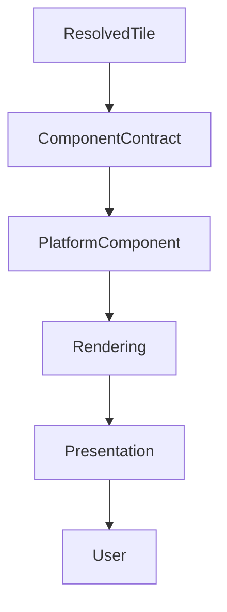

<!--
File: docs/design/system/mds-008-component-library/06-rendering-architecture.md
Document: MDS-008
Chapter: 06
Title: Rendering Architecture
Status: Draft
Version: 0.2
-->

# Rendering Architecture

---

# Purpose

The Component Library concludes with one responsibility.

Rendering.

Everything before this chapter has progressively transformed:

- behaviour,
- understanding,
- presentation,

into resolved Component Contracts.

Rendering Architecture defines how those resolved Components become pixels without introducing new architectural decisions.

Rendering should be considered the thinnest layer in the entire Mosaic architecture.

Its responsibility is implementation.

Nothing more.

---

# Definition

Within MDS, **Rendering Architecture** is defined as:

> **The deterministic implementation layer responsible for transforming resolved Component Contracts into visible presentation while remaining behaviourally passive.**

Rendering implements.

It never reasons.

---

# Philosophy

Traditional UI architectures frequently combine:

- rendering,
- state,
- behaviour,
- layout.

Mosaic intentionally separates these responsibilities.

```text
Runtime World

↓

Composition

↓

Tiles

↓

Components

↓

Rendering
```

Rendering becomes the final implementation stage.

Nothing upstream depends upon it.

---

# Rendering Is Passive

Rendering should never ask:

> What should I display?

Instead it should ask:

> **How should I faithfully display what has already been resolved?**

Every rendering decision should originate from Component Contracts.

---

# Rendering Pipeline

Every rendered frame follows the same conceptual pipeline.

```text
Resolved Tile

↓

Component Contract

↓

Platform Component

↓

Rendering

↓

Presentation
```

Every upstream decision has already been made.

Rendering simply implements it.

---

# Rendering Inputs

Rendering consumes:

```text
Platform Components

↓

Material Profiles

↓

Typography Profiles

↓

Motion Profiles

↓

Interaction Profiles

↓

Accessibility Profiles
```

Rendering never consumes:

- Runtime World
- Behaviour
- Expressions
- Runtime Hierarchy

Those concepts remain architecturally upstream.

---

# Rendering Outputs

Rendering produces:

- pixels,
- accessibility trees,
- input regions,
- compositor layers.

These outputs remain implementation artefacts.

They should never influence runtime behaviour.

---

# Rendering Order

Rendering should respect runtime hierarchy.

Conceptually.

```text
Canvas

↓

Supporting

↓

Hero

↓

Overlay
```

This ordering originates from the Material System.

Rendering simply preserves it.

---

# Material Rendering

Material behaviour should already be resolved.

Rendering implements:

- Acrylic
- Hero Materials
- Overlay Materials
- Refraction
- Runtime Atmosphere

Rendering should never reinterpret Material behaviour independently.

---

# Typography Rendering

Typography rendering should consume resolved typography.

Examples.

```text
Heading

↓

Text Rendering
```

```text
Supporting

↓

Text Rendering
```

The rendering layer should never choose:

- weights,
- hierarchy,
- editorial emphasis.

Those decisions already exist.

---

# Motion Rendering

Motion Profiles should be executed faithfully.

Rendering should perform:

- interpolation,
- frame scheduling,
- compositing,
- animation playback.

Rendering should never modify behavioural sequencing.

---

# Interaction Rendering

Rendering exposes interaction surfaces.

Examples.

- touch regions
- pointer regions
- focus rings
- accessibility actions

Behaviour remains unchanged.

Rendering simply exposes implementation.

---

# Incremental Rendering

Rendering should update only affected regions whenever practical.

Preferred.

```text
Timeline

↓

Render Timeline
```

Avoid.

```text
Timeline

↓

Render Entire Screen
```

Incremental rendering preserves performance without affecting runtime behaviour.

---

# Layering

Future implementations may internally use rendering layers.

Examples.

```text
Canvas Layer

↓

Material Layer

↓

Content Layer

↓

Overlay Layer
```

Layering remains an implementation concern.

Behaviour should remain completely unaware of compositor architecture.

---

# GPU Independence

The Rendering Architecture intentionally avoids depending upon:

- GPU APIs,
- shader languages,
- graphics libraries.

Future implementations may use:

- Skia
- Metal
- Vulkan
- DirectX
- WebGPU
- OpenGL
- Canvas

Rendering technology remains replaceable.

Architectural behaviour does not.

---

# Performance

Rendering should optimise:

- batching,
- caching,
- layer reuse,
- partial invalidation,
- GPU utilisation.

Optimisation should never modify:

- hierarchy,
- Materials,
- Motion,
- Typography,
- interaction.

Correctness remains the highest priority.

---

# Accessibility

Accessibility rendering should consume resolved Accessibility Profiles.

Examples.

- semantic trees
- screen reader metadata
- focus order
- contrast adjustments

Rendering should never invent accessibility behaviour independently.

---

# Deterministic Rendering

Given identical:

- Component Contracts,
- runtime profiles,
- rendering capabilities,

Rendering should produce identical presentation.

Deterministic rendering improves:

- testing,
- screenshots,
- replay,
- debugging.

---

# Platform Independence

Different rendering engines may produce different implementations.

Flutter.

↓

Impeller.

Web.

↓

Canvas/WebGPU.

SwiftUI.

↓

Core Animation.

Compose.

↓

Skia.

Presentation should remain behaviourally identical.

Only rendering implementation changes.

---

# Failure Behaviour

Rendering failures should degrade gracefully.

Preferred.

```text
Material Effect Fails

↓

Fallback Material

↓

Continue Rendering
```

Avoid.

```text
Rendering Failure

↓

Blank Interface
```

Behavioural continuity should remain the highest priority.

---

# Modules

Modules never participate directly in rendering.

Modules contribute:

- behaviour,
- information,
- Expressions.

Rendering remains entirely platform owned.

Every module therefore automatically inherits future rendering improvements.

---

# Good Examples

## Hero

Resolved Hero Tile.

↓

Hero Component.

↓

Rendering.

↓

Presentation.

Every architectural decision already exists before rendering begins.

---

## Playback

Timeline updates.

↓

Timeline Component.

↓

Partial rendering.

↓

Presentation.

Only affected regions redraw.

---

## Reading

Typography changes.

↓

Text Component.

↓

Incremental rendering.

↓

Reader continues naturally.

---

# Anti-patterns

## Smart Rendering

Rendering deciding behaviour.

---

## Rendering State

Graphics systems mutating runtime architecture.

---

## Platform Behaviour

Different renderers creating different runtime experiences.

---

## Behavioural Shaders

GPU effects changing behavioural understanding.

---

# Rendering Architecture Model



Rendering faithfully implements architectural intent.

Nothing upstream depends upon rendering.

---

# Relationship To Future Chapters

The next chapter defines **Platform Components**.

Rendering Architecture explains:

> **How Components become visible.**

Platform Components explain:

> **How different UI frameworks implement identical Component Contracts while preserving one behavioural language.**

Together they establish the implementation foundation of Mosaic.

---

# Summary

Rendering is intentionally the simplest architectural layer in Mosaic.

By the time rendering begins:

- behaviour has been solved,
- presentation has been solved,
- Components have been resolved.

Rendering simply makes those decisions visible.

That disciplined separation is what allows Mosaic to evolve for decades while remaining behaviourally consistent across every future platform.

---

# Review Status

**Status**

Draft

**Next File**

`07-platform-components.md`
