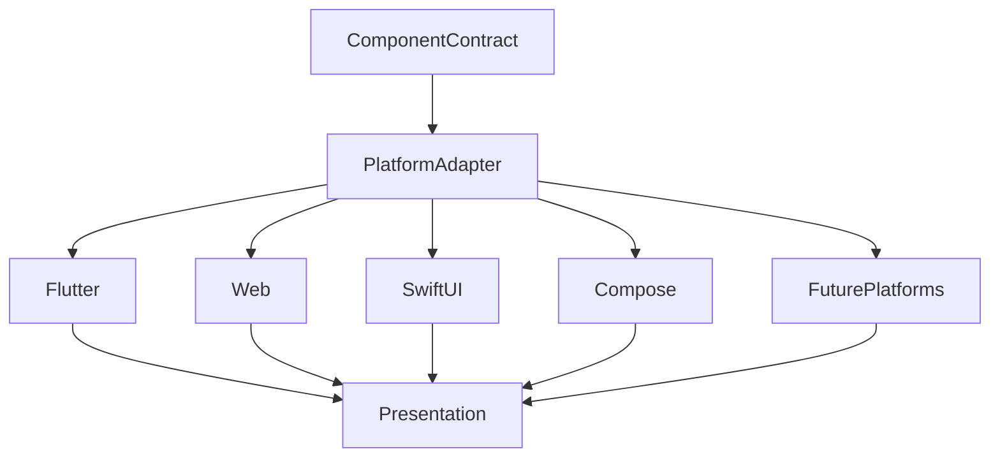

<!--
File: docs/design/system/mds-008-component-library/07-platform-components.md
Document: MDS-008
Chapter: 07
Title: Platform Components
Status: Draft
Version: 0.4
-->

# Platform Components

---

# Purpose

The Component Library defines one implementation vocabulary.

Platform Components express that vocabulary using the capabilities of each supported UI framework.

Unlike traditional cross-platform architectures, Mosaic does **not** attempt to make every framework identical.

Instead it requires every framework to faithfully implement the same behavioural contracts.

Different implementation.

One behavioural language.

---

# Definition

Within MDS, **Platform Components** are defined as:

> **Platform-specific implementations of Mosaic Component Contracts that preserve identical behavioural, visual and accessibility semantics across every supported client.**

Platform Components implement.

They never reinterpret.

---

# Philosophy

Every rendering platform provides different capabilities.

Examples include:

- Flutter
- Web
- SwiftUI
- Jetpack Compose
- Future rendering engines

These frameworks are implementation details.

The user should always experience:

- the same hierarchy,
- the same Materials,
- the same Typography,
- the same Motion,
- the same interaction.

Changing framework should never change behaviour.

---

# One Contract

Every Platform Component consumes the same Component Contract.

Conceptually.

```text
Resolved Tile

↓

Component Contract

↓

Flutter Component
```

```text
Resolved Tile

↓

Component Contract

↓

React Component
```

```text
Resolved Tile

↓

Component Contract

↓

SwiftUI Component
```

The implementation differs.

The contract does not.

---

# Platform Responsibilities

Each platform implementation is responsible for:

- rendering
- input handling
- accessibility APIs
- graphics integration
- lifecycle integration
- platform optimisation

Platforms are **not** responsible for:

- runtime behaviour
- hierarchy
- Materials
- Typography
- Motion sequencing

Those responsibilities remain upstream.

---

# Flutter

Flutter Components should:

- consume Component Contracts directly,
- use Impeller where available,
- implement Material behaviour faithfully,
- preserve runtime Motion ordering.

Flutter should never redefine behavioural presentation because framework APIs differ.

---

# Web

Web Components should:

- consume Component Contracts,
- implement Material behaviour using appropriate web technologies,
- preserve accessibility semantics,
- maintain deterministic rendering.

CSS, Canvas or WebGPU remain implementation choices.

Not architectural concepts.

---

# SwiftUI

SwiftUI Components should:

- consume Component Contracts,
- preserve behavioural hierarchy,
- integrate naturally with Apple accessibility,
- respect resolved Motion Profiles.

Native platform conventions should never weaken Mosaic behaviour.

---

# Jetpack Compose

Compose Components should:

- faithfully implement runtime Contracts,
- preserve Material behaviour,
- maintain Motion sequencing,
- expose identical accessibility semantics.

Platform differences should remain invisible to users.

---

# Future Platforms

Future platforms should require only:

```text
Component Contract

↓

Platform Adapter

↓

Rendering
```

The architecture intentionally assumes that rendering technologies will continue evolving.

The Component Library should remain stable despite those changes.

---

# Material Fidelity

Different platforms may render Materials differently.

Desktop GPU.

↓

Highest fidelity.

Phone.

↓

Balanced fidelity.

Low-power device.

↓

Simplified Acrylic.

Material identity should remain recognisable.

Only rendering quality changes.

---

# Typography Fidelity

Typography should preserve:

- editorial hierarchy,
- reading rhythm,
- accessibility,
- optical consistency.

Font technologies may differ.

Editorial language must not.

---

# Motion Fidelity

Platforms may implement Motion differently.

Examples.

Flutter.

↓

Physics.

Web.

↓

CSS interpolation.

SwiftUI.

↓

Native animation engine.

Motion ordering should remain identical.

Perceptual behaviour matters more than implementation technique.

---

# Interaction Fidelity

Platform Components should expose identical behavioural interaction.

Examples.

Touch.

↓

Behaviour.

Pointer.

↓

Behaviour.

Remote.

↓

Behaviour.

Voice.

↓

Behaviour.

Different input systems.

One runtime outcome.

---

# Accessibility Fidelity

Platform Components should integrate naturally with platform accessibility APIs.

Examples include:

- VoiceOver
- TalkBack
- Narrator
- browser accessibility trees

The user should receive equivalent behavioural understanding regardless of platform.

---

# Runtime Synchronisation

Platform Components should remain synchronised with Runtime Contracts.

Contract updates.

↓

Platform updates.

↓

Presentation updates.

Platform-specific state should never diverge from runtime state.

---

# Performance

Platform Components should optimise:

- recomposition,
- virtualisation,
- rendering,
- memory usage,
- GPU utilisation.

Performance optimisation should never alter behavioural correctness.

---

# Deterministic Behaviour

Given identical:

- Component Contracts,
- runtime state,
- accessibility,

Platform Components should produce equivalent presentation across every supported client.

Perfect pixel parity is unnecessary.

Behavioural parity is mandatory.

---

# Modules

Modules never implement Platform Components.

Modules contribute:

- behaviour,
- Expressions.

The Component Library provides platform implementations.

Every module therefore automatically supports every Mosaic client.

---

# Good Examples

## Flutter

Component Contract.

↓

Flutter Hero Component.

↓

Rendering.

↓

Behaviour preserved.

---

## Web

Component Contract.

↓

Web Timeline Component.

↓

Rendering.

↓

Behaviour preserved.

---

## Television

Component Contract.

↓

TV Overlay Component.

↓

Rendering.

↓

Distance-optimised presentation.

The behavioural language remains unchanged.

---

# Anti-patterns

## Platform Behaviour

Flutter behaving differently from Web.

---

## Framework Contracts

Platform APIs redefining Component Contracts.

---

## Native Drift

Platform conventions replacing Mosaic interaction.

---

## Module Components

Modules shipping platform-specific UI implementations.

---

# Platform Component Model



One Component Contract.

Many implementations.

One behavioural experience.

---

# Relationship To Future Chapters

The next chapter defines **Accessibility Contracts**.

Platform Components explain:

> **How Component Contracts become platform implementations.**

Accessibility Contracts explain:

> **How accessibility becomes a first-class implementation responsibility while remaining behaviourally identical across every platform.**

Together they ensure Mosaic remains both consistent and inclusive.

---

# Summary

Platform Components intentionally separate:

- behavioural architecture,
- implementation technology.

Frameworks evolve.

Platforms change.

Rendering engines come and go.

The Component Contract remains stable.

Users should therefore experience the same Companion regardless of which device or framework happens to be rendering it.

---

# Review Status

**Status**

Draft

**Next File**

`08-accessibility-contracts.md`
