<!--
File: docs/design/system/mds-008-component-library/09-runtime-rendering.md
Document: MDS-008
Chapter: 09
Title: Runtime Rendering
Status: Draft
Version: 0.4
-->

# Runtime Rendering

---

# Purpose

Every previous chapter has progressively transformed behavioural understanding into implementation.

The final responsibility of the Component Library is Runtime Rendering.

Runtime Rendering is responsible for:

- scheduling,
- updating,
- composing,
- presenting,

resolved Components efficiently while preserving the behavioural guarantees established throughout the Mosaic architecture.

Rendering should never become another behavioural system.

Its responsibility is execution.

---

# Definition

Within MDS, **Runtime Rendering** is defined as:

> **The deterministic execution of resolved Component Contracts into continuously updated visual presentation while preserving behavioural, material and accessibility correctness.**

Runtime Rendering implements.

It never decides.

---

# Philosophy

Traditional applications frequently merge:

- rendering,
- application state,
- behaviour,
- scheduling.

Mosaic intentionally separates these concerns.

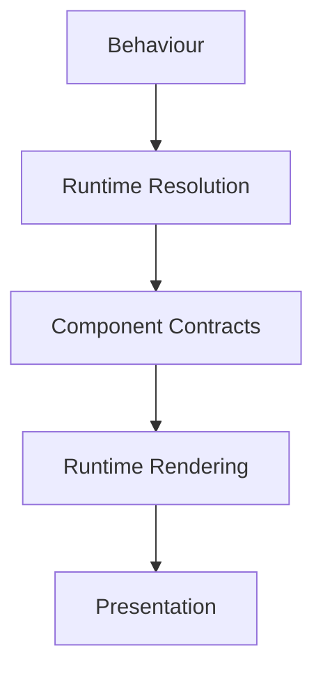

By the time rendering begins...

Every important decision has already been made.

---

# SDUI Rendering

Runtime Rendering consumes SDUI contracts.

Normal Mosaic presentation follows this path.

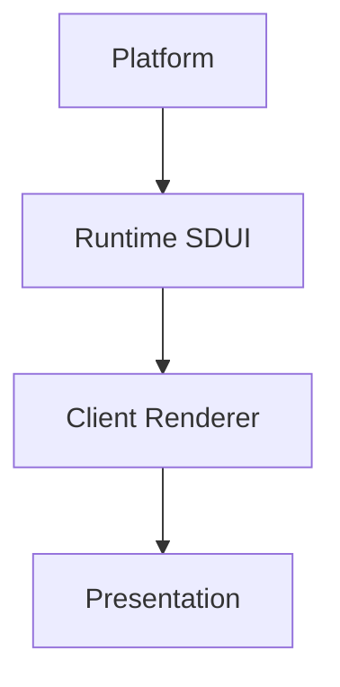

The Platform emits the same semantic UI to every client.

Each renderer, backed by its platform-specific MDL library, translates that intent into native visuals and interactions.

Recovery presentation follows a separate path.

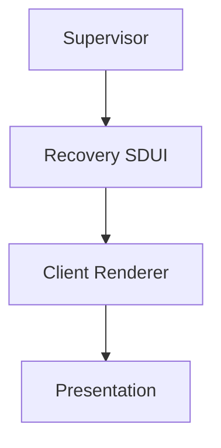

The renderer should not infer product meaning from either contract.

It should faithfully render the contract it receives.

The Supervisor may decide whether the public HTTP entry point presents normal runtime UI or recovery UI.

That does not change contract ownership.

Runtime SDUI remains Platform-produced.

Recovery SDUI remains Supervisor-produced.

---

# Mosaic v1 Runtime Scope

Mosaic v1 renders semantic SDUI through the client-side Web component library.

SDUI determines:

- structural component hierarchy
- content and semantic roles
- actions and state bindings
- accessibility and localisation metadata
- stable content identity

The client library determines:

- DOM implementation
- responsive CSS layout
- spacing, sizing and typography
- Materials and Refraction
- interaction presentation
- transitions and update scheduling

Static sites may author the same component hierarchy directly in semantic HTML without connecting to an SDUI backend.

The mathematical Adaptive Composition Runtime is post-v1 and is not required to render a conforming v1 SDUI document.

---

# SDUI Delivery Layers

Normal Mosaic presentation uses one semantic SDUI model through three complementary delivery layers.

| Layer | Responsibility |
|-------|----------------|
| Refreshable Compiled SDUI | Supplies an independently loadable page snapshot for initial rendering, deep links, recovery and cache replacement. |
| SDUI Patch Stream | Applies navigation, content and structural changes as ordered semantic transactions during a connected session. |
| Live State Bindings | Update frequently changing values without replacing the page definition or recomputing unrelated Composition. |

These layers do not define separate component languages.

Web, Flutter and other native renderers consume the same semantic contract.

---

# Refreshable Compiled SDUI

A compiled SDUI bundle is an immutable, versioned snapshot produced by a Platform-owned compiler or build pipeline.

The site remains refreshable by publishing a new bundle and atomically updating the active version.

A bundle may contain:

- semantic page structure and content
- routes and navigation metadata
- Authored Layout intent
- accessibility and localisation metadata
- actions and capability references
- optional Static Brand Emitter configuration
- contract version and content identity

It must not contain CSS, native widget definitions, raw spacing, final coordinates, Material effect values or pre-rendered Refraction state.

Web clients may pre-render the same semantics as accessible HTML for first load and indexing.

That HTML is an adapter output rather than the canonical cross-client contract.

Each route should remain independently loadable even though ordinary in-session navigation does not reload the page.

---

# Live State Bindings

Stable semantic nodes may bind to Platform data for metrics, status, progress, tables and other changing values.

A binding may communicate one of these freshness requirements:

| Freshness | Meaning |
|-----------|---------|
| Snapshot | The bundled value is sufficient until a newer bundle is loaded. |
| Refreshable | The value may update on explicit or lifecycle-driven refresh. |
| Near-live | Brief bounded delay is acceptable. |
| Live | Continuous updates are expected while transport and capability permit. |

SDUI communicates freshness intent and semantic capability references.

It must not prescribe URLs, WebSocket implementation, polling intervals or client scheduling mechanics.

Renderers should provide governed loading, stale, unavailable and error presentation for every binding.

A binding update should invalidate only the affected semantic state and Presentation region.

Routine metric changes must not rebuild the page definition, the whole Composition or the Refraction light field.

---

# SDUI Patch Stream

During an active session, the renderer should maintain a persistent ordered connection to the Platform SDUI Driver.

A full-duplex transport such as WebSocket is the preferred interactive path because it supports navigation transactions, live state and acknowledgements over one continuous session.

The canonical payload is a semantic SDUI transaction rather than an HTML fragment.

Web implementations may use HTML-fragment tooling as an adapter or progressive fallback, but native and Web renderers must remain contract-equivalent.

A transaction may insert, remove, move or update semantic nodes.

It should contain:

- transaction identity
- monotonic sequence
- base-state identity
- ordered semantic operations
- required content references
- continuity identities

Exact encoding, authentication, transport negotiation, size limits and backpressure thresholds require a future integration protocol.

---

# Continuity Keys

Every semantic object that may persist across snapshots, patches or route changes should carry a stable **Continuity Key**.

The key identifies domain continuity. It does not identify a component instance, render-tree node or transport operation.

The SDUI Driver must preserve the same Continuity Key while an object remains the same domain entity, including when that object is:

- repositioned
- resized
- reparented
- represented by a different component implementation

A key must not be reused for a different domain entity merely to manufacture a visual transition.

The v1 renderer compares the previous and pending semantic trees by Continuity Key so it can preserve DOM identity and apply governed component transitions rather than replacing the entire page.

The post-v1 Adaptive Composition Runtime may additionally classify repositioning, resizing, reparenting and Composition-plane movement through [MDS-005 — Motion System](../mds-005-motion-system/09-runtime-motion-resolution.md).

SDUI supplies semantic roles, relationships and stable identity. It must not supply final coordinates, raw spacing, Design Token values, curves, durations or spring values.

Exact key encoding, namespace governance, lifetime and collision handling require a future integration protocol.

---

# Atomic Transition Pipeline

The renderer should process each structural transaction through one continuity-preserving pipeline.

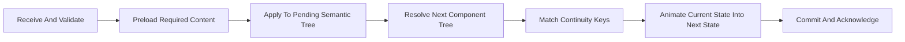

Every visible frame must represent either the previous complete state or the next complete state.

The renderer must not expose a partially applied transaction.

Continuity Keys allow the client to recognise structural and content updates as the continuation of an existing object.

Component implementation identities remain disposable and must not be used for behavioural continuity.

The Platform supplies meaning and identity.

The v1 component library resolves responsive layout and governed transitions without receiving Presentation values from SDUI.

---

# Continuous Navigation

Ordinary navigation should update the current Composition rather than replace the document or application root.

On Web, the renderer should update browser history and the canonical route without triggering a page reload.

Back, forward and deep-link behaviour must remain intact.

The v1 renderer should preload required content, resolve the pending component tree and transition shared identities before committing the new route state.

A direct URL load, manual refresh or recovery event may load the latest compiled snapshot.

That recovery path must not become the normal navigation mechanism.

---

# Stream Recovery

The Patch Stream should support:

- monotonic sequence validation
- idempotent transaction replay
- acknowledgement after atomic commit
- resume from the last committed cursor
- snapshot recovery after an unrecoverable gap
- coalescing when updates arrive faster than useful Presentation
- continuation from the last stable state during temporary disconnection

When continuity cannot be proven, the renderer should retain its last stable state until it can obtain and atomically present a valid snapshot.

---

# Platform Boundary

The Platform owns:

- business logic,
- navigation structure,
- component hierarchy,
- actions,
- state,
- permissions.

The Platform does not own:

- CSS,
- colours,
- spacing,
- animation,
- refraction,
- layout coordinates,
- platform widget choices.

Rendering should reject any pressure to make Platform SDUI describe native visual implementation.

---

# Client Behaviour

Each client renders SDUI using its native presentation system.

The Web client normally renders through the Shell and Web Renderer.

During Shell bootstrap or Shell failure, the Web client may receive the embedded recovery renderer from the Supervisor.

Native clients should render Recovery SDUI directly using their native component implementations.

Examples include Flutter, Windows, macOS, Linux, Android TV and Apple TV.

They should not depend on the embedded web renderer.

Recovery semantics should remain consistent across every client even when the presentation technology differs.

---

# Recovery Rendering

Recovery follows the same presentation architecture.

For Web fallback.

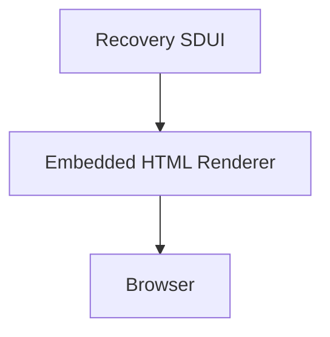

For a native client such as Flutter.

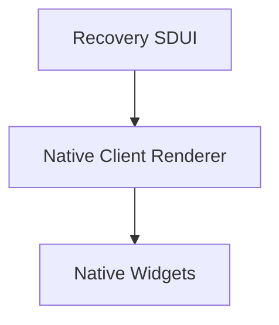

Flutter and other native clients do not need embedded recovery HTML.

They should render Recovery SDUI through their own native renderer.

---

# Rendering Is Continuous

Rendering should not be viewed as a sequence of pages.

Instead it continuously reflects the evolving Runtime World.

Conceptually.

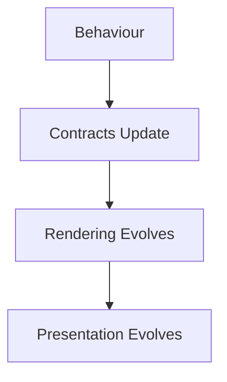

The renderer should appear alive without becoming behaviourally intelligent.

---

# Rendering Pipeline

Every rendering update should broadly follow this pipeline.

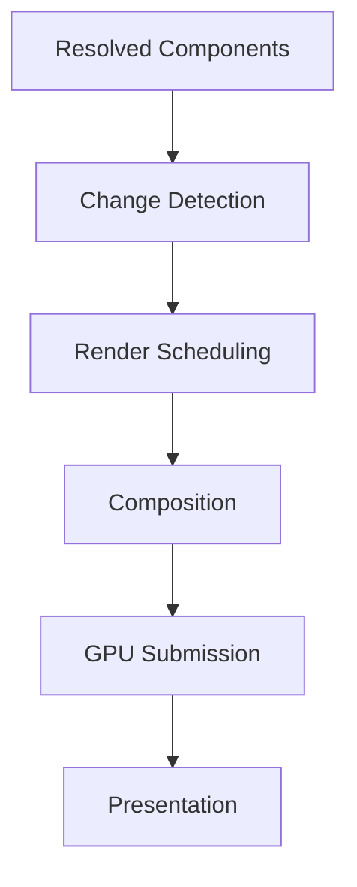

Each stage performs one responsibility.

---

# Change Detection

Rendering should begin only after behavioural resolution completes.

The renderer evaluates:

- updated Component Contracts,
- invalidated presentation,
- changed visual regions.

Rendering should never poll runtime systems independently.

---

# Render Scheduling

Rendering work should be prioritised according to Runtime Hierarchy.

Preferred order.

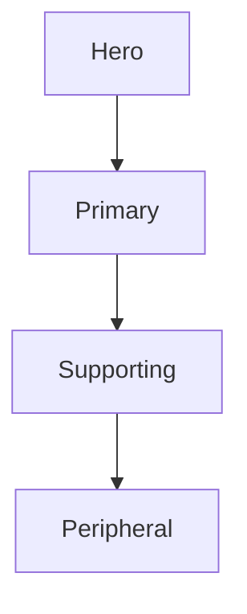

Scheduling should reinforce behavioural importance.

It should never redefine it.

---

# Incremental Rendering

Rendering should update only affected presentation.

Preferred.

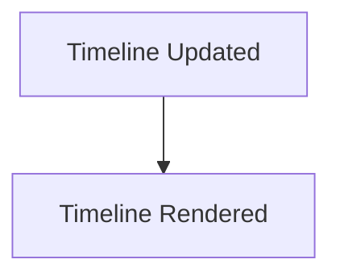

Avoid.

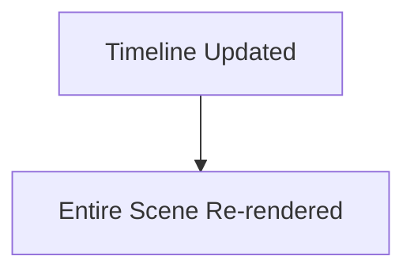

Incremental rendering improves responsiveness without affecting behavioural correctness.

---

# Composition

Runtime Rendering assembles platform Components into the final render tree.

Composition should preserve:

- Material hierarchy,
- Typography hierarchy,
- Motion sequencing,
- accessibility order.

Rendering should faithfully reproduce the Presentation Model.

---

# Layer Composition

Future implementations may internally compose layers.

Conceptually.

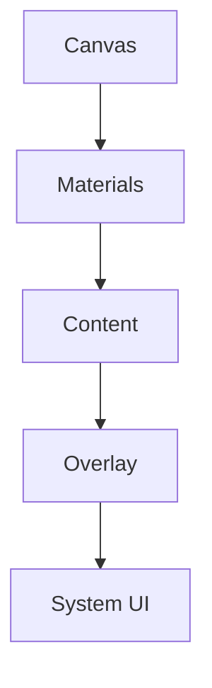

Layer composition remains an implementation concern.

The behavioural hierarchy should remain identical regardless of compositor architecture.

---

# Material Rendering

Runtime Rendering implements resolved Materials.

Examples include:

- Acrylic
- Hero Material
- Overlay Material
- Refraction
- Runtime Atmosphere

Rendering should never reinterpret Material behaviour.

It faithfully executes resolved Material Profiles.

---

# Typography Rendering

Typography should remain stable.

Rendering implements:

- glyph positioning,
- shaping,
- wrapping,
- optical sizing.

Editorial hierarchy should already be resolved.

Rendering simply displays it.

---

# Motion Rendering

Motion execution should remain deterministic.

Examples include:

- interpolation,
- timeline progression,
- frame updates,
- completion.

Behaviour determines motion.

Rendering performs it.

---

# Interaction Rendering

Runtime Rendering exposes interaction surfaces.

Examples.

- touch targets,
- pointer regions,
- accessibility regions,
- focus order.

These surfaces implement resolved Interaction Contracts.

Behavioural meaning remains unchanged.

---

# Accessibility Rendering

Accessibility should be rendered alongside visual presentation.

Examples include:

- semantic trees,
- accessible names,
- reading order,
- focus order,
- interaction actions.

Accessible presentation should remain behaviourally identical to visual presentation.

---

# Virtualisation

Future implementations may virtualise Components.

Examples include:

- long collections,
- library shelves,
- search results,
- recommendations.

Virtualisation is purely an implementation optimisation.

Users should never perceive behavioural differences.

---

# Partial Invalidation

Only changed presentation should invalidate rendering.

Examples.

Playback progress.

↓

Timeline redraw.

Theme change.

↓

Material redraw.

Focus change.

↓

Hero redraw.

Behaviour determines invalidation.

---

# Frame Consistency

Every rendered frame should represent one consistent Runtime World.

Rendering should never display:

- partially updated hierarchy,
- mixed behavioural states,
- incomplete Material updates.

Each frame should correspond to one completed runtime resolution.

---

# Performance Profiles

Future runtime implementations may expose conceptual rendering profiles.

Examples.

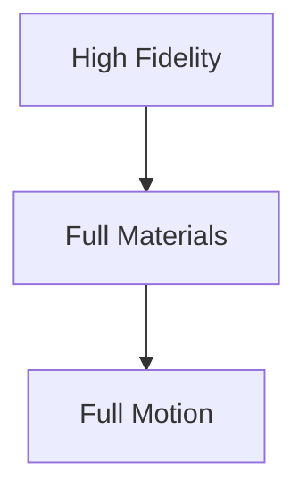

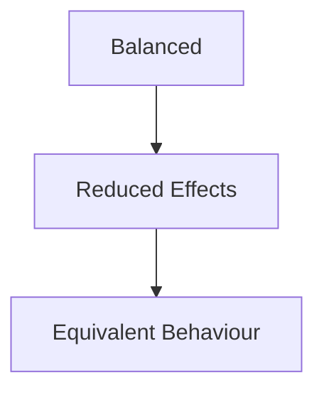

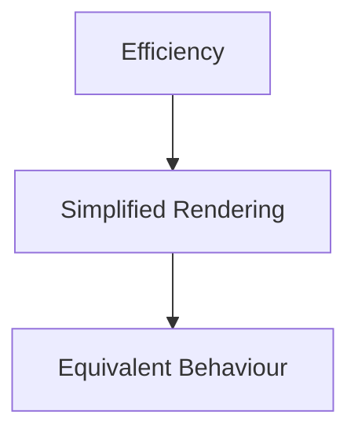

Rendering quality may change.

Behaviour must not.

---

# Platform Independence

Runtime Rendering should remain implementation independent.

Flutter.

↓

Impeller.

Web.

↓

Canvas / WebGPU.

SwiftUI.

↓

Core Animation.

Compose.

↓

Skia.

Presentation should remain behaviourally identical across every rendering technology.

---

# Deterministic Rendering

Given identical:

- Component Contracts,
- Accessibility Profiles,
- Runtime state,

Runtime Rendering should produce equivalent presentation.

Perfect pixel matching is unnecessary.

Behavioural equivalence is essential.

---

# Failure Behaviour

Rendering failures should degrade gracefully.

Preferred.

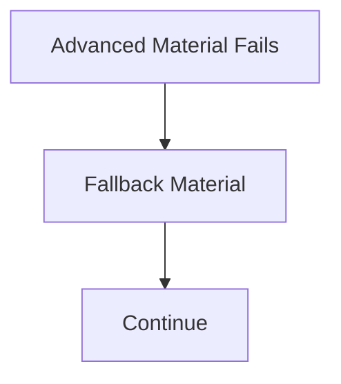

Avoid.

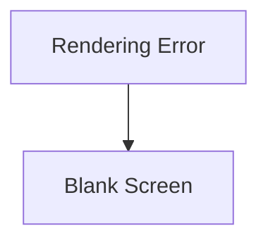

Presentation quality may reduce.

Behavioural continuity should remain intact.

---

# Modules

Modules never interact directly with Runtime Rendering.

Modules contribute:

- behaviour,
- Expressions,
- information.

The runtime resolves:

- Tiles,
- Components,
- Contracts.

Rendering simply displays them.

Every module therefore automatically benefits from rendering improvements.

---

# Good Examples

## Playback

Playback progresses.

↓

Timeline Contract updates.

↓

Timeline Component renders.

↓

Presentation updates.

Only the affected region redraws.

---

## Reading

Typography profile updates.

↓

Text Components rerender.

↓

Reading continues naturally.

---

## Library

Virtualised collection.

↓

Visible Components rendered.

↓

Behaviour remains identical.

Users never perceive implementation optimisations.

---

# Anti-patterns

## Behavioural Rendering

Rendering engine deciding runtime behaviour.

---

## Full Redraw

Entire interface redrawn for local behavioural updates.

---

## Platform Behaviour

Different rendering engines creating different runtime semantics.

---

## Accessibility Drift

Accessible presentation diverging from visual presentation.

---

# Runtime Rendering Model

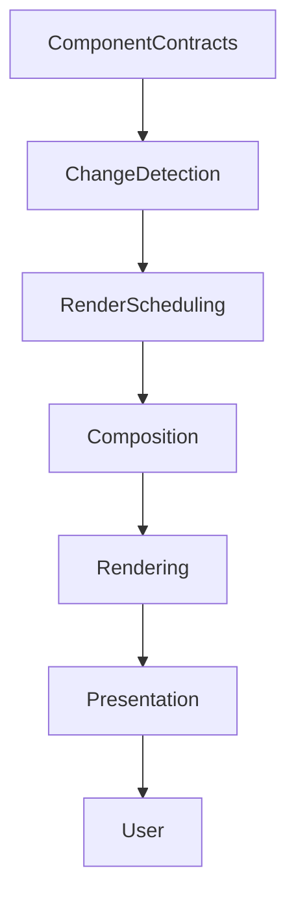

Rendering faithfully executes runtime decisions.

Behaviour always remains upstream.

---

# Relationship To Future Chapters

The next chapter defines **Component Optimisation**.

Runtime Rendering explains:

> **How Components become continuously visible.**

Component Optimisation explains:

> **How rendering efficiency improves over time while preserving every behavioural guarantee established by the Mosaic architecture.**

Together they complete the implementation pipeline of the Component Library.

---

# Summary

Runtime Rendering is the final implementation stage of the entire Mosaic Design Language.

By the time rendering begins:

- behaviour is solved,
- presentation is solved,
- accessibility is solved.

Rendering simply makes those decisions visible efficiently and consistently.

That deliberate simplicity is one of the defining architectural strengths of Mosaic.
