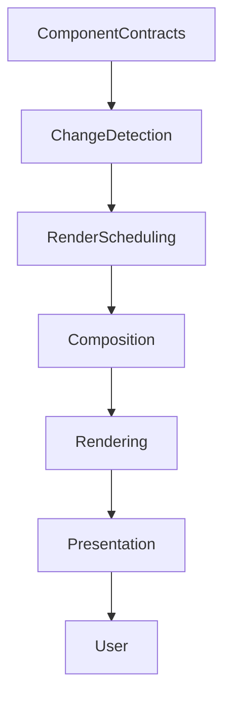

<!--
File: docs/design/system/mds-008-component-library/09-runtime-rendering.md
Document: MDS-008
Chapter: 09
Title: Runtime Rendering
Status: Draft
Version: 0.2
-->

# Runtime Rendering

---

# Purpose

Every previous chapter has progressively transformed behavioural understanding into implementation.

The final responsibility of the Component Library is Runtime Rendering.

Runtime Rendering is responsible for:

- scheduling,
- updating,
- composing,
- presenting,

resolved Components efficiently while preserving the behavioural guarantees established throughout the Mosaic architecture.

Rendering should never become another behavioural system.

Its responsibility is execution.

---

# Definition

Within MDS, **Runtime Rendering** is defined as:

> **The deterministic execution of resolved Component Contracts into continuously updated visual presentation while preserving behavioural, material and accessibility correctness.**

Runtime Rendering implements.

It never decides.

---

# Philosophy

Traditional applications frequently merge:

- rendering,
- application state,
- behaviour,
- scheduling.

Mosaic intentionally separates these concerns.

```text
Behaviour

↓

Runtime Resolution

↓

Component Contracts

↓

Runtime Rendering

↓

Presentation
```

By the time rendering begins...

Every important decision has already been made.

---

# Rendering Is Continuous

Rendering should not be viewed as a sequence of pages.

Instead it continuously reflects the evolving Runtime World.

Conceptually.

```text
Behaviour

↓

Contracts Update

↓

Rendering Evolves

↓

Presentation Evolves
```

The renderer should appear alive without becoming behaviourally intelligent.

---

# Rendering Pipeline

Every rendering update should broadly follow this pipeline.

```text
Resolved Components

↓

Change Detection

↓

Render Scheduling

↓

Composition

↓

GPU Submission

↓

Presentation
```

Each stage performs one responsibility.

---

# Change Detection

Rendering should begin only after behavioural resolution completes.

The renderer evaluates:

- updated Component Contracts,
- invalidated presentation,
- changed visual regions.

Rendering should never poll runtime systems independently.

---

# Render Scheduling

Rendering work should be prioritised according to Runtime Hierarchy.

Preferred order.

```text
Hero

↓

Primary

↓

Supporting

↓

Peripheral
```

Scheduling should reinforce behavioural importance.

It should never redefine it.

---

# Incremental Rendering

Rendering should update only affected presentation.

Preferred.

```text
Timeline Updated

↓

Timeline Rendered
```

Avoid.

```text
Timeline Updated

↓

Entire Scene Re-rendered
```

Incremental rendering improves responsiveness without affecting behavioural correctness.

---

# Composition

Runtime Rendering assembles platform Components into the final render tree.

Composition should preserve:

- Material hierarchy,
- Typography hierarchy,
- Motion sequencing,
- accessibility order.

Rendering should faithfully reproduce the Presentation Model.

---

# Layer Composition

Future implementations may internally compose layers.

Conceptually.

```text
Canvas

↓

Materials

↓

Content

↓

Overlay

↓

System UI
```

Layer composition remains an implementation concern.

The behavioural hierarchy should remain identical regardless of compositor architecture.

---

# Material Rendering

Runtime Rendering implements resolved Materials.

Examples include:

- Acrylic
- Hero Material
- Overlay Material
- Refraction
- Runtime Atmosphere

Rendering should never reinterpret Material behaviour.

It faithfully executes resolved Material Profiles.

---

# Typography Rendering

Typography should remain stable.

Rendering implements:

- glyph positioning,
- shaping,
- wrapping,
- optical sizing.

Editorial hierarchy should already be resolved.

Rendering simply displays it.

---

# Motion Rendering

Motion execution should remain deterministic.

Examples include:

- interpolation,
- timeline progression,
- frame updates,
- completion.

Behaviour determines motion.

Rendering performs it.

---

# Interaction Rendering

Runtime Rendering exposes interaction surfaces.

Examples.

- touch targets,
- pointer regions,
- accessibility regions,
- focus order.

These surfaces implement resolved Interaction Contracts.

Behavioural meaning remains unchanged.

---

# Accessibility Rendering

Accessibility should be rendered alongside visual presentation.

Examples include:

- semantic trees,
- accessible names,
- reading order,
- focus order,
- interaction actions.

Accessible presentation should remain behaviourally identical to visual presentation.

---

# Virtualisation

Future implementations may virtualise Components.

Examples include:

- long collections,
- library shelves,
- search results,
- recommendations.

Virtualisation is purely an implementation optimisation.

Users should never perceive behavioural differences.

---

# Partial Invalidation

Only changed presentation should invalidate rendering.

Examples.

Playback progress.

↓

Timeline redraw.

Theme change.

↓

Material redraw.

Focus change.

↓

Hero redraw.

Behaviour determines invalidation.

---

# Frame Consistency

Every rendered frame should represent one consistent Runtime World.

Rendering should never display:

- partially updated hierarchy,
- mixed behavioural states,
- incomplete Material updates.

Each frame should correspond to one completed runtime resolution.

---

# Performance Profiles

Future runtime implementations may expose conceptual rendering profiles.

Examples.

```text
High Fidelity

↓

Full Materials

↓

Full Motion
```

```text
Balanced

↓

Reduced Effects

↓

Equivalent Behaviour
```

```text
Efficiency

↓

Simplified Rendering

↓

Equivalent Behaviour
```

Rendering quality may change.

Behaviour must not.

---

# Platform Independence

Runtime Rendering should remain implementation independent.

Flutter.

↓

Impeller.

Web.

↓

Canvas / WebGPU.

SwiftUI.

↓

Core Animation.

Compose.

↓

Skia.

Presentation should remain behaviourally identical across every rendering technology.

---

# Deterministic Rendering

Given identical:

- Component Contracts,
- Accessibility Profiles,
- Runtime state,

Runtime Rendering should produce equivalent presentation.

Perfect pixel matching is unnecessary.

Behavioural equivalence is essential.

---

# Failure Behaviour

Rendering failures should degrade gracefully.

Preferred.

```text
Advanced Material Fails

↓

Fallback Material

↓

Continue
```

Avoid.

```text
Rendering Error

↓

Blank Screen
```

Presentation quality may reduce.

Behavioural continuity should remain intact.

---

# Modules

Modules never interact directly with Runtime Rendering.

Modules contribute:

- behaviour,
- Expressions,
- information.

The runtime resolves:

- Tiles,
- Components,
- Contracts.

Rendering simply displays them.

Every module therefore automatically benefits from rendering improvements.

---

# Good Examples

## Playback

Playback progresses.

↓

Timeline Contract updates.

↓

Timeline Component renders.

↓

Presentation updates.

Only the affected region redraws.

---

## Reading

Typography profile updates.

↓

Text Components rerender.

↓

Reading continues naturally.

---

## Library

Virtualised collection.

↓

Visible Components rendered.

↓

Behaviour remains identical.

Users never perceive implementation optimisations.

---

# Anti-patterns

## Behavioural Rendering

Rendering engine deciding runtime behaviour.

---

## Full Redraw

Entire interface redrawn for local behavioural updates.

---

## Platform Behaviour

Different rendering engines creating different runtime semantics.

---

## Accessibility Drift

Accessible presentation diverging from visual presentation.

---

# Runtime Rendering Model



Rendering faithfully executes runtime decisions.

Behaviour always remains upstream.

---

# Relationship To Future Chapters

The next chapter defines **Component Optimisation**.

Runtime Rendering explains:

> **How Components become continuously visible.**

Component Optimisation explains:

> **How rendering efficiency improves over time while preserving every behavioural guarantee established by the Mosaic architecture.**

Together they complete the implementation pipeline of the Component Library.

---

# Summary

Runtime Rendering is the final implementation stage of the entire Mosaic Design Language.

By the time rendering begins:

- behaviour is solved,
- presentation is solved,
- accessibility is solved.

Rendering simply makes those decisions visible efficiently and consistently.

That deliberate simplicity is one of the defining architectural strengths of Mosaic.

---

# Review Status

**Status**

Draft

**Next File**

`10-component-optimisation.md`
