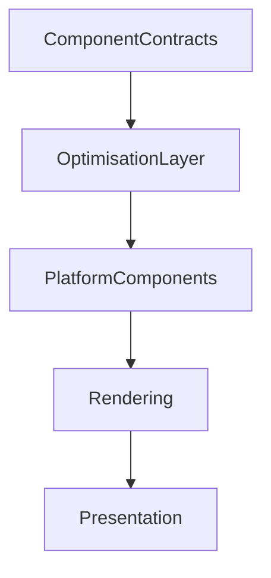

<!--
File: docs/design/system/mds-008-component-library/10-component-optimisation.md
Document: MDS-008
Chapter: 10
Title: Component Optimisation
Status: Draft
Version: 0.4
-->

# Component Optimisation

---

# Purpose

The Component Library exists to faithfully implement the runtime architecture.

Optimisation should strengthen that implementation.

It should never alter behavioural meaning.

Unlike many UI frameworks, Mosaic treats optimisation as an implementation concern rather than an architectural one.

Performance should improve continuously.

Behaviour should remain identical.

---

# Definition

Within MDS, **Component Optimisation** is defined as:

> **The implementation techniques used to improve rendering efficiency while preserving deterministic behaviour, presentation fidelity and runtime contracts.**

Optimisation changes execution.

It never changes understanding.

---

# Philosophy

Optimisation should answer one question.

> **"Can we render the same behaviour more efficiently?"**

Not:

> "Can we simplify behaviour to improve performance?"

Behaviour always possesses higher authority than optimisation.

---

# Optimisation Principles

Every optimisation should satisfy the following principles.

- deterministic
- behaviour preserving
- presentation preserving
- measurable
- reversible
- platform independent

Optimisation should never introduce behavioural side effects.

---

# Behaviour Before Performance

Preferred.

```text
Same Behaviour

↓

Better Performance
```

Avoid.

```text
Simpler Behaviour

↓

Better Performance
```

Performance improvements should never weaken runtime understanding.

---

# Optimisation Targets

Typical optimisation areas include:

- rendering
- layout
- compositing
- virtualisation
- memory usage
- GPU utilisation
- image decoding
- animation scheduling

Behavioural systems remain outside the scope of optimisation.

---

# Component Reuse

Components should be reused whenever practical.

Examples.

- virtualised collections
- scrolling shelves
- infinite feeds
- recommendation lists

Reuse reduces allocation.

It does not alter behavioural identity.

---

# Virtualisation

Large collections should virtualise presentation.

Example.

```text
1000 Tiles

↓

Visible Components

↓

Render
```

Tiles continue existing behaviourally.

Only implementation becomes selective.

---

# Partial Updates

Only affected Components should update.

Preferred.

```text
Timeline

↓

Timeline Component

↓

Render
```

Avoid.

```text
Timeline

↓

Entire Hero Tree

↓

Render
```

Behavioural locality should naturally produce rendering locality.

---

# Contract Equality

Future implementations should compare Component Contracts before updating.

Conceptually.

```text
Old Contract

↓

Compare

↓

Changed?

↓

Update
```

Equivalent Contracts should not trigger unnecessary rendering.

---

# Image Optimisation

Media Components may optimise:

- decoding
- caching
- resolution selection
- progressive loading

These optimisations should remain invisible to users.

Behaviour should remain unchanged.

---

# Material Optimisation

Material rendering may optimise:

- shader reuse
- cached refraction
- atmosphere fields
- layer compositing

Material identity must remain unchanged.

Only implementation improves.

---

# Typography Optimisation

Typography rendering may optimise:

- glyph caching
- paragraph layout
- shaping reuse
- font loading

Editorial hierarchy should remain identical.

Optimisation should never influence readability.

---

# Motion Optimisation

Motion may optimise:

- interpolation
- frame scheduling
- batching
- animation reuse

Motion sequencing must remain behaviourally identical.

---

# Accessibility Optimisation

Accessibility should never be disabled for performance.

Instead optimise:

- semantic tree generation
- focus updates
- accessibility caching

Accessibility correctness always has higher priority than rendering speed.

---

# Memory Optimisation

Future implementations should minimise:

- duplicate Components
- duplicated textures
- repeated allocations
- unnecessary object graphs

Memory optimisation should remain behaviourally transparent.

---

# GPU Optimisation

GPU acceleration may improve:

- Acrylic
- Refraction
- Atmosphere
- compositing
- transitions

GPU techniques remain implementation details.

They should never become architectural concepts.

---

# Lazy Rendering

Presentation may be deferred until required.

Examples.

- off-screen collections
- hidden overlays
- collapsed groups

Deferred rendering should never delay behavioural updates.

The Runtime World always remains current.

---

# Platform Optimisation

Each platform may optimise differently.

Flutter.

↓

Widget reuse.

Web.

↓

DOM reuse.

SwiftUI.

↓

View identity.

Compose.

↓

Recomposition.

Implementation differs.

Behaviour remains identical.

---

# Performance Profiles

Future implementations may expose conceptual performance profiles.

Examples.

```text
Maximum Quality

↓

Highest Fidelity
```

```text
Balanced

↓

Adaptive Optimisation
```

```text
Efficiency

↓

Simplified Rendering
```

Performance Profiles should never alter:

- behaviour
- hierarchy
- interaction
- accessibility

Only rendering fidelity changes.

---

# Runtime Metrics

Future implementations should collect metrics such as:

- frame time
- render cost
- contract updates
- virtualisation efficiency
- cache hit rate
- memory usage

Metrics exist to improve implementation.

They should never influence runtime behaviour directly.

---

# Failure Behaviour

Optimisation failures should degrade gracefully.

Preferred.

```text
GPU Optimisation Disabled

↓

CPU Rendering

↓

Continue
```

Avoid.

```text
Optimisation Failed

↓

Behaviour Changes
```

Optimisation should always remain optional.

Behaviour should never depend upon it.

---

# Modules

Modules never participate in optimisation.

Modules contribute:

- behaviour
- information
- Expressions

Platform implementations optimise rendering transparently.

Every module therefore automatically benefits from future optimisation work.

---

# Good Examples

## Playback

Timeline updates.

↓

Single Component updates.

↓

Partial redraw.

↓

Behaviour preserved.

---

## Library

Large collection.

↓

Virtualisation.

↓

Smooth scrolling.

↓

Identical behavioural understanding.

---

## Hero

Cached Material.

↓

Reduced GPU work.

↓

Identical presentation.

Users perceive no difference.

---

# Anti-patterns

## Behaviour Optimisation

Changing runtime behaviour for performance.

---

## Accessibility Reduction

Removing accessibility to improve rendering speed.

---

## Platform Behaviour

Different optimisation strategies producing different behavioural outcomes.

---

## Smart Components

Components introducing behavioural shortcuts to improve performance.

---

# Component Optimisation Model



Optimisation improves implementation.

It never changes behaviour.

---

# Relationship To Future Chapters

The next chapter defines **Component Library Governance**.

Component Optimisation explains:

> **How implementation becomes more efficient.**

Governance explains:

> **How the Component Library evolves while preserving the architectural guarantees established throughout the Mosaic Design Language.**

Together they complete the long-term implementation strategy of the Component Library.

---

# Summary

Component Optimisation is intentionally invisible.

Users should never notice:

- caching,
- virtualisation,
- GPU acceleration,
- rendering reuse.

They should simply experience a Companion that feels:

- fast,
- responsive,
- effortless.

The implementation may become dramatically more sophisticated over time.

The behavioural experience should remain exactly the same.

---

# Review Status

**Status**

Draft

**Next File**

`11-governance.md`
