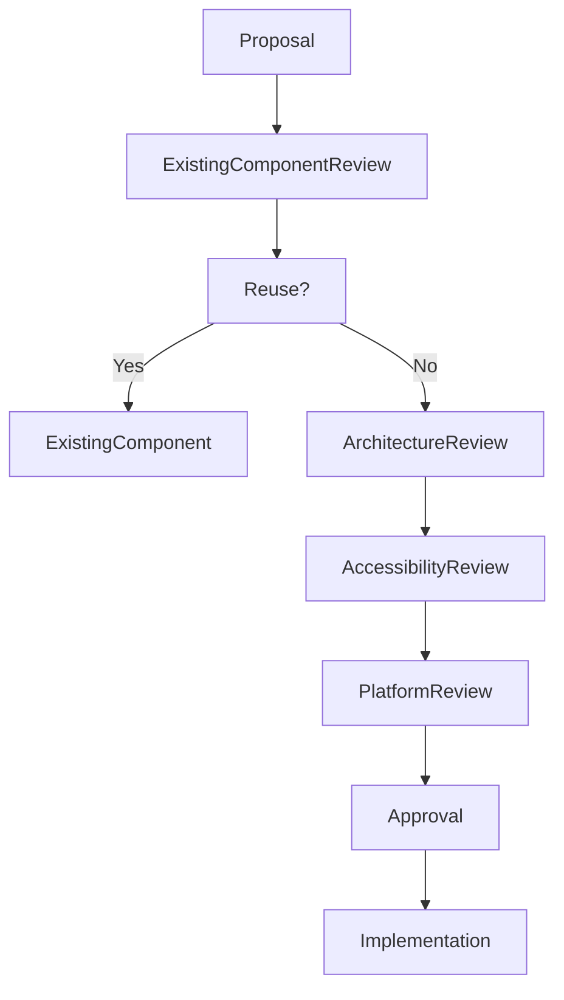

<!--
File: docs/design/system/mds-008-component-library/11-governance.md
Document: MDS-008
Chapter: 11
Title: Component Library Governance
Status: Draft
Version: 0.4
-->

# Component Library Governance

---

# Purpose

The Component Library is the final implementation layer of the Mosaic architecture.

Unlike runtime systems, Components are expected to evolve frequently as:

- UI frameworks mature,
- rendering technologies improve,
- platform capabilities expand.

Despite this implementation flexibility, the behavioural language of Mosaic must remain completely stable.

This chapter defines how the Component Library should evolve while preserving that separation.

---

# Governance Philosophy

Components should evolve continuously.

Behaviour should not.

The objective is not preserving widgets.

It is preserving the architectural guarantee that:

> **Components render decisions. They never make them.**

Every governance decision should reinforce this separation.

---

# Components Are Implementation

Components should always remain implementation artefacts.

Changing a Component should never require changes to:

- Behaviour
- Runtime World
- Composition
- Expressions
- Tiles

If upstream architecture changes because a Component changed...

The architectural boundary has been violated.

---

# Stable Responsibilities

The following concepts should remain highly stable.

- Component Philosophy
- Component Contracts
- Component Lifecycle
- Accessibility Contracts
- Platform-neutral rendering model

These concepts define the public implementation architecture of Mosaic.

---

# Evolvable Responsibilities

The following may evolve continuously.

- framework integrations
- rendering optimisations
- GPU techniques
- virtualisation
- memory management
- platform widgets
- graphics APIs

Implementation should improve.

Behaviour should remain identical.

---

# Component Ownership

Responsibilities are intentionally separated.

| Layer | Owner |
|--------|-------|
| Component Philosophy | Design Systems |
| Component Contracts | Runtime Architecture |
| Platform Components | Client Platform Teams |
| Rendering | Platform Rendering Teams |
| Performance Optimisation | Platform Runtime Teams |

Ownership protects architectural boundaries while allowing implementation teams to innovate independently.

---

# Introducing New Components

Before creating a new Component ask:

## Question One

Can an existing Component already render this Contract?

---

## Question Two

Is this a genuinely new implementation primitive...

or merely another visual variation?

---

## Question Three

Could Component Composition solve this instead?

---

## Question Four

Will this Component remain meaningful after the current UI framework becomes obsolete?

---

## Question Five

Would another contributor naturally discover this Component?

If uncertainty remains...

Refine the proposal before implementation.

---

# Component Drift

Component Drift occurs when:

- Components begin solving behaviour,
- framework-specific Components appear,
- Components reinterpret runtime Contracts,
- implementation begins influencing architecture,
- rendering logic leaks into runtime.

Component Drift weakens one of Mosaic's strongest architectural guarantees.

It should therefore be treated as architectural debt.

---

# Component Debt

Examples include:

- duplicate implementation primitives,
- stateful Components,
- framework-specific abstractions,
- behaviour hidden inside Components,
- undocumented rendering exceptions.

Component Debt should be reduced continuously.

Implementation should become simpler over time.

Not more complicated.

---

# Contract Governance

Component Contracts represent one of the strongest architectural boundaries within Mosaic.

Components should consume Contracts exactly as provided.

They should never:

- reinterpret,
- modify,
- extend,
- override

runtime Contracts independently.

---

# Platform Governance

Every platform should implement identical behavioural contracts.

Flutter.

↓

Same behaviour.

Web.

↓

Same behaviour.

SwiftUI.

↓

Same behaviour.

Compose.

↓

Same behaviour.

Rendering quality may differ.

Behavioural meaning must not.

---

# Accessibility Governance

Accessibility always possesses higher authority than rendering quality.

No Component proposal should weaken:

- accessibility,
- readability,
- interaction,
- semantic correctness.

Accessibility should remain entirely contract driven.

---

# Performance Governance

Performance optimisation should never alter:

- runtime hierarchy,
- Materials,
- Typography,
- Motion,
- interaction,
- behavioural sequencing.

Optimisation improves implementation only.

---

# Module Governance

Modules must never provide:

- Components,
- rendering,
- framework integrations,
- platform widgets.

Modules contribute:

- behaviour,
- Expressions,
- information.

The platform owns implementation.

This guarantees one coherent rendering language across the ecosystem.

---

# Review Questions

Every Component proposal should answer:

- Does this render an existing Contract?
- Does it remain behaviourally passive?
- Could an existing Component already perform this work?
- Would this remain useful after a framework migration?
- Does it preserve platform independence?
- Is this solving implementation rather than architecture?

If the proposal exists primarily because a framework encourages it...

It should be reconsidered.

Frameworks are temporary.

Architecture is not.

---

# Validation

Future tooling should automatically validate:

- Component Contract compliance
- platform parity
- accessibility correctness
- rendering determinism
- Component reuse
- absence of behavioural logic

Validation should reinforce architectural review.

It should never replace thoughtful implementation design.

---

# Governance Workflow

Reuse should remain the preferred outcome.

The implementation vocabulary should remain intentionally small.

---

# Success Criteria

The Component Library succeeds when:

- Components remain behaviourally passive,
- runtime Contracts remain authoritative,
- rendering frameworks remain replaceable,
- contributors naturally think in Tiles rather than Components,
- accessibility remains automatic,
- platform implementations remain behaviourally identical.

Users should never perceive Components.

They should simply experience a platform that behaves consistently everywhere.

---

# Architectural Decisions

| ADR | Decision |
|------|----------|
| ADR-177 | Components are implementation artefacts rather than behavioural objects. |
| ADR-178 | Component Contracts are immutable runtime boundaries. |
| ADR-179 | Platform implementations never redefine runtime behaviour. |
| ADR-180 | Accessibility is contract-driven rather than component-driven. |
| ADR-181 | Modules never implement Components directly. |
