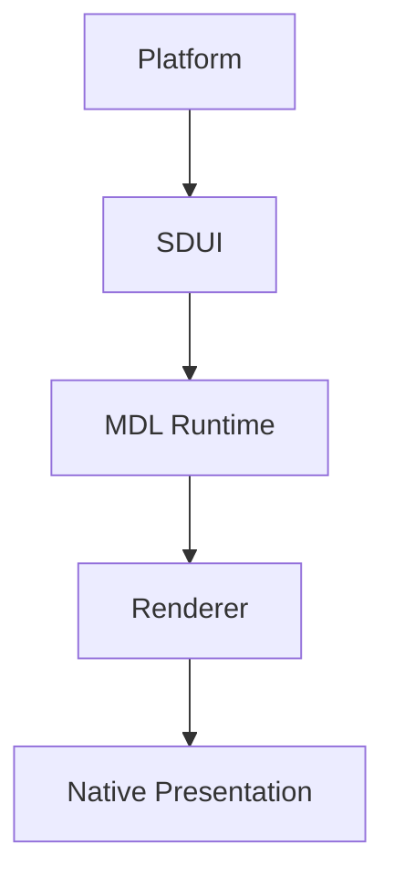
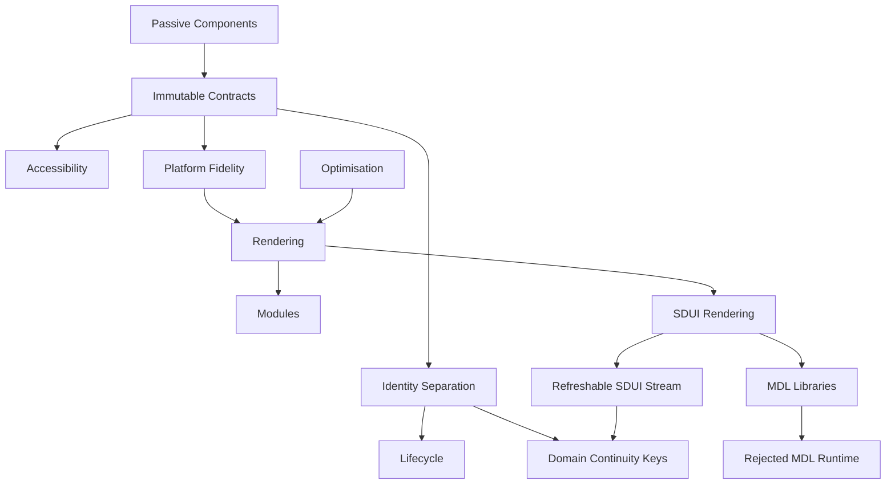

<!--
File: docs/design/system/mds-008-component-library/12-adrs.md
Document: MDS-008
Chapter: 12
Title: Architectural Decision Records
Status: Draft
Version: 0.4
-->

# Architectural Decision Records

---

# Purpose

The Architectural Decision Records (ADRs) contained within MDS-008 preserve the architectural reasoning behind the Mosaic Component Library.

Every previous specification established:

- Behaviour
- Runtime World
- Composition
- Expressions
- Tiles

MDS-008 establishes how those concepts become concrete platform implementations.

These ADRs explain why Mosaic deliberately treats Components as implementation artefacts rather than behavioural objects.

Future contributors should understand these decisions before modifying the Component Library.

---

# Decision Format

Decision format, lifecycle and review expectations are governed by **[MDG-001 — Documentation Authority Guide](../../../engineering/documentation/mdg-001-documentation-authority-guide/index.md)**.

This chapter records decisions specific to this specification and avoids redefining the shared ADR process.

# ADR-182

## Title

Components Render Rather Than Reason

### Status

Accepted

### Context

Traditional UI frameworks frequently allow Components to own behaviour and application state.

Founder workshops consistently reinforced that behaviour should remain external to implementation.

### Decision

Components become passive renderers of resolved runtime Contracts.

### Consequences

Behaviour remains framework independent while rendering technologies become replaceable.

---

# ADR-183

## Title

Introduce Immutable Component Contracts

### Status

Accepted

### Context

Allowing Components to reinterpret runtime information fragments behavioural consistency.

### Decision

Every Component consumes immutable runtime Contracts.

Components never modify them.

### Consequences

Presentation becomes deterministic across every Mosaic client.

---

# ADR-184

## Title

Separate Component Identity From Tile Identity

### Status

Accepted

### Context

Behavioural presentation and rendering implementation evolve at different rates.

### Decision

Tiles preserve behavioural identity.

Components preserve implementation identity.

### Consequences

Rendering frameworks may evolve independently from runtime architecture.

---

# ADR-185

## Title

Accessibility Is Resolved Before Rendering

### Status

Accepted

### Context

Platform-specific accessibility implementations frequently become inconsistent.

### Decision

Accessibility becomes part of Component Contracts rather than Component logic.

### Consequences

Every platform receives identical behavioural accessibility semantics.

---

# ADR-186

## Title

Platform Components Never Redefine Behaviour

### Status

Accepted

### Context

Different UI frameworks naturally encourage different implementation patterns.

### Decision

Platform Components faithfully implement runtime Contracts without reinterpretation.

### Consequences

Flutter, Web, SwiftUI and Compose all communicate identical behavioural understanding.

---

# ADR-187

## Title

Optimisation Must Preserve Behaviour

### Status

Accepted

### Context

Rendering optimisations frequently simplify runtime behaviour for performance.

### Decision

Performance improvements must preserve behavioural correctness completely.

### Consequences

Optimisation becomes transparent to users.

---

# ADR-188

## Title

Component Lifecycle Is Independent From Tile Lifecycle

### Status

Accepted

### Context

Behavioural continuity should survive implementation changes.

### Decision

Components may be recreated, pooled or virtualised independently from behavioural Tiles.

### Consequences

Rendering flexibility increases without weakening user understanding.

---

# ADR-189

## Title

Rendering Is The Final Architectural Layer

### Status

Accepted

### Context

Many frameworks blur the distinction between runtime architecture and rendering.

### Decision

Rendering becomes the final implementation stage only.

### Consequences

Every upstream architectural layer remains independent from graphics technology.

---

# ADR-190

## Title

Modules Never Implement Components

### Status

Accepted

### Context

Module-owned rendering fragments presentation quality and behavioural consistency.

### Decision

Modules contribute runtime behaviour only.

The platform owns Components completely.

### Consequences

Community modules automatically inherit future rendering improvements.

---

# ADR-191

## Title

Clients Render SDUI; Recovery Uses The Richest Available Renderer

### Status

Accepted

### Context

Mosaic supports multiple presentation clients.

The Platform emits Runtime SDUI for normal Mosaic presentation.

The Supervisor emits Recovery SDUI for onboarding, diagnostics and recovery states that must remain available when the Platform is unavailable.

If recovery presentation depends on one full client implementation, Mosaic can lose its diagnostic interface during exactly the failures that need diagnosis.

### Decision

Clients are responsible for rendering SDUI into native presentation.

Runtime SDUI and Recovery SDUI are separate contracts.

Runtime SDUI is produced by the Platform.

Recovery SDUI is produced by the Supervisor.

Recovery presentation should use the richest available renderer.

Preferred order:

1. Shell or native client renderer
2. Embedded Web Recovery Renderer
3. No UI only during catastrophic Supervisor failure

The Supervisor never emits normal HTML presentation.

The embedded Web Recovery Renderer is permitted only as a bootstrap and Shell-failure fallback.

Onboarding uses Recovery SDUI rather than Runtime SDUI because it can occur before the Platform exists.

During normal installation, the Supervisor bootstraps the Shell proactively and the Shell renders Recovery SDUI for onboarding and build progress.

The embedded Web Recovery Renderer appears only if the browser arrives before the Shell is available or the Shell cannot run, and yields automatically when the Shell becomes available.

Client renderers present recovery state but do not supervise or recover the Supervisor.

### Consequences

Normal presentation remains client-owned and replaceable.

Recovery remains available even when the Platform has not been built, is failed or is being replaced.

Native clients can provide native recovery interfaces without depending on Web implementation details.

The embedded web fallback must remain deliberately small, self-contained and independent from the normal Shell build.

---

# ADR-192

## Title

MDL Is Implemented As Platform-Specific Libraries

### Status

Accepted

### Context

Mosaic separates business intent, design language and rendering.

The Platform emits semantic UI.

Clients render that semantic UI.

One option was to make the Mosaic Design Language a runtime presentation service between Platform and clients.

That would introduce another runtime layer and make presentation depend on a central service.

### Decision

MDL will be implemented as platform-specific libraries rather than as a runtime presentation service.

Examples include:

- `mdl-web`
- `mdl-flutter`
- future `mdl-windows`
- future `mdl-macos`
- future `mdl-linux`
- future `mdl-android-tv`
- future `mdl-apple-tv`
- future `mdl-tv`

Each client renderer links against its platform's MDL implementation.

MDL owns presentation behaviour.

Renderers own native implementation.

The Platform owns semantic intent.

### Consequences

Clients remain platform idiomatic.

The Web renderer is not the reference implementation.

Every renderer is first class.

Platform-independent MDL algorithms should remain equivalent across implementations.

Rendering code may differ by platform as long as MDL semantics remain intact.

Mosaic avoids a runtime presentation service while preserving one shared design language.

---

# ADR-193

## Title

MDL Runtime As Presentation Service

### Status

Rejected

### Context

An earlier presentation architecture placed an MDL Runtime between SDUI and client renderers.

Conceptually.

The MDL Runtime would have enriched SDUI with presentation information before rendering.

This made MDL behave like another backend service and tied presentation decisions into the runtime path.

### Decision

Mosaic rejects an MDL Runtime service.

MDL is a client-side design-language implementation linked into each renderer.

MDL does not modify Runtime SDUI or Recovery SDUI.

Renderers combine semantic structure from SDUI with design rules from MDL and map the result to native graphics APIs.

### Consequences

The Platform remains the only runtime authority for normal Mosaic behaviour.

The Supervisor remains the recovery authority.

Presentation remains client-owned.

MDL can still provide shared specifications, design definitions and platform-independent algorithms.

Rendering implementations remain native and platform-specific.

Mosaic avoids an unnecessary runtime layer while preserving a single design language.

Flutter is one likely native-client implementation, not a required architectural dependency.

---

# ADR-194

## Title

Deliver Runtime SDUI Through Refreshable Snapshots And A Continuous Patch Stream

### Status

Accepted

### Context

Documentation and other compiled experiences require independently loadable routes and cacheable content.

Dashboards and normal Mosaic interaction also require live values, structural updates and navigation without full-page refreshes that break perceptual continuity.

Making HTML fragments canonical would bind SDUI to Web and prevent native clients from using the same contract.

### Decision

Mosaic uses one semantic SDUI model through Refreshable Compiled SDUI, an SDUI Patch Stream and Live State Bindings.

Each compiled bundle is immutable and versioned, while the active site may refresh by atomically adopting a newer bundle.

Connected clients should receive ordered semantic transactions through a persistent full-duplex connection such as WebSocket.

Transactions update semantic nodes rather than transporting canonical HTML fragments or presentation values.

Stable semantic and Tile identities provide continuity across structural changes.

The client validates and stages each transaction, resolves the pending Composition, transitions shared identities and commits atomically.

Routes remain directly loadable and Web history remains functional without making document reload the normal navigation path.

### Consequences

Static and authored experiences can refresh content without requiring a permanently generated page response.

Dashboards can update live values without replacing their semantic definition.

Navigation appears as continuous Composition movement rather than page teleportation.

Web and native clients remain equivalent because HTML-fragment tooling is an adapter, not the SDUI contract.

The exact wire encoding, authentication, transport negotiation, resource limits and backpressure policy remain future protocol work.

---

# ADR-199

## Title

Carry Stable Domain Continuity Keys Through Runtime SDUI

### Status

Accepted

### Context

Atomic SDUI updates can preserve perceptual continuity only when the client can determine which objects in the previous and pending semantic trees represent the same domain entity.

Component instances, render-tree nodes and transaction identities are implementation details with lifetimes that do not reliably match domain identity.

Allowing SDUI to prescribe final geometry or animation values would transfer Composition and Motion ownership from the client to the server.

### Decision

Semantic objects that may persist across snapshots, patches or route changes carry a stable Continuity Key representing domain identity.

The SDUI Driver preserves the key across repositioning, resizing, reparenting, permanent Composition-plane movement and component replacement while the domain entity remains the same.

The client compares previous and pending semantic trees by Continuity Key, classifies the transition and resolves Composition and Motion locally.

SDUI does not supply final coordinates, plane assignments, Behavioural Cost, curves, durations or spring values.

Keys must not be reused across unrelated domain entities to manufacture transitions.

### Consequences

Refreshable snapshots and streamed transactions can produce the same identity-preserving behaviour.

Web and native renderers can replace component implementations without breaking perceptual continuity.

The exact key encoding, namespace governance, lifetime and collision policy remain future integration-protocol work.

---

# ADR Relationships

Together these decisions establish the Component Library as a thin implementation layer that faithfully renders the runtime architecture without altering it.

---

# Future ADRs

Future Component Library ADRs are expected to formalise:

- GPU-driven Component Rendering
- Spatial UI Components
- Adaptive Rendering Pipelines
- AI-assisted Rendering Optimisation
- Hardware Capability Profiles
- Runtime Rendering Personas

These intentionally remain outside the current scope of MDS-008.

---

# ADR Governance

Component Library ADRs should change only when:

- rendering architecture fundamentally evolves,
- accessibility standards require refinement,
- platform implementation strategies change,
- the Mosaic Design Language itself evolves.

Framework trends alone should never justify architectural changes.

Components should remain behaviourally passive regardless of future implementation technology.

---

# Summary

The ADRs contained within MDS-008 define the implementation identity of Mosaic.

Behaviour belongs to the Runtime World.

Presentation belongs to Tiles.

Implementation belongs to Components.

Rendering belongs to platforms.

Maintaining these boundaries allows Mosaic to continuously adopt new UI technologies without ever compromising its behavioural architecture.
