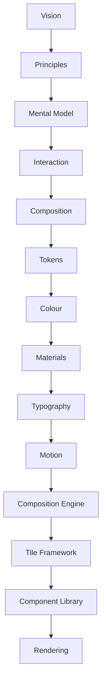
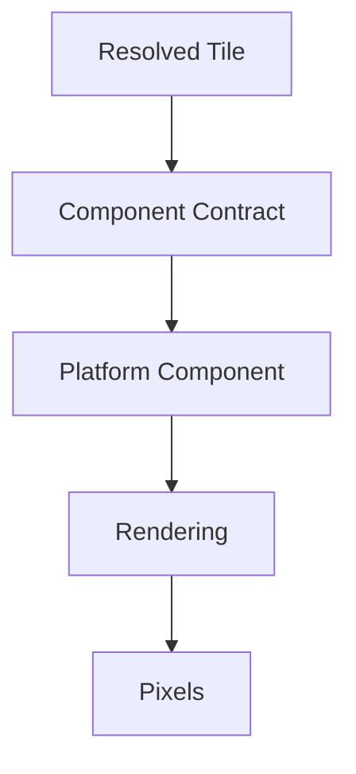

<!--
File: docs/design/system/mds-008-component-library/index.md
Document: MDS-008
Status: Draft
Version: 0.4
-->

# MDS-008 — Component Library

> *Components do not decide. They faithfully render the decisions already made.*

---

# Purpose

Every previous specification has progressively transformed behavioural understanding into presentation.

The MDL established:

- Vision
- Principles
- Mental Model
- Interaction
- Composition

The MDS established:

- Design Tokens
- Colour
- Materials
- Typography
- Motion
- Composition Engine
- Tile Framework

MDS-008 defines the final architectural layer.

The Component Library is responsible for physically implementing the behavioural presentation described by resolved Tiles.

Unlike traditional UI frameworks, Components possess almost no behavioural responsibility.

By the time a Component is created:

- Behaviour has been solved.
- Hierarchy has been solved.
- Materials have been solved.
- Typography has been solved.
- Motion has been solved.
- Interaction has been solved.
- Tiles have been solved.

Components simply render.

---

# Relationship to Previous Specifications



The Component Library consumes:

- Resolved Tiles
- Material Profiles
- Typography Profiles
- Motion Profiles
- Interaction Profiles

It produces:

- Platform Components
- Render Trees
- Accessible UI
- Client-specific renderers

---

# Scope

This specification defines:

- Component Philosophy
- Component Taxonomy
- Component Contracts
- Component Lifecycle
- Component Composition
- Rendering Architecture
- Client Renderers
- Runtime SDUI
- Refreshable Compiled SDUI
- SDUI Patch Stream
- Recovery SDUI
- Platform Components
- Accessibility Contracts
- Runtime Rendering
- Component Optimisation

This specification intentionally does **not** define:

- Behaviour
- Hierarchy
- Runtime World
- Expressions
- Tiles
- Design Tokens

Those systems already solved the problem.

The Component Library simply implements their decisions.

---

# Guiding Question

MDS-008 exists to answer one question.

> **How should resolved Tiles become concrete user interface implementations?**

Not:

> How should the application behave?

For recovery and onboarding states, this specification also defines how clients render the deliberately smaller Recovery SDUI vocabulary emitted by the Supervisor.

---

# Component Statement

Within Mosaic:

> **Components render. They never reason.**

This is the single most important architectural principle of the Component Library.

---

# Component Responsibilities

The Component Library separates implementation into several conceptual layers.



Each layer contributes exactly one responsibility.

---

# Expected Outcome

After reading MDS-008 contributors should understand:

- why Components intentionally remain simple,
- how Component Contracts work,
- how Components remain platform independent,
- how rendering stays replaceable,
- how accessibility integrates,
- how runtime presentation becomes visible,
- how Recovery SDUI becomes safe diagnostic presentation,

without redefining behaviour or runtime architecture.

---

# Repository Structure

```text
design/

└── mds/

    └── MDS-008 Component Library/

        README.md

        00-document-control.md

        01-component-philosophy.md

        02-component-taxonomy.md

        03-component-contracts.md

        04-component-lifecycle.md

        05-component-composition.md

        06-rendering-architecture.md

        07-platform-components.md

        08-accessibility-contracts.md

        09-runtime-rendering.md

        10-component-optimisation.md

        11-governance.md

        12-adrs.md

        13-contributor-guidance.md

        references.md

        glossary.md
```

---

# Dependencies

Required reading:

- [MDL-001](../../language/mdl-001-vision/index.md) → [MDL-005](../../language/mdl-005-composition-model/index.md)
- [MDS-001](../mds-001-design-token-architecture/index.md) → [MDS-007](../mds-007-tile-framework/index.md)

Downstream specifications:

There are currently no downstream Design System specifications.

Platform implementation guides may build upon this specification.
