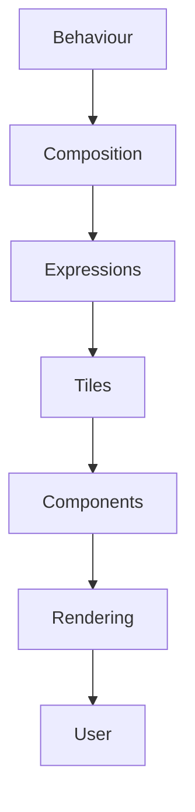
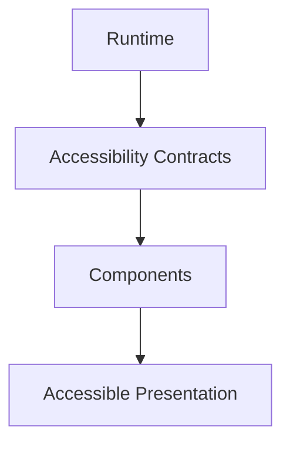
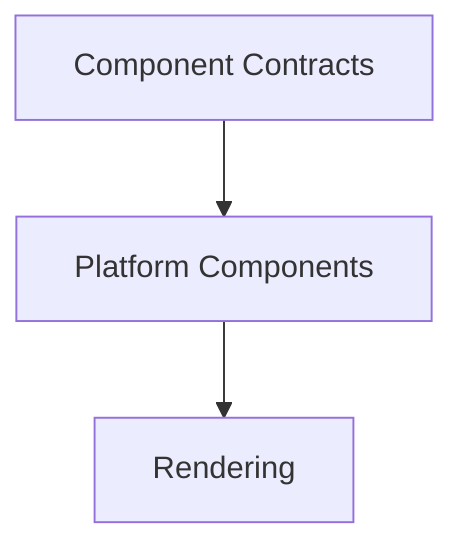
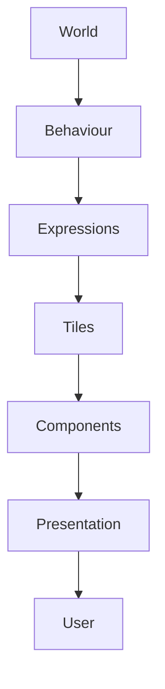

<!--
File: docs/design/system/mds-008-component-library/references.md
Document: MDS-008
Title: References
Status: Draft
Version: 0.4
-->

# References

---

# Purpose

This document records the architectural influences and conceptual foundations that informed **MDS-008 — Component Library**.

Unlike implementation documentation, these references explain *why* the Component Library exists rather than documenting specific frameworks or rendering APIs.

The Component Library intentionally combines ideas from:

- behavioural architecture,
- declarative rendering,
- runtime contracts,
- accessibility,
- platform abstraction,
- deterministic execution,

into one implementation layer that remains deliberately thin.

Every architectural decision before this specification already determined behaviour.

The Component Library simply makes those decisions visible.

---

# Reading Order

Contributors should approach references in the following order.

1. MDL Specifications
2. Design Token Architecture
3. Colour System
4. Material System
5. Typography System
6. Motion System
7. Component Library
8. Platform Implementations

The Mosaic Design Language remains the architectural authority.

Rendering technologies merely implement it.

---

# Internal References

## [MDL-001 — Mosaic Design Language Vision](../../language/mdl-001-vision/index.md)

Provides:

- Companion philosophy
- Entertainment-first thinking
- Calm interaction

Components should remain invisible beneath the Companion.

Users should remember the experience.

Never the implementation.

---

## [MDL-002 — Principles](../../language/mdl-002-principles/index.md)

Provides:

- Behaviour Before Interface
- Content Leads
- Calm Interfaces
- Every Feature Earns Its Place

Components exist only because behaviour has already been solved.

Implementation should never redefine those principles.

---

## [MDL-003 — Mental Model](../../language/mdl-003-mental-model/index.md)

Provides:

- World
- Focus
- Context
- Relationships

Components never reason about the World.

They simply render it.

---

## [MDL-004 — Interaction Model](../../language/mdl-004-interaction-model/index.md)

Provides:

- Behaviour
- Continuity
- Runtime evolution

Components execute interaction.

They never determine interaction.

---

## [MDL-005 — Composition Model](../../language/mdl-005-composition-model/index.md)

Provides:

- Hero
- Hierarchy
- Priority
- Expressions

Component trees should always reflect solved Composition rather than invent their own hierarchy.

---

## [MDS-001 — Design Token Architecture](../mds-001-design-token-architecture/index.md)

Provides:

- Resolved Tokens
- Resolution
- Semantic contracts

Component Contracts continue the runtime resolution architecture established by [MDS-001](../mds-001-design-token-architecture/index.md).

---

## [MDS-002 — Colour System](../mds-002-colour-system/index.md)

Provides:

- Runtime Atmosphere
- Material colour
- Semantic colour

Components consume resolved colour behaviour.

They never determine colour independently.

---

## [MDS-003 — Material System](../mds-003-material-system/index.md)

Provides:

- Hero Material
- Acrylic
- Runtime Material Resolution

Components implement Materials.

They never reinterpret them.

---

## [MDS-004 — Typography System](../mds-004-typography-system/index.md)

Provides:

- Editorial Hierarchy
- Typography Resolution
- Accessibility

Text Components consume resolved Typography Profiles.

Editorial decisions always remain upstream.

---

## [MDS-005 — Motion System](../mds-005-motion-system/index.md)

Provides:

- Behavioural Motion
- Motion Resolution
- Accessibility Motion

Components execute Motion Profiles.

Behavioural sequencing remains runtime owned.

---

## [MDP-001 — Adaptive Composition Runtime](../../../engineering/architecture/mdp-001-adaptive-composition-runtime/index.md)

Preserves a deferred proposal for:

- Runtime World
- Expressions
- Runtime Hierarchy
- Presentation Models

MDS-008 does not depend on this proposal for v1 conformance. A future adaptive runtime may supply resolved presentation to the same component contracts.

---

## [MDP-001 — Adaptive Composition Runtime](../../../engineering/architecture/mdp-001-adaptive-composition-runtime/14-adaptive-tile-model.md)

Preserves proposed post-v1 research for:

- Tile Philosophy
- semantic Tile resolution
- Tile Contracts

Mosaic v1 Tiles are structural components owned by MDS-008. The linked adaptive Tile model is non-authoritative and does not define the v1 component contract.

---

# Architectural Principle

The Component Library intentionally concludes the architectural pipeline.

Conceptually.

Everything upstream determines meaning.

Everything downstream implements meaning.

---

# Declarative Rendering

The Component Library is heavily influenced by declarative rendering.

Components describe:

> **What should be rendered.**

Never:

> **What should happen.**

This distinction significantly simplifies long-term maintenance.

---

# Deterministic Systems

The Component Library assumes deterministic rendering.

Identical:

- Component Contracts,
- runtime profiles,
- accessibility,

should always produce equivalent presentation.

This assumption enables:

- replay,
- testing,
- visual regression,
- platform parity.

---

# Accessibility

Accessibility is treated as an architectural requirement rather than a platform feature.

The Component Library assumes:

Accessibility therefore remains behaviourally identical across every supported client.

---

# Platform Independence

The Component Library intentionally separates:

Future rendering technologies should require only:

- new platform Components,
- new rendering adapters.

Behavioural architecture remains unchanged.

---

# Rendering Technologies

Rendering technologies are intentionally excluded from architectural decision-making.

Examples include:

- Flutter Impeller
- Skia
- Metal
- Vulkan
- WebGPU
- DirectX
- HTML Canvas

These technologies implement Components.

They never define Components.

---

# Performance

Performance improvements should remain implementation concerns.

Examples include:

- virtualisation,
- batching,
- layer caching,
- shader optimisation,
- recomposition reduction.

Optimisation should never modify:

- hierarchy,
- Materials,
- Typography,
- Motion,
- interaction,
- accessibility.

Behaviour remains the architectural authority.

---

# Mosaic-Specific Influences

The Component Library emerged directly from founder exploration.

Major architectural discoveries included:

- Components should become almost behaviourless.
- Runtime Contracts should eliminate component decision-making.
- Tiles provide the correct abstraction between behaviour and implementation.
- Rendering should become entirely replaceable.
- Accessibility should be resolved before Components exist.

Together these discoveries complete the architectural separation that defines Mosaic.

---

# Relationship To The Companion

Components represent the visible body of the Companion.

Conceptually.

The Companion understands first.

Components merely give that understanding physical form.

This ordering should remain fundamental throughout the lifetime of Mosaic.

---

# Normative References

Required reading before contributing to MDS-008.

- [MDL-001 — Mosaic Design Language Vision](../../language/mdl-001-vision/index.md)
- [MDL-002 — Principles](../../language/mdl-002-principles/index.md)
- [MDL-003 — Mental Model](../../language/mdl-003-mental-model/index.md)
- [MDL-004 — Interaction Model](../../language/mdl-004-interaction-model/index.md)
- [MDL-005 — Composition Model](../../language/mdl-005-composition-model/index.md)
- [MDS-001 — Design Token Architecture](../mds-001-design-token-architecture/index.md)
- [MDS-002 — Colour System](../mds-002-colour-system/index.md)
- [MDS-003 — Material System](../mds-003-material-system/index.md)
- [MDS-004 — Typography System](../mds-004-typography-system/index.md)
- [MDS-005 — Motion System](../mds-005-motion-system/index.md)
- [MDP-001 — Adaptive Composition Runtime](../../../engineering/architecture/mdp-001-adaptive-composition-runtime/index.md)
- [MDP-001 — Adaptive Composition Runtime](../../../engineering/architecture/mdp-001-adaptive-composition-runtime/14-adaptive-tile-model.md)

Together these specifications define the complete architectural foundation of the Component Library.

---

# Informative References

Future implementation guides may define:

- Flutter implementation standards
- Web implementation standards
- SwiftUI implementation standards
- Compose implementation standards
- Rendering optimisation guides
- Platform accessibility guides

These documents should consume the Component Library.

They should never redefine it.

---

# Living Document

This reference list should remain intentionally concise.

References should only be introduced when they materially influence:

- implementation architecture,
- rendering,
- accessibility,
- runtime contracts,
- platform independence.

The objective is to preserve architectural reasoning rather than catalogue framework documentation.

---

# Completion

This concludes **MDS-008 — Component Library**.

It also completes the **Mosaic Design System (MDS)**.

Together, the MDL and MDS define a complete architecture spanning:

- **Vision**
- **Principles**
- **Mental Models**
- **Interaction**
- **Composition**
- **Design Tokens**
- **Colour**
- **Materials**
- **Typography**
- **Motion**
- **Runtime Composition**
- **Presentation**
- **Implementation**

From this point onwards, future documentation should transition from design architecture into product and engineering specifications, such as:

- Mosaic Runtime Architecture
- Module SDK
- Storage Architecture
- Media Pipeline
- Networking
- Module Runtime
- API Specifications
- Client Implementation Guides

At this stage, the behavioural language of Mosaic is fully defined.

Everything that follows is engineering.
