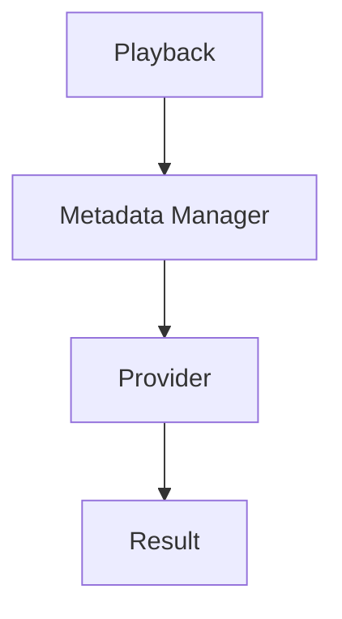
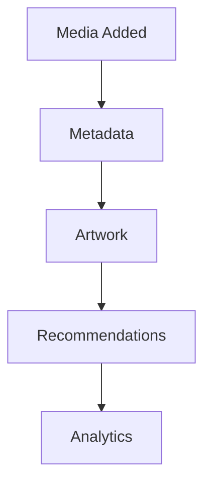

<!--
File: docs/engineering/architecture/mac-001-platform-architecture/06-contract-and-communication-model.md
Document: MAC-001
Status: Draft
Version: 0.4
-->

# 06 — Contract And Communication Model

---

# Purpose

The Platform owns the stable contracts that allow independently developed capabilities to cooperate.

It does not own every implementation of those contracts.

Modules implement Platform contracts.

The Platform coordinates their execution.

---

# Platform As Ports

The Platform defines capability ports.

Examples include:

- Metadata Provider
- Media Provider
- Artwork Provider
- Search Provider
- Authentication Provider
- Notification Provider

The Platform defines the contract.

Modules implement the contract.

The SDK publishes the public contract surface that Modules use.

---

# Communication Models

The Platform supports three communication styles.

## Capability Calls

Capability calls are synchronous.

They answer:

> **I need something.**

Example.

Capability calls should flow through Platform-owned managers rather than direct Module-to-Module dependencies.

## Event Bus

Event Bus communication is asynchronous.

It announces:

> **Something happened.**

Example.

The publisher should not know who is listening.

## GraphQL

GraphQL is the external communication surface for clients.

Clients communicate with the Platform.

Modules may contribute GraphQL schemas.

The Platform assembles the final API.

---

# Event Ownership

The Platform owns:

- Event Envelope
- Event Bus
- event transport rules
- event routing behaviour

The Platform does not own every domain event.

Modules may publish domain events such as:

- `anime.episode.released`
- `playback.started`
- `jellyfin.library.synced`

The Platform routes events.

Modules own domain meaning.

---

# Runtime SDUI

The Platform emits Runtime SDUI for normal Mosaic presentation.

Runtime SDUI is semantic UI.

Examples include:

- Media Grid
- Sidebar
- Button
- Settings Page
- Media Card

The Platform does not know:

- CSS
- Flutter
- HTML
- refraction effects
- colours
- client rendering technology

Client renderers consume Runtime SDUI and apply Mosaic presentation locally.

Runtime SDUI may reach a client as a Refreshable Compiled SDUI snapshot, ordered semantic transactions or Live State Binding updates.

The Platform remains the semantic contract owner regardless of whether a snapshot was produced during a build or an active session.

Connected presentation should evolve through semantic transactions rather than require full-page replacement for ordinary navigation or content updates.

[MDS-008](../../../design/system/mds-008-component-library/index.md) defines rendering responsibilities for client presentation.

---

# Contract Rule

> **The Platform owns contracts, not feature implementations.**

This preserves Platform stability while allowing Modules to add, replace and evolve Mosaic functionality independently.
