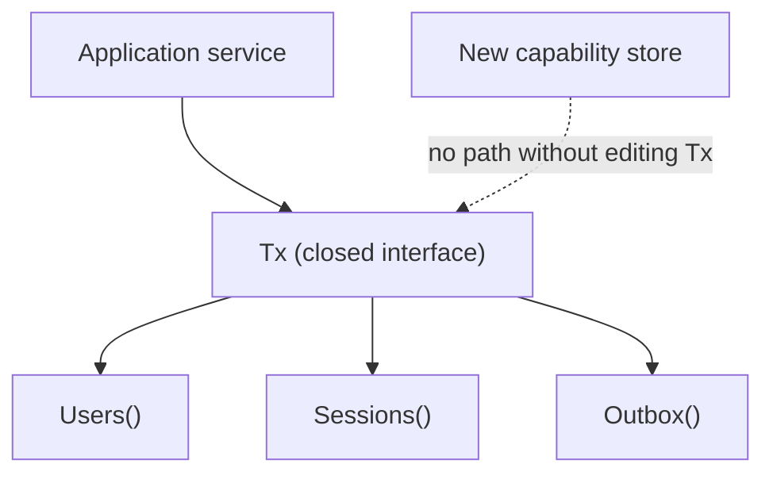

<!--
File: docs/engineering/architecture/mad-001-transactional-store-extensibility/01-context.md
Document: MAD-001
Status: Draft
Version: 0.1
-->

# 01 — Context

---

# Where It Surfaced

The contradiction was found while building the Reference capability path — slice 13 of the [MEG-015 build sequence](../../guides/meg-015-platform-foundation-implementation/12-build-sequence.md). That slice must prove a non-media capability can register and persist through Platform contracts without importing private Platform internals.

---

# The Closed Transaction Contract

[MEG-015 §03](../../guides/meg-015-platform-foundation-implementation/03-platform-contracts.md) originally defined the transaction boundary as a closed interface enumerating Core Platform stores:

- `Users()`, `Sessions()`, `Credentials()`, `Permissions()`, `Config()`, `Outbox()`.

[MEG-015 §04](../../guides/meg-015-platform-foundation-implementation/04-application-boundaries.md) makes this the single atomic write path: an application service opens a `UnitOfWork`, resolves stores from the transaction and appends outbox events, all in one transaction. There is no other way to commit a store change atomically with events.

The only way to obtain a transaction-scoped store was therefore a compile-time method on this closed interface.

---

# The Contradiction

A capability that owns durable state it must commit atomically with the outbox had no way to join the transaction without Core Platform's `Tx` interface being edited on its behalf. That collides with three accepted positions:

- **[MEG-006 §13](../../guides/meg-006-module-platform/13-platform-guidelines.md)** — "The Runtime should require no modification to support [capabilities]"; "Do not hide a new architectural capability inside a Module-specific contract."
- **[MAC-001 §01](../mac-001-platform-architecture/index.md) and [§03](../mac-001-platform-architecture/03-capability-model.md)** — built-in and Module-delivered capabilities are architectural equals.
- **[MIP-005](../../protocols/mip-005-module-adapter-contract-protocol/index.md)** — "'Built-in' controls admission and distribution; it does not create a private architectural path."

A closed `Tx` gives Core Platform stores a first-class typed accessor while denying any other store the same participation without editing core. That is precisely a private architectural path.

The contradiction is also internal to [MEG-015](../../guides/meg-015-platform-foundation-implementation/index.md): [§02](../../guides/meg-015-platform-foundation-implementation/02-repository-layout.md) already calls PostgreSQL "a built-in module … discovered the same way as external modules," yet §03 privileged the stores that module fulfils with named accessors no other store could obtain.

---

# What The Contradiction Is Not

Editing a Platform contract is not forbidden in itself. Both [MAC-001 §03](../mac-001-platform-architecture/03-capability-model.md) and [MEG-006 §13](../../guides/meg-006-module-platform/13-platform-guidelines.md) accept that "a genuinely new capability may require Platform and SDK evolution."

The defect is narrower and load-bearing: the closed list forced a **Core Platform transaction-plumbing edit for ordinary storage participation** — not for a deliberated new capability contract — and structurally denied other stores the equality the canon promises. That is the drift named by [MAC-001 §05](../mac-001-platform-architecture/05-architecture-principles.md), "Ownership Before Convenience."
