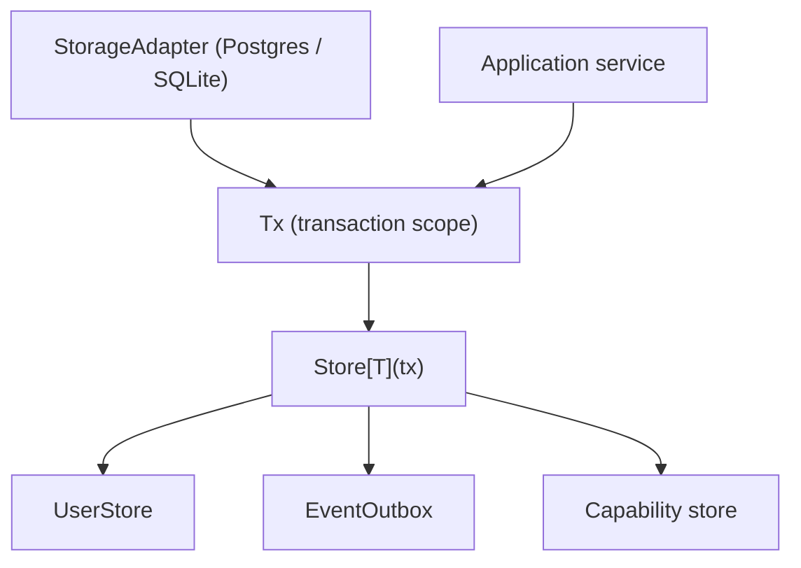

<!--
File: docs/engineering/architecture/mad-001-transactional-store-extensibility/02-decision.md
Document: MAD-001
Status: Draft
Version: 0.1
-->

# 02 — Decision

---

# Decision

The transaction scope exposes no fixed list of stores. Every store — Core Platform or capability — is resolved the same way, so nothing is privileged by being named on the transaction handle and adding a store never edits it.

Three parts:

1. **Uniform store resolution.** `Tx` becomes an opaque transaction scope. Stores are obtained through a typed accessor bound to that scope rather than through named methods. A command that would have called `tx.Users()` obtains the same contract with `Store[UserStore](tx)`, and the outbox with `Store[EventOutbox](tx)` — fully typed, no assertion.

2. **Storage is a port.** A `StorageAdapter` provides the `UnitOfWork` and binds each resolved store to the live transaction, so the built-in PostgreSQL adapter can be replaced — for example by SQLite — without changing a call site.

3. **The SDK exposes storage for use, not modification.** Capabilities persist through Platform-owned storage contracts; they do not define their own tables, modify Core Platform schema or open parallel databases, per [MIP-005](../../protocols/mip-005-module-adapter-contract-protocol/index.md).

---

# Why This Direction

The direction was chosen from a stakeholder principle rather than by decorating the closed interface: because Modules are ordinary Go libraries statically linked into the Platform binary, the Platform sees Module code as its own at compile time. There is no runtime boundary between Platform and Module storage to bridge, so any mechanism that makes a store *ask permission* to join the transaction is ceremony over a boundary that does not exist.

If storage is a port and the SDK exposes ports, then obtaining a store — core or capability — should go through one uniform, transaction-scoped resolution. The closed accessor list was the only thing standing in the way.

---

# Scope Of The Decision

Uniform resolution exists so that Core Platform bounded contexts and first-party capabilities participate in a transaction identically — **not** so that external Modules can inject storage. External Modules do not own schema. The Platform owns a deliberately content-agnostic object model, so a new content capability maps onto existing storage rather than extending it. This preserves capability equality without granting any store a private path into the transaction boundary.

---

# Status

Accepted. The decision is carried by [MEG-015 §03](../../guides/meg-015-platform-foundation-implementation/03-platform-contracts.md); this record is its rationale. It also unblocked slice 13, recorded in the [MEG-015 build sequence](../../guides/meg-015-platform-foundation-implementation/12-build-sequence.md).
