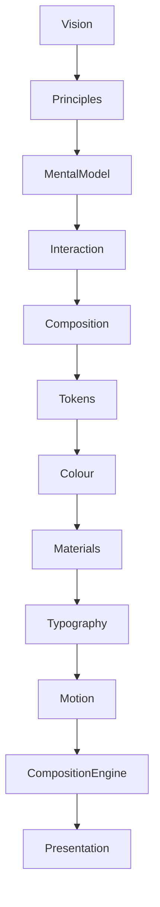
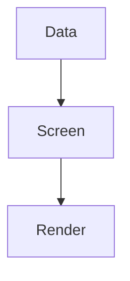
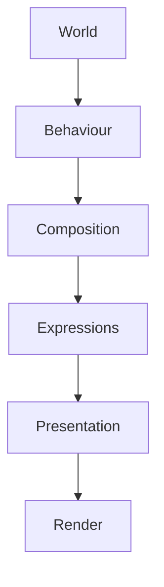

<!--
File: docs/engineering/architecture/mdp-001-adaptive-composition-runtime/00-document-control.md
Document: MDP-001
Status: Deferred
-->

# Document Control

> **Proposal status:** Deferred and non-authoritative. This chapter preserves post-v1 research; it is not a Mosaic v1 requirement.

---

# Document Information

| Property | Value |
|----------|-------|
| Document ID | MDP-001 |
| Title | Mosaic Design Proposal — Adaptive Composition Runtime |
| Classification | Internal |
| Status | Deferred |
| Delivery Target | Unscheduled post-v1 research |
| Owner | AdamNi-7080 |
| Parent Specifications | [MDL-001](../../../design/language/mdl-001-vision/index.md) → [MDL-005](../../../design/language/mdl-005-composition-model/index.md), [MDS-001](../../../design/system/mds-001-design-token-architecture/index.md) → [MDS-005](../../../design/system/mds-005-motion-system/index.md) |
| Repository | `docs/engineering/architecture/mdp-001-adaptive-composition-runtime/` |

---

# Purpose

MDP-001 preserves a proposed runtime architecture for constructing the user's World.

Mosaic v1 does not require this adaptive runtime. It uses the client-side component architecture defined by [MDS-008 — Component Library](../../../design/system/mds-008-component-library/index.md). MDP-001 preserves the mathematical and behavioural direction for a post-v1 Adaptive Composition release.

Every previous specification described:

- what the platform believes,
- how it behaves,
- how it communicates.

The Composition Engine is responsible for turning those architectural concepts into a living experience.

Unlike conventional UI frameworks, which render predefined interface trees, the Composition Engine continuously solves:

- behavioural intent,
- hierarchy,
- expressions,
- presentation,

before a single component is rendered.

The Composition Engine is therefore the runtime embodiment of the Mosaic Design Language.

---

# Authority

MDP-001 explores:

- Runtime World construction
- Composition Solver implementation
- Expression Resolution
- Runtime Hierarchy
- Behaviour Orchestration
- Adaptive Layout Resolution
- Composition-Plane Occupancy
- Breathable Composition Extent
- Projected Text Legibility
- Evidence-Led Solver Calibration
- Airspace Reserve Resolution
- Composition Pipelines
- Runtime Caching
- Multi-device Composition
- Registered Device Capability Envelopes
- Live Presentation Profiles
- Normalised Composition Coordinates

This specification intentionally does **not** govern:

- rendering frameworks,
- GraphQL schemas,
- storage,
- transport,
- platform widgets.

Those systems provide capabilities.

The proposal describes how a future Composition Engine could create experience.

---

# Relationship To MDS

The Composition Engine consumes every conceptual system defined before it.

Everything before the Composition Engine defines intent.

Everything after it implements presentation.

---

# Design Intent

Traditional applications typically follow:

Mosaic intentionally follows:

The distinction is fundamental.

Applications render components.

Mosaic constructs understanding.

---

# Reader Expectations

Before reading this specification contributors should already understand:

- [MDL-001 — Mosaic Design Language Vision](../../../design/language/mdl-001-vision/index.md)
- [MDL-002 — Principles](../../../design/language/mdl-002-principles/index.md)
- [MDL-003 — Mental Model](../../../design/language/mdl-003-mental-model/index.md)
- [MDL-004 — Interaction Model](../../../design/language/mdl-004-interaction-model/index.md)
- [MDL-005 — Composition Model](../../../design/language/mdl-005-composition-model/index.md)
- [MDS-001 — Design Token Architecture](../../../design/system/mds-001-design-token-architecture/index.md)
- [MDS-002 — Colour System](../../../design/system/mds-002-colour-system/index.md)
- [MDS-003 — Material System](../../../design/system/mds-003-material-system/index.md)
- [MDS-004 — Typography System](../../../design/system/mds-004-typography-system/index.md)
- [MDS-005 — Motion System](../../../design/system/mds-005-motion-system/index.md)

The Composition Engine assumes every conceptual decision has already been made.

Its responsibility is runtime orchestration.

---

# Architectural Scope

The Composition Engine defines:

- runtime solving
- behavioural orchestration
- expression selection
- hierarchy resolution
- adaptive composition
- presentation modelling

It intentionally avoids implementation technologies such as:

- Flutter Widgets
- React Components
- SwiftUI Views
- Compose Composables

These become consumers of the Presentation Model produced by the engine.

---

# Stability

Expected lifetime.

| Artefact | Expected Lifetime |
|----------|-------------------|
| UI Components | Months |
| Rendering Backends | Months |
| Runtime Optimisations | Years |
| Composition Engine Architecture | Years |
| Runtime Philosophy | Decades |

The engine implementation may evolve continuously.

Its conceptual model should remain remarkably stable.

---

# Success Criteria

MDP-001 succeeds when:

- every client constructs identical understanding
- behaviour consistently produces identical composition
- adaptive layouts preserve the user's World
- modules integrate naturally
- rendering frameworks remain replaceable
- contributors think in runtime worlds rather than interface trees
- permanent depth and cross-plane visibility remain deterministic
- artwork protection and plane-local capacity resolve without continuous image analysis

Users should never feel that screens are loading.

They should simply feel that their World continuously evolves around them.
