<!--
File: docs/engineering/architecture/mdp-001-adaptive-composition-runtime/09-composition-caching.md
Document: MDP-001
Chapter: 09
Title: Composition Caching
Status: Draft
Version: 0.1
-->

# Composition Caching

> **Proposal status:** Deferred and non-authoritative. This chapter preserves post-v1 research; it is not a Mosaic v1 requirement.

---

# Purpose

The Composition Engine continuously solves the user's World.

Without caching, every behavioural update would require the entire runtime pipeline to execute repeatedly.

This would reduce performance while providing no additional understanding.

Composition Caching exists to preserve deterministic behaviour while minimising unnecessary recomputation.

The objective is not simply performance.

The objective is preserving continuity.

---

# Definition

Within MDS, **Composition Caching** is defined as:

> **The deterministic reuse of previously solved runtime artefacts whenever behavioural understanding remains unchanged.**

Composition Caching preserves:

- behavioural correctness,
- runtime efficiency,
- temporal continuity.

It should never alter the behaviour produced by the Composition Engine.

---

# Philosophy

Caching should optimise work.

It should never optimise behaviour.

Users should experience:

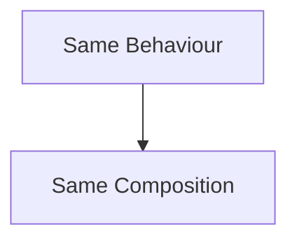

Whether the result was:

- recomputed,
- retrieved from cache,

should remain entirely invisible.

---

# Behaviour Before Cache

Caching always follows behaviour.

Conceptually.

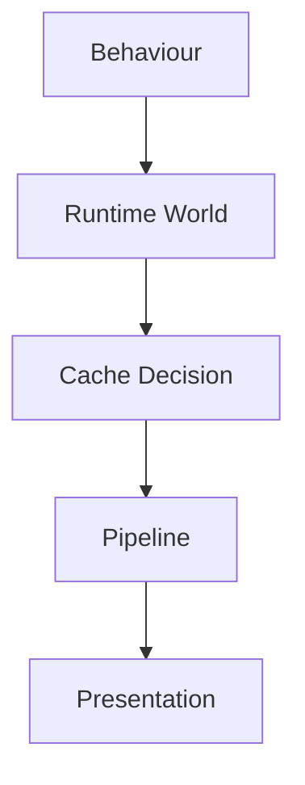

Behaviour always determines whether cached information remains valid.

The cache never determines behaviour.

---

# Cacheable Artefacts

The Composition Engine may cache several conceptual artefacts.

Examples include:

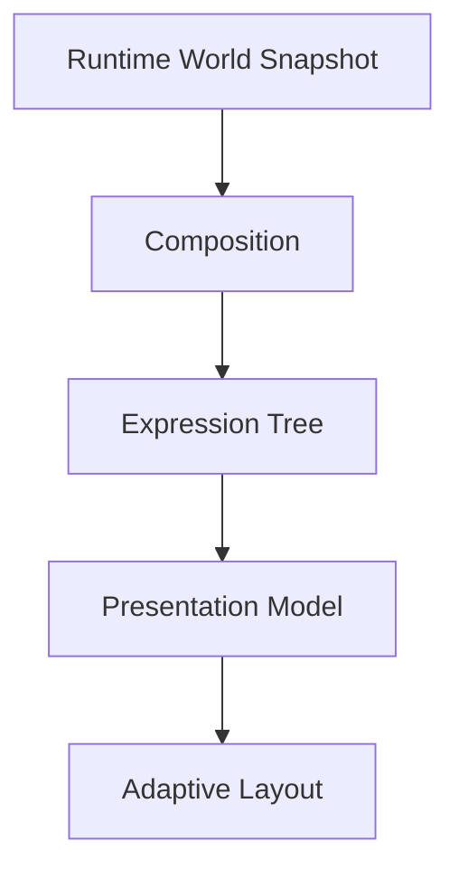

Each stage may possess its own cache.

Stages remain independently invalidatable.

---

# Runtime World Cache

Immutable Runtime World snapshots provide the foundation for deterministic caching.

Conceptually.

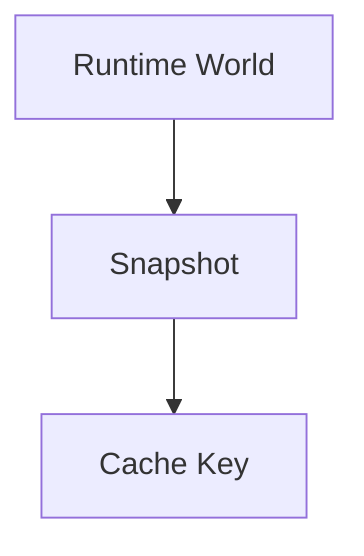

Future runtime systems may compare snapshots to determine whether downstream stages require recomputation.

---

# Composition Cache

If:

- Behaviour,
- Focus,
- Context,
- Relationships

remain unchanged...

The solved Composition may be safely reused.

Behaviour remains the authoritative invalidation mechanism.

---

# Expression Cache

Expression Trees may also be cached.

Example.

Playback progresses.

↓

Timeline Expression updates.

↓

Hero Expression unchanged.

Only affected Expressions require regeneration.

Incremental updates preserve continuity while improving runtime performance.

---

# Layout Cache

Adaptive Layout should remain cacheable.

Examples.

Device unchanged.

↓

Layout reused.

Orientation changes.

↓

Layout invalidated.

Behaviour remains identical.

Only spatial presentation changes.

---

# Presentation Cache

Presentation Models may also be cached.

Conceptually.

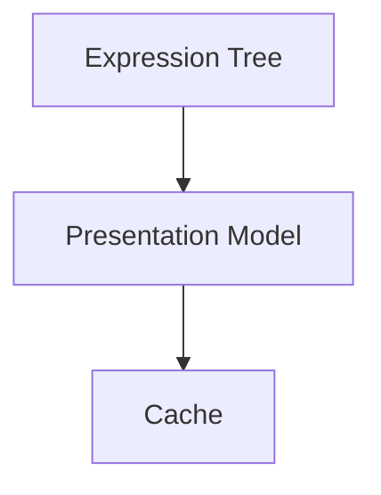

Presentation caching should remain independent from rendering technology.

Rendering engines may introduce additional caches.

These remain implementation concerns.

---

# Behavioural Invalidation

Cache invalidation should always begin with behaviour.

Examples.

Playback progresses.

↓

Timeline invalidated.

Focus changes.

↓

Hero invalidated.

Search opens.

↓

Overlay invalidated.

Small behavioural changes should invalidate only the minimum required runtime artefacts.

---

# Hierarchical Invalidation

Invalidation should propagate naturally through the runtime hierarchy.

Example.

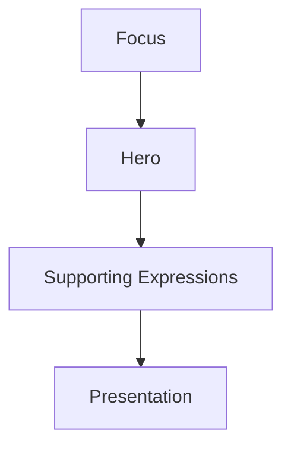

Peripheral Expressions should remain valid whenever possible.

Understanding should evolve incrementally.

---

# Material Caching

Material behaviour should also participate.

Examples.

Runtime Atmosphere.

↓

Material Profiles.

↓

Refraction Fields.

↓

Cache.

Materials should reuse stable environmental information whenever practical.

---

# Motion Caching

Motion Profiles may also be cached.

Examples.

Hero Transition.

↓

Resolved Motion Profile.

↓

Cache.

Only behavioural changes requiring different movement should invalidate Motion caches.

---

# Deterministic Keys

Cache keys should derive only from deterministic runtime inputs.

Examples include:

- Runtime World Snapshot
- Behaviour
- Context
- Focus
- Accessibility
- available extent and orientation
- viewing and input context
- effective renderer capability

Implementation-specific values should never become behavioural cache keys.

Registered Device Capability Envelopes may seed capability discovery but must not become the sole Presentation cache key.

Presentation projection keys should use the effective live inputs that affect the result, including logical extent, safe area, typography scale, accessibility, enabled input capabilities and effective renderer budget.

Multiple windows or displays on one registered device may therefore retain independent Presentation caches.

---

# Incremental Recomputation

Preferred.

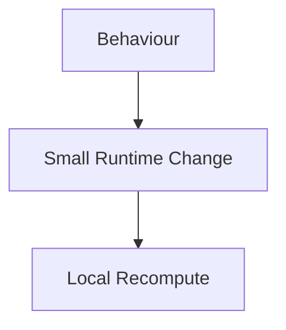

Avoid.

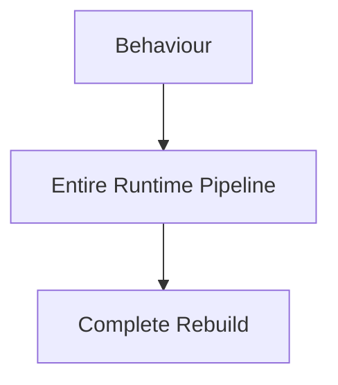

Incremental recomputation preserves responsiveness while strengthening continuity.

---

# Multi-Device Caching

Different devices may maintain independent Presentation caches.

However...

Composition caches should remain conceptually identical.

Desktop.

↓

Composition.

Phone.

↓

Same Composition.

Only Adaptive Layout differs.

---

# Accessibility

Accessibility changes invalidate only the stages they affect.

Example.

Large Text.

↓

Typography.

↓

Presentation.

Composition remains unchanged.

Behaviour remains unchanged.

The cache should preserve unaffected runtime work.

---

# Runtime Consistency

Cached artefacts must always produce identical runtime behaviour to recomputed artefacts.

Users should never perceive:

- stale hierarchy,
- delayed Expressions,
- inconsistent Materials.

Correctness always possesses higher priority than cache reuse.

---

# Performance Profiles

Future runtime implementations may expose conceptual cache profiles.

Examples.

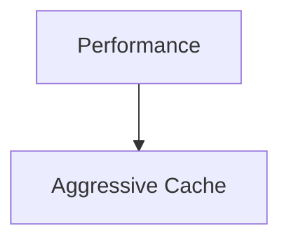

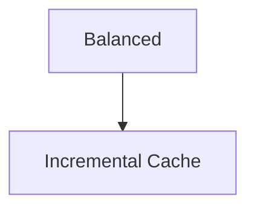

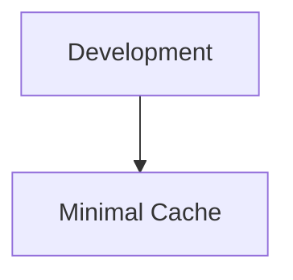

Profiles alter optimisation.

They never alter behaviour.

---

# Modules

Modules contribute:

- behaviour,
- information,
- relationships.

Modules never manage caches.

The Composition Engine owns:

- invalidation,
- recomputation,
- runtime reuse.

Every module therefore inherits identical runtime performance characteristics.

---

# Good Examples

## Playback

Playback progresses.

↓

Timeline invalidated.

↓

Timeline recomputed.

↓

Everything else reused.

The runtime remains responsive.

---

## Reading

Bookmark added.

↓

Bookmarks recomputed.

↓

Current Chapter remains unchanged.

↓

Hero reused.

Readers perceive uninterrupted continuity.

---

## Search

Overlay appears.

↓

Overlay Expressions generated.

↓

Underlying Composition reused.

↓

Closing Search instantly restores previous Presentation.

---

# Anti-patterns

## Global Invalidation

Every behavioural event invalidates the entire runtime.

---

## Behavioural Cache

Cache determines behavioural correctness.

---

## Platform Cache

Rendering frameworks redefining runtime caching behaviour.

---

## Stale World

Presentation continues using outdated Runtime World snapshots.

---

# Composition Caching Model

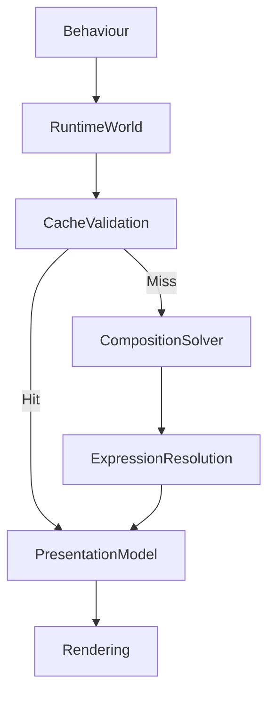

Caching should optimise execution.

Never behaviour.

---

# Relationship To Future Chapters

The next chapter defines **Multi-Device Composition**.

Composition Caching explains:

> **How runtime work is reused efficiently.**

Multi-Device Composition explains:

> **How one solved World is simultaneously projected across multiple devices while preserving identical behavioural understanding.**

Together they complete the runtime execution architecture of the Composition Engine.

---

# Summary

Composition Caching preserves one of the most important architectural characteristics of Mosaic.

The interface should continuously evolve...

without continuously rebuilding itself.

Behaviour determines change.

Caching simply avoids solving the same understanding twice.

Users should therefore experience:

- responsiveness,
- continuity,
- consistency,

without ever realising a cache existed.
