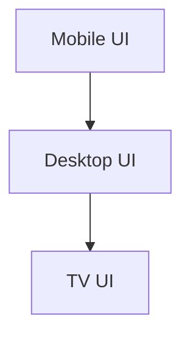
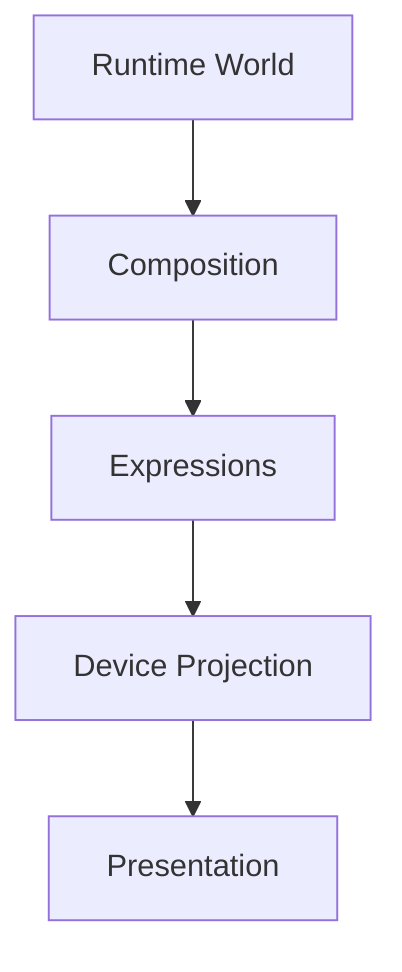
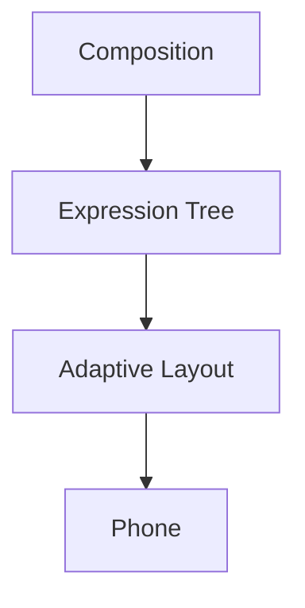
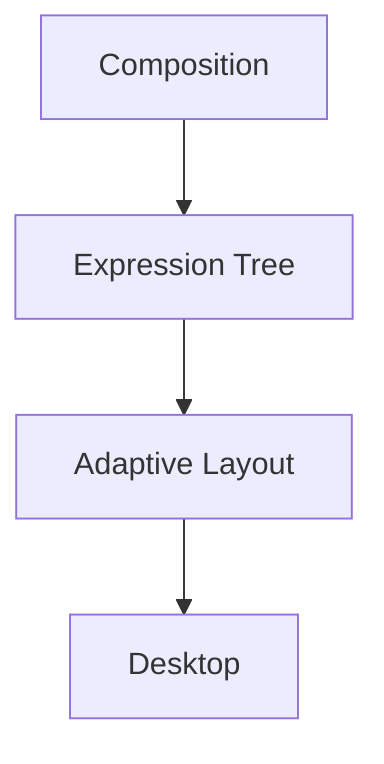
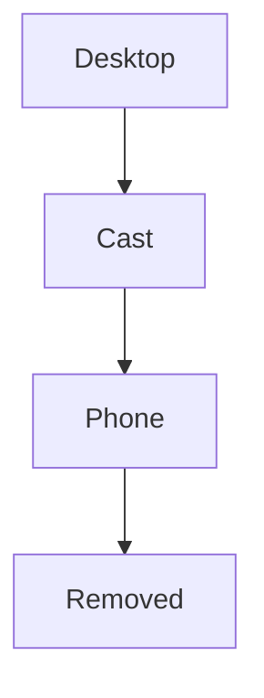
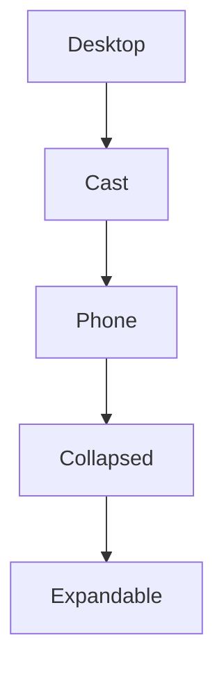
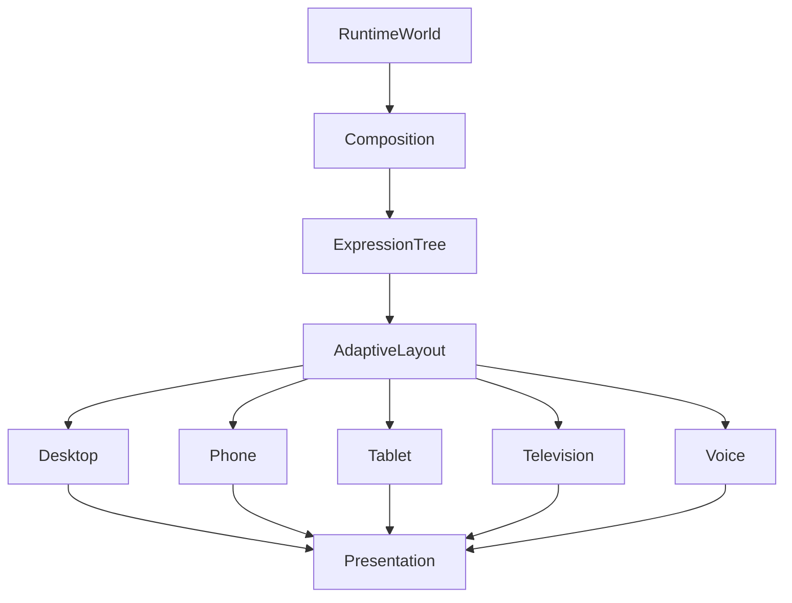

<!--
File: docs/engineering/architecture/mdp-001-adaptive-composition-runtime/10-multi-device-composition.md
Document: MDP-001
Status: Deferred
-->

# Multi-Device Composition

> **Proposal status:** Deferred and non-authoritative. This chapter preserves post-v1 research; it is not a Mosaic v1 requirement.

---

# Purpose

The Composition Engine solves one Runtime World.

Users, however, may experience that World across many different devices.

Examples include:

- phone
- tablet
- desktop
- television
- foldable devices
- future spatial interfaces
- voice interfaces

This chapter defines how one solved Composition becomes many presentations without fragmenting behavioural understanding.

There should never be:

- Mobile Composition
- TV Composition
- Desktop Composition

There should only ever be:

> **One Composition.**

> **Release applicability:** The normalised projection mathematics in this chapter belongs to the post-v1 Adaptive Composition Runtime. Mosaic v1 uses ordinary responsive component layout while retaining the registered-device and live-capability ownership boundary.

---

# Definition

Within MDS, **Multi-Device Composition** is defined as:

> **The deterministic projection of one solved Runtime Composition across multiple presentation environments while preserving behavioural understanding.**

Presentation adapts.

Understanding does not.

---

# Philosophy

Traditional applications frequently solve interfaces separately.

Examples.



These experiences often diverge over time.

Mosaic intentionally solves once.



The World remains identical.

Only its physical expression changes.

---

# One Runtime

Every client consumes the same Runtime World.

Desktop.

↓

Runtime World.

Phone.

↓

Same Runtime World.

Television.

↓

Same Runtime World.

No client owns independent behavioural state.

The Runtime World remains the single source of truth.

---

# One Composition

Likewise.

Every client consumes the same solved Composition.

Examples.

```

Hero

Timeline

Relationships

Progress

Actions
```

These Expressions remain identical regardless of device.

The Adaptive Layout system determines presentation.

---

# Device Projection

The client-side Adaptive Layout implementation projects solved Expressions into layouts for the current Presentation constraints.

Conceptually.





Behaviour remains identical.

---

# Capability Profiles

Implementations may describe current Presentation constraints through a capability profile.

The profile may include:

- available extent and orientation
- viewing distance
- input methods
- typography and accessibility settings
- renderer features
- measured runtime budget

It must not reduce these inputs to a permanent phone, tablet, desktop or television layout class.

No capability profile receives a different Composition.

---

# Registered Device Capability Envelope

At device registration or first sign-in, a client may discover a relatively stable capability envelope and associate it with the registered device.

The envelope may include:

- renderer features
- supported texture and compositing techniques
- input capabilities
- application and platform versions
- an approximate performance envelope

It is a reusable discovery result rather than a permanent layout classification.

The client should refresh it when application, platform or renderer capabilities materially change.

The server may retain the last reported envelope for diagnostics, compatibility and device management. It must not use that envelope to author final Composition geometry.

Authentication credentials, revocable sessions and remote sign-out belong to [MEG-009 — Security Architecture](../../guides/meg-009-security-architecture/03-authentication.md), not to the Composition Engine.

---

# Live Presentation Profile

The client resolves a Live Presentation Profile at Presentation startup and whenever relevant environment state changes.

Conceptually:

\[
P_t
=
\operatorname{resolve}
\left(
D,
V_t,
A_t,
I_t,
B_t
\right)
\]

where:

| Term | Meaning |
|------|---------|
| \(D\) | Registered Device Capability Envelope. |
| \(V_t\) | Current logical viewport, orientation and safe-area state. |
| \(A_t\) | Current accessibility and typography state. |
| \(I_t\) | Currently enabled input capabilities. |
| \(B_t\) | Current measured runtime budget. |

Unlike the registered envelope, \(P_t\) is session-local and time-dependent.

Window resizing, orientation, split-screen, browser zoom, safe-area changes, external displays, accessibility changes and newly enabled input methods may invalidate affected Presentation resolution.

---

# Normalised Composition Coordinates

Composition geometry should be resolution-independent and resolved from the current logical Presentation extent.

Let \(W_t\) and \(H_t\) be the current logical width and height of the Composition parent. Normalised Composition coordinates use the same width-derived scale on both projected axes:

\[
u=\frac{x}{W_t},
\qquad
v=\frac{y}{W_t}
\]

Using one scale preserves spatial proportions, angles and distance comparisons.

For vertical scroll position \(s_t\), the visible window is:

\[
0\le u\le1
\]

\[
s_t\le v\le s_t+\frac{H_t}{W_t}
\]

The vertical coordinate is not normalised to the total document length. It may grow beyond one as the breathable Composition extends, preventing existing geometry from shifting when later content is added.

Renderer projection is:

\[
x_{\mathrm{logical}}=uW_t,
\qquad
y_{\mathrm{logical}}=(v-s_t)W_t
\]

The renderer adapter converts logical coordinates into CSS pixels, Flutter logical pixels, native points or physical pixels.

Logical depth may use \(P\ge2\) governed planes across a bounded normalised range:

\[
z_k=-1+\frac{2k}{P-1},
\qquad
k\in\{0,\ldots,P-1\}
\]

Depth represents ordering, occlusion, parallax and Material relationships rather than physical distance.

Composition Space, Tile-local space and artwork UV space remain distinct coordinate systems even when each uses normalised values.

Typography minimums, interaction targets, safe-area insets, optical limits and performance budgets are resolved after geometric projection and must not be reduced to percentages.

---

# Static Profile Projection

Private Composition Profiles should store normalised anchors, proportional extents, alignment relationships, governed plane choices and constraints rather than resolution-specific rectangles.

Static means deterministic profile selection and constraint resolution. It does not mean fixed physical pixels.

The client may reuse a cached projection while its relevant Live Presentation Profile inputs remain materially unchanged. Re-evaluating the coordinate transform is inexpensive; rebuilding unaffected Composition state is unnecessary.

---

# Viewing Distance

Projection should account for viewing distance.

Television.

↓

Greater spacing.

↓

Larger typography.

↓

Expanded Hero.

Phone.

↓

Closer reading.

↓

Compact hierarchy.

The behavioural language remains unchanged.

---

# Input Independence

Different devices expose different interaction methods.

Examples.

- touch
- mouse
- keyboard
- remote
- voice
- gesture

These affect interaction.

They do not affect Composition.

Behaviour remains independent from input technology.

---

# Expression Stability

Expressions should remain recognisable across every platform.

Timeline.

↓

Timeline.

Hero.

↓

Hero.

Relationships.

↓

Relationships.

Only visual expression changes.

Conceptual identity remains constant.

---

# Progressive Projection

Smaller devices should progressively disclose information.

Not remove it.

Incorrect.



Preferred.



Understanding remains available.

Presentation adapts.

---

# Simultaneous Devices

Future Mosaic experiences may span multiple devices simultaneously.

Examples.

Television.

↓

Playback.

Phone.

↓

Companion controls.

Tablet.

↓

Metadata.

Each device receives a different Presentation Model.

All consume the same Runtime World.

Behaviour remains synchronised.

---

# Runtime Synchronisation

Every device should observe identical behavioural evolution.

Example.

Playback pauses.

↓

Television updates.

↓

Phone updates.

↓

Tablet updates.

↓

Runtime World remains authoritative.

Presentation latency should never alter behavioural ordering.

---

# Material Consistency

Different devices may implement Materials differently.

Desktop.

↓

Premium Acrylic.

Phone.

↓

Simplified Acrylic.

Television.

↓

Greater perceived depth.

The Material language remains recognisably Mosaic.

Only rendering fidelity changes.

---

# Typography Consistency

Editorial hierarchy remains identical.

Examples.

Hero.

↓

Heading.

Supporting.

↓

Body.

Caption.

↓

Caption.

Different devices may alter:

- spacing
- measure
- scale

Editorial meaning remains unchanged.

---

# Motion Consistency

Motion sequencing should remain identical.

Examples.

Hero moves.

↓

Supporting responds.

↓

Environment settles.

Different platforms may adjust:

- duration
- interpolation
- rendering fidelity

Behavioural ordering must remain identical.

---

# Accessibility

Accessibility should remain device independent.

Large text.

↓

All devices.

Reduced motion.

↓

All devices.

High contrast.

↓

All devices.

Accessibility profiles belong to the Runtime World.

Not individual platforms.

---

# Runtime Identity

Users should always feel they are interacting with:

> The same Companion.

Changing device should never require relearning:

- hierarchy
- navigation
- behaviour
- editorial language

Only presentation changes.

---

# Device Handover

Future implementations may support seamless device handover.

Example.

Watching.

↓

Television.

↓

Continue on Phone.

↓

Same Runtime World.

↓

Same Hero.

↓

Same Progress.

↓

Same Composition.

The transition should feel like continuing the same experience rather than opening a different application.

---

# Modules

Modules contribute:

- behaviour
- information
- relationships

Modules never target specific devices.

The Composition Engine determines how module content appears everywhere.

Every module therefore automatically supports future devices.

---

# Good Examples

## Television

Hero.

↓

Large presentation.

↓

Minimal controls.

↓

Immersive experience.

---

## Phone

Hero.

↓

Compact presentation.

↓

Progressive disclosure.

↓

Comfortable touch interaction.

The behavioural language remains identical.

---

## Foldable

One Runtime World.

↓

Adaptive projection.

↓

Expanded editorial layout.

↓

Same Expressions.

The experience evolves naturally with the device.

---

# Anti-patterns

## Mobile Features

Mobile receives different behaviour.

---

## Platform Hierarchy

Television invents different conceptual priorities.

---

## Device Modules

Modules creating independent device interfaces.

---

## Separate Runtime

Every client maintaining its own behavioural state.

---

# Multi-Device Composition Model



One Runtime World.

One Composition.

Many Presentations.

---

# Relationship To Future Chapters

The next chapter defines **Composition Engine Governance**.

Multi-Device Composition explains:

> **How one solved World becomes many device experiences.**

Governance explains:

> **How the Composition Engine evolves while preserving one consistent behavioural architecture across every future client.**

Together they complete the architectural foundation of the Mosaic runtime.

---

# Summary

Multi-Device Composition ensures that Mosaic remains one platform rather than a collection of applications.

Users should experience:

- one World,
- one Companion,
- one behavioural language,

regardless of:

- screen size,
- input method,
- rendering technology,
- future devices.

Presentation may change.

Understanding never should.
