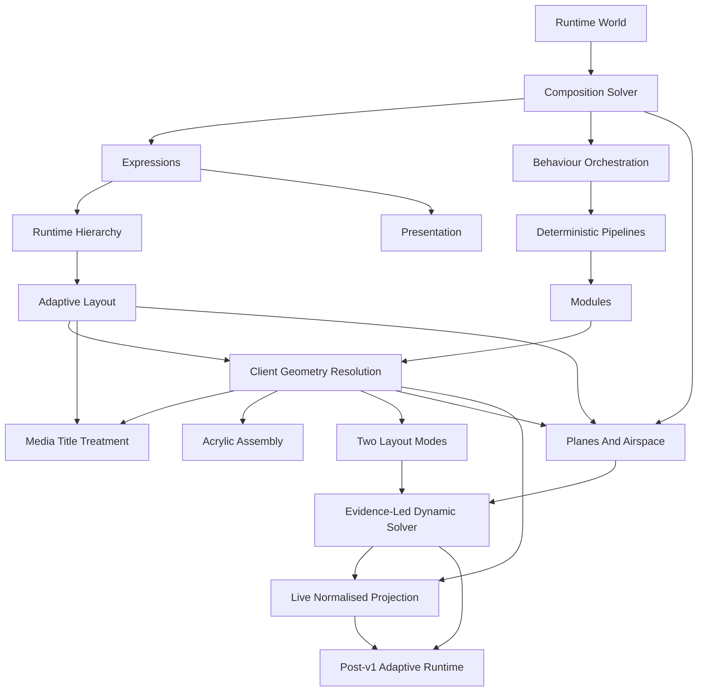

<!--
File: docs/engineering/architecture/mdp-001-adaptive-composition-runtime/12-decision-history.md
Document: MDP-001
Chapter: 12
Title: Decision History
Status: Draft
Version: 0.1
-->

# Decision History

> **Proposal status:** Deferred and non-authoritative. This chapter preserves post-v1 research; it is not a Mosaic v1 requirement.

---

# Purpose

This chapter preserves the internal decision history developed while the Adaptive Composition Runtime was documented as active Design System architecture.

These records are historical proposal inputs. Their `Accepted` labels describe the earlier design review state and do not make MDP-001 authoritative after its deferral.

The current v1 boundary and deferral decision are recorded by ADR-204 and ADR-205 in [MDS-008 — Component Library](../../../design/system/mds-008-component-library/12-adrs.md).

Every previous specification established:

- Vision
- Behaviour
- Design Language
- Runtime Systems

MDP-001 establishes how those systems become one continuously evolving runtime experience.

These ADRs explain why Mosaic treats runtime composition as a behavioural solving process rather than a rendering process.

Future contributors should understand these decisions before modifying the Composition Engine.

---

# Decision Format

Decision format, lifecycle and review expectations are governed by **[MDG-001 — Documentation Authority Guide](../../documentation/mdg-001-documentation-authority-guide/index.md)**.

This chapter records decisions specific to this specification and avoids redefining the shared ADR process.

# ADR-154

## Title

Treat The Runtime World As The Primary Runtime Model

### Status

Accepted

### Context

Traditional applications frequently build interfaces from application state.

Founder workshops consistently favoured modelling the user's current World rather than interface state.

### Decision

The Runtime World becomes the single behavioural source of truth.

### Consequences

Every runtime subsystem consumes identical behavioural information.

Presentation becomes deterministic.

---

# ADR-155

## Title

Composition Is Solved Rather Than Authored

### Status

Accepted

### Context

Static interface templates struggle to communicate changing behavioural priorities.

### Decision

The Composition Solver continuously constructs understanding from the Runtime World.

### Consequences

The interface evolves naturally as behaviour changes.

---

# ADR-156

## Title

Introduce Expressions As A Runtime Abstraction

### Status

Accepted

### Context

Directly generating components tightly couples runtime behaviour to rendering frameworks.

### Decision

Expressions become the stable contract between runtime understanding and presentation.

### Consequences

Future clients remain implementation independent while sharing one conceptual runtime.

---

# ADR-157

## Title

Runtime Hierarchy Is Behavioural

### Status

Accepted

### Context

Traditional interfaces frequently derive hierarchy from layout.

### Decision

Hierarchy is continuously solved from behaviour rather than geometry.

### Consequences

Adaptive layouts preserve understanding across every device.

---

# ADR-158

## Title

Behaviour Orchestrates Every Runtime System

### Status

Accepted

### Context

Independent runtime subsystems frequently produce fragmented user experiences.

### Decision

Every runtime subsystem evolves from one coordinated behavioural pipeline.

### Consequences

Users experience one coherent World rather than multiple independent interface updates.

---

# ADR-159

## Title

Presentation Is A Runtime Product

### Status

Accepted

### Context

Traditional frameworks often treat presentation as the runtime model.

### Decision

Presentation becomes the output of runtime solving.

### Consequences

Rendering technologies remain replaceable without affecting runtime behaviour.

---

# ADR-160

## Title

Adaptive Layout Never Changes Behaviour

### Status

Accepted

### Context

Responsive layouts frequently alter behavioural meaning across devices.

### Decision

Adaptive Layout projects solved understanding rather than redefining it.

### Consequences

Every device communicates identical behavioural intent.

---

# ADR-161

## Title

Runtime Pipelines Must Remain Deterministic

### Status

Accepted

### Context

Predictable runtime behaviour is essential for replay, testing and synchronisation.

### Decision

Every pipeline stage consumes immutable inputs and produces deterministic outputs.

### Consequences

Caching, replay and multi-device synchronisation become reliable architectural capabilities.

---

# ADR-162

## Title

Modules Enrich The Runtime World

### Status

Amended by ADR-163

### Context

Allowing modules to construct presentation fragments runtime consistency.

### Decision

Modules contribute behaviour, relationships, information and governed domain layout constraints.

They do not provide final Presentation geometry or private Platform values.

The Composition Engine owns runtime solving.

### Consequences

Community modules inherit every future runtime improvement automatically.

---

# ADR-163

## Title

Resolve Presentation Geometry In The Client From Capability And Constraints

### Status

Accepted

### Context

SDUI must support browsers and native clients with widely different extents, input contexts, accessibility settings and rendering budgets.

Device categories do not reliably describe those constraints, while server-authored coordinates would couple semantic intent to one Presentation.

### Decision

Composition and Runtime SDUI provide semantic hierarchy, relationships, Expressions and permitted domain layout modes.

The client-side Adaptive Layout implementation calculates final location, size, depth ordering, padding, spacing, density and typography from private Platform primitives and the current capability profile.

Modules may provide governed domain invariants, but cannot provide final Presentation geometry or select private primitives.

Intrinsic domain coordinates, such as those in an authored diagram or spatial canvas, remain content data and are projected into Presentation space by the client.

### Consequences

Web and native clients share one semantic contract while adapting to their actual runtime conditions.

Mosaic retains control of visual rhythm without exposing controls such as `Spacing.Large` to SDUI, Modules or users.

---

# ADR-164

## Title

Select Media Title Treatment From Artwork Role And Safe Placement

### Status

Accepted

### Context

Media identity may be communicated by an HD ClearLogo or semantic typography.

Overlaying titles on every asset obscures portrait poster artwork, while forcing a logo into unsuitable landscape artwork damages legibility and focal composition.

### Decision

Landscape and backdrop artwork uses an HD ClearLogo only when verified negative space provides safe placement.

The fallback is a Mona Sans semantic title on an Acrylic information plane.

Portrait poster artwork remains unobstructed and places semantic title and metadata below the image.

Only one visible title treatment is presented, while semantic text remains available to accessibility and non-visual systems.

### Consequences

Artwork remains the primary focal point.

Media identity adapts to the asset rather than a device category, and title presentation remains deterministic when artwork or ClearLogo assets are unavailable.

---

# ADR-165

## Title

Distinguish Acrylic Assembly From Material Fusion

### Status

Accepted

### Context

Composition may need to group several Tiles and render them efficiently without making rigid Acrylic behave like proximity-driven liquid glass.

### Decision

One Tile defines one continuous Acrylic surface.

An Acrylic Assembly groups separate rigid Tiles for coordinated layout, movement and optional renderer compositing while preserving their material boundaries.

Touching or nearby Tile bounds do not fuse.

Modules cannot select material topology or edge values directly.

### Consequences

Composition retains grouping flexibility and performance options while the Material System preserves rigid Acrylic identity.

---

# ADR-166

## Title

Support Adaptive Composition And Authored Layout

### Status

Accepted

### Context

Media browsing benefits from mathematically resolved Composition, while documentation, administration and dashboard experiences require conventional CSS or native layout authoring.

Treating either mode as universal would make Mosaic impractical for the other.

### Decision

Mosaic supports Adaptive Composition and Authored Layout as peer client consumption modes.

Adaptive Composition resolves geometry automatically.

Authored Layout uses public Semantic Tokens with conventional layout primitives.

Both modes share the same Design Language, Material, typography, accessibility and runtime resolution contracts.

### Consequences

Mosaic can support cinematic media experiences and standard application surfaces without maintaining separate design systems or exposing private Primitive values.

---

# ADR-197

## Title

Resolve Permanent Composition Planes And Airspace Reserves Client-Side

### Status

Accepted

### Context

Layered Mosaic compositions require artwork, information and episode Tiles to occupy overlapping projected regions without competing for one flat layout.

Important artwork subjects also require protection from settled occlusion without preventing Tiles from moving through the same projected region.

### Decision

The Composition Solver produces semantic depth and visibility intent.

Client-side Adaptive Layout assigns governed permanent Composition Planes and solves independent \(x,y\) occupancy on each plane.

Same-plane Tiles compete for capacity while cross-plane projected overlap is permitted.

Airspace Reserves use hard exclusion masks and soft occlusion costs to constrain settled placement above lower-plane content.

Transit motion may cross a reserve, but every interrupted or completed transition must continue toward a valid settled footprint.

SDUI and Modules do not provide final \(x,y,z\) coordinates, saliency thresholds or placement weights.

### Consequences

The client can construct layered spatial-puzzle compositions deterministically from semantic intent.

Low-resolution masks and summed-area evaluation keep candidate placement inexpensive while preserving focal artwork and editorial safe regions.

---

# ADR-201

## Title

Calibrate A Breathable Dynamic Solver From Curated Reference Compositions

### Status

Accepted

### Context

The dynamic Composition Solver requires private weights, candidate budgets and stability thresholds that cannot be selected reliably without visible Mosaic interfaces.

Compressing all relevant content into a fixed viewport conflicts with Breathing Space, while exposing private templates through SDUI would make early implementation structures permanent public contracts.

Tiles also require freedom to settle on any valid Composition Plane while projected text remains readable across planes.

### Decision

Mosaic will implement Composition in three evidence-led stages:

1. curated reference compositions using the real Design System
2. deterministic private Composition Profiles mapping semantic intent into resolved slots
3. a bounded dynamic solver calibrated from stakeholder-ranked reference alternatives and runtime measurements

The viewport remains a vertically moving window over an extensible Composition. Hard Breathing Space, accessibility, minimum-size, collision, projected-text and Airspace constraints are evaluated before weighted layout scoring.

A Tile's current Composition Plane is resolved state rather than identity. Every Tile may settle on any valid governed plane.

SDUI and Modules communicate semantic intent and cannot address private profile identifiers, slots, coordinates, weights or search budgets.

This decision refines ADR-197 by retaining persistent Composition Planes while removing any implication that a Tile is permanently attached to one plane.

### Consequences

The first physical Mosaic interfaces can be built and tested before the adaptive search solver is complete.

Reference compositions become visual targets, golden tests, performance fixtures and safe fallbacks.

Solver weights begin from ranked evidence rather than arbitrary constants.

The public semantic contract remains stable when private profiles are replaced by dynamic solving.

---

# ADR-203

## Title

Project Normalised Composition From A Live Presentation Profile

### Status

Accepted

### Context

A registered device can cache relatively stable renderer and input capabilities, but its available Presentation extent may change through resizing, orientation, split-screen, safe areas, accessibility, external displays and input changes.

Persisting final geometry at registration would make one device record incorrectly authoritative for multiple simultaneous windows and displays.

Authoring static profiles in physical pixels would also bind reference compositions to one resolution.

### Decision

Device registration or first sign-in may establish a reusable Registered Device Capability Envelope.

At Presentation startup and after relevant environment changes, the client resolves a Live Presentation Profile and projects Composition through normalised logical \(x\), \(y\) and bounded \(z\) coordinates.

Projected \(x\) and \(y\) use one width-derived scale so spatial proportions and angles remain stable. Vertical Composition extent may grow beyond the viewport without renormalising existing content.

Private Composition Profiles store normalised relationships and constraints rather than resolution-specific rectangles.

The server may retain last-reported capabilities for compatibility and device management, but it does not calculate or persist final Presentation geometry.

### Consequences

Displays with different physical pixel densities but equivalent logical constraints produce equivalent Composition geometry.

Multiple windows and displays on one registered device may resolve and cache independent Presentation projections.

Coordinate transformation remains inexpensive, while cached Composition work is invalidated only by inputs that materially affect it.

Authentication, registered-device persistence and session revocation remain owned by Security Architecture rather than the Design System.

---

# ADR Relationships

Together these decisions establish the Composition Engine as a behavioural runtime architecture rather than a rendering framework.

---

# Future ADRs

Future Composition Engine ADRs are expected to formalise:

- Predictive Composition
- AI-assisted Expression Selection
- Distributed Runtime Worlds
- Collaborative Runtime Sessions
- Spatial Composition
- Incremental Graph Solving
- Runtime Behaviour Personas
- Cloud-assisted Composition Pipelines

These intentionally remain outside the scope of MDP-001 Version 0.1.

---

# ADR Governance

Composition Engine ADRs should change only when:

- behavioural research identifies deficiencies,
- runtime architecture fundamentally evolves,
- deterministic guarantees require refinement,
- the Mosaic Design Language itself changes.

Implementation technology alone should never justify architectural changes.

The runtime model should remain recognisably Mosaic regardless of future execution environments.

---

# Summary

The ADRs contained within MDP-001 define the architectural heart of Mosaic.

Rather than constructing interfaces...

The Composition Engine constructs understanding.

Everything else:

- layouts,
- materials,
- typography,
- motion,
- rendering,

emerges naturally from that solved understanding.
