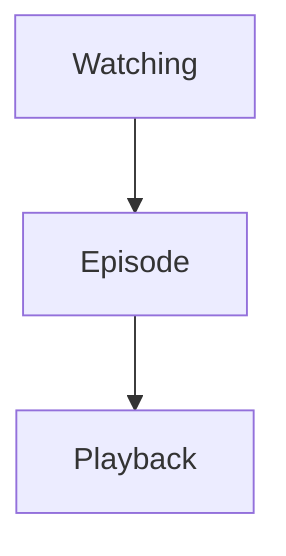
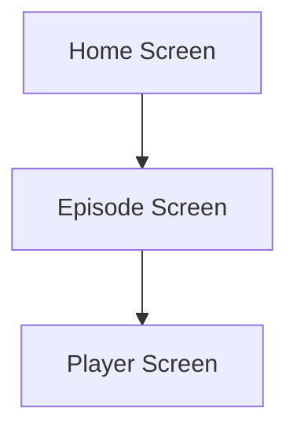
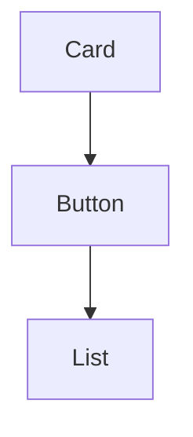
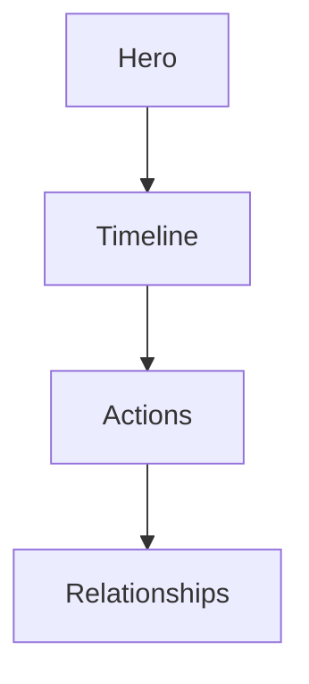
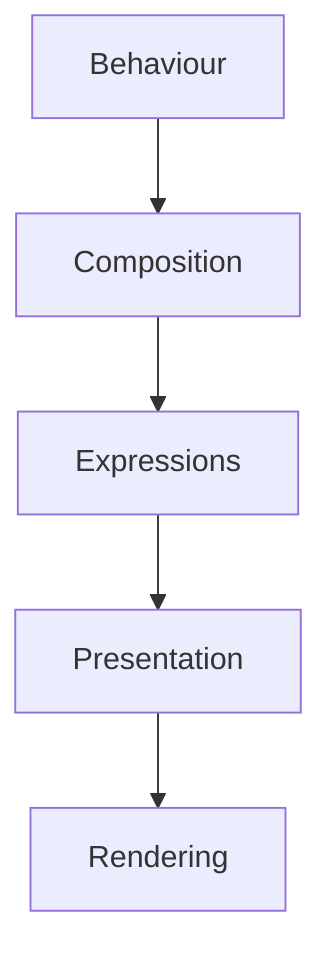
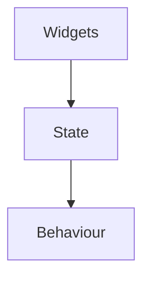
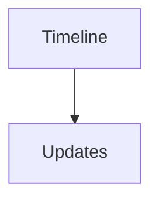
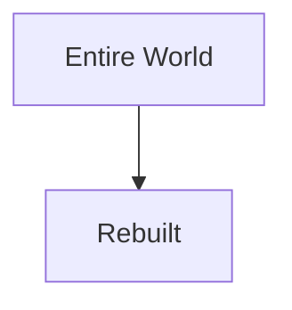
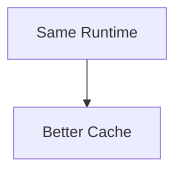
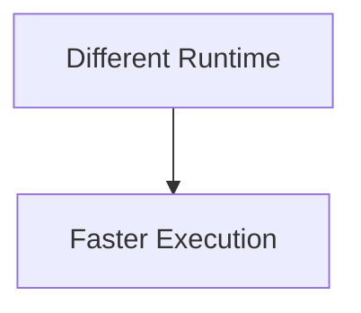

<!--
File: docs/engineering/architecture/mdp-001-adaptive-composition-runtime/13-contributor-guidance.md
Document: MDP-001
Chapter: 13
Title: Contributor Guidance
Status: Draft
Version: 0.1
-->

# Contributor Guidance

> **Proposal status:** Deferred and non-authoritative. This chapter preserves post-v1 research; it is not a Mosaic v1 requirement.

---

# Purpose

The Composition Engine is the architectural centre of Mosaic.

Every subsystem ultimately contributes to it.

Every client ultimately consumes it.

This guidance exists to help contributors think in terms of:

- Worlds,
- Behaviour,
- Composition,
- Understanding,

rather than:

- screens,
- widgets,
- layouts,
- pages.

When contributors naturally begin reasoning about Worlds instead of interfaces, the Composition Engine has achieved its purpose.

---

# Think In Worlds

Never begin with:

> "Which screen is this?"

Instead ask:

> **"What World is the user currently experiencing?"**

Good.

Poor.

Screens are implementation.

Worlds are architecture.

---

# Think In Behaviour

Every runtime change should begin with one question.

> **"What behaviour changed?"**

Never begin with:

- button presses,
- navigation,
- layout,
- rendering.

Behaviour remains the highest authority.

Everything else follows naturally.

---

# Solve Understanding

The Composition Engine exists to solve understanding.

Not layouts.

Not widgets.

Before implementing any runtime feature ask:

> **What should the user understand after this behaviour changes?**

If the answer is unclear...

The implementation should probably not begin yet.

---

# Expressions Before Components

Never think:

Instead think:

Components are merely one possible implementation of Expressions.

The Expression vocabulary should always remain conceptually richer than the component vocabulary.

---

# Preserve Hierarchy

Hierarchy should always emerge from:

- Behaviour,
- Composition,
- Relationships.

Never from:

- screen position,
- component type,
- visual styling.

Behaviour owns hierarchy.

Presentation communicates it.

---

# Runtime Before Rendering

Rendering should remain the final concern.

Preferred.

Avoid.

The runtime should always lead implementation.

---

# Respect Determinism

Every behavioural decision should produce deterministic runtime behaviour.

Given identical:

- Runtime World,
- Behaviour,
- Relationships,

the Composition Engine should produce identical Composition.

Predictability is significantly more valuable than cleverness.

---

# Think Incrementally

Behaviour rarely changes everything.

Before recomputing ask:

> **What actually changed?**

Preferred.

Avoid.

Incremental evolution preserves both continuity and performance.

---

# Respect Adaptive Layout

Adaptive Layout exists to project understanding.

Not redefine it.

Changing devices should never require changing:

- Expressions,
- Behaviour,
- Runtime Hierarchy.

Only presentation should adapt.

---

# Modules Enrich Worlds

Modules should contribute:

- information,
- relationships,
- behaviour,
- capabilities.

Modules should never attempt to solve:

- hierarchy,
- composition,
- layouts,
- runtime presentation.

The Composition Engine owns those responsibilities.

---

# Accessibility

Accessibility modifies presentation.

It never modifies behaviour.

Examples.

Large text.

↓

Presentation changes.

Behaviour.

↓

Unchanged.

Reduced Motion.

↓

Presentation changes.

Composition.

↓

Unchanged.

Behavioural understanding should remain identical.

---

# Platform Independence

Before implementing runtime behaviour ask:

> Would this behave identically on:

- Web?
- Flutter?
- Television?
- Voice?
- Future platforms?

Presentation may differ.

Runtime behaviour should not.

---

# Optimise Carefully

Performance optimisation should never alter behavioural correctness.

Preferred.

Avoid.

Optimise execution.

Never understanding.

---

# Common Mistakes

Avoid the following.

### Screen Thinking

Beginning runtime architecture from interface pages.

---

### Component Thinking

Allowing widgets to determine runtime behaviour.

---

### Layout Thinking

Treating adaptive layout as runtime composition.

---

### Platform Thinking

Building independent runtime models for different clients.

---

### Module Ownership

Allowing modules to bypass the Composition Engine.

---

### Behaviour Duplication

Multiple runtime systems independently solving the same behaviour.

---

# Composition Review Questions

Before implementing runtime logic ask:

- What World currently exists?
- What behaviour changed?
- What should the user understand next?
- Does this strengthen continuity?
- Could an existing Expression already communicate this?
- Would this still work on every Mosaic client?

If uncertainty remains...

Return to the Runtime World before implementation.

---

# Composition Checklist

Every runtime implementation should satisfy the following.

- [ ] Runtime World remains authoritative.
- [ ] Behaviour initiated every runtime change.
- [ ] Composition Solver owns understanding.
- [ ] Expressions remain presentation independent.
- [ ] Adaptive Layout preserves behavioural meaning.
- [ ] Accessibility remains intact.
- [ ] Runtime behaviour remains deterministic.
- [ ] Platform independence is preserved.

---

# Final Guidance

The Composition Engine should eventually disappear from conscious thought.

Contributors should stop asking:

> "How should this interface work?"

and instinctively begin asking:

> **"How should the user's World evolve?"**

When every contributor naturally thinks in Worlds rather than interfaces, Mosaic stops behaving like an application.

It begins behaving like a companion that always understands where the user is, what matters now, and how to guide them there without ever making them think about the machinery underneath.
