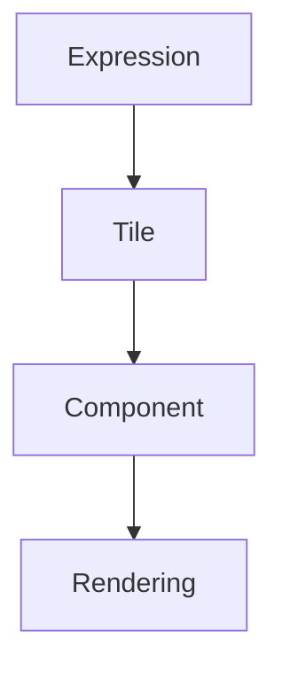
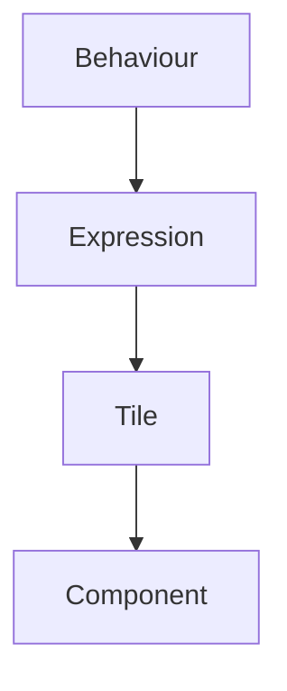
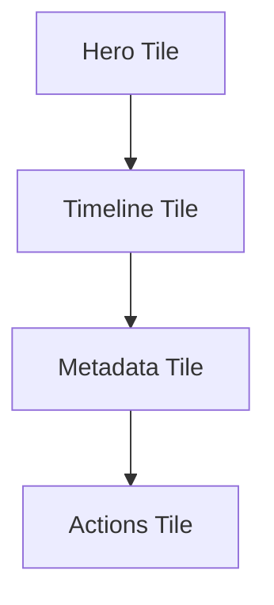
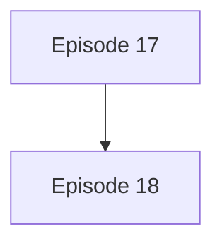
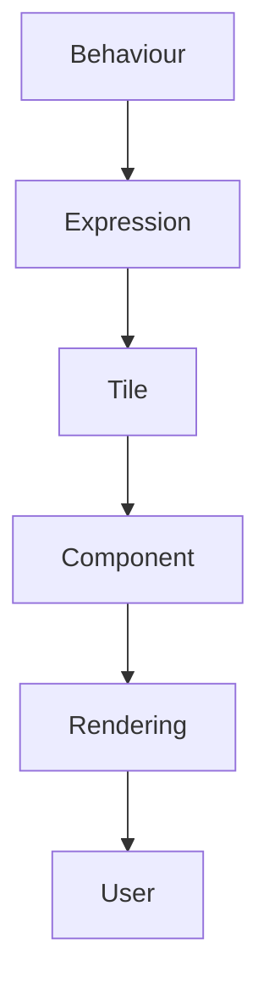

<!--
File: docs/engineering/architecture/mdp-001-adaptive-composition-runtime/17-tile-philosophy.md
Document: MDP-001
Chapter: 17
Title: Tile Philosophy
Status: Draft
Version: 0.1
-->

# Tile Philosophy

> **Proposal status:** Deferred and non-authoritative. This chapter preserves post-v1 research; it is not a Mosaic v1 requirement.

---

# Purpose

Before defining Tile taxonomy, lifecycle or runtime behaviour, contributors must first understand what a Tile represents within Mosaic.

Most interface frameworks begin with reusable components.

Examples include:

- cards,
- lists,
- buttons,
- tables.

These are implementation concepts.

Mosaic intentionally begins one layer higher.

A Tile is **not** an implementation.

It is a behavioural presentation primitive.

It exists to communicate one solved Expression from the Composition Engine.

---

# Philosophy Statement

> **A Tile is the physical expression of one behavioural Expression within the user's current World.**

Everything within the Tile Framework derives from this statement.

---

# Why Tiles Exist

The Composition Engine produces:

- Hero
- Timeline
- Relationships
- Metadata
- Actions
- Progress

These are Expressions.

Rendering frameworks cannot directly render Expressions.

Likewise...

Components should never understand runtime behaviour.

Tiles exist between those worlds.



This separation preserves one of the strongest architectural boundaries within Mosaic.

---

# Tiles Are Behavioural

A Tile communicates behaviour.

Not implementation.

Example.

Incorrect.

```text
PosterCard
```

Correct.

```text
Hero Tile
```

The Hero Tile may become:

- a card,
- a full-width panel,
- a television Hero,
- a compact phone presentation.

Its behavioural identity remains unchanged.

---

# Tiles Are Physical

Unlike Expressions, Tiles possess physical identity.

They inherit:

- Materials
- Typography
- Motion
- Interaction

A Tile therefore becomes the first runtime artefact that users can perceive.

Expressions remain conceptual.

Tiles become tangible.

---

# Tiles Are Reusable

A Timeline remains:

```

Timeline
```

regardless of:

- media type,
- device,
- platform,
- layout.

Likewise.

A Timeline Tile should remain:

```

Timeline Tile
```

Its presentation evolves.

Its identity remains stable.

---

# Tiles Are Presentation Independent

Tiles intentionally avoid:

- Flutter widgets
- React components
- SwiftUI views
- Compose composables

Those belong to implementation.

The Tile Framework should remain understandable without mentioning any rendering technology.

---

# Tiles Follow Behaviour

Tiles should never determine behaviour.

Behaviour determines Expressions.

Expressions determine Tiles.

Conceptually.



Responsibility always flows in one direction.

---

# Tiles Preserve Meaning

A Hero Tile should remain a Hero Tile even if:

- rendered differently,
- resized,
- repositioned,
- simplified.

Meaning survives presentation.

This principle enables adaptive interfaces without behavioural fragmentation.

---

# Tiles Are Composable

Tiles intentionally combine into larger experiences.

Example.



Together they communicate:

```

Playback
```

Each Tile owns one responsibility.

The Composition Engine determines how they relate.

---

# Tiles Own Presentation

Expressions communicate:

> What exists.

Tiles communicate:

> How it should exist physically.

Examples include:

- Material intent
- Typography intent
- Interaction affordance
- Motion behaviour

Rendering frameworks simply implement these characteristics.

---

# Tiles Support Adaptation

A Tile should adapt naturally.

Desktop.

↓

Expanded Hero Tile.

Phone.

↓

Compact Hero Tile.

Voice.

↓

Spoken Hero Tile.

The behavioural meaning remains identical.

Only physical presentation changes.

---

# Tiles Respect Hierarchy

Runtime Hierarchy determines Tile importance.

Hero.

↓

Hero Tile.

Supporting.

↓

Supporting Tile.

Peripheral.

↓

Peripheral Tile.

Tiles should never promote themselves.

Hierarchy always originates from the Composition Engine.

---

# Tiles Support Continuity

Tile identity should survive behavioural evolution.

Example.



The Hero Tile evolves.

It should not disappear and reappear as another unrelated Tile.

Continuity reduces cognitive effort.

---

# Tiles Support Materials

Every Tile inherits Material Intent.

Examples.

Hero Tile.

↓

Hero Material.

Overlay Tile.

↓

Overlay Material.

Supporting Tile.

↓

Surface Material.

Tiles communicate physical identity.

They do not create it.

---

# Tiles Support Typography

Tiles also inherit editorial intent.

Examples.

Hero Tile.

↓

Heading.

Metadata Tile.

↓

Supporting.

Diagnostics Tile.

↓

Caption.

Editorial hierarchy therefore remains consistent throughout the platform.

---

# Tiles Support Motion

Tiles inherit Motion behaviour.

Examples.

Hero Tile.

↓

Hero Motion.

Timeline Tile.

↓

Supporting Motion.

Overlay Tile.

↓

Overlay Motion.

Motion therefore remains behaviourally consistent without components needing independent animation logic.

---

# Modules

Modules never define Tiles.

Modules contribute:

- behaviour,
- information,
- relationships.

The Composition Engine determines Expressions.

The Tile Framework determines Tiles.

This guarantees every module inherits the same presentation language.

---

# Good Examples

## Playback

Expression.

↓

Hero.

↓

Hero Tile.

↓

Platform Component.

The runtime architecture remains intact.

---

## Reading

Expression.

↓

Reading Progress.

↓

Progress Tile.

↓

Presentation.

The same Tile works across every reading experience.

---

## Music

Expression.

↓

Current Track.

↓

Hero Tile.

↓

Television Presentation.

Behaviour remains identical.

---

# Anti-patterns

## Component Tiles

Naming Tiles after widgets.

---

## Platform Tiles

Creating Flutter Tiles or React Tiles.

---

## Behavioural Tiles

Allowing Tiles to determine runtime hierarchy.

---

## Module Tiles

Modules introducing independent presentation primitives.

---

# Tile Philosophy Model



Tiles transform solved understanding into reusable physical presentation.

---

# Relationship To Future Chapters

The following chapters define how this philosophy becomes runtime architecture.

Including:

- Tile Taxonomy
- Expression Mapping
- Tile Lifecycle
- Adaptive Tiles
- Tile Composition
- Tile Interaction
- Runtime Tile Resolution

Every implementation should reinforce the philosophy established here.

---

# Summary

Tiles are the missing bridge between runtime understanding and visible interface.

They ensure that:

- behaviour remains behavioural,
- presentation remains reusable,
- rendering remains replaceable.

Components render Tiles.

Tiles communicate Expressions.

Expressions communicate the user's World.

That layered separation is the defining architectural principle of the Mosaic Tile Framework.
