<!--
File: docs/engineering/architecture/mdp-001-adaptive-composition-runtime/21-adaptive-tiles.md
Document: MDP-001
Chapter: 21
Title: Adaptive Tiles
Status: Draft
Version: 0.1
-->

# Adaptive Tiles

> **Proposal status:** Deferred and non-authoritative. This chapter preserves post-v1 research; it is not a Mosaic v1 requirement.

---

# Purpose

Every Tile communicates one behavioural idea.

That idea must remain recognisable regardless of:

- device,
- screen size,
- viewing distance,
- interaction method,
- accessibility preferences.

Adaptive Tiles define how one Tile identity evolves across different presentation environments without changing its behavioural meaning.

The Tile adapts.

The understanding remains constant.

---

# Definition

Within MDS, **Adaptive Tiles** are defined as:

> **Tiles capable of altering their physical presentation while preserving behavioural identity, runtime hierarchy and conceptual responsibility.**

Adaptive behaviour changes presentation.

It never changes purpose.

---

# Philosophy

Traditional responsive systems frequently create:

- desktop cards,
- mobile cards,
- TV cards.

Each gradually evolves into an independent implementation.

Mosaic intentionally avoids this.

Instead.

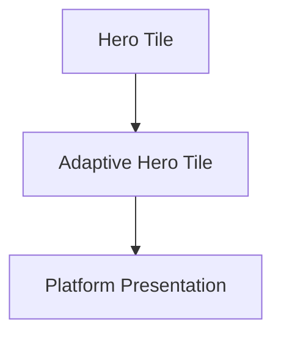

One Tile.

Many physical expressions.

---

# Behaviour Before Adaptation

Adaptive Tiles always begin with behaviour.

Incorrect.

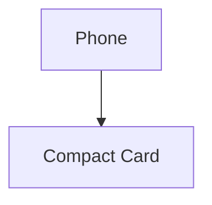

Correct.

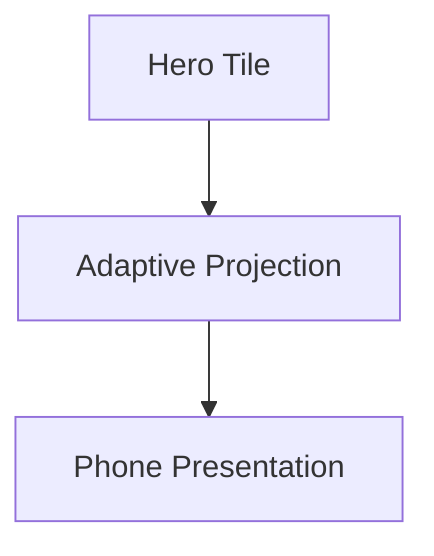

Devices influence presentation.

They never redefine behaviour.

---

# One Tile Identity

Every Adaptive Tile preserves one stable identity.

Examples.

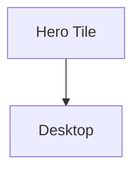

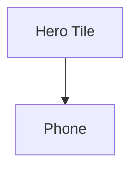

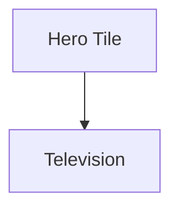

Every presentation remains:

```

Hero Tile
```

The behavioural identity never changes.

---

# Adaptive Inputs

Adaptive behaviour evaluates:

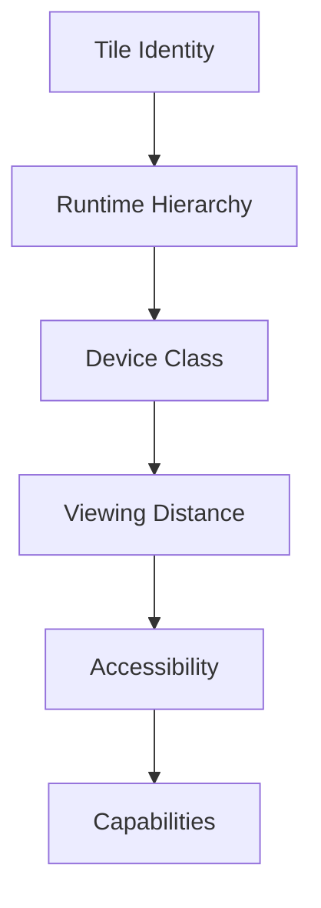

Behaviour has already been solved.

Adaptive Tiles communicate that behaviour appropriately.

---

# Adaptive Outputs

Adaptive Tiles produce:

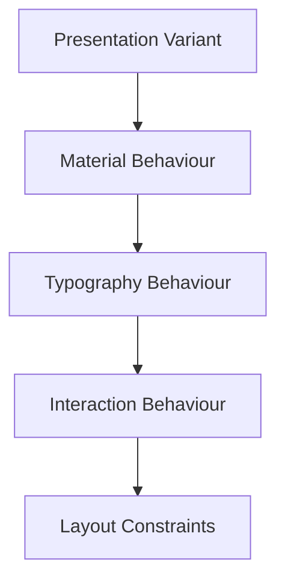

These outputs remain independent from rendering technology.

---

# Capacity-Sensitive Tile Viewports

A Tile may gain or release plane-local capacity while preserving its identity.

The Tile shell may therefore change width, height and aspect ratio. Mosaic does not impose one locked aspect ratio on every Tile.

The content model inside the Tile remains stable:

- artwork preserves its source aspect ratio
- content orientation remains stable
- item order remains stable
- row dimensions remain stable
- semantic priority remains stable

Additional capacity reveals additional content. Reduced capacity suppresses the lowest-priority content that no longer fits.

The Tile must not respond by inventing a different internal layout, reordering content, stretching artwork or compressing rows until they become illegible.

For a vertically repeating collection such as a release schedule, the visible item count is:

\[
N_{\mathrm{visible}} =
\operatorname{clamp}\left(
\left\lfloor
\frac{H_{\mathrm{content}} + g}{H_{\mathrm{row}} + g}
\right\rfloor,
1,
N_{\mathrm{available}}
\right)
\]

where:

| Symbol | Meaning |
|--------|---------|
| \(H_{\mathrm{content}}\) | Vertical capacity available to repeating content after fixed Tile regions are resolved. |
| \(H_{\mathrm{row}}\) | Governed row height for the Tile expression. |
| \(g\) | Governed gap between rows. |
| \(N_{\mathrm{available}}\) | Number of semantically available items. |

A release schedule with more vertical capacity therefore shows more episodes. When capacity contracts, it shows fewer episodes while retaining at least the highest-priority scheduled episode.

Thresholds, minimum dimensions and transition hysteresis require calibration in the alpha implementation. The invariant is stable topology, not any provisional numeric value.

---

# Stable Internal Topology

Adaptive presentation changes the visible extent of one Tile expression.

It does not replace that expression with a different component arrangement merely because its bounds changed.

This distinction preserves perceptual continuity while the Composition Engine moves and resizes Tiles through the spatial puzzle:

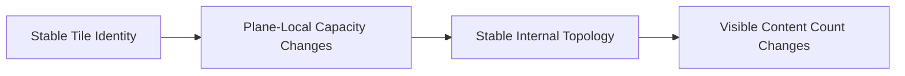

If a fundamentally different information relationship is required, it should be represented as a different Expression or Tile identity rather than hidden inside an arbitrary responsive breakpoint.

---

# Hero Adaptation

Desktop.

↓

Expanded Hero.

Phone.

↓

Compact Hero.

Television.

↓

Immersive Hero.

Voice.

↓

Spoken Hero.

The Hero remains behaviourally identical.

Only presentation differs.

---

# Timeline Adaptation

Timeline Tiles should adapt according to available space.

Examples.

Desktop.

↓

Expanded progress.

Phone.

↓

Condensed progress.

Television.

↓

Distance-optimised progress.

Voice.

↓

Spoken progress.

Users should always recognise:

```

Timeline
```

regardless of implementation.

---

# Metadata Adaptation

Metadata should progressively collapse.

Preferred.

Desktop.

↓

Complete metadata.

Phone.

↓

Primary metadata.

↓

Expandable detail.

Understanding remains available.

Presentation simply becomes quieter.

---

# Relationship Adaptation

Relationship Tiles may adapt by:

- grouping,
- collapsing,
- summarising,
- expanding.

Relationships should never disappear solely because presentation space decreased.

Behaviour always possesses higher priority than convenience.

---

# Collection Adaptation

Collections should adapt naturally.

Desktop.

↓

Large collection.

Phone.

↓

Progressive collection.

Television.

↓

Immersive collection.

The Collection Tile remains behaviourally unchanged.

---

# Material Adaptation

Adaptive Tiles inherit Material behaviour.

Examples.

Hero Tile.

↓

Hero Material.

Compact Hero.

↓

Simplified Hero Material.

Low Power Device.

↓

Reduced Material Fidelity.

Material identity remains recognisable.

Only rendering complexity changes.

---

# Typography Adaptation

Editorial hierarchy remains stable.

Heading.

↓

Heading.

Supporting.

↓

Supporting.

Caption.

↓

Caption.

Adaptive Tiles may alter:

- measure,
- spacing,
- line length.

They should never alter editorial meaning.

---

# Motion Adaptation

Motion should adapt naturally.

Examples.

Desktop.

↓

Full Material Motion.

Phone.

↓

Reduced travel.

Television.

↓

Greater perceived distance.

Reduced Motion.

↓

Minimal movement.

Behavioural sequencing remains identical.

---

# Interaction Adaptation

Interaction methods naturally differ.

Examples.

Phone.

↓

Touch.

Desktop.

↓

Pointer.

Television.

↓

Remote.

Voice.

↓

Conversation.

Adaptive Tiles expose different interaction affordances.

The underlying behaviour remains identical.

---

# Accessibility

Accessibility may adapt Tile presentation.

Examples.

Large Text.

↓

Greater spacing.

Reduced Motion.

↓

Simplified transitions.

High Contrast.

↓

Clearer Materials.

The Tile should remain behaviourally recognisable under every accessibility profile.

---

# Runtime Adaptation

Adaptive behaviour should occur continuously.

Examples.

Window resized.

↓

Tile evolves.

Orientation changes.

↓

Tile adapts.

Accessibility enabled.

↓

Tile refines.

The Tile should never appear to restart its lifecycle because presentation changed.

---

# Device Independence

Adaptive behaviour should remain independent from specific platforms.

Future devices should require only:

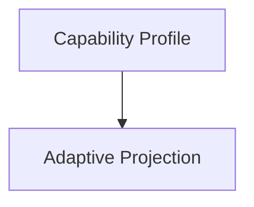

The Tile Framework should remain prepared for technologies that do not yet exist.

---

# Modules

Modules never define adaptive behaviour.

Modules contribute:

- Expressions,
- behaviour,
- information.

Adaptive Tiles remain entirely platform owned.

Every module therefore automatically supports future devices.

---

# Good Examples

## Hero

Desktop.

↓

Expanded Hero.

Phone.

↓

Compact Hero.

Behaviour remains identical.

---

## Reading

Metadata collapses naturally.

↓

Reader expands when required.

↓

Understanding preserved.

---

## Television

Collection Tile expands.

↓

Greater spacing.

↓

Long-distance readability.

↓

Same behavioural identity.

---

# Anti-patterns

## Device Tiles

Creating independent Mobile Hero Tiles.

---

## Layout Behaviour

Changing behavioural meaning because layout changed.

---

## Platform Identity

Different clients inventing different Tile vocabularies.

---

## Accessibility Tiles

Creating separate Tile identities for accessibility.

---

# Adaptive Tile Model

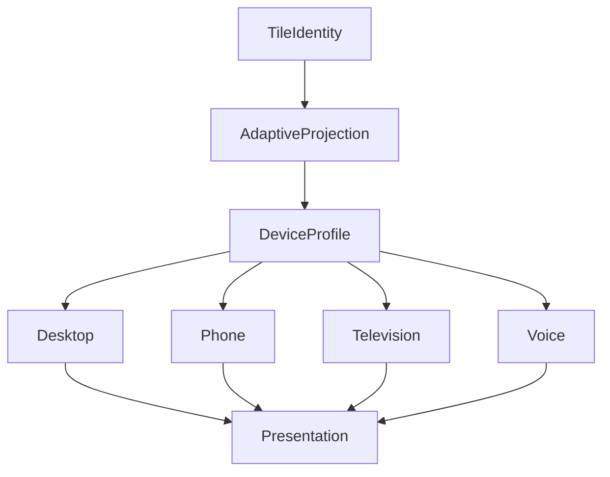

One Tile identity.

Many adaptive presentations.

---

# Relationship To Future Chapters

The next chapter defines **Tile Composition**.

Adaptive Tiles explain:

> **How one Tile adapts across environments.**

Tile Composition explains:

> **How multiple Tiles combine into coherent runtime presentation while preserving behavioural understanding.**

Together they establish the presentation architecture of Mosaic.

---

# Summary

Adaptive Tiles ensure that Mosaic remains:

- behaviourally consistent,
- presentation flexible,
- future proof.

Users should never think:

> "This is the mobile version."

They should simply feel that the same Companion naturally adapted to the device they chose to use.

That behavioural continuity is the defining objective of Adaptive Tiles.
