<!--
File: docs/engineering/architecture/mdp-001-adaptive-composition-runtime/22-tile-composition.md
Document: MDP-001
Chapter: 22
Title: Tile Composition
Status: Draft
Version: 0.1
-->

# Tile Composition

> **Proposal status:** Deferred and non-authoritative. This chapter preserves post-v1 research; it is not a Mosaic v1 requirement.

---

# Purpose

Individual Tiles communicate individual Expressions.

Real user experiences, however, are rarely expressed through one Tile alone.

Tile Composition defines how multiple Tiles combine into coherent behavioural experiences while preserving:

- hierarchy,
- continuity,
- understanding,
- adaptability.

Unlike traditional layout systems, Tile Composition is not concerned with positioning widgets.

It is concerned with composing understanding.

---

# Definition

Within MDS, **Tile Composition** is defined as:

> **The behavioural organisation of multiple Tiles into coherent presentation structures that preserve the solved understanding produced by the Composition Engine.**

Tile Composition is behavioural.

Layout is implementation.

---

# Philosophy

Traditional interfaces frequently compose components.

Examples.

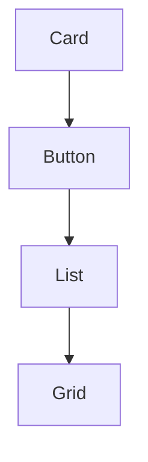

Mosaic intentionally composes behavioural concepts.

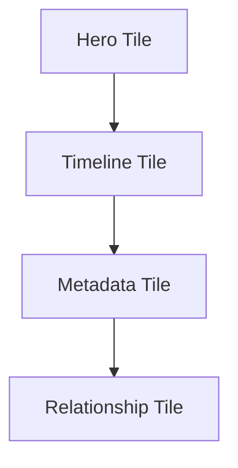

Presentation emerges naturally from understanding.

---

# Composition Before Layout

Tile Composition should never begin by asking:

> Where should this Tile go?

Instead ask:

> **Which Tiles belong together behaviourally?**

Grouping always precedes geometry.

---

# Behaviour Creates Composition

Every Tile Composition originates from runtime behaviour.

Example.

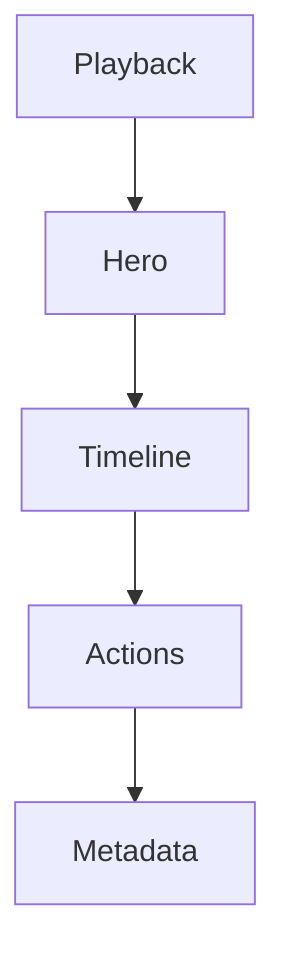

These Tiles form one behavioural experience.

The runtime determines placement afterwards.

---

# Composition Groups

Tile Composition naturally forms behavioural groups.

Examples include:

```text
Hero Group

Playback Group

Reading Group

Discovery Group

Relationship Group

Utility Group
```

Each group communicates one behavioural purpose.

Groups should remain conceptually independent.

---

# Hero Group

The Hero Group normally contains:

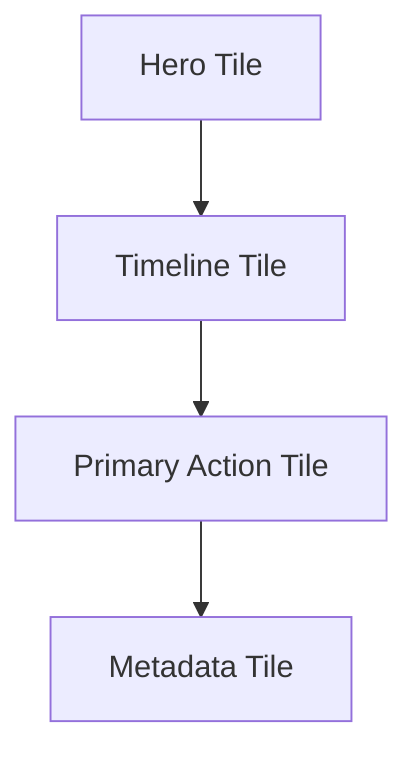

The Hero Group represents the behavioural centre of the current World.

Nothing outside the group should compete for primary attention.

---

# Reading Group

A Reading Group may contain:

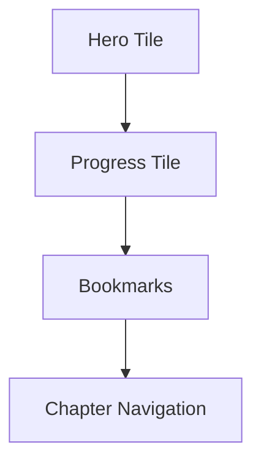

Reading behaviour determines composition.

Not media type.

---

# Playback Group

Playback naturally groups:

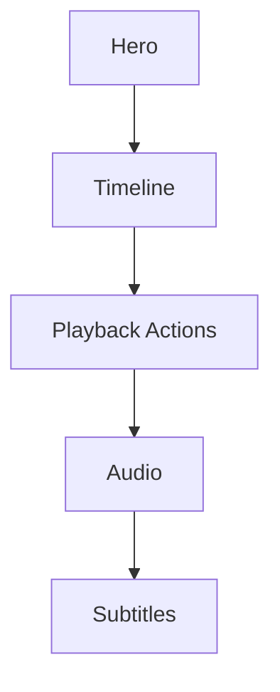

The group should communicate one coherent behavioural task.

---

# Relationship Group

Relationship Tiles naturally compose together.

Examples.

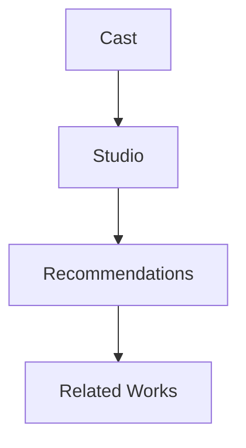

Relationships should strengthen discovery.

Not interrupt the current Focus.

---

# Utility Group

Utility information should compose separately.

Examples.

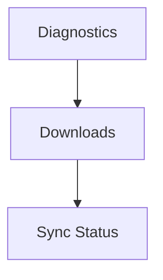

Utility groups should remain behaviourally peripheral.

Entertainment should remain central.

---

# Hierarchical Composition

Tile Composition should respect Runtime Hierarchy.

Example.

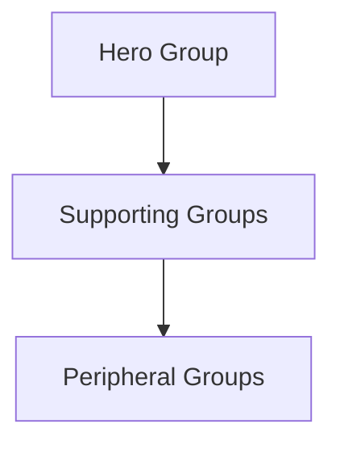

Groups should never compete equally.

Behavioural importance should remain immediately recognisable.

---

# Nested Composition

Groups may contain sub-groups.

Example.

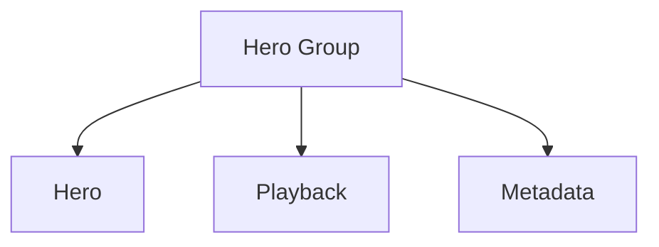

Nested groups improve organisation without changing behavioural meaning.

---

# Composition Stability

Tile groups should remain stable whenever possible.

Example.

Playback progress updates.

↓

Timeline Group evolves.

Hero Group remains intact.

Stable composition significantly improves user orientation.

---

# Material Cohesion

Tiles within the same group should feel materially related.

Example.

Hero Group.

↓

Hero Material.

↓

Supporting Acrylic.

↓

Shared Atmosphere.

Groups should feel physically connected.

Not visually assembled.

---

# Typography Cohesion

Editorial hierarchy should remain consistent within groups.

Example.

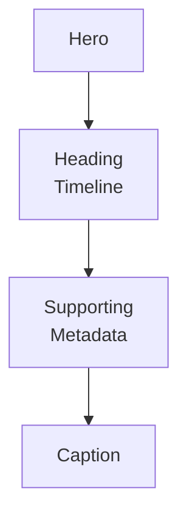

Typography should reinforce group structure naturally.

---

# Motion Cohesion

Tile groups should move together behaviourally.

Example.

Hero changes.

↓

Hero Group evolves.

↓

Relationship Group responds.

↓

Environment settles.

Movement should reinforce conceptual grouping.

Not merely physical proximity.

---

# Adaptive Composition

Adaptive Layout should preserve Tile groups.

Desktop.

↓

Expanded Hero Group.

Phone.

↓

Compact Hero Group.

Television.

↓

Immersive Hero Group.

The group remains behaviourally identical.

Only spatial expression changes.

---

# Runtime Composition

Tile Composition should evolve incrementally.

Example.

Bookmark added.

↓

Reading Group updates.

Playback Group unchanged.

Behavioural locality preserves continuity.

---

# Composition Integrity

Tiles should never migrate between unrelated groups purely because layout changed.

Behaviour owns grouping.

Presentation communicates it.

---

# Modules

Modules contribute Expressions.

The Tile Framework determines:

- Tile identity,
- Tile groups,
- behavioural composition.

Modules should never construct Tile groups independently.

Every module therefore inherits one coherent presentation language.

---

# Good Examples

## Playback

Hero Group.

↓

Playback Group.

↓

Relationship Group.

↓

Utility Group.

Behaviour remains immediately understandable.

---

## Reading

Hero Group.

↓

Reading Group.

↓

Relationship Group.

↓

Bookmarks.

Readers naturally understand where to look.

---

## Music

Hero Group.

↓

Queue Group.

↓

Recommendations.

↓

Metadata.

Listening behaviour determines composition.

---

# Anti-patterns

## Layout Groups

Grouping Tiles purely because they fit inside the same container.

---

## Component Groups

Widgets determining behavioural organisation.

---

## Platform Groups

Different clients inventing different behavioural groupings.

---

## Module Groups

Modules constructing independent presentation structures.

---

# Tile Composition Model

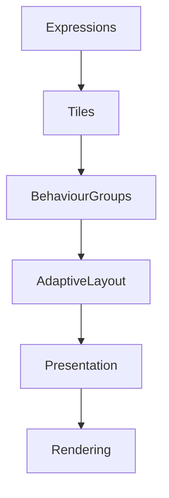

Behaviour creates groups.

Groups create presentation.

Rendering simply expresses the result.

---

# Relationship To Future Chapters

The next chapter defines **Tile Interaction**.

Tile Composition explains:

> **How Tiles belong together.**

Tile Interaction explains:

> **How users interact with those Tiles while preserving the behavioural language established by the Composition Engine.**

Together they complete the conceptual architecture of the Tile Framework.

---

# Summary

Tile Composition ensures that presentation remains behaviourally meaningful.

Tiles should never feel like unrelated interface elements arranged on a screen.

Instead they should feel like members of one coherent conversation about the user's current World.

That behavioural cohesion is one of the defining characteristics of the Mosaic Tile Framework.
