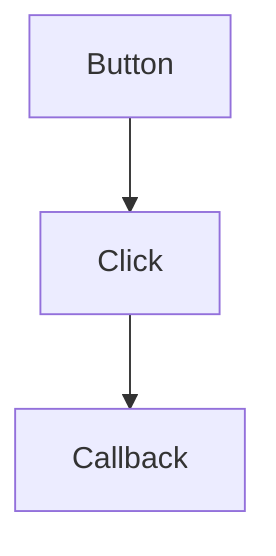
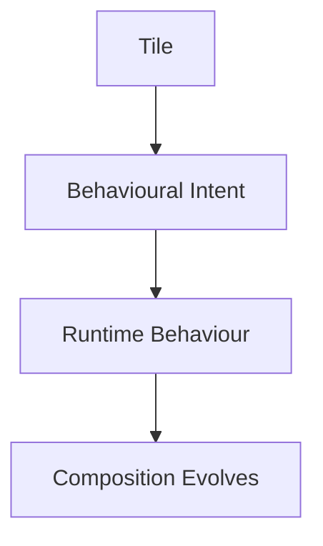
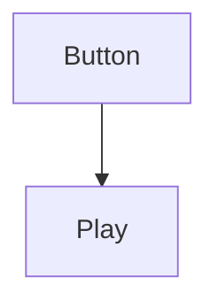
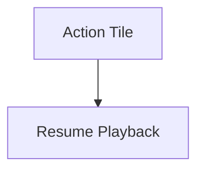
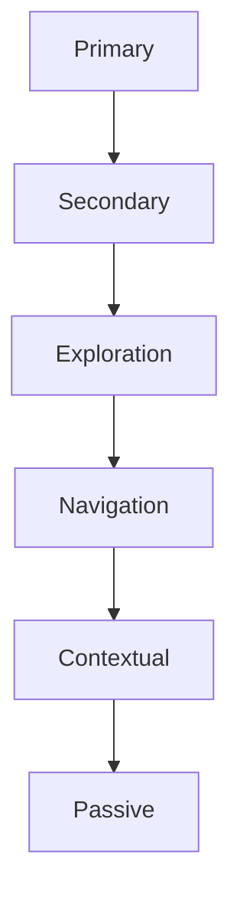
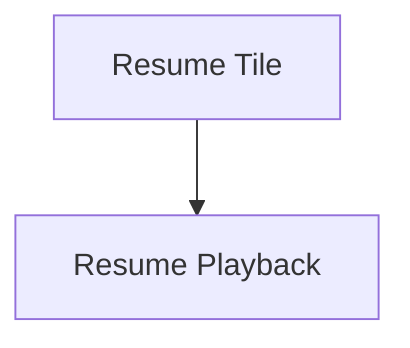
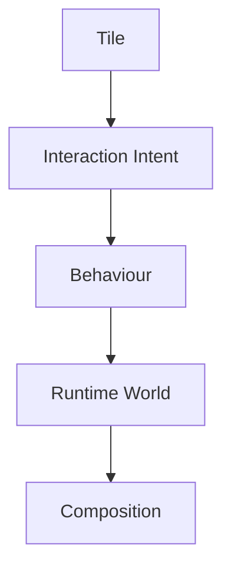
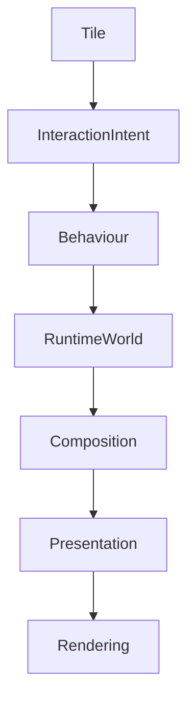

<!--
File: docs/engineering/architecture/mdp-001-adaptive-composition-runtime/23-tile-interaction.md
Document: MDP-001
Chapter: 23
Title: Tile Interaction
Status: Draft
Version: 0.1
-->

# Tile Interaction

> **Proposal status:** Deferred and non-authoritative. This chapter preserves post-v1 research; it is not a Mosaic v1 requirement.

---

# Purpose

Tiles communicate behavioural understanding.

Interaction allows users to participate in that behaviour.

Unlike traditional component systems, where interaction is owned by widgets, Mosaic intentionally assigns interaction to Tiles.

Components merely render interaction.

Tiles communicate behavioural intent.

This distinction preserves one interaction language across every platform.

---

# Definition

Within MDS, **Tile Interaction** is defined as:

> **The behavioural contract through which users interact with a Tile while preserving the integrity of the Runtime World and Composition Engine.**

Interaction belongs to behaviour.

Not presentation.

---

# Philosophy

Traditional interfaces frequently model interaction like this.



Mosaic intentionally models interaction differently.



Users interact with understanding.

Not components.

---

# Interaction Before Components

Components should never own behaviour.

Incorrect.



Correct.



The component merely renders the Action Tile.

The Tile owns behavioural meaning.

---

# Interaction Categories

The Tile Framework recognises several conceptual interaction categories.



Every Tile exposes one primary interaction category.

---

# Primary Interaction

Purpose.

Advance the user's current behavioural goal.

Examples.

- Resume playback
- Continue reading
- Play album
- Open Hero

Primary interactions should always reinforce the current Focus.

They should never compete with it.

---

# Secondary Interaction

Purpose.

Support the current behaviour.

Examples.

- Bookmark
- Favourite
- Queue
- Download

Secondary interactions remain immediately available without competing with the primary behavioural objective.

---

# Exploration Interaction

Purpose.

Expand the user's World.

Examples.

- Cast member
- Related work
- Author
- Franchise

Exploration interactions encourage discovery.

They should never interrupt the current behavioural flow.

---

# Navigation Interaction

Purpose.

Move between behavioural contexts.

Examples.

- Home
- Search
- Library
- Downloads

Navigation should preserve continuity.

Users should always feel they remain within one World.

---

# Contextual Interaction

Purpose.

Reveal additional behavioural capability.

Examples.

- Context menu
- More actions
- Diagnostics
- Advanced controls

Contextual interactions should remain behaviourally subordinate.

They should never obscure primary understanding.

---

# Passive Interaction

Some Tiles intentionally expose no direct interaction.

Examples.

- informational metadata
- decorative atmosphere
- environmental elements

Passive Tiles contribute understanding without requiring user action.

Not every Tile should invite interaction.

---

# Behavioural Intent

Every interaction communicates behavioural intent.

Example.



Not.

```text
Pressed Button
```

The Runtime World consumes behavioural intent.

Implementation events remain platform concerns.

---

# Interaction Resolution

Tile Interaction resolves into behavioural events.

Conceptually.



Tiles never mutate the Runtime World directly.

They communicate behavioural intent.

---

# Hero Interaction

The Hero Tile normally exposes one clear primary interaction.

Examples.

- Play
- Resume
- Continue
- Open

Multiple competing primary interactions weaken behavioural clarity.

The Hero should answer one question.

> **"What should I do next?"**

---

# Relationship Interaction

Relationship Tiles encourage exploration.

Examples.

Cast.

↓

Actor details.

Series.

↓

Season.

Author.

↓

Other works.

Exploration should always preserve orientation.

Users should never feel lost after following relationships.

---

# Timeline Interaction

Timeline Tiles expose temporal interaction.

Examples.

- seek
- chapter selection
- reading progress
- queue position

Timeline interactions should preserve continuity.

They modify the current World.

They do not replace it.

---

# Overlay Interaction

Overlay Tiles temporarily become the interaction centre.

Examples.

- Search
- Playback controls
- Settings
- Menus

When the Overlay retires:

The user's previous behavioural context should immediately return.

Interaction should never permanently fragment the Runtime World.

---

# Material Behaviour

Interactions should respect Material identity.

Hero Tile.

↓

Hero Material response.

Overlay Tile.

↓

Overlay Material response.

Metadata Tile.

↓

Minimal material response.

Physical behaviour reinforces interaction confidence.

---

# Typography Behaviour

Editorial hierarchy should remain stable throughout interaction.

Interactions may alter:

- emphasis,
- focus,
- selection.

They should never unexpectedly change editorial roles.

Understanding always remains stable.

---

# Motion Behaviour

Interactions initiate behavioural Motion.

Example.

Interaction.

↓

Behaviour changes.

↓

Motion communicates behaviour.

Movement never exists independently from interaction.

---

# Accessibility

Every interaction should remain accessible through:

- keyboard
- remote
- touch
- screen reader
- voice

Interaction categories remain identical.

Only implementation changes.

---

# Multi-Device Interaction

The same Tile may expose different physical interaction methods.

Desktop.

↓

Pointer.

Phone.

↓

Touch.

Television.

↓

Remote.

Voice.

↓

Conversation.

The behavioural outcome remains identical.

---

# Runtime Ownership

The Runtime World owns behaviour.

Tiles own interaction intent.

Components own implementation.

Responsibilities remain intentionally separated.

---

# Modules

Modules contribute:

- behavioural capabilities
- interaction metadata

Modules never implement interaction directly.

The Tile Framework determines:

- interaction category
- runtime behaviour
- presentation

Every module therefore inherits the same interaction language.

---

# Good Examples

## Playback

Hero Tile.

↓

Resume.

↓

Runtime Behaviour.

↓

Playback.

↓

Composition evolves.

The interaction feels inevitable.

---

## Reading

Bookmark Tile.

↓

Bookmark Behaviour.

↓

Reading continues.

↓

World preserved.

---

## Discovery

Relationship Tile.

↓

Explore Author.

↓

New behavioural context.

↓

Continuity maintained.

---

# Anti-patterns

## Component Behaviour

Widgets directly mutating application state.

---

## Multiple Primary Actions

Several equally important actions competing for attention.

---

## Platform Interaction

Different clients inventing different behavioural outcomes.

---

## Module Behaviour

Modules bypassing the Runtime World.

---

# Tile Interaction Model



Interaction begins with Tiles.

Behaviour remains the ultimate authority.

---

# Relationship To Future Chapters

The next chapter defines **Runtime Tile Resolution**.

Tile Interaction explains:

> **How users communicate with Tiles.**

Runtime Tile Resolution explains:

> **How Tiles become fully resolved runtime presentation objects before rendering.**

Together they complete the behavioural architecture of runtime presentation.

---

# Summary

Tile Interaction ensures that every user interaction remains:

- behavioural,
- predictable,
- continuous,
- platform independent.

Users should never feel they are clicking widgets.

They should feel they are naturally interacting with their current World.

That distinction is one of the defining architectural principles of the Mosaic Tile Framework.
