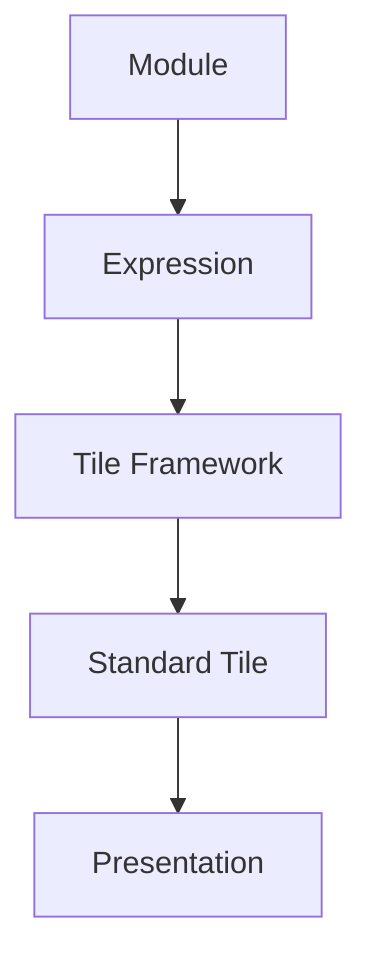
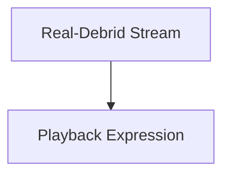
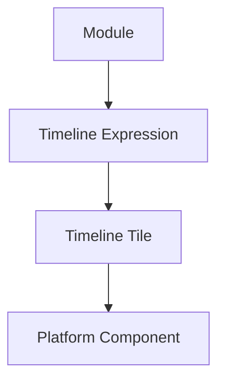
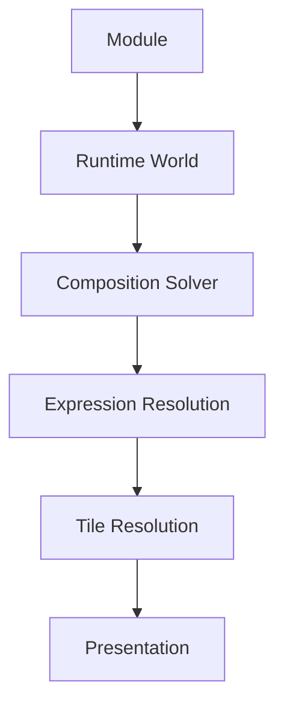
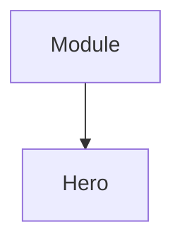
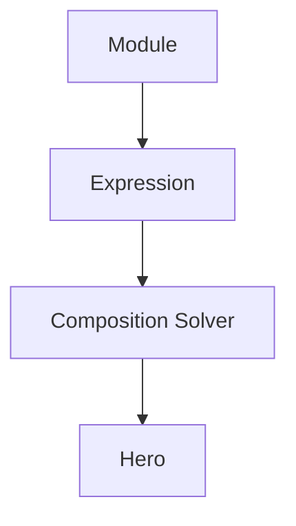
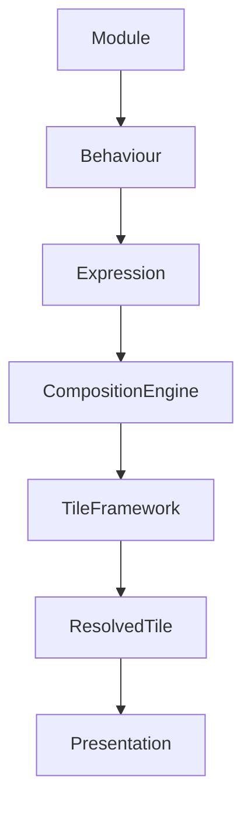

<!--
File: docs/engineering/architecture/mdp-001-adaptive-composition-runtime/25-module-tiles.md
Document: MDP-001
Chapter: 25
Title: Module Tiles
Status: Draft
Version: 0.1
-->

# Module Tiles

> **Proposal status:** Deferred and non-authoritative. This chapter preserves post-v1 research; it is not a Mosaic v1 requirement.

---

# Purpose

One of Mosaic's defining architectural goals is allowing modules to feel indistinguishable from native functionality.

Users should never be able to identify whether a Tile originated from:

- Mosaic Platform,
- an official module,
- a community module,
- a third-party integration.

This chapter defines how modules participate in the Tile Framework without fragmenting the behavioural language of the platform.

Modules contribute understanding.

The Tile Framework determines presentation.

---

# Definition

Within MDS, **Module Tiles** are defined as:

> **Runtime Tiles produced from module-provided Expressions using the same behavioural resolution pipeline as native Mosaic functionality.**

Module Tiles are not custom Tile types.

They are standard Mosaic Tiles whose behavioural source happens to originate from a module.

---

# Philosophy

Traditional module systems frequently allow modules to create arbitrary interfaces.

The result is:

- inconsistent layouts,
- inconsistent motion,
- inconsistent typography,
- inconsistent interaction.

Mosaic intentionally rejects this model.

Instead:



Modules become behaviourally native.

---

# Modules Never Create Tiles

This principle is fundamental.

Modules provide:

- information,
- relationships,
- behaviours,
- capabilities.

They never provide:

- Hero Tiles,
- custom Cards,
- layouts,
- widgets.

The Tile Framework remains solely responsible for presentation.

---

# Behaviour Before Presentation

Modules communicate behavioural meaning.

Example.



Not:

```text
Streaming Widget
```

The runtime determines how playback should appear.

The module merely enriches the Runtime World.

---

# Expression Ownership

Module Expressions participate identically to native Expressions.

Example.



The Composition Engine never distinguishes between native and module Expressions during presentation.

Only behaviour matters.

---

# Tile Resolution

Module Expressions pass through the complete runtime pipeline.



No shortcuts should exist.

This guarantees behavioural consistency.

---

# Runtime Hierarchy

Modules never assign hierarchy.

Incorrect.



Correct.



Only the Composition Engine determines runtime importance.

This preserves behavioural integrity.

---

# Material Behaviour

Module Tiles inherit standard Material behaviour.

Examples.

Hero.

↓

Hero Material.

Relationship.

↓

Surface Material.

Overlay.

↓

Overlay Material.

Modules should never specify Material behaviour directly.

---

# Typography Behaviour

Editorial hierarchy also remains platform owned.

Examples.

Module Metadata.

↓

Supporting.

Module Hero.

↓

Heading.

Module Diagnostics.

↓

Caption.

The editorial language remains consistent regardless of content source.

---

# Motion Behaviour

Module Tiles inherit standard Motion.

Examples.

Playback.

↓

Hero Motion.

Relationship.

↓

Supporting Motion.

Overlay.

↓

Overlay Motion.

Modules never define transitions.

Movement remains behaviourally consistent.

---

# Adaptive Behaviour

Module Tiles adapt exactly like native Tiles.

Desktop.

↓

Expanded Tile.

Phone.

↓

Compact Tile.

Television.

↓

Immersive Tile.

Voice.

↓

Conversational Tile.

Modules automatically support future presentation environments.

---

# Interaction Behaviour

Modules communicate interaction intent.

Examples.

```text
Play

Bookmark

Install

Open
```

The Tile Framework resolves:

- touch,
- pointer,
- remote,
- keyboard,
- voice.

Interaction therefore remains platform independent.

---

# Module Identity

Users should perceive:

```

Mosaic
```

Not:

```

Module UI
```

Visual identity belongs to the platform.

Behaviour belongs to the Runtime World.

Modules should therefore disappear into the experience.

---

# Capability Projection

Modules may expose capabilities.

Examples.

```text
Offline Download

Transcoding

Metadata

Streaming

Recommendations
```

Capabilities become behavioural Expressions.

The Composition Engine determines whether and how they appear.

Capability does not imply presentation.

---

# Runtime Updates

Module updates should follow identical runtime behaviour.

Example.

Module updates metadata.

↓

Runtime World updates.

↓

Composition evolves.

↓

Tiles update.

The module should never directly manipulate presentation.

---

# Accessibility

Module Tiles automatically inherit:

- accessibility,
- adaptive layout,
- motion preferences,
- typography,
- materials.

Modules should never implement accessibility independently.

The platform guarantees consistency.

---

# Multi-Device Behaviour

Module Tiles should remain behaviourally identical across:

- desktop,
- mobile,
- television,
- voice,
- future platforms.

Presentation adapts.

Behaviour remains stable.

Modules therefore automatically support future clients without modification.

---

# Security Boundary

The Tile Framework intentionally provides an architectural security boundary.

Modules should never directly influence:

- rendering,
- runtime hierarchy,
- Materials,
- Typography,
- Motion,
- Adaptive Layout.

This significantly reduces the risk of inconsistent or malicious presentation behaviour.

---

# Runtime Ownership

The Runtime World owns:

- hierarchy,
- composition,
- presentation.

Modules own:

- capabilities,
- behaviour,
- information.

Responsibilities remain intentionally separated.

---

# Good Examples

## Streaming Module

Behaviour.

↓

Playback Expression.

↓

Hero Tile.

↓

Presentation.

Users experience normal playback.

---

## Book Provider

Behaviour.

↓

Relationship Expression.

↓

Relationship Tile.

↓

Presentation.

Discovery behaves identically to native content.

---

## Download Module

Capability.

↓

Download Expression.

↓

Action Tile.

↓

Presentation.

Interaction feels entirely native.

---

# Anti-patterns

## Custom Widgets

Modules rendering independent UI.

---

## Custom Tile Types

Modules inventing new behavioural presentation primitives.

---

## Theme Injection

Modules modifying:

- Materials,
- Typography,
- Motion.

---

## Runtime Ownership

Modules bypassing the Composition Engine.

---

# Module Tile Model



Modules contribute behaviour.

The platform owns presentation.

---

# Relationship To Future Chapters

The next chapter defines **Tile Orchestration**.

Module Tiles explain:

> **How modules participate in the Tile Framework.**

Tile Orchestration explains:

> **How every Tile evolves together during runtime while preserving behavioural continuity.**

Together they complete the behavioural integration architecture of the Tile Framework.

---

# Summary

Module Tiles ensure that the Mosaic ecosystem grows without fragmenting.

Modules enrich:

- the Runtime World,
- behavioural understanding,
- user capability.

The Tile Framework transforms those contributions into presentation that feels entirely native.

Users should never think:

> "This came from a module."

They should simply feel that Mosaic naturally became more capable.
