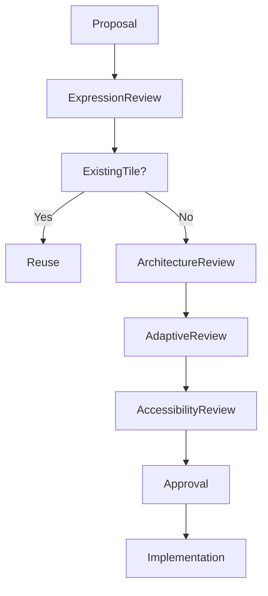

<!--
File: docs/engineering/architecture/mdp-001-adaptive-composition-runtime/27-tile-governance.md
Document: MDP-001
Chapter: 27
Title: Tile Framework Governance
Status: Draft
Version: 0.1
-->

# Tile Framework Governance

> **Proposal status:** Deferred and non-authoritative. This chapter preserves post-v1 research; it is not a Mosaic v1 requirement.

---

# Purpose

The Tile Framework defines the reusable presentation language of Mosaic.

Unlike rendering technologies, which are expected to evolve rapidly, Tile identities become part of the long-term behavioural vocabulary of the platform.

Poor governance would gradually produce:

- duplicate Tile types,
- presentation fragmentation,
- inconsistent interaction,
- platform divergence,
- module incompatibility.

This chapter defines how the Tile Framework should evolve while preserving one coherent presentation language.

---

# Governance Philosophy

Tiles should evolve technically.

Their behavioural meaning should remain remarkably stable.

The objective is not preserving implementations.

It is preserving:

- behavioural consistency,
- presentation reuse,
- adaptive flexibility,
- runtime clarity.

Future UI technologies should strengthen the Tile Framework rather than replace it.

---

# Tiles Are Architecture

Tiles are not widgets.

They are architectural presentation primitives.

Changing:

- Hero Tile,
- Timeline Tile,
- Relationship Tile,

changes how users perceive runtime behaviour.

Such changes should therefore receive architectural review rather than implementation review.

---

# Stable Responsibilities

The following concepts should remain highly stable.

- Tile Philosophy
- Tile Taxonomy
- Expression Mapping
- Tile Lifecycle
- Adaptive Tiles
- Tile Interaction

These concepts define the public presentation language of Mosaic.

---

# Evolvable Responsibilities

The following may evolve continuously.

- rendering implementations
- adaptive variants
- platform components
- caching strategies
- runtime optimisation
- presentation fidelity

Implementation may evolve.

Behavioural identity should remain stable.

---

# Tile Ownership

Tile responsibilities are intentionally separated.

| Layer | Owner |
|--------|-------|
| Tile Philosophy | Design Systems |
| Tile Taxonomy | Design Systems |
| Runtime Tile Resolution | Runtime Architecture |
| Component Library | Client Platform |
| Rendering | Platform Runtime |

Ownership preserves presentation consistency while allowing implementation to improve independently.

---

# Introducing New Tiles

Before introducing a new Tile ask:

## Question One

Can an existing Tile already communicate this Expression?

---

## Question Two

Is this genuinely a new behavioural presentation...

or simply another visual variation?

---

## Question Three

Could adaptive behaviour solve this instead?

---

## Question Four

Will this Tile remain meaningful after future rendering technologies change?

---

## Question Five

Would another contributor naturally discover this Tile?

If uncertainty remains...

The proposal should continue evolving before implementation.

---

# Tile Drift

Tile Drift occurs when:

- duplicate Tile identities appear,
- platform-specific Tiles emerge,
- modules introduce presentation primitives,
- behaviour leaks into components,
- rendering influences runtime vocabulary.

Tile Drift weakens one of the strongest architectural separations within Mosaic.

It should therefore be treated as architectural debt.

---

# Tile Debt

Examples include:

- duplicate Hero Tiles,
- platform variants becoming independent identities,
- widget-driven behaviour,
- presentation-owned interaction,
- undocumented Tile exceptions.

Tile Debt should be continuously reduced.

The Tile vocabulary should remain intentionally compact.

---

# Expression Governance

Expressions and Tiles intentionally remain separate.

Expressions communicate:

- understanding.

Tiles communicate:

- presentation.

Neither layer should absorb responsibilities belonging to the other.

Maintaining this separation preserves long-term architectural flexibility.

---

# Adaptive Governance

Adaptive behaviour should never create new Tile identities.

Desktop Hero.

↓

Hero Tile.

Phone Hero.

↓

Hero Tile.

Voice Hero.

↓

Hero Tile.

Adaptive behaviour projects.

It never redefines.

---

# Accessibility Governance

Accessibility always possesses higher authority than presentation richness.

No Tile proposal should weaken:

- readability,
- interaction,
- behavioural clarity,
- continuity.

Accessibility refines Tiles.

It never changes their identity.

---

# Module Governance

Modules must never define:

- Tile families,
- adaptive behaviour,
- presentation hierarchy,
- interaction models.

Modules contribute:

- Expressions,
- behaviours,
- relationships.

The Tile Framework owns presentation.

This guarantees every module feels unmistakably Mosaic.

---

# Review Questions

Every Tile proposal should answer:

- Does this strengthen behavioural understanding?
- Does this preserve reuse?
- Does this remain platform independent?
- Could an existing Tile already solve this?
- Would users still recognise Mosaic?
- Is this solving behaviour or implementation?

If the proposal exists primarily because a UI framework makes it convenient...

It should be reconsidered.

Behaviour always possesses higher authority than implementation.

---

# Validation

Future tooling should automatically validate:

- Tile taxonomy usage
- Expression mapping
- adaptive variants
- runtime consistency
- module compatibility
- platform parity

Validation should reinforce architectural review.

It should never replace behavioural reasoning.

---

# Governance Workflow

Refinement should always be preferred over expanding the Tile vocabulary.

---

# Success Criteria

The Tile Framework succeeds when:

- Expressions consistently resolve into reusable Tiles,
- adaptive behaviour remains predictable,
- rendering frameworks remain replaceable,
- contributors naturally think in Tiles rather than widgets,
- modules integrate seamlessly,
- users experience one coherent presentation language.

Tiles should become invisible.

Only understanding should remain.

---

# Architectural Decisions

| ADR | Decision |
|------|----------|
| ADR-163 | Tiles are behavioural presentation primitives rather than UI components. |
| ADR-164 | Expressions map deterministically into Tile identities. |
| ADR-165 | Adaptive behaviour never changes Tile identity. |
| ADR-166 | Runtime Tile Resolution owns presentation behaviour. |
| ADR-167 | Modules inherit the Tile Framework rather than extending it. |
