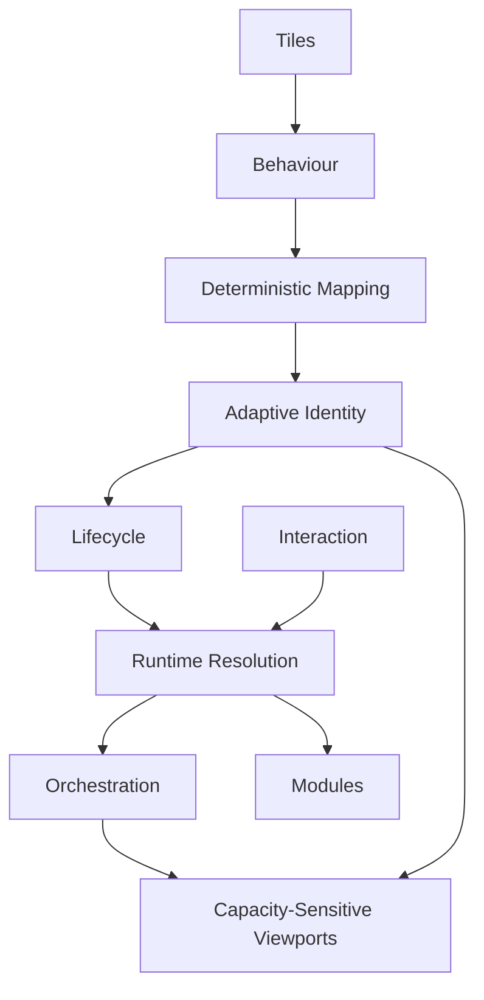

<!--
File: docs/engineering/architecture/mdp-001-adaptive-composition-runtime/28-tile-decision-history.md
Document: MDP-001
Chapter: 28
Title: Tile Decision History
Status: Draft
Version: 0.1
-->

# Tile Decision History

> **Proposal status:** Deferred and non-authoritative. This chapter preserves post-v1 research; it is not a Mosaic v1 requirement.

---

# Purpose

This chapter preserves historical decision inputs from the former Tile Framework specification.

Their recorded `Accepted` status describes the outcome inside that earlier draft. It does not make MDP-001 authoritative, scheduled or accepted architecture. The current v1 boundary and deferral are governed by ADR-204 and ADR-205 in [MDS-008 — Component Library](../../../design/system/mds-008-component-library/12-adrs.md).

Every previous specification established:

- Behaviour
- Runtime World
- Composition
- Expressions

MDP-001 establishes how those runtime concepts become reusable presentation primitives.

These ADRs explain why Mosaic deliberately separates:

- Expressions,
- Tiles,
- Components,
- Rendering,

into independent architectural layers.

Future contributors should understand these decisions before modifying the Tile Framework.

---

# Decision Format

Decision format, lifecycle and review expectations are governed by **[MDG-001 — Documentation Authority Guide](../../documentation/mdg-001-documentation-authority-guide/index.md)**.

This chapter records decisions specific to this specification and avoids redefining the shared ADR process.

# ADR-168

## Title

Introduce Tiles Between Expressions And Components

### Status

Accepted

### Context

Directly rendering Expressions tightly couples runtime behaviour to implementation technology.

### Decision

Introduce Tiles as reusable presentation primitives positioned between Expressions and Components.

### Consequences

Behaviour remains independent from rendering frameworks while presentation becomes reusable.

---

# ADR-169

## Title

Tiles Represent Behaviour Rather Than Widgets

### Status

Accepted

### Context

Traditional UI frameworks frequently name presentation primitives after implementation.

### Decision

Tile identities communicate behavioural purpose rather than component type.

### Consequences

Tile vocabulary remains stable even as rendering technologies evolve.

---

# ADR-170

## Title

Expression Mapping Must Remain Deterministic

### Status

Accepted

### Context

Platform-specific presentation decisions create inconsistent runtime behaviour.

### Decision

Identical Expressions must always resolve into identical Tile identities.

### Consequences

Caching, replay, testing and cross-platform consistency become significantly simpler.

---

# ADR-171

## Title

Adaptive Behaviour Never Changes Tile Identity

### Status

Accepted

### Context

Responsive interfaces frequently create separate presentation concepts for different devices.

### Decision

Adaptive behaviour modifies presentation only.

Tile identity remains unchanged.

### Consequences

One behavioural language survives across every device.

---

# ADR-172

## Title

Tile Lifecycle Preserves Identity

### Status

Accepted

### Context

Destroying and recreating presentation primitives weakens continuity.

### Decision

Tiles evolve whenever practical instead of being replaced.

### Consequences

Users perceive one continuous World rather than constantly changing interface objects.

---

# ADR-173

## Title

Tile Interaction Represents Behaviour

### Status

Accepted

### Context

Component-owned callbacks tightly couple interaction to implementation.

### Decision

Tiles expose behavioural interaction intent.

Components merely implement interaction mechanisms.

### Consequences

Interaction remains platform independent and behaviourally consistent.

---

# ADR-174

## Title

Runtime Tile Resolution Owns Presentation

### Status

Accepted

### Context

Allowing components to determine Materials, Typography or Motion fragments presentation.

### Decision

Runtime Tile Resolution produces fully resolved Tiles before rendering begins.

### Consequences

Components become extremely small implementation artefacts.

---

# ADR-175

## Title

Modules Never Define Tiles

### Status

Accepted

### Context

Module-owned presentation primitives fragment behavioural consistency.

### Decision

Modules contribute Expressions.

The Tile Framework determines presentation.

### Consequences

Community modules automatically inherit future presentation improvements.

---

# ADR-176

## Title

Tile Orchestration Coordinates Presentation

### Status

Accepted

### Context

Independent Tile updates weaken behavioural continuity.

### Decision

Tile evolution is orchestrated centrally.

### Consequences

Users experience one coherent presentation rather than many unrelated interface updates.

---

# ADR-198

## Title

Preserve Internal Tile Topology While Visible Capacity Changes

### Status

Accepted

### Context

Plane-local Composition movement may change a Tile's available width, height and aspect ratio.

Rearranging internal content at arbitrary responsive breakpoints makes the Tile appear to become a different object and weakens continuity during resizing.

Locking every Tile to one aspect ratio would prevent useful capacity changes such as revealing additional release-schedule episodes when more vertical space becomes available.

### Decision

Tiles use Capacity-Sensitive Tile Viewports.

The Tile shell may resize, but artwork aspect ratio, content orientation, item ordering, row dimensions and semantic priority remain stable.

Additional capacity reveals additional semantically ordered content. Reduced capacity suppresses the lowest-priority content that no longer fits while preserving the governed minimum.

A fundamentally different information relationship requires a different Expression or Tile identity rather than a hidden responsive rearrangement.

### Consequences

Tiles remain perceptually rigid and recognisable while participating in the spatial puzzle.

Schedule and collection Tiles may expose more useful information without fragmenting their identity.

Exact thresholds, minimum dimensions and hysteresis remain alpha calibration concerns.

---

# ADR Relationships

Together these decisions establish Tiles as the stable presentation language bridging runtime understanding and visual implementation.

---

# Future ADRs

Future Tile Framework ADRs are expected to formalise:

- AI-generated Tile Variants
- Spatial Tile Projection
- Ambient Tile Groups
- Multi-user Shared Tiles
- Predictive Tile Resolution
- Streaming Tile Pipelines
- Adaptive Accessibility Tiles
- Runtime Tile Virtualisation

These intentionally remain outside the scope of MDP-001 Version 0.1.

---

# ADR Governance

Tile Framework ADRs should change only when:

- behavioural architecture evolves,
- runtime presentation requires refinement,
- accessibility research identifies deficiencies,
- the Mosaic Design Language itself changes.

Rendering technology alone should never justify architectural changes.

Tiles should remain recognisably Mosaic regardless of implementation.

---

# Summary

The ADRs contained within MDP-001 define the presentation identity of Mosaic.

Expressions communicate understanding.

Tiles communicate presentation.

Components implement rendering.

Maintaining these boundaries allows Mosaic to evolve for decades without losing its behavioural language.
