<!--
File: docs/engineering/architecture/mdp-001-adaptive-composition-runtime/29-tile-contributor-guidance.md
Document: MDP-001
Chapter: 29
Title: Contributor Guidance
Status: Draft
Version: 0.1
-->

# Contributor Guidance

> **Proposal status:** Deferred and non-authoritative. This chapter preserves post-v1 research; it is not a Mosaic v1 requirement.

---

# Purpose

The Tile Framework is the bridge between runtime understanding and visual presentation.

Every contributor working on:

- runtime,
- frontend,
- modules,
- components,
- interaction,
- presentation,

will eventually interact with Tiles.

This guidance exists to ensure contributors think in behavioural presentation rather than implementation.

When contributors naturally think in Tiles instead of widgets, the Tile Framework has achieved its purpose.

---

# Think In Expressions

Never begin with:

> "Which component should I use?"

Instead ask:

> **"Which Expression am I communicating?"**

Good.

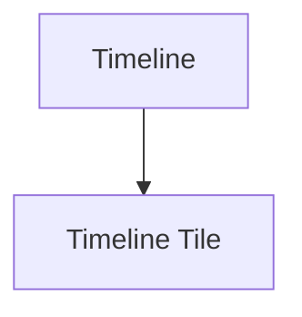

Poor.

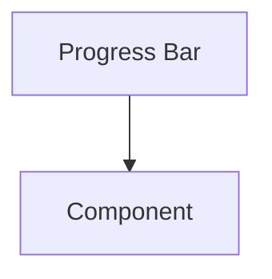

Expressions always precede Tiles.

---

# Think In Tiles

After identifying the Expression ask:

> **"Which Tile best communicates this behaviour?"**

Not:

> Which widget?

Not:

> Which layout?

Tiles represent presentation intent.

Components merely implement that intent.

---

# Behaviour Before Presentation

Every Tile exists because behaviour exists.

Preferred.

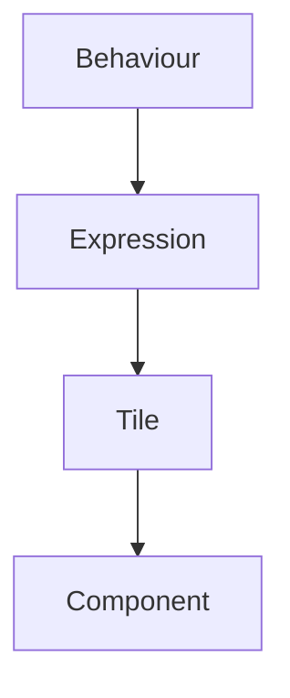

Avoid.

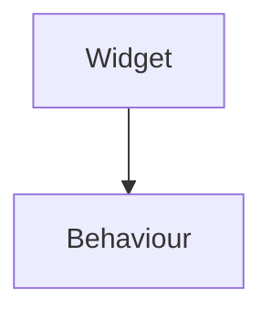

Presentation should always remain downstream from runtime understanding.

---

# Preserve Tile Identity

Tiles should remain behaviourally stable.

Example.

```

Hero Tile
```

may appear differently on:

- desktop,
- phone,
- television,
- voice.

It remains:

```

Hero Tile
```

Do not invent new Tile identities simply because presentation differs.

---

# Reuse Existing Tiles

Before creating a new Tile ask:

> Can an existing Tile communicate this?

Most new presentation requests should refine existing Tiles rather than expand the Tile vocabulary.

Behavioural simplicity is significantly more valuable than presentation variety.

---

# Components Render

Components should never own behaviour.

Good.

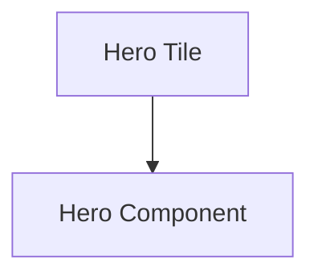

Poor.

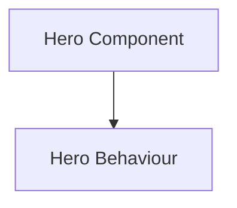

Components are implementation.

Tiles communicate behaviour.

---

# Let Runtime Resolve

Applications should never determine:

- Materials,
- Typography,
- Motion,
- Interaction,
- Adaptive behaviour.

Components consume resolved Tiles.

The Runtime Tile Resolver owns presentation logic.

---

# Respect Adaptive Behaviour

Do not create:

- Mobile Hero Tile
- TV Hero Tile
- Desktop Hero Tile

Instead create:

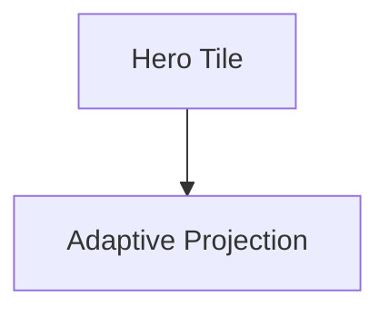

Devices change.

Behaviour should not.

---

# Preserve Continuity

Whenever practical...

Tiles should evolve.

Not be replaced.

Preferred.

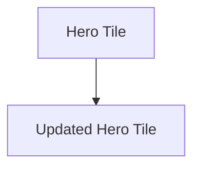

Avoid.

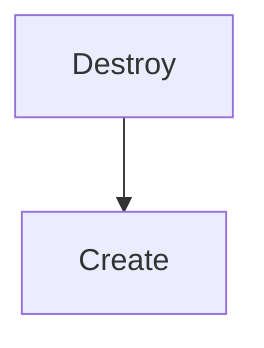

Users should perceive continuous presentation.

---

# Respect Runtime Hierarchy

Tiles never determine importance.

Hierarchy originates from:

- Behaviour,
- Composition,
- Runtime Hierarchy.

Tiles communicate that hierarchy.

They never redefine it.

---

# Modules Enrich Behaviour

Modules contribute:

- behaviour,
- information,
- relationships.

They never contribute:

- Tiles,
- layouts,
- widgets,
- Materials.

Every module should disappear naturally into Mosaic.

---

# Accessibility

Accessibility should adapt presentation.

It should never create new Tile identities.

Examples.

Large text.

↓

Hero Tile.

Reduced motion.

↓

Hero Tile.

High contrast.

↓

Hero Tile.

Behaviour remains unchanged.

---

# Platform Independence

Before implementing any Tile ask:

> Would this still communicate the same behaviour on:

- Web?
- Flutter?
- Television?
- Voice?
- Future devices?

Presentation may evolve.

Behaviour should remain identical.

---

# Performance

Performance optimisation should preserve Tile identity.

Preferred.

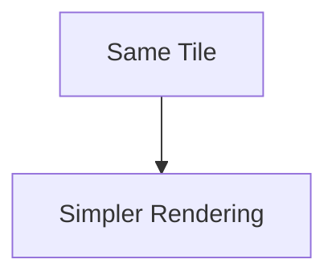

Avoid.

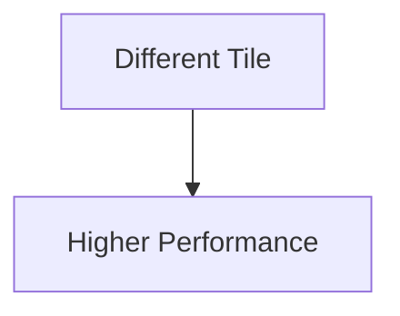

Optimise implementation.

Never behavioural presentation.

---

# Common Mistakes

Avoid the following.

### Widget Thinking

Beginning with components instead of Expressions.

---

### Platform Thinking

Creating platform-specific Tile identities.

---

### Layout Thinking

Allowing geometry to redefine behaviour.

---

### Module Presentation

Modules creating their own UI language.

---

### Component Behaviour

Widgets mutating the Runtime World.

---

### Duplicate Tiles

Creating new Tiles for existing behavioural concepts.

---

# Tile Review Questions

Before implementing a Tile ask:

- Which Expression does this communicate?
- Does an existing Tile already solve this?
- Does this preserve behavioural identity?
- Does adaptive behaviour remain consistent?
- Would this still feel like Mosaic on every platform?
- Could the renderer change without affecting this design?

If uncertainty remains...

Return to the Expression before implementation.

---

# Tile Checklist

Every Tile implementation should satisfy the following.

- [ ] Expression is clearly identified.
- [ ] Existing Tile reused where possible.
- [ ] Behaviour remains platform independent.
- [ ] Runtime Hierarchy is respected.
- [ ] Adaptive behaviour preserves identity.
- [ ] Accessibility is maintained.
- [ ] Components remain implementation only.
- [ ] Modules cannot bypass the Tile Framework.

---

# Final Guidance

The Tile Framework should eventually disappear from conscious thought.

Contributors should stop asking:

> "Which widget should I build?"

and instinctively begin asking:

> **"Which behavioural idea am I presenting?"**

When every contributor naturally thinks in Expressions and Tiles rather than components, Mosaic gains something rare.

A presentation layer that can evolve for decades while the behavioural language remains unchanged.

That separation is the defining strength of the Mosaic Tile Framework.
